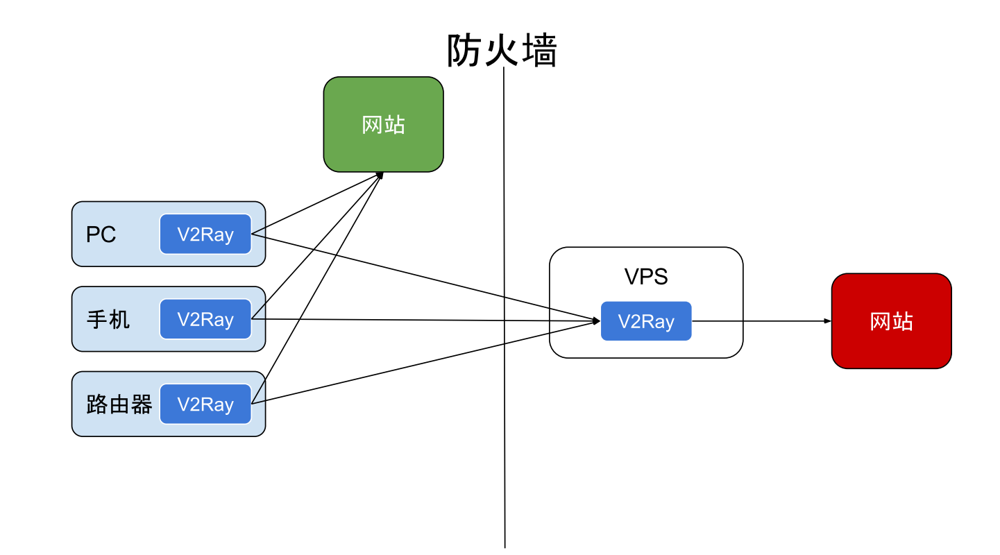
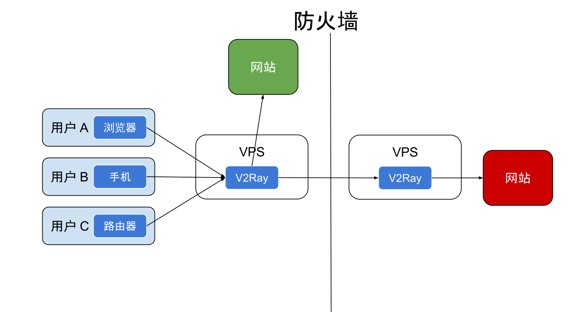

官方文档和白话文博客已经很详细,这里就只是简单说明。

---

## 官方文档

github仓库：

<https://github.com/v2ray/v2ray-core>

官方文档链接：

<https://www.v2ray.com>

离线下载官方文档:

百度网盘: <https://pan.baidu.com/s/1twcC6rg1Vs-dmon9j9PPlQ> 

提取码: wnkr

streemit博客链接：

<https://steemit.com/@v2ray>

## 白话文

白话文博客链接:

<https://toutyrater.github.io>

白话文github仓库链接：

<https://github.com/ToutyRater/v2ray-guide>

## 配置文件

配置文件模板仓库:

<https://github.com/KiriKira/vTemplate>

vmess userId 生成:

<https://www.uuidgenerator.net>

## 其他

233boy的一键脚本:

<https://github.com/233boy/v2ray>

## v2ray实现原理图

