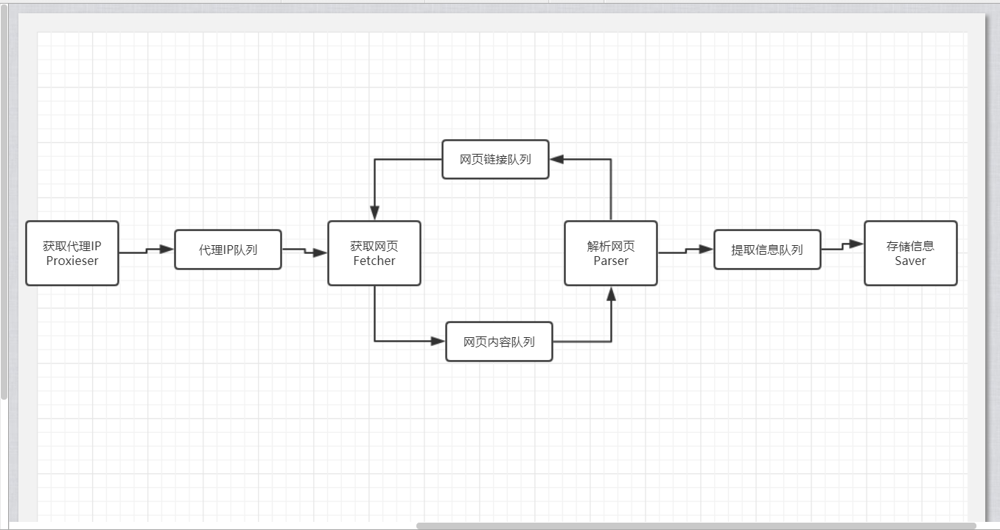
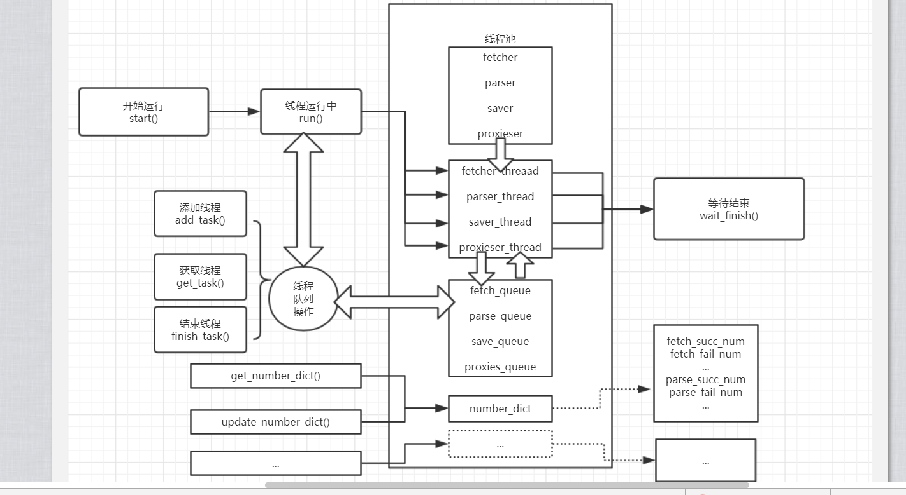
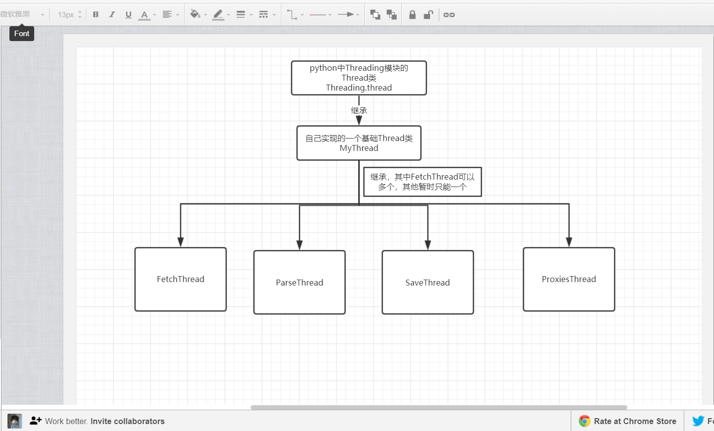
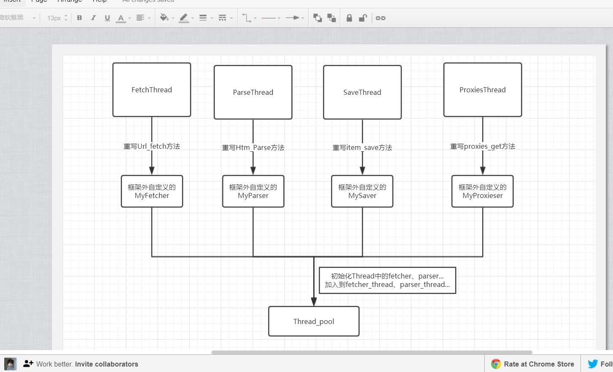
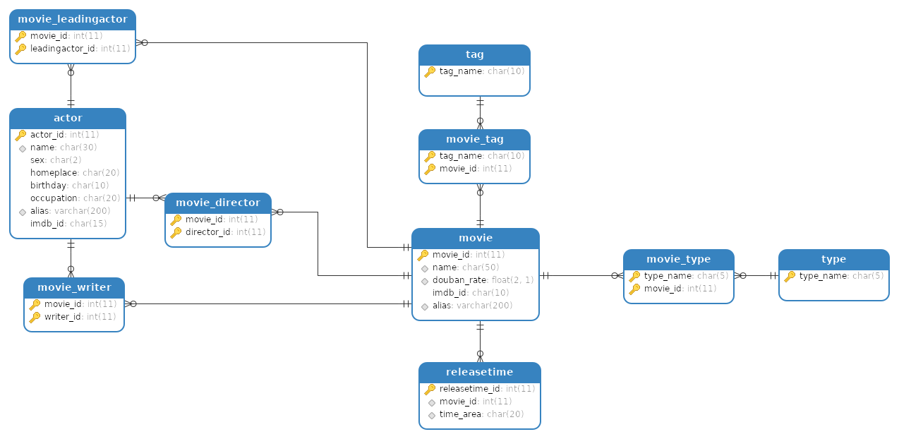

之前写豆瓣电影爬虫的时候用过Github大佬[xianhu](https://github.com/xianhu)的[简易多线程爬虫框架](https://github.com/xianhu/PSpider),觉得很不错，结构精巧而实用，后来有时间于是就模仿着也实现了一个简化版本的，一方面学习一下python，另一方面能更加深刻地理解多线程思想。

------

- [Github仓库](https://github.com/humingk/douban_movie_spider)

------

## [施工]待重构...

- 其中douban目录所用框架spider待重构，此处采用的仍是[简易多线程爬虫框架](https://github.com/xianhu/PSpider)框架
- 其中douban目录数据库表结构待重构，关于其表结构的优化详见[豆瓣电影数据库设计及优化](https://humingk.github.io/mysql-douban_movie/)

## 框架结构

### 框架整体流程



### 线程池原理图



### 线程池初始化



### 使用接口



## 代码目录

```
├── douban						# 豆瓣电影爬虫实现
│   ├── main.py							 # main
│   ├── config.py						 # 配置文件
│   ├── fetcher.py						# 获取网页 
│   ├── parser.py						#  解析网页
│   ├── proxy.py						# 获取代理
│   └── saver.py						# 保存数据
├── README.md
├── spider							# 爬虫框架
│   ├── instances						# 框架接口
│   │   ├── fetch.py						# 获取网页
│   │   ├── parse.py						# 解析网页
│   │   ├── proxies.py						# 获取代理
│   │   └── save.py							# 保存数据
│   └── threads							# 框架线程池
│       ├── threads_inst					# 线程初始化
│       │   ├── base.py							# MyThread基类，继承了Thread类
│       │   ├── fetch.py						# 线程处理-获取网页，继承MyThread类
│       │   ├── parse.py						# 线程处理-解析网页，继承MyThread类
│       │   ├── proxies.py					# 线程处理-获取代理，继承MyThread类
│       │   └── save.py							# 线程处理-保存数据，继承MyThread类
│       └── threads_pool.py				# 线程池类
```

### 历史版本表结构(此douban目录目前采用的表结构)



### 最新版本(此douban目录待重构部分)


## 友情链接

- [IPProxyTool](https://github.com/awolfly9/IPProxyTool)
- [PSpider](https://github.com/xianhu/PSpider)

