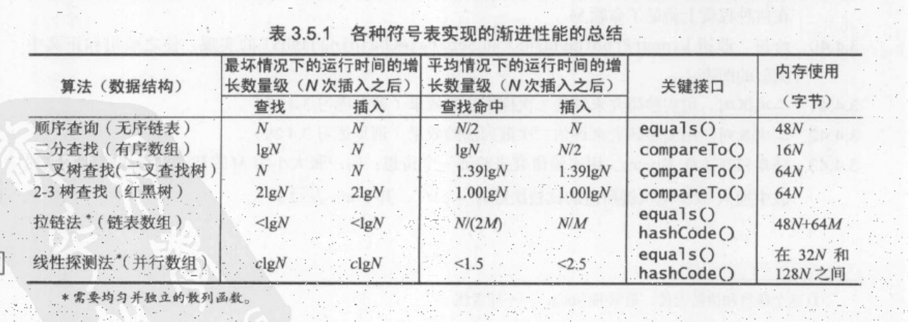
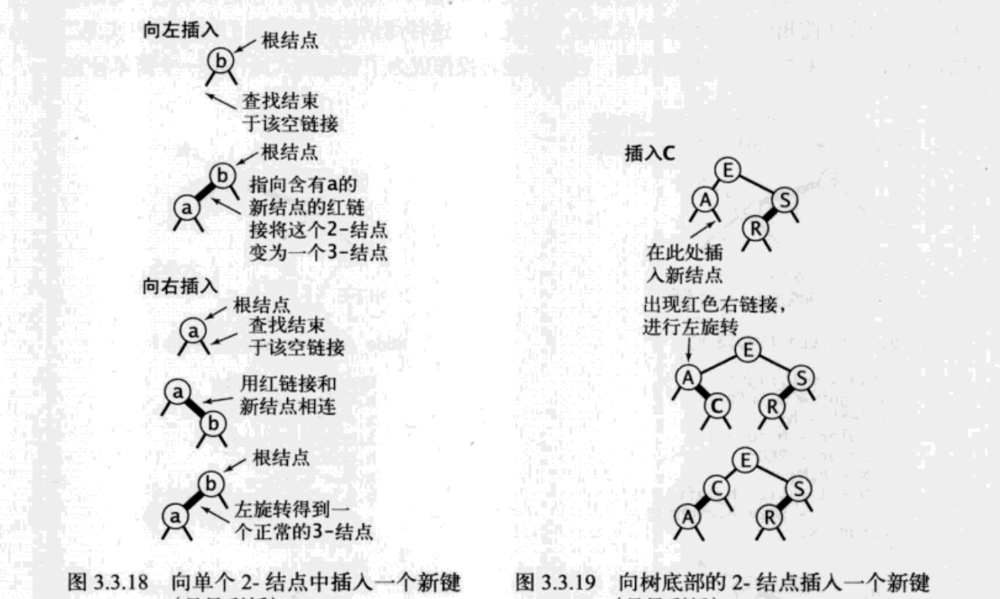
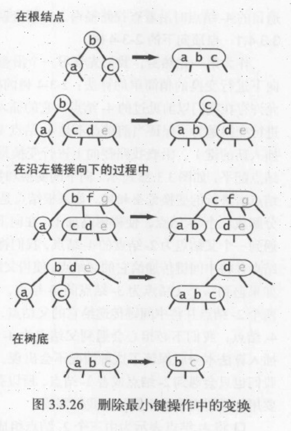

排序算法也是最基础的算法知识，这里主要参考了[算法第四版](https://algs4.cs.princeton.edu/home/)这本书，比较详细的讲解了各种选择算法的实现方式，其中包括二叉树、红黑树等基础数据结构的实现原理


选择算法也是最基础的算法知识，这里主要参考了[算法第四版](https://algs4.cs.princeton.edu/home/)这本书，比较详细的讲解了各种选择算法的实现方式，其中包括二叉树、红黑树等基础数据结构的实现原理

---

从这里开始使用**阿里巴巴代码规约**

https://github.com/alibaba/p3c

---

### 时间复杂度



## 顺序查找:无序链表

- get(),put() 实现均为遍历链表进行比较
- 基于链表的实现和顺序查找是非常低效的


### 完整代码

```java
package test.sort;

import edu.princeton.cs.algs4.Queue;

/**
 * @author humingk
 */
public class SequentialSearchSt<Key, Value> {
    private int n;
    private Node first;

    private class Node {
        private Key key;
        private Value value;
        private Node next;

        public Node(Key key, Value value, Node next) {
            this.key = key;
            this.value = value;
            this.next = next;
        }
    }

    public SequentialSearchSt() {

    }

    public Value get(Key key) {
        for (Node i = first; i != null; i = i.next) {
            if (key.equals(i.key)) {
                return i.value;
            }
        }
        return null;
    }

    public void put(Key key, Value value) {
        if (value == null) {
            delete(key);
            return;
        }
        // 修改value
        for (Node i = first; i != null; i = i.next) {
            if (key.equals(i.key)) {
                i.value = value;
                return;
            }
        }
        // 新添加
        first = new Node(key, value, first);
        n++;
        return;
    }

    public boolean contains(Key key) {
        return get(key) != null;
    }

    public void delete(Key key) {
        first = delete(key, first);
    }

    public Node delete(Key key, Node node) {
        if (key == null) {
            return null;
        }
        if (key.equals(node.key)) {
            n--;
            return node.next;
        }
        node.next = delete(key, node.next);
        return node;
    }

    public int size() {
        return n;
    }

    public boolean isEmpty() {
        return n == 0;
    }

    public Iterable<Key> keys() {
        Queue<Key> queue = new Queue<Key>();
        for (Node i = first; i != null; i = i.next) {
            queue.enqueue(i.key);
        }
        return queue;
    }

    public static void main(String[] args) {
        String[] a = {"S", "O", "R", "T", "E", "X", "A", "M", "P", "L", "E"};
        SequentialSearchSt<String, Integer> st = new SequentialSearchSt<String, Integer>();
        int i = 0;
        for (String s : a) {
            st.put(s, i);
            i++;
        }
        System.out.print("Key:  ");
        for (int j = 0; j < a.length; j++) {
            System.out.print(a[j] + " ");
        }
        System.out.println();
        System.out.print("Value:");
        for (int j = 0; j < a.length; j++) {
            System.out.print(j + " ");
        }
        System.out.println();

        System.out.println();
        st.delete("A");
        st.delete("E");
        System.out.println("delete A and E then:");
        for (String s : st.keys()) {
            System.out.print(st.get(s) + " ");
        }
        System.out.println();
    }
}
```

## 二分查找:有序数组

一对平行的有序数组，分别存储keys和values


### 递归的二分查找

- rank() 返回key在keys中的位置

```java
    public int rank(Key key) {
        int lo = 0, hi = n - 1;
        while (lo <= hi) {
            int mid = lo + (hi - lo) / 2;
            int cmp = key.compareTo(keys[mid]);
            if (cmp < 0) {
                hi = mid - 1;
            } else if (cmp > 0) {
                lo = mid + 1;
            } else {
                return mid;
            }
        }
        return lo;
    }
```

## 完整代码

```java
package test.sort;

import edu.princeton.cs.algs4.Queue;

/**
 * @author humingk
 */
public class BinarySearchSt<Key extends Comparable<Key>, Value> {
    private static final int LOW = 4;
    private static final int DOUBLE = 2;
    private Key[] keys;
    private Value[] values;
    private int n = 0;

    public BinarySearchSt() {
        keys = (Key[]) new Comparable[2];
        values = (Value[]) new Object[2];
    }

    public Value get(Key key) {
        if (isEmpty()) {
            return null;
        }
        int i = rank(key);
        if (i < n && i >= 0 && keys[i].compareTo(key) == 0) {
            return values[i];
        }
        return null;
    }

    public void put(Key key, Value value) {
        if (value == null) {
            delete(key);
            return;
        }
        int i = rank(key);
        if (i < n && i >= 0 && keys[i].compareTo(key) == 0) {
            values[i] = value;
            return;
        }
        // keys扩容
        if (n == keys.length) {
            resize(2 * keys.length);
        }
        //比key大的（在key后面）的元素向后移一位
        for (int j = n; j > i; j--) {
            keys[j] = keys[j - 1];
            values[j] = values[j - 1];
        }
        keys[i] = key;
        values[i] = value;
        n++;
    }

    /**
     * 返回key在keys中的位置
     *
     * @param key
     * @return
     */
    public int rank(Key key) {
        int lo = 0, hi = n - 1;
        while (lo <= hi) {
            int mid = lo + (hi - lo) / 2;
            int cmp = key.compareTo(keys[mid]);
            if (cmp < 0) {
                hi = mid - 1;
            } else if (cmp > 0) {
                lo = mid + 1;
            } else {
                return mid;
            }
        }
        return lo;
    }

    public void delete(Key key) {
        if (isEmpty()) {
            return;
        }
        int i = rank(key);
        // 表中没有此元素
        if (i == n || keys[i].compareTo(key) != 0) {
            return;
        }
        // 比key大的元素向前移一位
        for (int j = i; j < n - 1; j++) {
            keys[j] = keys[j + 1];
            values[j] = values[j + 1];
        }
        n--;
        keys[n] = null;
        values[n] = null;
        // keys 减容
        if (n > 0 && n == keys.length / LOW) {
            resize(keys.length / DOUBLE);
        }
    }

    public int size() {
        return n;
    }

    public boolean isEmpty() {
        return n == 0;
    }

    public boolean contains(Key key) {
        return get(key) != null;
    }

    private void resize(int capacity) {
        assert capacity >= n;
        Key[] tempKeys = (Key[]) new Comparable[capacity];
        Value[] tempvalues = (Value[]) new Object[capacity];
        for (int i = 0; i < n; i++) {
            tempKeys[i] = keys[i];
            tempvalues[i] = values[i];
        }
        keys = tempKeys;
        values = tempvalues;
    }

    public Iterable<Key> keys() {
        return keys(keys[0], keys[n - 1]);
    }

    public Iterable<Key> keys(Key lo, Key hi) {
        Queue<Key> queue = new Queue<Key>();
        if (lo.compareTo(hi) > 0) {
            return queue;
        }
        for (int i = rank(lo); i < rank(hi); i++) {
            queue.enqueue(keys[i]);
        }
        if (contains(hi)) {
            queue.enqueue(keys[rank(hi)]);
        }
        return queue;
    }

    public static void main(String[] args) {
        String[] a = {"S", "O", "R", "T", "E", "X", "A", "M", "P", "L", "E"};
        BinarySearchSt<String, Integer> st = new BinarySearchSt<String, Integer>();
        int i = 0;
        for (String s : a) {
            st.put(s, i);
            i++;
        }
        System.out.println("orign:");
        for (String s : st.keys()) {
            System.out.print(st.get(s) + " ");
        }
        System.out.println();
        st.delete("A");
        st.delete("E");
        System.out.println("delete A and E then:");
        for (String s : st.keys()) {
            System.out.print(st.get(s) + " ");
        }
        System.out.println();
    }
}
```

## 二叉树查找:二叉查找树

### 插入节点

```java
    private Node put(Node x, Key key, Value value) {
        // 树是空树，返回一个根节点
        // key不存在，将key 和 value 作为新节点插入到该子树中
        if (x == null) {
            return new Node(key, value, 1);
        }
        int cmp = key.compareTo(x.key);
        // 小于当前节点 继续在左侧插入
        if (cmp < 0) {
            x.left = put(x.left, key, value);
        }
        // 大于当前节点 继续在右侧插入
        else if (cmp > 0) {
            x.right = put(x.right, key, value);
        }
        // 更新key对应的value新值
        else {
            x.value = value;
        }
        x.n = size(x.left) + size(x.right) + 1;
        return x;
    }
```

### floor 小于等于key的节点中的最大节点


```java
    private Node floor(Node x, Key key) {
        if (x == null) {
            return null;
        }
        int cmp = key.compareTo(x.key);
        // key等于x，小于等于key的节点为x
        if (cmp == 0) {
            return x;
        }
        // key小于x, 那么floor一定在x的左子树中，向左递归
        if (cmp < 0) {
            return floor(x.left, key);
        }
        // key大于x, 那么floor可能在 "x的右子树中/x"，向右递归
        Node t = floor(x.right, key);
        // 当x右子树存在floor时，返回t
        if (t != null) {
            return t;
        }
        // 当x右子树不存在floor时，返回x
        else {
            return x;
        }
    }
```

### select 找出排名为k的节点


```java
    private Node select(Node x, int k) {
        if (x == null) {
            return null;
        }
        int t = size(x.left);
        if (t > k) {
            return select(x.left, k);
        } else if (t < k) {
            return select(x.right, k);
        } else {
            return x;
        }
    }
```

### deleteMin 删除最小节点


```java
    private Node deleteMin(Node x) {
        // 返回x的右节点,等同于：
        // 将x的上一节点指向x，改成x的上一节点指向x的右节点
        // 此时没有任何链接指向x，x会被当做垃圾回收
        if (x.left == null) {
            return x.right;
        }
        x.left = deleteMin(x.left);
        //计数器更新
        x.n = size(x.left) + size(x.right) + 1;
        return x;
    }
```

### delete 删除操作

删除x节点，右子树中的最小节点将代替x节点，代替后，将右子树最小节点删除，新的x节点右链接指向新的右子树，左链接指向原来的x节点左子树


```java
    public Node delete(Node x, Key key) {
        if (x == null) {
            return null;
        }
        int cmp = key.compareTo(x.key);
        if (cmp < 0) {
            x.left = delete(x.left, key);
        } else if (cmp > 0) {
            x.right = delete(x.right, key);
        } else {
            // 删除任意只有一个的左/右子节点
            if (x.left == null) {
                return x.right;
            }
            if (x.right == null) {
                return x.left;
            }
            // t为将要删除的节点
            Node t = x;
            // x为t的后继节点，即t的右子树中最小的节点
            // 删除t后，x将要顶替t
            x = min(t.right);
            // 删除掉t的右子树(R)中最小的节点x，右子树调整好后(R+)
            // 将要代替t的x的右子树指向R+
            x.right = deleteMin(t.right);
            // 将要代替t的x的左子树指向t原来的左子树
            x.left = t.left;
        }
        x.n = size(x.left) + size(x.right) + 1;
        return x;
    }
```

### 完整代码

```java
package test.sort;

import edu.princeton.cs.algs4.Queue;

/**
 * @author humingk
 */
public class Bst<Key extends Comparable<Key>, Value> {
    private Node root;

    private class Node {
        private Key key;
        private Value value;
        private Node left, right;
        /**
         * 以该节点为根的子节点总数
         */
        private int n;

        public Node() {
        }

        public Node(Key key, Value value, int n) {
            this.key = key;
            this.value = value;
            this.n = n;
        }
    }

    public Bst() {
    }

    public Value get(Key key) {
        return get(root, key);
    }

    private Value get(Node x, Key key) {
        if (x == null) {
            return null;
        }
        int cmp = key.compareTo(x.key);
        if (cmp < 0) {
            return get(x.left, key);
        } else if (cmp > 0) {
            return get(x.right, key);
        } else {
            return x.value;
        }
    }

    public void put(Key key, Value value) {
        if (value == null) {
            delete(key);
            return;
        }
        root = put(root, key, value);
    }

    private Node put(Node x, Key key, Value value) {
        // 树是空树，返回一个根节点
        // key不存在，将key 和 value 作为新节点插入到该子树中
        if (x == null) {
            return new Node(key, value, 1);
        }
        int cmp = key.compareTo(x.key);
        // 小于当前节点 继续在左侧插入
        if (cmp < 0) {
            x.left = put(x.left, key, value);
        }
        // 大于当前节点 继续在右侧插入
        else if (cmp > 0) {
            x.right = put(x.right, key, value);
        }
        // 更新key对应的value新值
        else {
            x.value = value;
        }
        x.n = size(x.left) + size(x.right) + 1;
        return x;
    }

    public boolean isEmpty() {
        return size(root) == 0;
    }

    public Iterable<Key> keys() {
        return keys(min(), max());
    }

    public Iterable<Key> keys(Key lo, Key hi) {
        Queue<Key> queue = new Queue<Key>();
        keys(root, queue, lo, hi);
        return queue;
    }

    /**
     * 查找lo-hi范围内的key
     *
     * @param x
     * @param queue
     * @param lo
     * @param hi
     */
    private void keys(Node x, Queue<Key> queue, Key lo, Key hi) {
        if (x == null) {
            return;
        }
        int cmplo = lo.compareTo(x.key);
        int cmphi = hi.compareTo(x.key);
        // lo < x.key
        if (cmplo < 0) {
            keys(x.left, queue, lo, hi);
        }
        // lo <= x.key <= hi
        if (cmplo <= 0 && cmphi >= 0) {
            queue.enqueue(x.key);
        }
        // x.key < hi
        if (cmphi > 0) {
            keys(x.right, queue, lo, hi);
        }

    }

    public int size() {
        return size(root);
    }

    private int size(Node x) {
        if (x == null) {
            return 0;
        } else {
            return x.n;
        }
    }

    public Key min() {
        return min(root).key;
    }

    private Node min(Node x) {
        if (x.left == null) {
            return x;
        }
        return min(x.left);
    }

    public Key max() {
        return max(root).key;
    }

    private Node max(Node x) {
        if (x.right == null) {
            return x;
        }
        return max(x.right);
    }

    public Key floor(Key key) {
        Node x = floor(root, key);
        if (x == null) {
            return null;
        }
        return x.key;
    }

    /**
     * @param x
     * @param key
     * @return 小于等于key节点中的最大键
     */
    private Node floor(Node x, Key key) {
        if (x == null) {
            return null;
        }
        int cmp = key.compareTo(x.key);
        // key等于x，小于等于key的节点为x
        if (cmp == 0) {
            return x;
        }
        // key小于x, 那么floor一定在x的左子树中，向左递归
        if (cmp < 0) {
            return floor(x.left, key);
        }
        // key大于x, 那么floor可能在 "x的右子树中/x"，向右递归
        Node t = floor(x.right, key);
        // 当x右子树存在floor时，返回t
        if (t != null) {
            return t;
        }
        // 当x右子树不存在floor时，返回x
        else {
            return x;
        }
    }

    public Key ceiling(Key key) {
        Node x = ceiling(root, key);
        if (x == null) {
            return null;
        }
        return x.key;
    }

    /**
     * @param x
     * @param key
     * @return 大于等于key的最小键节点
     */
    private Node ceiling(Node x, Key key) {
        if (x == null) {
            return null;
        }
        int cmp = key.compareTo(x.key);
        // key等于x，大于等于key的节点为x
        if (cmp == 0) {
            return x;
        }
        // key小于x, 那么floor可能在 "x的左子树中/x"，向左递归
        if (cmp < 0) {
            Node t = ceiling(x.left, key);
            //key小于x，且x的左子数存在floor，返回t
            if (t != null) {
                return t;
            }
            //key小于x，且x的左子数不存在floor，返回x
            else {
                return x;
            }
        }
        //key大于x，那么floor一定在x的右子树中，向右递归
        return ceiling(x.right, key);
    }

    public Key select(int k) {
        return select(root, k).key;
    }

    /**
     * @param x
     * @param k
     * @return 返回排名为k的节点
     */
    private Node select(Node x, int k) {
        if (x == null) {
            return null;
        }
        int t = size(x.left);
        if (t > k) {
            return select(x.left, k);
        } else if (t < k) {
            return select(x.right, k);
        } else {
            return x;
        }
    }

    public int rank(Key key) {
        return rank(root, key);
    }

    /**
     * @param x
     * @param key
     * @return 给定键的排名
     */
    private int rank(Node x, Key key) {
        if (x == null) {
            return 0;
        }
        int cmp = key.compareTo(x.key);
        if (cmp < 0) {
            return rank(x.left, key);
        } else if (cmp > 0) {
            return rank(x.right, key) + rank(x.left, key) + 1;
        } else {
            return size(x.left);
        }
    }

    public void deleteMin() {
        root = deleteMin(root);
    }

    private Node deleteMin(Node x) {
        // 返回x的右节点,等同于：
        // 将x的上一节点指向x，改成x的上一节点指向x的右节点
        // 此时没有任何链接指向x，x会被当做垃圾回收
        if (x.left == null) {
            return x.right;
        }
        x.left = deleteMin(x.left);
        //计数器更新
        x.n = size(x.left) + size(x.right) + 1;
        return x;
    }

    public void deleteMax() {
        root = deleteMax(root);
    }

    private Node deleteMax(Node x) {
        if (x.right == null) {
            return x.left;
        }
        x.right = deleteMax(x.right);
        x.n = size(x.left) + size(x.right) + 1;
        return x;
    }

    public void delete(Key key) {
        root = delete(root, key);
    }

    public Node delete(Node x, Key key) {
        if (x == null) {
            return null;
        }
        int cmp = key.compareTo(x.key);
        if (cmp < 0) {
            x.left = delete(x.left, key);
        } else if (cmp > 0) {
            x.right = delete(x.right, key);
        } else {
            // 删除任意只有一个的左/右子节点
            if (x.left == null) {
                return x.right;
            }
            if (x.right == null) {
                return x.left;
            }
            // t为将要删除的节点
            Node t = x;
            // x为t的后继节点，即t的右子树中最小的节点
            // 删除t后，x将要顶替t
            x = min(t.right);
            // 删除掉t的右子树(R)中最小的节点x，右子树调整好后(R+)
            // 将要代替t的x的右子树指向R+
            x.right = deleteMin(t.right);
            // 将要代替t的x的左子树指向t原来的左子树
            x.left = t.left;
        }
        x.n = size(x.left) + size(x.right) + 1;
        return x;
    }

    public static void main(String[] args) {
        String[] a = {"S", "O", "R", "T", "E", "X", "A", "M", "P", "L"};
        Bst<String, Integer> st = new Bst<>();
        int i = 0;
        for (String s : a) {
            st.put(s, i);
            i++;
        }
        System.out.print("Key:  ");
        for (int j = 0; j < a.length; j++) {
            System.out.print(a[j] + " ");
        }
        System.out.println();
        System.out.print("Value:");
        for (int j = 0; j < a.length; j++) {
            System.out.print(j + " ");
        }
        System.out.println();

        System.out.print("less than or equal to D：");
        System.out.println(st.floor("D"));
        System.out.print("greater or equal to D：");
        System.out.println(st.ceiling("D"));

        System.out.print("5st ：");
        System.out.println(st.select(4));

        System.out.print("E's ranking:");
        System.out.println(st.rank("E"));

        System.out.println("delete Max and Min then:");
        st.deleteMin();
        st.deleteMax();
        for (String s : st.keys()) {
            System.out.print(st.get(s) + " ");
        }
        System.out.println();

        st.delete("P");
        st.delete("E");
        System.out.println("delete P and E then:");
        for (String s : st.keys()) {
            System.out.print(st.get(s) + " ");
        }
        System.out.println();
    }
}
```

运行结果

```
Key:  S O R T E X A M P L 
Value:0 1 2 3 4 5 6 7 8 9 
less than or equal to D：A
greater or equal to D：E
5st ：O
E's ranking:1
delete Max and Min then:
4 9 7 1 8 2 0 3 
delete P and E then:
9 7 1 2 0 3 
```

## 2-3查找树:红黑树

### 红黑树定义

- 红链接均为左链接

- 没有任何一个节点同时与两条红链接相连(即最多两个节点-三个链接)

- 完美黑色平衡，即根节点到任意空链接的路径上黑链接数目相同

### 左旋转


### 颜色转换


可以改成翻转颜色,如下:

```java
    private void flipColors(Node x) {
        x.color = !x.color;
        x.left.color = !x.left.color;
        x.right.color = !x.right.color;
    }
```

### 插入

**五种情况**：

一、向二节点插入：

- 1.左插入，成红色左链接
- 2.右插入，成红色右链接，左旋



二、向三节点插入：

- 3.最大的位置插入，成红色右链接，'八'形红色链接，颜色转换
- 4.最小的位置插入，成红色左链接，'/'形红色链接,先右旋转下部，'八'形红色链接,再颜色转换
- 5.中间的位置插入，成红色右链接，'<'型红色链接，先左旋转下部，'/'型红色链接，再右旋转上部，'八'型红色链接，再颜色转换


```java
    private Node put(Node x, Key key, Value value) {
        // 树是空树，返回一个根节点
        // key不存在，将key 和 value 作为新节点插入到该子树中
        if (x == null) {
            return new Node(key, value, RED, 1);
        }
        int cmp = key.compareTo(x.key);
        // 小于当前节点 继续在左侧插入
        if (cmp < 0) {
            x.left = put(x.left, key, value);
        }
        // 大于当前节点 继续在右侧插入
        else if (cmp > 0) {
            x.right = put(x.right, key, value);
        }
        // 更新key对应的value新值
        else {
            x.value = value;
        }
        // 红色右链接 转化为 红色左链接
        if (!isRed(x.left) && isRed(x.right)) {
            x = rotateLeft(x);
        }
        // 连续两个红色左链接 转化为 红色左链接+红色右链接
        if (isRed(x.left) && isRed(x.left.left)) {
            x = rotateRight(x);
        }
        // 红色左链接+红色右链接 转化为 红色父节点链接
        if (isRed(x.left) && isRed(x.right)) {
            flipColors(x);
        }
        x.n = size(x.left) + size(x.right) + 1;
        return x;
    }
```


### balance

put()的后半部分

```java
    private Node balance(Node x) {
        // 红色右链接 转化为 红色左链接
        if (!isRed(x.left) && isRed(x.right)) {
            x = rotateLeft(x);
        }
        // 连续两个红色左链接 转化为 红色左链接+红色右链接
        if (isRed(x.left) && isRed(x.left.left)) {
            x = rotateRight(x);
        }
        // 红色左链接+红色右链接 转化为 红色父节点链接
        if (isRed(x.left) && isRed(x.right)) {
            flipColors(x);
        }
        x.n = size(x.left) + size(x.right) + 1;
        return x;
    }
```

### moveRedLeft

x是红色节点，x.left 和 x.left.left 都是黑色节点  

将x.left 或 x.left的左子节点 变成红色节点


```java
    private Node moveRedLeft(Node x) {
        flipColors(x);
        if (isRed(x.right.left)) {
            x.right = rotateRight(x.right);
            x = rotateLeft(x);
            flipColors(x);
        }
        return x;
    }
```

### moveRedRight

x为红色节点，x.right 和 x.right.left是黑色节点  

将x.right 或 x.right 的右子节点 变成红色


```java
    private Node moveRedRight(Node x) {
        flipColors(x);
        if (isRed(x.left.left)) {
            x = rotateRight(x);
        }
        return x;
    }
```

### 删除最小值

沿着左链接向下，确保当前节点不是二节点（可以是三节点和临时的四节点），



```java
    public void deleteMin() {
        //沿着左链接向下，并且确保当前节点不是二节点(可以是三节点和四节点)
        if (!isRed(root.left) && !isRed(root.right)) {
            root.color = RED;
        }
        root = deleteMin(root);
        if (!isEmpty()) {
            root.color = BLACK;
        }
    }

    private Node deleteMin(Node x) {
        // 返回x的右节点,等同于：
        // 将x的上一节点指向x，改成x的上一节点指向x的右节点
        // 此时没有任何链接指向x，x会被当做垃圾回收
        if (x.left == null) {
            return null;
        }
        // moveRedLeft()
        if (!isRed(x.left) && !isRed(x.left.left)) {
            x = moveRedLeft(x);
        }
        x.left = deleteMin(x.left);
        return balance(x);
    }
```

### 删除操作

等价于： 在一棵根节点不是2节点的子树中删除最小的键  
分别向左和向右递归，递归的时候倾向于将二节点转化为三、四节点

```java
    private Node delete(Node h, Key key) {
        // 向左递归
        if (key.compareTo(h.key) < 0) {
            // x是红色节点，x.left 和 x.left.left 都是黑色节点
            // 将x.left 或 x.left的左子节点 变成红色节点
            if (!isRed(h.left) && !isRed(h.left.left)) {
                h = moveRedLeft(h);
            }
            h.left = delete(h.left, key);
        }
        // 向右递归
        else {
            if (isRed(h.left)) {
                h = rotateRight(h);
            }
            if (key.compareTo(h.key) == 0 && h.right == null) {
                return null;
            }
            // x为红色节点，x.right 和 x.right.left是黑色节点
            // 将x.right 或 x.right 的右子节点 变成红色
            if (!isRed(h.right) && !isRed(h.right.left)) {
                h = moveRedRight(h);
            }
            // 删除操作
            if (key.compareTo(h.key) == 0) {
                Node x = min(h.right);
                h.key = x.key;
                h.value = x.value;
                h.right = deleteMin(h.right);
            } else {
                h.right = delete(h.right, key);
            }
        }
        return balance(h);
    }
```


### 完整代码

```java
package test.sort;

import edu.princeton.cs.algs4.Queue;

/**
 * @author humingk
 */
public class RedBlackBst<Key extends Comparable<Key>, Value> {
    private static final boolean RED = true;
    private static final boolean BLACK = false;
    private Node root;

    private class Node {
        private Key key;
        private Value value;
        private Node left, right;
        /**
         * 红色：true
         * 黑色：false
         * 空链接为黑色
         */
        private boolean color;
        /**
         * 以该节点为根的子节点总数
         */
        private int n;

        public Node(Key key, Value value, boolean color, int n) {
            this.key = key;
            this.value = value;
            this.color = color;
            this.n = n;
        }
    }

    public RedBlackBst() {
    }

    public Value get(Key key) {
        return get(root, key);
    }

    private Value get(Node x, Key key) {
        if (x == null) {
            return null;
        }
        int cmp = key.compareTo(x.key);
        if (cmp < 0) {
            return get(x.left, key);
        } else if (cmp > 0) {
            return get(x.right, key);
        } else {
            return x.value;
        }
    }

    public void put(Key key, Value value) {
        if (value == null) {
            delete(key);
            return;
        }
        root = put(root, key, value);
        // 根节点总是黑色的，若由红色变为黑色，说明树高度加1
        root.color = BLACK;
    }

    private Node put(Node x, Key key, Value value) {
        // 树是空树，返回一个根节点
        // key不存在，将key 和 value 作为新节点插入到该子树中
        if (x == null) {
            return new Node(key, value, RED, 1);
        }
        int cmp = key.compareTo(x.key);
        // 小于当前节点 继续在左侧插入
        if (cmp < 0) {
            x.left = put(x.left, key, value);
        }
        // 大于当前节点 继续在右侧插入
        else if (cmp > 0) {
            x.right = put(x.right, key, value);
        }
        // 更新key对应的value新值
        else {
            x.value = value;
        }
        // 红色右链接 转化为 红色左链接
        if (!isRed(x.left) && isRed(x.right)) {
            x = rotateLeft(x);
        }
        // 连续两个红色左链接 转化为 红色左链接+红色右链接
        if (isRed(x.left) && isRed(x.left.left)) {
            x = rotateRight(x);
        }
        // 红色左链接+红色右链接 转化为 红色父节点链接
        if (isRed(x.left) && isRed(x.right)) {
            flipColors(x);
        }
        x.n = size(x.left) + size(x.right) + 1;
        return x;
    }

    private boolean isRed(Node x) {
        if (x == null) {
            return false;
        }
        return x.color == RED;
    }

    private boolean is23() {
        return is23(root);
    }

    /**
     * 检查是否存在：
     * 一个节点连接两个红色链接
     * 红色右链接
     *
     * @param x
     * @return
     */
    private boolean is23(Node x) {
        if (x == null) {
            return true;
        }
        if (isRed(x.right)) {
            return false;
        }
        if (x != root && isRed(x) && isRed(x.left)) {
            return false;
        }
        return is23(x.left) && is23(x.right);
    }

    private boolean isBalanced() {
        int black = 0;
        Node x = root;
        while (x != null) {
            if (!isRed(x)) {
                black++;
            }
            x = x.left;
        }
        return isBalanced(root, black);
    }

    /**
     * 检查从某一节点到所有空链接的路径上的黑链接数量是否相同
     *
     * @param x
     * @param black
     * @return
     */
    private boolean isBalanced(Node x, int black) {
        if (x == null) {
            return black == 0;
        }
        if (!isRed(x)) {
            black--;
        }
        return isBalanced(x.left, black) && isBalanced(x.right, black);
    }

    private boolean isBst() {
        return isBst(root, null, null);
    }

    /**
     * 判断是否是一个RedBlackBST
     *
     * @param x
     * @param min
     * @param max
     * @return
     */
    private boolean isBst(Node x, Key min, Key max) {
        if (x == null) {
            return true;
        }
        if (min != null && x.key.compareTo(min) <= 0) {
            return false;
        }
        if (max != null && x.key.compareTo(max) >= 0) {
            return false;
        }
        return isBst(x.left, null, x.key) && isBst(x.right, x.key, null) && isBalanced();
    }

    /**
     * 红色右链接左旋为红色左链接
     *
     * @param h 上面的节点
     * @return
     */
    private Node rotateLeft(Node h) {
        Node x = h.right;

        h.right = x.left;
        x.left = h;

        x.color = h.color;
        h.color = RED;

        x.n = h.n;
        h.n = size(h.left) + size(h.right) + 1;
        return x;
    }

    /**
     * 红色左链接右旋为红色右链接
     *
     * @param h 上面的节点
     * @return
     */
    private Node rotateRight(Node h) {
        Node x = h.left;

        h.left = x.right;
        x.right = h;

        x.color = h.color;
        h.color = RED;

        x.n = h.n;
        h.n = size(h.left) + size(h.right) + 1;
        return x;
    }

    /**
     * --- 根节点总是黑色的
     * 一个节点的左右链接都是红色
     * 节点转化为红链接
     * 节点的子节点转化为黑链接
     *
     * @param x
     */
    private void flipColors(Node x) {
        x.color = !x.color;
        x.left.color = !x.left.color;
        x.right.color = !x.right.color;
    }

    public boolean isEmpty() {
        return size(root) == 0;
    }

    public Iterable<Key> keys() {
        return keys(min(), max());
    }

    public Iterable<Key> keys(Key lo, Key hi) {
        Queue<Key> queue = new Queue<Key>();
        keys(root, queue, lo, hi);
        return queue;
    }

    /**
     * 查找lo-hi范围内的key
     *
     * @param x
     * @param queue
     * @param lo
     * @param hi
     */
    private void keys(Node x, Queue<Key> queue, Key lo, Key hi) {
        if (x == null) {
            return;
        }
        int cmplo = lo.compareTo(x.key);
        int cmphi = hi.compareTo(x.key);
        // lo < x.key
        if (cmplo < 0) {
            keys(x.left, queue, lo, hi);
        }
        // lo <= x.key <= hi
        if (cmplo <= 0 && cmphi >= 0) {
            queue.enqueue(x.key);
        }
        // x.key < hi
        if (cmphi > 0) {
            keys(x.right, queue, lo, hi);
        }

    }

    public int size() {
        return size(root);
    }

    private int size(Node x) {
        if (x == null) {
            return 0;
        } else {
            return x.n;
        }
    }

    public Key min() {
        return min(root).key;
    }

    private Node min(Node x) {
        if (x.left == null) {
            return x;
        }
        return min(x.left);
    }

    public Key max() {
        return max(root).key;
    }

    private Node max(Node x) {
        if (x.right == null) {
            return x;
        }
        return max(x.right);
    }

    public Key floor(Key key) {
        Node x = floor(root, key);
        if (x == null) {
            return null;
        }
        return x.key;
    }

    /**
     * @param x
     * @param key
     * @return 小于等于key节点中的最大键
     */
    private Node floor(Node x, Key key) {
        if (x == null) {
            return null;
        }
        int cmp = key.compareTo(x.key);
        // key等于x，小于等于key的节点为x
        if (cmp == 0) {
            return x;
        }
        // key小于x, 那么floor一定在x的左子树中，向左递归
        if (cmp < 0) {
            return floor(x.left, key);
        }
        // key大于x, 那么floor可能在 "x的右子树中/x"，向右递归
        Node t = floor(x.right, key);
        // 当x右子树存在floor时，返回t
        if (t != null) {
            return t;
        }
        // 当x右子树不存在floor时，返回x
        else {
            return x;
        }
    }

    public Key ceiling(Key key) {
        Node x = ceiling(root, key);
        if (x == null) {
            return null;
        }
        return x.key;
    }

    /**
     * @param x
     * @param key
     * @return 大于等于key的最小键节点
     */
    private Node ceiling(Node x, Key key) {
        if (x == null) {
            return null;
        }
        int cmp = key.compareTo(x.key);
        // key等于x，大于等于key的节点为x
        if (cmp == 0) {
            return x;
        }
        // key小于x, 那么floor可能在 "x的左子树中/x"，向左递归
        if (cmp < 0) {
            Node t = ceiling(x.left, key);
            //key小于x，且x的左子数存在floor，返回t
            if (t != null) {
                return t;
            }
            //key小于x，且x的左子数不存在floor，返回x
            else {
                return x;
            }
        }
        //key大于x，那么floor一定在x的右子树中，向右递归
        return ceiling(x.right, key);
    }

    public Key select(int k) {
        return select(root, k).key;
    }

    /**
     * @param x
     * @param k
     * @return 返回排名为k的节点
     */
    private Node select(Node x, int k) {
        if (x == null) {
            return null;
        }
        int t = size(x.left);
        if (t > k) {
            return select(x.left, k);
        } else if (t < k) {
            return select(x.right, k);
        } else {
            return x;
        }
    }

    public int rank(Key key) {
        return rank(root, key);
    }

    /**
     * @param x
     * @param key
     * @return 给定键的排名
     */
    private int rank(Node x, Key key) {
        if (x == null) {
            return 0;
        }
        int cmp = key.compareTo(x.key);
        if (cmp < 0) {
            return rank(x.left, key);
        } else if (cmp > 0) {
            return rank(x.right, key) + rank(x.left, key) + 1;
        } else {
            return size(x.left);
        }
    }

    /**
     * 节点x不能有：
     * 红色右链接
     * 连续两个红色左链接
     * 红色左链接+红色右链接
     *
     * @param x
     * @return
     */
    private Node balance(Node x) {
        // 红色右链接 转化为 红色左链接
        if (!isRed(x.left) && isRed(x.right)) {
            x = rotateLeft(x);
        }
        // 连续两个红色左链接 转化为 红色左链接+红色右链接
        if (isRed(x.left) && isRed(x.left.left)) {
            x = rotateRight(x);
        }
        // 红色左链接+红色右链接 转化为 红色父节点链接
        if (isRed(x.left) && isRed(x.right)) {
            flipColors(x);
        }
        x.n = size(x.left) + size(x.right) + 1;
        return x;
    }

    /**
     * x是红色节点，x.left 和 x.left.left 都是黑色节点
     * 将x.left 或 x.left的左子节点 变成红色节点
     *
     * @param x
     * @return
     */
    private Node moveRedLeft(Node x) {
        flipColors(x);
        if (isRed(x.right.left)) {
            x.right = rotateRight(x.right);
            x = rotateLeft(x);
            flipColors(x);
        }
        return x;
    }

    public void deleteMin() {
        //沿着左链接向下，并且确保当前节点不是二节点(可以是三节点和四节点)
        if (!isRed(root.left) && !isRed(root.right)) {
            root.color = RED;
        }
        root = deleteMin(root);
        if (!isEmpty()) {
            root.color = BLACK;
        }
    }

    private Node deleteMin(Node x) {
        // 返回x的右节点,等同于：
        // 将x的上一节点指向x，改成x的上一节点指向x的右节点
        // 此时没有任何链接指向x，x会被当做垃圾回收
        if (x.left == null) {
            return null;
        }
        // moveRedLeft()
        if (!isRed(x.left) && !isRed(x.left.left)) {
            x = moveRedLeft(x);
        }
        x.left = deleteMin(x.left);
        return balance(x);
    }

    /**
     * x为红色节点，x.right 和 x.right.left是黑色节点
     * 将x.right 或 x.right 的右子节点 变成红色
     *
     * @param x
     * @return
     */
    private Node moveRedRight(Node x) {
        flipColors(x);
        if (isRed(x.left.left)) {
            x = rotateRight(x);
            flipColors(x);
        }
        return x;
    }

    public void deleteMax() {
        if (!isRed(root.left) && !isRed(root.right)) {
            root.color = RED;
        }
        root = deleteMax(root);
        if (!isEmpty()) {
            root.color = BLACK;
        }
    }

    private Node deleteMax(Node x) {
        if (isRed(x.left)) {
            x = rotateRight(x);
        }
        if (x.right == null) {
            return null;
        }
        if (!isRed(x.right) && !isRed(x.right.left)) {
            x = moveRedRight(x);
        }
        x.right = deleteMax(x.right);
        return balance(x);
    }

    public void delete(Key key) {
        if (!isRed(root.left) && !isRed(root.right)) {
            root.color = RED;
        }
        root = delete(root, key);
        if (isEmpty()) {
            root.color = BLACK;
        }
    }

    private Node delete(Node h, Key key) {
        // 向左递归
        if (key.compareTo(h.key) < 0) {
            // x是红色节点，x.left 和 x.left.left 都是黑色节点
            // 将x.left 或 x.left的左子节点 变成红色节点
            if (!isRed(h.left) && !isRed(h.left.left)) {
                h = moveRedLeft(h);
            }
            h.left = delete(h.left, key);
        }
        // 向右递归
        else {
            if (isRed(h.left)) {
                h = rotateRight(h);
            }
            if (key.compareTo(h.key) == 0 && h.right == null) {
                return null;
            }
            // x为红色节点，x.right 和 x.right.left是黑色节点
            // 将x.right 或 x.right 的右子节点 变成红色
            if (!isRed(h.right) && !isRed(h.right.left)) {
                h = moveRedRight(h);
            }
            // 删除操作
            if (key.compareTo(h.key) == 0) {
                Node x = min(h.right);
                h.key = x.key;
                h.value = x.value;
                h.right = deleteMin(h.right);
            } else {
                h.right = delete(h.right, key);
            }
        }
        return balance(h);
    }

    public static void main(String[] args) {
        String[] a = {"S", "O", "R", "T", "E", "X", "A", "M", "P", "L"};
        RedBlackBst<String, Integer> st = new RedBlackBst<>();
        int i = 0;
        for (String s : a) {
            st.put(s, i);
            i++;
        }
        System.out.print("Key:  ");
        for (int j = 0; j < a.length; j++) {
            System.out.print(a[j] + " ");
        }
        System.out.println();
        System.out.print("Value:");
        for (int j = 0; j < a.length; j++) {
            System.out.print(j + " ");
        }
        System.out.println();

        System.out.println("isBalanced?: " + st.isBalanced());
        System.out.println("isRedBlackBST?: " + st.isBst());

        System.out.print("less than or equal to D：");
        System.out.println(st.floor("D"));
        System.out.print("greater or equal to D：");
        System.out.println(st.ceiling("D"));

        System.out.print("5st ：");
        System.out.println(st.select(4));

        System.out.print("E's ranking:");
        System.out.println(st.rank("E"));

        System.out.println("delete Max and Min then:");
        st.deleteMin();
        st.deleteMax();
        for (String s : st.keys()) {
            System.out.print(st.get(s) + " ");
        }
        System.out.println();

        st.delete("P");
        st.delete("E");
        System.out.println("delete P and E then:");
        for (String s : st.keys()) {
            System.out.print(st.get(s) + " ");
        }
        System.out.println();
    }
}
```

运行结果

```
Key:  S O R T E X A M P L
Value:0 1 2 3 4 5 6 7 8 9
isBalanced?: true
isRedBlackBST?: true
less than or equal to D：A
greater or equal to D：E
5st ：O
E's ranking:1
delete Max and Min then:
4 9 7 1 8 2 0 3
delete P and E then:
9 7 1 2 0 3
```

## 拉链法:链表数组


### 完整代码

```java
package test.sort;

import edu.princeton.cs.algs4.Queue;

/**
 * @author humingk
 */
public class SepatateChainingHashSt<Key, Value> {
    private static final int HIGH_AVERAGE = 10;
    private static final int LOW_AVERAGE = 2;
    private static final int DOUBLE = 2;
    /**
     * 键值对总数
     */
    private int n;
    /**
     * 散列表大小
     */
    private int m;
    /**
     * 存放链表对象的数组
     */
    private SequentialSearchSt<Key, Value>[] st;

    public SepatateChainingHashSt() {
        this(997);
    }

    public SepatateChainingHashSt(int m) {
        this.m = m;
        st = (SequentialSearchSt<Key, Value>[]) new SequentialSearchSt[m];
        for (int i = 0; i < m; i++) {
            st[i] = new SequentialSearchSt();
        }
    }

    private int hash(Key key) {
        return (key.hashCode() & 0x7fffffff) % m;
    }

    public Value get(Key key) {
        return (Value) st[hash(key)].get(key);
    }

    public void put(Key key, Value value) {
        if (value == null) {
            delete(key);
            return;
        }
        // 如果存放链表对象的数组平均长度大于HIGH_AVERAGE,扩容
        if (n >= HIGH_AVERAGE * m) {
            resize(DOUBLE * m);
        }
        // 键值对总数递增
        if (!st[hash(key)].contains(key)) {
            n++;
        }
        st[hash(key)].put(key, value);

    }

    public void delete(Key key) {
        // 键值对数递减
        if (st[hash(key)].contains(key)) {
            n--;
        }
        st[hash(key)].delete(key);
        // 如果存放链表对象的数组平均长度小于LOW_AVERAGE,缩容
        if (n <= LOW_AVERAGE * m) {
            resize(m / DOUBLE);
        }
    }

    private Iterable<Key> keys() {
        Queue queue = new Queue<Key>();
        for (int i = 0; i < m; i++) {
            for (Key key : st[i].keys()) {
                queue.enqueue(key);
            }
        }
        return queue;
    }

    /**
     * 调整存放链表对象数组的大小
     *
     * @param chains
     */
    private void resize(int chains) {
        SepatateChainingHashSt temp = new SepatateChainingHashSt<Key, Value>(chains);
        for (int i = 0; i < m; i++) {
            for (Key key : st[i].keys()) {
                temp.put(key, st[i].get(key));
            }
        }
        this.m = temp.m;
        this.n = temp.n;
        this.st = temp.st;
    }

    public boolean contains(Key key) {
        return get(key) != null;
    }

    public int size() {
        return n;
    }

    public boolean isEmpty() {
        return size() == 0;
    }

    public static void main(String[] args) {
        String[] a = {"S", "O", "R", "T", "E", "X", "A", "M", "P", "L"};
        SepatateChainingHashSt<String, Integer> st = new SepatateChainingHashSt<String, Integer>(5);
        int i = 0;
        for (String s : a) {
            st.put(s, i);
            i++;
        }
        System.out.print("Key:  ");
        for (int j = 0; j < a.length; j++) {
            System.out.print(a[j] + " ");
        }
        System.out.println();
        System.out.print("Value:");
        for (int j = 0; j < a.length; j++) {
            System.out.print(j + " ");
        }
        System.out.println();

        System.out.println("orogin:");
        System.out.println("st     key:value");
        for (int j = 0; j < st.m; j++) {
            System.out.print(j + "      ");
            for (String string : st.st[j].keys()) {
                System.out.print(string + ":" + st.get(string) + " ");
            }
            System.out.println();
        }

        st.delete("P");
        st.delete("E");
        System.out.println("delete P and E then:");
        System.out.println("st     key:value");
        for (int j = 0; j < st.m; j++) {
            System.out.print(j + "      ");
            for (String string : st.st[j].keys()) {
                System.out.print(string + ":" + st.get(string) + " ");
            }
            System.out.println();
        }
    }
}

```

运行结果

```
Key:  S O R T E X A M P L 
Value:0 1 2 3 4 5 6 7 8 9 
orogin:
st     key:value
0      P:8 A:6 
1      L:9 
2      M:7 R:2 
3      X:5 S:0 
4      E:4 T:3 O:1 
delete P and E then:
st     key:value
0      T:3 X:5 R:2 L:9 
1      O:1 S:0 M:7 A:6 
```

## 线性探测法:并行数组

### 完整代码

```java
package test.sort;

import edu.princeton.cs.algs4.Queue;

/**
 * @author humingk
 */
public class LinearProbingHashSt<Key, Value> {
    private static final float HIGH_FULL = (float) 1 / (float) 2;
    private static final float LOW_FULL = (float) 1 / (float) 8;
    private static final int DOUBLE = 2;
    /**
     * 键值对总数
     */
    private int n;
    /**
     * 线性探测表大小
     */
    private int m;
    /**
     * 存放链表对象的数组
     */
    private Key[] keys;
    private Value[] values;

    public LinearProbingHashSt() {
        this(4);
    }

    public LinearProbingHashSt(int m) {
        this.m = m;
        this.n = 0;
        keys = (Key[]) new Object[m];
        values = (Value[]) new Object[m];
    }

    private int hash(Key key) {
        return (key.hashCode() & 0x7fffffff) % m;
    }

    public Value get(Key key) {
        for (int i = hash(key); keys[i] != null; i = (i + 1) % m) {
            if (key.equals(keys[i])) {
                return values[i];
            }
        }
        return null;
    }

    public void put(Key key, Value value) {
        if (value == null) {
            delete(key);
            return;
        }
        // 如果线性表长度占用百分比大于HIGH_FULL,扩容
        if (n >= HIGH_FULL * m) {
            resize(DOUBLE * m);
        }
        int i;
        for (i = hash(key); keys[i] != null; i = (i + 1) % m) {
            if (key.equals(keys[i])) {
                values[i] = value;
                return;
            }
        }
        keys[i] = key;
        values[i] = value;
        n++;
    }

    public void delete(Key key) {
        if (!contains(key)) {
            return;
        }
        int i = hash(key);
        while (!key.equals(keys[i])) {
            i = (i + 1) % m;
        }
        keys[i] = null;
        values[i] = null;

        // 刷新剩余key的hash值
        for (int j = (i + 1) % m; keys[j] != null; j = (j + 1) % m) {
            Key keyTemp = keys[j];
            Value valueTemp = values[j];
            keys[j] = null;
            values[j] = null;
            n--;
            put(keyTemp, valueTemp);
        }

        n--;
        // 如果线性表长度占用百分比大于HIGH_FULL,扩容
        if (n <= LOW_FULL * m) {
            resize(m / DOUBLE);
        }
    }

    private Iterable<Key> keys() {
        Queue queue = new Queue<Key>();
        for (int i = 0; i < m; i++) {
            if (keys[i] != null) {
                queue.enqueue(keys[i]);
            }
        }
        return queue;
    }

    /**
     * 调整存放链表对象数组的大小
     *
     * @param chains
     */
    private void resize(int chains) {
        LinearProbingHashSt<Key, Value> temp = new LinearProbingHashSt<Key, Value>(chains);
        for (int i = 0; i < m; i++) {
            if (keys[i] != null) {
                temp.put(keys[i], values[i]);
            }
        }
        this.m = temp.m;
        this.n = temp.n;
        this.keys = temp.keys;
        this.values = temp.values;
    }

    public boolean contains(Key key) {
        return get(key) != null;
    }

    public int size() {
        return n;
    }

    public boolean isEmpty() {
        return size() == 0;
    }

    public static void main(String[] args) {
        String[] a = {"S", "O", "R", "T", "E", "X", "A", "M", "P", "L"};
        LinearProbingHashSt<String, Integer> st = new LinearProbingHashSt<String, Integer>(4);
        int i = 0;
        for (String s : a) {
            st.put(s, i);
            i++;
        }
        System.out.print("Key:  ");
        for (int j = 0; j < a.length; j++) {
            System.out.print(a[j] + " ");
        }
        System.out.println();
        System.out.print("Value:");
        for (int j = 0; j < a.length; j++) {
            System.out.print(j + " ");
        }
        System.out.println();

        System.out.println("origin:");
        for (String string : st.keys()) {
            System.out.print(string + ":" + st.get(string) + " ");
        }
        System.out.println();
        st.delete("P");
        st.delete("E");
        System.out.println("delete P and E then:");
        for (String string : st.keys()) {
            System.out.print(string + ":" + st.get(string) + " ");
        }
        System.out.println();
    }
}
```

运行结果

```
Key:  S O R T E X A M P L 
Value:0 1 2 3 4 5 6 7 8 9 
origin:
A:6 E:4 L:9 M:7 O:1 P:8 R:2 S:0 T:3 X:5 
delete P and E then:
A:6 L:9 M:7 O:1 R:2 S:0 T:3 X:5 
```

