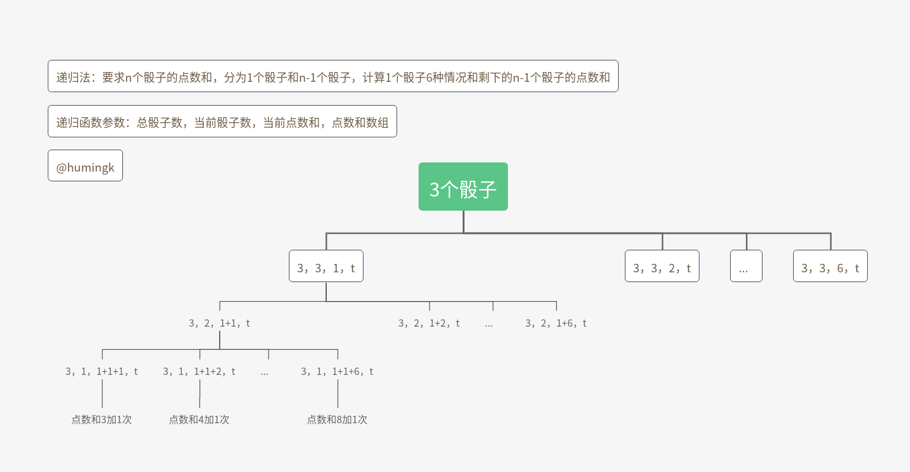

- 典型的编程题，包括测试
- [github源代码地址](https://github.com/humingk/humingk.github.io/tree/master/source_code/offer/array)
- 若未标明，默认的测试平台为：[牛客网](https://www.nowcoder.com)

---

### 数组模板工具类

**第4-8题**使用此模板:

```java
package array;

import java.util.ArrayList;

/**
 * @author humingk
 */
public class ArrayBase {
    // ------------------------------------------------------------------------------------------
    // start
    // 1.测试用例方法

    public void test() {

    }

    // 2.算法题方法

    public String solution() {

        return null;
    }
    // end
    // ------------------------------------------------------------------------------------------

    private void printArray(int[] test) {
        for (int i = 0; i < test.length; i++) {
            System.out.print(test[i] + " ");
        }
        System.out.println();
    }

    private void printArraylist(ArrayList<Integer> test) {
        for (int i = 0; i < test.size(); i++) {
            System.out.print(test.get(i) + " ");
        }
        System.out.println();
    }

    private void printMatrix(int[][] test) {
        for (int i = 0; i < test.length; i++) {
            for (int j = 0; j < test[i].length; j++) {
                System.out.print(test[i][j] + " ");
            }
            System.out.println();
        }
    }

    public static void main(String[] args) {
        new ArrayBase().test();
    }
}
```

---

### 二、数组中重复的数字

[OJ](https://www.nowcoder.com/practice/623a5ac0ea5b4e5f95552655361ae0a8?tpId=13&tqId=11203&tPage=3&rp=1&ru=%2Fta%2Fcoding-interviews&qru=%2Fta%2Fcoding-interviews%2Fquestion-ranking)

二分法的[OJ](https://www.acwing.com/problem/content/description/15/)

一、

在一个长度为n的数组里的所有数字都在0到n-1的范围内。 数组中某些数字是重复的，但不知道有几个数字是重复的。也不知道每个数字重复几次。请找出数组中任意一个重复的数字。 例如，如果输入长度为7的数组{2,3,1,0,2,5,3}，那么对应的输出是第一个重复的数字2

二、（二分法专用）

给定一个长度为 n+1n+1 的数组`nums`，数组中所有的数均在 1∼n1∼n 的范围内，其中 n≥1n≥1。

请找出数组中任意一个重复的数，但不能修改输入的数组。

样例

```
给定 nums = [2, 3, 5, 4, 3, 2, 6, 7]。

返回 2 或 3。
```


PS：

- 要求空间复杂度为O(1) 解法2
- 要求不能修改原数组 解法1
- 要求空间复杂度为O(1)且不能修改原数组 解法3

#### 测试用例

1. 有无重复
2. 包含要求范围内的数字
3. 无效输入

#### 解法123+测试 另建哈希表  / 自身哈希表 / 二分法

- 1.另建哈希表 O(n)+O(n)

  满足不修改元素组，但空间复杂度为O(n)

  用一个int型号数组当做哈希表存放下标值在数组中的出现次数，遍历一遍数组即可获得数组中所有数字的出现次数

- 2.自身哈希表 O(n)+O(1)

  满足空间复杂度为O(1)，但修改了元素组

  数组自身当做哈希表，利用哈希表特性：如果数组没有重复的数字，那么数字将和数字下标一一相同

  循环数组，如果当前数字不与当期下标相同，则与当期数字对应下标的数字进行交换

  交换第二个重复数字的时候，第二个重复数字所对应下标的位置已有第一个重复数字，返回false

- 3.二分法 O(NlogN) + O(1)

  既满足不修改元素组，且空间复杂度为O(1)

  **（但仅仅适用于n+1个数，位于1~n之间这种情况）**

  类似二分查找算法,将1～n划分成左右两个子区间，左右两个子区间里一定至少存在一个子区间，子区间中的数在数组中的个数大于此子区间长度

  调用计算count的for循环共O(logN)次，每次O(n)时间，共O(NlogN),但空间为O(1),以时间换空间

```java
package array;

/**
 * 数组中重复的数字
 *
 * @author humingk
 */
public class RepeatNumberInArray {
    /**
     * 1.另建哈希表
     * 共n个数，在1～n-1之间
     *
     * @param numbers
     * @param length
     * @param duplication
     * @return
     */
    public boolean findRepeatNumberInArray1(int[] numbers, int length, int[] duplication) {
        if (numbers == null || length <= 0) {
            return false;
        }
        // 哈希表存放哈希表数组下标在numbers数组中出现的次数
        int[] counts = new int[length];
        for (int i = 0; i < length; i++) {
            if (numbers[i] < 0 || numbers[i] > length - 1) {
                return false;
            }
            // 标记次数
            counts[numbers[i]]++;
        }
        for (int i = 0; i < length; i++) {
            if (counts[numbers[i]] > 1) {
                duplication[0] = numbers[i];
                return true;
            }
        }
        return false;
    }

    /**
     * 2.自身哈希表
     * 共n个数，在0～n-1之间
     *
     * @param numbers
     * @param length
     * @param duplication
     * @return true    有重复
     * false   没有重复
     */
    public boolean findRepeatNumberInArray2(int[] numbers, int length, int[] duplication) {
        if (numbers == null || length <= 0) {
            return false;
        }
        for (int i = 0; i < length; i++) {
            if (numbers[i] < 0 || numbers[i] > length - 1) {
                return false;
            }
        }
        int m;
        for (int i = 0; i < length; i++) {
            if (numbers[i] != i) {
                m = numbers[i];
                // 出现了重复的数字
                if (numbers[m] == m) {
                    duplication[0] = m;
                    return true;
                }
                // 交换
                else {
                    numbers[i] = numbers[m];
                    numbers[m] = m;
                }
            }
        }
        return false;
    }


    /**
     * 3.二分法
     * 共n+1个数
     * 位于1～n之间
     *
     * @param nums
     * @return
     */
    public int findRepeatNumberInArray3(int[] nums) {
        if (nums == null || nums.length <= 0) {
            return -1;
        }
        int start = 1, end = nums.length - 1, middle, count;
        while (start < end) {
            middle = (start + end) >> 1;
            // start-middle之间的数字（数组下标数字）在数组（数组的值）中出现的次数
            count = 0;
            for (int i = 0; i < nums.length; i++) {
                if (nums[i] <= middle && nums[i] >= start) {
                    count++;
                }
            }
            // start-middle下标值在数组中出现次数大于start-middle的数字个数，说明在数组start-middle之间存在重复值
            if (count > (middle - start + 1)) {
                end = middle;
            }
            // 否则在数组middle+1 - end之间存在重复值
            else {
                start = middle + 1;
            }
        }
        return start;
    }

    public void test1(int[] numbers, int[] duplication) {
        if (findRepeatNumberInArray2(numbers, numbers.length, duplication)) {
            System.out.println(duplication[0]);
        } else {
            System.out.println("repeat none");
        }
    }

    public void test3(int[] numbers) {
        System.out.println(findRepeatNumberInArray3(numbers));
    }

    public static void main(String[] args) {
        RepeatNumberInArray r = new RepeatNumberInArray();
        System.out.println("哈希表2========");
        int[] numbersTwo1 = {3, 1, 2, 4, 7, 5, 6, 7, 0, 9};
        System.out.println("没有重复");
        r.test1(numbersTwo1, new int[numbersTwo1.length]);
        System.out.println("有一个重复");
        int[] numbersTwo2 = {3, 1, 2, 4, 7, 7, 6, 8, 0, 9};
        r.test1(numbersTwo2, new int[numbersTwo2.length]);
        System.out.println("无效输入");
        int[] numbersTwo3 = {};
        r.test1(numbersTwo3, new int[numbersTwo3.length]);
        System.out.println("包含 0~n-1 之外的数字");
        int[] numbersTwo4 = {3, 1, 2, 24, 7, 5, 13, 7, 0, 9};
        r.test1(numbersTwo4, new int[numbersTwo4.length]);

        System.out.println("二分法=========");
        System.out.println("有两个重复");
        int[] numbersThree1 = {3, 1, 2, 4, 7, 7, 6, 8, 3, 9, 5};
        r.test3(numbersThree1);
        System.out.println("有一个重复");
        int[] numbersThree2 = {3, 1, 2, 4, 7, 7, 6, 8, 10, 9, 5};
        r.test3(numbersThree2);
        System.out.println("无效输入");
        int[] numbersThree3 = {};
        r.test3(numbersThree3);

    }
}
```
#### 运行结果

```java
哈希表2========
没有重复
7
有一个重复
7
无效输入
repeat none
包含 0~n-1 之外的数字
repeat none
二分法=========
有两个重复
3
有一个重复
7
无效输入
-1
```

---

### 三、在二维数组中查找

[OJ](https://www.nowcoder.com/practice/abc3fe2ce8e146608e868a70efebf62e?tpId=13&tqId=11154&tPage=1&rp=1&ru=%2Fta%2Fcoding-interviews&qru=%2Fta%2Fcoding-interviews%2Fquestion-ranking)

在一个二维数组中（每个一维数组的长度相同），每一行都按照从左到右递增的顺序排序，每一列都按照从上到下递增的顺序排序。请完成一个函数，输入这样的一个二维数组和一个整数，判断数组中是否含有该整数。

#### 测试用例

1. 有无此数
2. 此数刚好为最小值
3. 此数刚好为最大值
4. 此数刚好小于最小值
5. 此数刚好大于最大值
6. 无效输入

#### 解法1+测试 右上角开始查找

从右上角或左下角与指定的数进行大小比较

从左上角（右下角）开始的话，如果当前数比目标数小，不能确定目标数是在当前数的下边还是右边，也就不能排除当前列或者行了

```java
package array;

/**
 * 二维数组是否包含某数
 *
 * @author humingk
 */
public class NumberInDoubleArray {

    /**
     * @param array
     * @param target
     * @return true    有此数
     * false   无此数
     */
    public static boolean findNumberInDoubleArray(int[][] array, int target) {
        if(array==null || array.length==0 || array[0].length==0){
            return false;
        }
        int i = 0,j = array.length - 1;
        while (i < array.length && j >= 0) {
            if (array[i][j] == target) {
                return true;
            }
            // 第j列第i个数比 target 大，第j列下面的数均大于 target
            else if (array[i][j] > target) {
                // 在第i行中跳至第jTemp列的下一列
                j--;
                continue;
            }
            // 第j列第i个数比 target 小，target 可能是第j列下面的数
            else {
                // 在jTemp列中跳至第i行的下一行
                i++;
                continue;
            }
        }
        return false;
    }

    public static void test(int[][] array, int target) {
        if (findNumberInDoubleArray(array, target)) {
            System.out.println("有此数" + target);
        } else {
            System.out.println("无此数" + target);
        }
    }

    public static void main(String[] args) {
        System.out.println("测试该二维数组是否含有该整数");
        System.out.println("1.含有该整数");
        int[][] array1 ={ {1, 2, 8, 9}, {2, 4, 9, 12}, {4, 7, 10, 13}, {6, 8, 11, 15} };
        int target1 = 10;
        test(array1, target1);

        System.out.println("2.不含有该整数");
        int[][] array2 = { {1, 2, 8, 9}, {2, 4, 9, 12}, {4, 7, 10, 13}, {6, 8, 11, 15} };
        int target2 = 20;
        test(array2, target2);

        System.out.println("3.该整数是最小的");
        int[][] array3 ={ {1, 2, 8, 9}, {2, 4, 9, 12}, {4, 7, 10, 13}, {6, 8, 11, 15} };
        int target3 = 1;
        test(array3, target3);

        System.out.println("4.该整数是最大的");
        int[][] array4 ={ {1, 2, 8, 9}, {2, 4, 9, 12}, {4, 7, 10, 13}, {6, 8, 11, 15} };
        int target4 = 15;
        test(array4, target4);

        System.out.println("5.该整数刚好比最小数小");
        int[][] array5 ={ {1, 2, 8, 9}, {2, 4, 9, 12}, {4, 7, 10, 13}, {6, 8, 11, 15} };
        int target5 = 0;
        test(array5, target5);

        System.out.println("6.该整数刚好比最大数大");
        int[][] array6 ={ {1, 2, 8, 9}, {2, 4, 9, 12}, {4, 7, 10, 13}, {6, 8, 11, 15} };
        int target6 = 16;
        test(array6, target6);

        System.out.println("7.无效输入");
        int[][] array7 ={ {} };
        int target7 = 10;
        test(array7, target7);
    }
}
```
---

### 四、旋转数组的最小值

[OJ](https://www.nowcoder.com/practice/9f3231a991af4f55b95579b44b7a01ba?tpId=13&tqId=11159&tPage=1&rp=1&ru=%2Fta%2Fcoding-interviews&qru=%2Fta%2Fcoding-interviews%2Fquestion-ranking)

把一个数组最开始的若干个元素搬到数组的末尾，我们称之为数组的旋转。 输入一个非减排序的数组的一个旋转，输出旋转数组的最小元素。 例如数组{3,4,5,1,2}为{1,2,3,4,5}的一个旋转，该数组的最小值为1。 NOTE：给出的所有元素都大于0，若数组大小为0，请返回0。

#### 测试用例

- 有没有重复数字
- 是否有序

#### 解法1 顺序查找 O(n)+O(n)

#### 解法2+测试 二分法 O(logN)+O(1)

```java
    // ------------------------------------------------------------------------------------------
    // start
    // 1.测试用例方法

    public void test() {
        System.out.println("1.没有重复数字:" + " 3,4,5,6,7,8,9,1,2");
        System.out.println(solution(new int[]{3, 4, 5, 6, 7, 8, 9, 1, 2}));
        System.out.println("1.2 没有重复数字且有序:" + " 1,2,3,4,5,6,7,8,9");
        System.out.println(solution(new int[]{1, 2, 3, 4, 5, 6, 7, 8, 9}));
        System.out.println("2.有重复数字:" + " 3,4,4,6,7,7,9,1,1");
        System.out.println(solution(new int[]{3, 4, 4, 6, 7, 7, 9, 1, 1}));
        System.out.println("2.2 有重复数字且有序:" + " 1,1,2,3,4,4,6,6,6,9");
        System.out.println(solution(new int[]{1, 1, 2, 3, 4, 4, 6, 6, 6, 9}));
        System.out.println("3.只有一个数字:" + "1,1,1,1,1,1,1,1,1,1");
        System.out.println(solution(new int[]{1, 1, 1, 1, 1, 1, 1, 1, 1, 1}));
        System.out.println("4.输入为空:");
        System.out.println(solution(null));
    }

    // 2.算法题方法

    public int solution(int[] array) {
        if (array == null || array.length == 0) {
            return 0;
        }
        int start = 0, end = array.length - 1, middle = (start+end) >> 1;
        while (start <= end) {
            // 有序数组
            if (array[start] < array[end]) {
                return array[start];
            }
            // 最小值
            else if (start == middle) {
                return array[middle + 1];
            }
            // 中间值位于左边递增数组，最小值在middle和end之间，不包括middle
            else if (array[middle] > array[start]) {
                start = middle;
            }
            // 中间值位于右边递增数组，最小值在start和middle之间，包括middle
            else if (array[middle] < array[start]) {
                end = middle;
            }
            // 中间值与start相等，最小值为start(middle)或者end
            else if (array[middle] == array[start]) {
                if(array[start]>array[end]){
                    return array[end];
                }else{
                    return array[start];
                }
            }
            middle = start + (end - start) / 2;
        }
        return 0;
    }
    // end
    // ------------------------------------------------------------------------------------------
```

#### 运行结果

```java
1.没有重复数字: 3,4,5,6,7,8,9,1,2
1
1.2 没有重复数字且有序: 1,2,3,4,5,6,7,8,9
1
2.有重复数字: 3,4,4,6,7,7,9,1,1
1
2.2 有重复数字且有序: 1,1,2,3,4,4,6,6,6,9
1
3.只有一个数字:1,1,1,1,1,1,1,1,1,1
1
4.输入为空:
0
```

---

### 五、矩阵中的路径

[OJ](https://www.nowcoder.com/practice/c61c6999eecb4b8f88a98f66b273a3cc?tpId=13&tqId=11218&tPage=4&rp=1&ru=%2Fta%2Fcoding-interviews&qru=%2Fta%2Fcoding-interviews%2Fquestion-ranking)

请设计一个函数，用来判断在一个矩阵中是否存在一条包含某字符串所有字符的路径。路径可以从矩阵中的任意一个格子开始，每一步可以在矩阵中向左，向右，向上，向下移动一个格子。如果一条路径经过了矩阵中的某一个格子，则之后不能再次进入这个格子。 例如 a b c e s f c s a d e e 这样的3 X 4 矩阵中包含一条字符串"bcced"的路径，但是矩阵中不包含"abcb"路径，因为字符串的第一个字符b占据了矩阵中的第一行第二个格子之后，路径不能再次进入该格子

#### 测试用例

- 边界值
- 是否存在
- 多条路径

#### 解法1+测试 回溯法（待优化）

遍历矩阵，找到路径的第一个字符，开始通过递归来回溯路径

```java
    // ------------------------------------------------------------------------------------------
    // start
    // 1.测试用例方法

    public void test() {
        System.out.println("1. 多行多列存在路径：");
        solution(new char[]{'a', 'b', 't', 'g', 'c', 'f', 'c', 's', 'j', 'd', 'e', 'h'}, 3, 4, new char[]{'b', 'f', 'c', 'e'});
        System.out.println();
        System.out.println("2. 多行多列不存在路径：");
        solution(new char[]{'a', 'b', 't', 'g', 'c', 'f', 'c', 's', 'j', 'd', 'e', 'h'}, 3, 4, new char[]{'b', 'f', 'c', 'd'});
        System.out.println();
        System.out.println("3. 只有一行存在路径：");
        solution(new char[]{'a', 'b', 't', 'g', 'c', 'f', 'c', 's', 'j', 'd', 'e', 'h'}, 1, 12, new char[]{'g', 'c', 'f', 'c'});
        System.out.println();
        System.out.println("4. 只有一行不存在路径：");
        solution(new char[]{'a', 'b', 't', 'g', 'c', 'f', 'c', 's', 'j', 'd', 'e', 'h'}, 1, 12, new char[]{'g', 'c', 'f', 'j'});
        System.out.println();
        System.out.println("5. 矩阵字符串都相同:");
        solution(new char[]{'a', 'a', 'a', 'a'}, 2, 2, new char[]{'a', 'a', 'a'});
        System.out.println();
        System.out.println("6. 输入为空:");
        solution(new char[]{}, 0, 0, new char[]{});
        System.out.println();
        System.out.println("7. 错误测试例子1：(非第一个元素)");
        solution(new char[]{'A','B','C','E','S','F','C','S','A','D','E','E'},3,4,new char[]{'S','E','E'});
        System.out.println();
        System.out.println("8. 错误测试例子2：(下 左 边界出错)");
        solution(new char[]{'A','B','C','E','S','F','C','S','A','D','E','E'},3,4,new char[]{'A','B','C','B'});
        System.out.println("9. 错误例子3：（出错的路径需要重置）");
        solution(new char[]{'A','B','C','E','S','F','C','S','A','D','E','E'},3,4,new char[]{'E','E','D','A','S','A','B','C','E','S'});
    }

    // 2.算法题方法

    public boolean solution(char[] matrix, int rows, int cols, char[] str) {
        if(matrix==null || matrix.length==0){
            return false;
        }
        if(str==null||str.length==0){
            return true;
        }
        // 标记是否走过,默认false未走过
        boolean[] flags = new boolean[rows * cols];
        // 初始化路径的起始元素
        int startRow = -1, startCol = -1;
        for (int i = 0; i < rows * cols; i++) {
            if (matrix[i] == str[0]) {
                startRow = i / cols;
                startCol = i % cols;
                flags[i] = false;
                // 有一项成功，则成功
                if(recursion(matrix, rows, cols, startRow, startCol, str, 0, "start", flags)){
                    System.out.print("true ");
                    return true;
                }else {
                    // 重置flags
                    flags=new boolean[rows*cols];
                    System.out.print("false ");
                    System.out.println();
                }
            }
        }
        return false;
    }

    /**
     * 递归
     *
     * @param matrix
     * @param rows
     * @param cols
     * @param i 当前位置在矩阵中的行数
     * @param j 当前位置在矩阵中的列数
     * @param str
     * @param nowS
     * @param type
     * @param flags
     * @return
     */
    private boolean recursion(char[] matrix, int rows, int cols, int i, int j, char[] str, int nowS, String type, boolean[] flags) {
        int index=i*cols+j;
        // 路径经过标记true
        flags[index] = true;
        // 走完路径
        if (nowS >= str.length - 1) {
            System.out.print(matrix[index]+" -> ");
            return true;
        }
        // 路径回溯到第一个，路径不通
        else if (nowS < 0) {
            return false;
        }
        // 还没有走完路径
        else {
            System.out.print(str[nowS] + " -> ");
            // 左边
            if (j > 0 && cols != 1 && !flags[index - 1] && matrix[index - 1] == str[nowS + 1]) {
                return recursion(matrix, rows, cols, i, j - 1, str, nowS + 1, "left", flags);
            }
            // 右边
            else if (j < cols - 1 && cols != 1 && !flags[index + 1] && matrix[index + 1] == str[nowS + 1]) {
                return recursion(matrix, rows, cols, i, j + 1, str, nowS + 1, "right", flags);
            }
            // 上边
            else if (i > 0 && rows != 1 && !flags[index-cols] && matrix[index-cols] == str[nowS + 1]) {
                return recursion(matrix, rows, cols, i - 1, j, str, nowS + 1, "up", flags);
            }
            // 下边
            else if (i < rows - 1 && rows != 1 && !flags[index+cols] && matrix[index+cols] == str[nowS + 1]) {
                return recursion(matrix, rows, cols, i + 1, j, str, nowS + 1, "down", flags);
            }
            // 回溯
            else {
                System.out.print(str[nowS] + " -> ");
                if ("left".equals(type)) {
                    // 恢复上一个的flags为true
                    flags[index + 1] = false;
                    return recursion(matrix, rows, cols, i, j + 1, str, nowS - 1, "right", flags);
                } else if ("right".equals(type)) {
                    flags[index - 1] = false;
                    return recursion(matrix, rows, cols, i, j - 1, str, nowS - 1, "left", flags);
                } else if ("up".equals(type)) {
                    flags[index+cols] = false;
                    return recursion(matrix, rows, cols, i + 1, j, str, nowS - 1, "down", flags);
                } else if ("down".equals(type)) {
                    flags[index-cols] = false;
                    return recursion(matrix, rows, cols, i - 1, j, str, nowS - 1, "up", flags);
                }
            }
        }
        return false;
    }
    // end
    // ------------------------------------------------------------------------------------------
```
#### 运行结果
```java
1. 多行多列存在路径：
b -> f -> c -> c -> f -> c -> e -> true 
2. 多行多列不存在路径：
b -> f -> c -> c -> f -> c -> c -> f -> f -> b -> b -> false 

3. 只有一行存在路径：
g -> c -> f -> c -> true 
4. 只有一行不存在路径：
g -> c -> f -> f -> c -> c -> g -> c -> c -> g -> g -> false 

5. 矩阵字符串都相同:
a -> a -> a -> true 
6. 输入为空:

7. 错误测试例子1：(非第一个元素)
S -> S -> false 
S -> E -> E -> S -> E -> E -> true 
8. 错误测试例子2：(下 左 边界出错)
A -> B -> C -> C -> B -> B -> A -> A -> false 
A -> A -> false 
9. 错误例子3：（出错的路径需要重置）
E -> E -> false 
E -> E -> E -> E -> E -> false 
E -> E -> D -> A -> S -> A -> B -> C -> E -> S -> true 
```
#### 解法2+测试 回溯法 （已优化）

```java
    // ------------------------------------------------------------------------------------------
    // start
    // 1.测试用例方法

    public void test() {
        System.out.println("1. 多行多列存在路径：");
        solution(new char[]{'a', 'b', 't', 'g', 'c', 'f', 'c', 's', 'j', 'd', 'e', 'h'}, 3, 4, new char[]{'b', 'f', 'c', 'e'});
        System.out.println();
        System.out.println("2. 多行多列不存在路径：");
        solution(new char[]{'a', 'b', 't', 'g', 'c', 'f', 'c', 's', 'j', 'd', 'e', 'h'}, 3, 4, new char[]{'b', 'f', 'c', 'd'});
        System.out.println();
        System.out.println("3. 只有一行存在路径：");
        solution(new char[]{'a', 'b', 't', 'g', 'c', 'f', 'c', 's', 'j', 'd', 'e', 'h'}, 1, 12, new char[]{'g', 'c', 'f', 'c'});
        System.out.println();
        System.out.println("4. 只有一行不存在路径：");
        solution(new char[]{'a', 'b', 't', 'g', 'c', 'f', 'c', 's', 'j', 'd', 'e', 'h'}, 1, 12, new char[]{'g', 'c', 'f', 'j'});
        System.out.println();
        System.out.println("5. 矩阵字符串都相同:");
        solution(new char[]{'a', 'a', 'a', 'a'}, 2, 2, new char[]{'a', 'a', 'a'});
        System.out.println();
        System.out.println("6. 输入为空:");
        solution(new char[]{}, 0, 0, new char[]{});
        System.out.println();
        System.out.println("7. 错误测试例子1：(非第一个元素)");
        solution(new char[]{'A', 'B', 'C', 'E', 'S', 'F', 'C', 'S', 'A', 'D', 'E', 'E'}, 3, 4, new char[]{'S', 'E', 'E'});
        System.out.println();
        System.out.println("8. 错误测试例子2：(下 左 边界出错)");
        solution(new char[]{'A', 'B', 'C', 'E', 'S', 'F', 'C', 'S', 'A', 'D', 'E', 'E'}, 3, 4, new char[]{'A', 'B', 'C', 'B'});
        System.out.println();
        System.out.println("9. 错误例子3：（出错的路径需要重置）");
        solution(new char[]{'A', 'B', 'C', 'E', 'S', 'F', 'C', 'S', 'A', 'D', 'E', 'E'}, 3, 4, new char[]{'E', 'E', 'D', 'A', 'S', 'A', 'B', 'C', 'E', 'S'});
        System.out.println();
    }
    
    // 2.算法题方法
    
    public boolean solution(char[] matrix, int rows, int cols, char[] str) {
        if (matrix == null || matrix.length == 0) {
            return false;
        }
        if (str == null || str.length == 0) {
            return true;
        }
        /**
         * 标记是否走过
         * true     走过
         * false    没走过(默认)
         *
         */
        boolean[] flags = new boolean[rows * cols];
        // 起始元素
        for (int i = 0; i < rows * cols; i++) {
            if (matrix[i] == str[0]) {
                if (recursion(matrix, rows, cols, i / cols, i % cols, str, 0, flags)) {
                    System.out.print("true ");
                    return true;
                } else {
                    System.out.print("false ");
                    System.out.println();
                }
            }
        }
        return false;
    }
    
    /**
     * 递归回溯
     *
     * @param matrix
     * @param rows
     * @param cols
     * @param i
     * @param j
     * @param str
     * @param nowS
     * @param flags
     * @return
     */
    private boolean recursion(char[] matrix, int rows, int cols, int i, int j, char[] str, int nowS, boolean[] flags) {
        int index = i * cols + j;
        // 标记此点上下左右能不能走通,默认不能走通
        boolean flag = false;
        // 此点满足str
        if (i >= 0 && i < rows && j >= 0 && j < cols && matrix[index] == str[nowS] && !flags[index]) {
            nowS++;
            // 标记为走过此点
            flags[index] = true;
            System.out.print(matrix[index] + " -> ");
            // 成功走完路径
            if (nowS == str.length) {
                return true;
            }
            // 回溯 判断此点上下左右能不能走通
            flag = recursion(matrix, rows, cols, i, j - 1, str, nowS, flags) ||
                    recursion(matrix, rows, cols, i - 1, j, str, nowS, flags) ||
                    recursion(matrix, rows, cols, i, j + 1, str, nowS, flags) ||
                    recursion(matrix, rows, cols, i + 1, j, str, nowS, flags);
    
            // 若不能走通
            if (!flag) {
                nowS--;
                // 标记为未走过此点
                flags[index] = false;
                System.out.print("x ");
            }
        }
        return flag;
    }
    // end
    // ------------------------------------------------------------------------------------------
```

#### 运行结果

```java
1. 多行多列存在路径：
b -> f -> c -> x c -> e -> true 
2. 多行多列不存在路径：
b -> f -> c -> x c -> x x x false 

3. 只有一行存在路径：
g -> c -> f -> c -> true 
4. 只有一行不存在路径：
g -> c -> f -> x x x false 

5. 矩阵字符串都相同:
a -> a -> a -> true 
6. 输入为空:

7. 错误测试例子1：(非第一个元素)
S -> x false 
S -> E -> x E -> E -> true 
8. 错误测试例子2：(下 左 边界出错)
A -> B -> C -> x x x false 
A -> x false 

9. 错误例子3：（出错的路径需要重置）
E -> x false 
E -> E -> x x false 
E -> E -> D -> A -> S -> A -> B -> C -> E -> S -> true 

```

---

### 六、机器人运动范围

[OJ](https://www.nowcoder.com/practice/6e5207314b5241fb83f2329e89fdecc8?tpId=13&tqId=11219&tPage=4&rp=1&ru=%2Fta%2Fcoding-interviews&qru=%2Fta%2Fcoding-interviews%2Fquestion-ranking)

地上有一个m行和n列的方格。一个机器人从坐标0,0的格子开始移动，每一次只能向左，右，上，下四个方向移动一格，但是不能进入行坐标和列坐标的数位之和大于k的格子。 例如，当k为18时，机器人能够进入方格（35,37），因为3+5+3+7 = 18。但是，它不能进入方格（35,38），因为3+5+3+8 = 19。请问该机器人能够达到多少个格子？

#### 测试用例

- 边界值
- 是否存在
- 多条路径

#### 解法1+测试 回溯法

```java
    // ------------------------------------------------------------------------------------------
    // start
    // 1.测试用例方法

    public void test() {
        System.out.println("1.多行多列");
        int s1 = solution(18, 100, 100);
        System.out.println();
        System.out.println(s1);
        System.out.println("2.一行多列");
        int s2 = solution(18, 1, 100);
        System.out.println();
        System.out.println(s2);
        System.out.println("3.多行一列");
        int s3 = solution(18, 100, 1);
        System.out.println();
        System.out.println(s3);
        System.out.println("4.一行一列");
        int s4 = solution(18, 1, 1);
        System.out.println();
        System.out.println(s4);
        System.out.println("5.threshold 为负数");
        int s5 = solution(-18, 10, 10);
        System.out.println();
        System.out.println(s5);
    }

    // 2.算法题方法

    /**
     * @param threshold 数位和最大值
     * @param rows
     * @param cols
     * @return
     */
    public int solution(int threshold, int rows, int cols) {
        if (rows == 0 || cols == 0 || threshold <= 0) {
            return 0;
        }
        /**
         * true 走过
         * false 没走过 (默认)
         */
        boolean[] flags = new boolean[rows * cols];
        return recall(threshold, rows, cols, 0, 0, flags);
    }

    /**
     * 回溯
     *
     * @param threshold
     * @param rows
     * @param cols
     * @param x
     * @param y
     * @param flags
     * @return
     */
    private int recall(int threshold, int rows, int cols, int x, int y, boolean[] flags) {
        // 从当前格子出发能到达的格子数
        int count = 0;
        // x与y的数位之和
        int sum = 0,xx=x,yy=y;
        while (xx > 0) {
            sum += xx % 10;
            xx /= 10;
        }
        while (yy > 0) {
            sum += yy % 10;
            yy /= 10;
        }
        // 当前格子不超范围，没有走过以及数位之和不超过threshold，即能经过此点
        if (x >= 0 && x < rows && y >= 0 && y < cols
                && !flags[x * cols + y]
                && sum <= threshold) {
            flags[x * cols + y] = true;
            System.out.print(x + "-" + y + " -> ");
            count = 1
                    + recall(threshold, rows, cols, x + 1, y, flags)
                    + recall(threshold, rows, cols, x, y + 1, flags)
                    + recall(threshold, rows, cols, x - 1, y, flags)
                    + recall(threshold, rows, cols, x, y - 1, flags);
        } else {
            System.out.print(" | ");
        }
        return count;
    }
    // end
    // ------------------------------------------------------------------------------------------
```

#### 运行结果

```java
1.多行多列
0-0 -> 1-0 -> 2-0 -> 3-0 -> 4-0 -> 5-0 -> 6-0 -> 7-0 -> 8-0 -> 9-0 -> 10-0 -> 11-0 -> 12-0 -> 13-0 -> 14-0 -> 15-0  ...
    
4585
2.一行多列
0-0 ->  | 0-1 ->  | 0-2 ->  | 0-3 ->  | 0-4 ->  | 0-5 ->  | 0-6 ->  | 0-7 ->  | 0-8 ->  | 0-9 ->  | 0-10 ->  | 0-11 ->  | 0-12 ->  | 0-13 ->...
100
3.多行一列
0-0 -> 1-0 -> 2-0 -> 3-0 -> 4-0 -> 5-0 -> 6-0 -> 7-0 -> 8-0 -> 9-0 -> 10-0 -> 11-0 -> 12-0 -> 13-0 -> 14-0 -> 15-0 -> ...
4.一行一列
0-0 ->  |  |  |  | 
1
5.threshold 为负数

0
```

---

### 七、调整数组顺序，奇数位于前面

[OJ](https://www.nowcoder.com/practice/beb5aa231adc45b2a5dcc5b62c93f593?tpId=13&tqId=11166&tPage=1&rp=1&ru=%2Fta%2Fcoding-interviews&qru=%2Fta%2Fcoding-interviews%2Fquestion-ranking)

输入一个整数数组，实现一个函数来调整该数组中数字的顺序，使得所有的奇数位于数组的前半部分，所有的偶数位于数组的后半部分，并保证奇数和奇数，偶数和偶数之间的相对位置不变。

PS:

- 要求相对位置稳定

  解法2+3+4

- 要求空间复杂度为O(1) 

  解法1+3+4

- 要求相对位置稳定且空间复杂度为O(1) 

  解法3+4

PS：

这里只有是否为奇数这一个判断条件来区分前后部分，考虑将判断这一条件提取出来isCondition()方法，可以解决一系列同类型的问题，比如，能被3整除的数放前面，不能被3整除的数放后面等等，就可以一并加入isCondition()方法

#### 解法1+测试 类快速排序(不稳定) O(n)+O(1)

不考虑相对位置的情况，是不稳定方法，不能保证相对位置不变

空间复杂度为O(1)

类似快速排序的切分，两个指针向中间移动并比较，对于左边的指针，遇到奇数跳过，遇到偶数与右边的指针交换，右边同理

```java
// ------------------------------------------------------------------------------------------
    // start
    // 1.测试用例方法

    private int[][] nums = {
            null,
            {},
            {5},
            {1, 2, 3, 4, 5, 6, 7, 8, 9, 10},
            {1, 3, 5, 7, 9, 2, 4, 6, 8, 10},
            {2, 4, 6, 8, 10, 1, 3, 5, 7, 9},
            {3, 3, 3, 3, 3, 3, 3, 3, 3, 3},
            {8, 8, 8, 8, 8, 8, 8, 8, 8, 8}
    };

    public void test() {
        for (int i = 0; i < nums.length; i++) {
            solution(nums[i]);
            if (i == 0) {
                continue;
            }
            for (int j = 0; j < nums[i].length; j++) {
                System.out.print(nums[i][j] + " ");
            }
            System.out.println();
        }
    }

    // 2.算法题方法

    public void solution(int[] array) {
        if (array == null || array.length == 0) {
            return;
        }
        int i = 0, j = array.length - 1;
        while (i < j) {
            while (i < j && isCondiction(array[i])) {
                i++;
            }
            while (i < j && !isCondiction(array[j])) {
                j--;
            }
            if (i < j) {
                int temp = array[i];
                array[i] = array[j];
                array[j] = temp;
            }
        }
    }

    /**
     * 奇数返回true
     * 偶数返回false
     *
     * @param now
     * @return
     */
    private boolean isCondiction(int now) {
        return ((now & 1) == 1);
    }

    // end
    // ------------------------------------------------------------------------------------------
```

#### 运行结果1

```java

5 
1 9 3 7 5 6 4 8 2 10 
1 3 5 7 9 2 4 6 8 10 
9 7 5 3 1 10 8 6 4 2 
3 3 3 3 3 3 3 3 3 3 
8 8 8 8 8 8 8 8 8 8 
```

#### 解法2+测试 另建数组 (稳定) O(n)+O(n)

考虑相对位置的情况，是稳定方法，能保证相对位置不变

空间复杂度为O(n)

新建数组，分别找奇数和偶数

时间换空间，时间O(n),空间O(n)

```java
// ------------------------------------------------------------------------------------------
    // start
    // 1.测试用例方法

    private int[][] nums = {
            null,
            {},
            {5},
            {1, 2, 3, 4, 5, 6, 7, 8, 9, 10},
            {1, 3, 5, 7, 9, 2, 4, 6, 8, 10},
            {2, 4, 6, 8, 10, 1, 3, 5, 7, 9},
            {3, 3, 3, 3, 3, 3, 3, 3, 3, 3},
            {8, 8, 8, 8, 8, 8, 8, 8, 8, 8}
    };

    public void test() {
        for (int i = 0; i < nums.length; i++) {
            solution(nums[i]);
            if (i == 0) {
                continue;
            }
            for (int j = 0; j < nums[i].length; j++) {
                System.out.print(nums[i][j] + " ");
            }
            System.out.println();
        }
    }

    // 2.算法题方法

    public void solution(int[] array) {
        if (array == null || array.length == 0) {
            return;
        }
        int[] aux = new int[array.length];
        int j = 0;
        for (int i = 0; i < array.length; i++) {
            if (isCondiction(array[i])) {
                aux[j++] = array[i];
            }
        }
        for (int i = 0; i < array.length; i++) {
            if (!isCondiction(array[i])) {
                aux[j++] = array[i];
            }
        }
        for (int i = 0; i < array.length; i++) {
            array[i] = aux[i];
        }
    }

    /**
     * 奇数返回true
     * 偶数返回false
     *
     * @param now
     * @return
     */
    private boolean isCondiction(int now) {
        return ((now & 1) == 1);
    }

    // end
    // ------------------------------------------------------------------------------------------
```

#### 运行结果2

```java

5 
1 2 3 4 5 6 7 8 9 10 
1 3 5 7 9 2 4 6 8 10 
2 4 6 8 10 1 3 5 7 9 
3 3 3 3 3 3 3 3 3 3 
8 8 8 8 8 8 8 8 8 8 
```

#### 解法3+测试 类插入排序 (稳定) O(n^2)+O(1)

考虑相对位置的情况，是稳定方法，能保证相对位置不变

且空间复杂度为O(1)

采用类似插入排序、冒泡排序等稳定的排序算法，时间O(n^2)，空间O(1)

这里类似插入排序，遍历数组，遇到奇数的话就将当前奇数前移，即当前奇数之前的所有偶数后移一位，当前奇数移到所有偶数前面

```java
// ------------------------------------------------------------------------------------------
    // start
    // 1.测试用例方法

    private int[][] nums = {
            null,
            {},
            {5},
            {1, 2, 3, 4, 5, 6, 7, 8, 9, 10},
            {1, 3, 5, 7, 9, 2, 4, 6, 8, 10},
            {2, 4, 6, 8, 10, 1, 3, 5, 7, 9},
            {3, 3, 3, 3, 3, 3, 3, 3, 3, 3},
            {8, 8, 8, 8, 8, 8, 8, 8, 8, 8}
    };

    public void test() {
        for (int i = 0; i < nums.length; i++) {
            solution(nums[i]);
            if (i == 0) {
                continue;
            }
            for (int j = 0; j < nums[i].length; j++) {
                System.out.print(nums[i][j] + " ");
            }
            System.out.println();
        }
    }

    // 2.算法题方法

    public void solution(int[] array) {
        if (array == null || array.length == 0) {
            return;
        }
        int temp;
        // 从第二位开始遍历找奇数
        for (int i = 1; i < array.length; i++) {
            // 奇数
            if (isCondiction(array[i])) {
                // 暂存当前奇数
                temp = array[i];
                // 遍历i之前的所有偶数
                int j = i;
                while (j >= 1 && !isCondiction(array[j - 1])) {
                    // 将i之前所有的偶数后移一位
                    array[j] = array[j - 1];
                    j--;
                }
                // 当前奇数前移到所有偶数前面
                array[j] = temp;
            }
        }
    }

    /**
     * 奇数返回true
     * 偶数返回false
     *
     * @param now
     * @return
     */
    private boolean isCondiction(int now) {
        return ((now & 1) == 1);
    }

    // end
    // ------------------------------------------------------------------------------------------
```

#### 运行结果

```java
5 
1 3 5 7 9 2 4 6 8 10 
1 3 5 7 9 2 4 6 8 10 
1 3 5 7 9 2 4 6 8 10 
3 3 3 3 3 3 3 3 3 3 
8 8 8 8 8 8 8 8 8 8 
```

#### 解法4+测试 类冒泡排序 (稳定) O(n^2)+O(1)

考虑相对位置的情况，是稳定方法，能保证相对位置不变

且空间复杂度为O(1)

采用类似插入排序、冒泡排序等稳定的排序算法，时间O(n^2)，空间O(1)

这里类似冒泡排序，遍历数组的一半（第一层循环只需要一半即可完成排序，因为每执行一次内循环，就处理了两个数字的关系），内循环依次比较相邻的两个数是否为前偶后奇的关系，是的话交换一下即可

```java
// ------------------------------------------------------------------------------------------
    // start
    // 1.测试用例方法

    private int[][] nums = {
            null,
            {},
            {5},
            {1, 2, 3, 4, 5, 6, 7, 8, 9, 10},
            {1, 3, 5, 7, 9, 2, 4, 6, 8, 10},
            {2, 4, 6, 8, 10, 1, 3, 5, 7, 9},
            {3, 3, 3, 3, 3, 3, 3, 3, 3, 3},
            {8, 8, 8, 8, 8, 8, 8, 8, 8, 8}
    };

    public void test() {
        for (int i = 0; i < nums.length; i++) {
            solution(nums[i]);
            if (i == 0) {
                continue;
            }
            for (int j = 0; j < nums[i].length; j++) {
                System.out.print(nums[i][j] + " ");
            }
            System.out.println();
        }
    }

    // 2.算法题方法

    public void solution(int[] array) {
        if (array == null || array.length == 0) {
            return;
        }
        int temp;
        // 外循环遍历数组的一半
        for (int i = 0; i < array.length >> 1; i++) {
            for (int j = 0; j < array.length - 1; j++) {
                // 前偶后奇的关系,需要交换
                if (!isCondiction(array[j]) && isCondiction(array[j + 1])) {
                    temp = array[j];
                    array[j] = array[j + 1];
                    array[j + 1] = temp;
                }
            }
        }
    }

    /**
     * 奇数返回true
     * 偶数返回false
     *
     * @param now
     * @return
     */
    private boolean isCondiction(int now) {
        return ((now & 1) == 1);
    }

    // end
    // ------------------------------------------------------------------------------------------
```

#### 运行结果

```java
5 
1 3 5 7 9 2 4 6 8 10 
1 3 5 7 9 2 4 6 8 10 
1 3 5 7 9 2 4 6 8 10 
3 3 3 3 3 3 3 3 3 3 
8 8 8 8 8 8 8 8 8 8 
```


---


### 八、顺时针打印矩阵

[OJ](https://www.nowcoder.com/practice/9b4c81a02cd34f76be2659fa0d54342a?tpId=13&tqId=11172&tPage=1&rp=1&ru=%2Fta%2Fcoding-interviews&qru=%2Fta%2Fcoding-interviews%2Fquestion-ranking)

输入一个矩阵，按照从外向里以顺时针的顺序依次打印出每一个数字，例如，如果输入如下4 X 4矩阵： 1 2 3 4 5 6 7 8 9 10 11 12 13 14 15 16 则依次打印出数字1,2,3,4,8,12,16,15,14,13,9,5,6,7,11,10.

#### 解法1 向右旋转遍历 O(mn)+O(1)

**会修改原矩阵**

每走过一个元素，将该元素置为-1

遍历矩阵，当即将遇到边界或者-1的时候，向右旋转90度即可

向右旋转90度：

di=dj,dj=-di,比如：

- di=0,dj=1

  向右遍历

- di=1,dj=0

  向下遍历

- di=0,dj=-1

  向左遍历

- di=-1,dj=0

  向上遍历

- di=0,dj=1

  继续 向右遍历

```java
import java.util.ArrayList;

public class Solution {
    public ArrayList<Integer> printMatrix(int[][] matrix) {
        ArrayList<Integer> result = new ArrayList<>();
        if (matrix == null || matrix.length == 0 || matrix[0].length == 0) {
            return result;
        }
        int i = 0, j = 0;
        // i和j遍历
        int di = 0, dj = 1;
        // 遍历矩阵所有元素
        for (int k = 0; k < matrix.length * matrix[0].length; k++) {
            result.add(matrix[i][j]);
            // 标记为已经走过
            matrix[i][j] = -1;
            // 如果下一步超出当前顺时针循环的边界 或 已经走过
            if ((i + di) > matrix.length - 1 || (i + di) < 0
                    || (j + dj) > matrix[0].length-1 || (j + dj) < 0
                    || matrix[i + di][j + dj] == -1) {
                // 右转90度
                int temp = di;
                di = dj;
                dj = -temp;
            }
            i += di;
            j += dj;
        }
        return result;
    }
}
```

#### 解法2+测试 顺时针模拟 O(mn)+O(1)

分成多次顺时针循环，其中每一次：

- 分成四次循环，如下：

  - 第一步 向右 条件: start < endX

  - 第二步 向下 条件：start < endY

  - 第三步 向左 条件: 已执行第二步

    如果没有执行第二步（向下），则说明当前只剩下一行，不需要再向左以避免重复

  - 第四步 向上 条件：已执行第一步 and 第二步不止一次移动

    如果没有执行第一步（向右）， 则说明当前只有一列，不需要再向上以避免重复

    如果第二步（向下）没执行或只执行了一次的话，说明当前只有一列/两列，不需要再向上以避免重复

```java
    // ------------------------------------------------------------------------------------------
    // start
    // 1.测试用例方法

    public void test() {
        int[][] test1 = {
                {1, 2, 3, 4},
                {5, 6, 7, 8},
                {9, 10, 11, 12},
                {13, 14, 15, 16}
        };
        printMatrix(test1);
        printArraylist(solution(test1));
        System.out.println("-----------------");

        int[][] test2 = {
                {1, 2, 3, 4},
                {5, 6, 7, 8},
                {9, 10, 11, 12},
                {13, 14, 15, 16},
                {17, 18, 19, 20}
        };
        printMatrix(test2);
        printArraylist(solution(test2));
        System.out.println("-----------------");

        int[][] test3 = {
                {1, 2, 3, 4}
        };
        printMatrix(test3);
        printArraylist(solution(test3));
        System.out.println("-----------------");

        int[][] test4 = {
                {1},
                {5},
                {9},
                {13}
        };
        printMatrix(test4);
        printArraylist(solution(test4));
        System.out.println("-----------------");

        int[][] test5 = {
                {13}
        };
        printMatrix(test5);
        printArraylist(solution(test5));
        System.out.println("-----------------");

        int[][] test6 = {
                {1, 2, 3, 4},
                {5, 6, 7, 8},
                {9, 10, 11, 12},
                {13, 14, 15, 16},
        };
        printMatrix(test6);
        printArraylist(solution(test6));
        System.out.println("-----------------");

        int[][] test7 = {
                {1, 2, 3, 4, 31},
                {5, 6, 7, 8, 32},
                {9, 10, 11, 12, 33},
                {13, 14, 15, 16, 34},
                {17, 18, 19, 20, 35}
        };
        printMatrix(test7);
        printArraylist(solution(test7));
        System.out.println("-----------------");
    }

    // 2.算法题方法

    public ArrayList<Integer> solution(int[][] matrix) {
        if (matrix == null || matrix.length == 0 || matrix[0].length == 0) {
            return null;
        }
        ArrayList<Integer> result = new ArrayList<>();
        int start = 0;
        while (start * 2 < matrix.length && start * 2 < matrix[0].length) {
            int endX = matrix[0].length - start - 1;
            int endY = matrix.length - start - 1;
            // 第一步 向右 条件: start < endX
            for (int i = start; i <= endX; i++) {
                result.add(matrix[start][i]);
            }
            // 第二步 向下 条件：start < endY
            for (int i = start + 1; i <= endY; i++) {
                result.add(matrix[i][endX]);
            }
            // 第三步 向左 条件: 已执行第二步
            // 如果没有执行第二步（向下），则说明当前只剩下一行，不需要再向左以避免重复
            if (start < endY) {
                for (int i = endX - 1; i >= start; i--) {
                    result.add(matrix[endY][i]);
                }
            }
            // 第四步 向上 条件：已执行第一步 and 第二步不止一次移动
            // 如果没有执行第一步（向右）， 则说明当前只有一列，不需要再向上以避免重复
            // 如果第二步（向下）没执行或只执行了一次的话，说明当前只有一列/两列，不需要再向上以避免重复
            if (start < endX && start < endY - 1) {
                for (int i = endY - 1; i >= start + 1; i--) {
                    result.add(matrix[i][start]);
                }
            }
            start++;
        }
        return result;
    }
    // end
    // ------------------------------------------------------------------------------------------
```

#### 运行结果

```java
1 2 3 4 
5 6 7 8 
9 10 11 12 
13 14 15 16 
1 2 3 4 8 12 16 15 14 13 9 5 6 7 11 10 
-----------------
1 2 3 4 
5 6 7 8 
9 10 11 12 
13 14 15 16 
17 18 19 20 
1 2 3 4 8 12 16 20 19 18 17 13 9 5 6 7 11 15 14 10 
-----------------
1 2 3 4 
1 2 3 4 
-----------------
1 
5 
9 
13 
1 5 9 13 
-----------------
13 
13 
-----------------
1 2 3 4 
5 6 7 8 
9 10 11 12 
13 14 15 16 
1 2 3 4 8 12 16 15 14 13 9 5 6 7 11 10 
-----------------
1 2 3 4 31 
5 6 7 8 32 
9 10 11 12 33 
13 14 15 16 34 
17 18 19 20 35 
1 2 3 4 31 32 33 34 35 20 19 18 17 13 9 5 6 7 8 12 16 15 14 10 11 
-----------------
```

------


### 九、数组中出现次数超过一半的数字

[OJ](https://www.nowcoder.com/practice/e8a1b01a2df14cb2b228b30ee6a92163?tpId=13&tqId=11181&tPage=2&rp=1&ru=%2Fta%2Fcoding-interviews&qru=%2Fta%2Fcoding-interviews%2Fquestion-ranking)

数组中有一个数字出现的次数超过数组长度的一半，请找出这个数字。例如输入一个长度为9的数组{1,2,3,2,2,2,5,4,2}。由于数字2在数组中出现了5次，超过数组长度的一半，因此输出2。如果不存在则输出0。

#### 测试用例

- 存在、不存在
- partition数组只有一个元素

#### 解法1 类快速排序 O(NlogN)+O(1)

**基于切分的选择算法的运行时间是线性级别的**

排序后，一定就是位于数组中间的那个数，中位数

```java
public class Solution {
    public int MoreThanHalfNum_Solution(int [] array) {
        if(array==null||array.length==0){
            return 0;
        }
        int start=0;
        int end=array.length-1;
        int p=partition(array,start,end);
        int middle=array.length>>1;
        while(p!=middle){
            // p在middle右边，继续在p的左边切分寻找中位数
            if(p>middle){
                end=p-1;
                p=partition(array,start,end);
            }
            // p在middle左边，继续在p的右边切分寻找中位数
            else if(p<middle){
                start=p+1;
                p=partition(array,start,end);
            }
        }
        // 当前中位数在数组中的出现次数
        int sum=0;
        for (int i = 0; i <array.length ; i++) {
            if(array[i]==array[p]){
                sum++;
            }
        }
        // 当前的中位数array[p]的次数没有超过数组长度一半
        if(sum<=middle){
            return 0;
        }
        // p==middle,p就是中位数
        return array[p];
    }
    private int partition(int[]array,int start,int end){
        if(start==end){
            return start;
        }
        int i=start,j=end+1;
        int key=array[start];
        while (true){
            while(i<end && array[++i]<key);
            while(j>start && array[--j]>key);
            if(i>=j){
                break;
            }
            exch(array,i,j);
        }
        exch(array,start,j);
        return j;
    }

    private void exch(int[] array,int i,int j){
        int temp=array[i];
        array[i]=array[j];
        array[j]=temp;
    }
}
```

------

#### 解法2 贪吃蛇吃果子 O(n)+O(1)

贪吃蛇每次只能吃同一类型的水果，每吃一个同类型水果生命值++，每吃一个不同类型水果生命值--，若贪吃蛇生命值为0，贪吃蛇死亡并原地复活，并且吃下当前的果子，生命值++为1

最后留在贪吃蛇肚子里的水果就是当前数组中出现次数超过一半的一种果子。

相当于所有不同类型的果子互相抵消，一半果子都与其他类型的果子相抵消了，只剩下超出一半的那些果子。

```java
public class Solution {
    public int MoreThanHalfNum_Solution(int [] array) {
        if(array==null||array.length==0){
            return 0;
        }
        int fruit=array[0];
        int life=1;
        // 贪吃蛇遍历吃数组里的果子
        for(int i=1;i<array.length;i++){
            // 和贪吃蛇肚子里的果子类型相同，生命++
            if(fruit==array[i]){
                life++;
            }
            // 和贪吃蛇肚子里的果子类型不同，生命--
            else{
                life--;
                // 如果此时贪吃蛇生命为0，原地复活并吃下了当前的果子，生命值也变为了1
                if(life==0){
                    life++;
                    fruit=array[i];
                }
            }
        }
        // fruit在数组中出现的次数
        int sum=0;
        for (int i = 0; i <array.length ; i++) {
            if(array[i]==fruit){
                sum++;
            }
        }
        // 不存在
        if(sum<=array.length>>1){
            return 0;
        }
        return fruit;
    }
}
```

------

### 十、最小的k个数

[OJ](https://www.nowcoder.com/practice/6a296eb82cf844ca8539b57c23e6e9bf?tpId=13&tqId=11182&tPage=2&rp=1&ru=%2Fta%2Fcoding-interviews&qru=%2Fta%2Fcoding-interviews%2Fquestion-ranking)

输入n个整数，找出其中最小的K个数。例如输入4,5,1,6,2,7,3,8这8个数字，则最小的4个数字是1,2,3,4,。

PS：

- 要求不能修改原数组 解法1部分算法 + 解法3

#### 测试用例

- k小于、等于、大于input长度
- partition数组只有一个元素

#### 解法1 先排序再取值 O(NlogN)

---

#### 解法2 类快速排序 O(N) + O(1)

比第k个数字小的所有数字都在k的左边，比第k个数字大的都在k的右边

```java
import java.util.ArrayList;

public class Solution {
    public ArrayList<Integer> GetLeastNumbers_Solution(int[] input, int k) {
        ArrayList<Integer> resultList = new ArrayList<>();
        if (input == null || input.length == 0 || input.length < k || k <= 0) {
            return resultList;
        }
        int start = 0;
        int end = input.length - 1;
        int p = partition(input,  start, end);
        while (p != k-1) {
            // p小于k，最小的k个数不够，向右继续找
            if (p < k-1) {
                start = p + 1;
                p = partition(input, start, end);
            }
            // p大于k，最小的k个数太多了，向左缩减
            else if (p > k-1) {
                end = p - 1;
                p = partition(input, start, end);
            }
        }
        for (int i = 0; i < k; i++) {
            resultList.add(input[i]);
        }
        return resultList;
    }

    private int partition(int[] input, int start, int end) {
        if (start == end) {
            return start;
        }
        int i = start, j = end + 1;
        int key = input[start];
        while (true) {
            while (i < end && input[++i] < key) ;
            while (j > start && input[--j] > key) ;
            if (i >= j) {
                break;
            }
            exch(input, i, j);
        }
        exch(input, start, j);
        return j;
    }

    private void exch(int[] input, int i, int j) {
        int temp = input[i];
        input[i] = input[j];
        input[j] = temp;
    }

    public static void main(String[] args) {
        int[] input = new int[]{4, 5, 1, 6, 2, 7, 3, 8};
        System.out.println(new Solution().GetLeastNumbers_Solution(input, 6));
        System.out.println(new Solution().GetLeastNumbers_Solution(input, 7));
        System.out.println(new Solution().GetLeastNumbers_Solution(input, 8));
        System.out.println(new Solution().GetLeastNumbers_Solution(input, 9));
    }
}
```

------

#### 解法3 构造最大堆 O(NlogK)+O(k)

类似堆排序，准备一个最大堆，也可以用红黑树实现

循环数组，每次和k值或容器里最大值比较来决定是否插入容器

相比于解法2有两个优点：

- 不会改变原始数组，但需要辅助空间O(k)

- 对于大容量的数组，不用一次性取到内存

  可以从硬盘中每读取一个数字，就通过k以及当前最大堆中的最大值来判断是否需要放入最大堆：

  - 如果最大堆未满，则直接放入最大堆
  - 如果最大堆已满，且当前值比最大堆的最大值小，则替换最大值并调整堆
  - 如果最大堆已满，且当前值比最大堆的最大值大，则舍弃当前值

每插入/删除一个数，需要调整当前堆，时间复杂度为O(logk)，循环数组时间复杂度为O(n)

这里直接借用Java的PriorityQueue 优先队列，由完全二叉树实现的二叉小顶堆

```java
import java.util.ArrayList;
import java.util.PriorityQueue;

public class Solution {
    public ArrayList<Integer> GetLeastNumbers_Solution(int [] input, int k) {
        ArrayList<Integer> resultList = new ArrayList<>();
        if (input == null || input.length == 0 || input.length < k || k <= 0) {
            return resultList;
        }
        // 最大堆
        PriorityQueue<Integer> maxHeap = new PriorityQueue<>(k,(o1,o2)->o2-o1);
        // 遍历数组构造最大堆
        for(int i=0;i<input.length;i++){
            // 最大堆未满
            if(maxHeap.size()!=k){
                maxHeap.offer(input[i]);
            }
            // 当前值比最大堆的最大值小
            else if(input[i]<maxHeap.peek()){
                maxHeap.poll();
                maxHeap.offer(input[i]);
            }
        }
        for(int q:maxHeap){
            resultList.add(q);
        }
        return resultList;
    }
}
```


---

### 十一、连续子数组的最大和

[OJ](https://www.nowcoder.com/practice/459bd355da1549fa8a49e350bf3df484?tpId=13&tqId=11183&tPage=2&rp=1&ru=%2Fta%2Fcoding-interviews&qru=%2Fta%2Fcoding-interviews%2Fquestion-ranking)

HZ偶尔会拿些专业问题来忽悠那些非计算机专业的同学。今天测试组开完会后,他又发话了:在古老的一维模式识别中,常常需要计算连续子向量的最大和,当向量全为正数的时候,问题很好解决。但是,如果向量中包含负数,是否应该包含某个负数,并期望旁边的正数会弥补它呢？例如:{6,-3,-2,7,-15,1,2,2},连续子向量的最大和为8(从第0个开始,到第3个为止)。给一个数组，返回它的最大连续子序列的和，你会不会被他忽悠住？(子向量的长度至少是1)

#### 测试用例

- null
- 只有一个元素
- 所有元素都是负数
- ...

#### 解法1 先求所有子数组的和 O(n^2)

对于一个长度为n的数组，其共有2^n个子序列，其中连续子序列共有n(n+1)/2，1+2+3+...+n等差数列

计算这些连续子序列的和的最大值

#### 解法2 动态规划 f(n)=Max{上一个子序列和+当前元素值，当前元素值}

以当前i结尾的子序列最大和为：

1. 当前元素 （上一个节点i-1的子序列和小于0）
2. 上一个节点i-1的子序列和+当前元素 (上一个节点i-1的子序列和大于0)

即：

f(n)=Max{上一个子序列和+当前元素值，当前元素值}

```java
public class Solution {
    public int FindGreatestSumOfSubArray(int[] array) {
        if(array==null){
            return 0;
        }
        // 当前子序列和
        int now=0;
        // 子序列和最大值
        int max=Integer.MIN_VALUE;
        for(int i=0;i<array.length;i++){
            now=Math.max(now+array[i],array[i]);
            if(now>max){
                max=now;
            }
        }
        return max;
    }
}
```

------

### 十二、数据流中的中位数

[OJ](https://www.nowcoder.com/practice/9be0172896bd43948f8a32fb954e1be1?tpId=13&tqId=11216&tPage=4&rp=1&ru=%2Fta%2Fcoding-interviews&qru=%2Fta%2Fcoding-interviews%2Fquestion-ranking)

如何得到一个数据流中的中位数？如果从数据流中读出奇数个数值，那么中位数就是所有数值排序之后位于中间的数值。如果从数据流中读出偶数个数值，那么中位数就是所有数值排序之后中间两个数的平均值。我们使用Insert()方法读取数据流，使用GetMedian()方法获取当前读取数据的中位数。

#### 解法1 无序数组 / 有序链表 / 二叉搜索树 / 平衡二叉搜索树

插入 + 取中位数的时间复杂度分别为：

- 无序数组，O(1)，O(n)

  取中位数采用类似快速排序的二分切分法

- 排序数组/链表，O(n),O(1)

  插入元素需要遍历操作，取中位数的话可以维护两个指针始终指向链表中间节点

- 二叉搜索树，O(logN)-O(N),O(1)-O(N)

  向有序的二叉树插入新数据:

  - 最好情况是当前二叉树是平衡的，时间复杂度为o(logN)
  - 最差情况是当期二叉树是极度不平衡的，像有序链表一样，时间复杂度为O(n)

  取中位数：

  - 最好情况是当前二叉树是平衡的，当前根节点或附近就是中位数，时间复杂度为O(1)
  - 最差情况是当期二叉树是极度不平衡的，像有序链表一样，时间复杂度为O(n)

- 平衡的二叉搜索树（AVL），O(logN),O(1)

  AVL为二叉搜索树的最好情况

------

#### 解法2 最大堆和最小堆 插入：O(logN) 取出中位数: O(1)

将数据分为最大堆（左边）和最小堆（右边），最大堆<=最小堆，

插入：

为了平均分配插入两个堆，可以考虑偶数时插入最小堆(右边)，奇数时插入最大堆(左边)：

- 插入最大堆(左边)：

  为了保证所有最大堆（左边）的数比所有最小堆（右边）小，需要先插入最小堆(右边)，然后把最小堆中的最小数插入最大堆。

- 插入最小堆(右边)：

  同理

```java
import java.util.PriorityQueue;

public class Solution {
    private int count = 0;
    // 最小堆，存储右边，可取最小的元素
    private PriorityQueue<Integer> minHeap = new PriorityQueue<>();
    // 最大堆，存储左边，可取最大的元素
    private PriorityQueue<Integer> maxHeap = new PriorityQueue<>((o1, o2) -> o2 - o1);
    public void Insert(Integer num) {
        // 偶数，插入最小堆(右边)
        if (count % 2 == 0) {
            // 先插入最大堆(左边)
            maxHeap.add(num);
            // 最大堆的最大值存入最小堆(右边)
            minHeap.add(maxHeap.poll());
        }
        // 奇数，插入最大堆(左边)
        else {
            // 先存入最小堆(右边)
            minHeap.add(num);
            // 最小堆的最小值存入最大堆(左边)
            maxHeap.add(minHeap.poll());
        }
        count++;
    }

    public Double GetMedian() {
        if (count % 2 == 0) {
            return ((double) (minHeap.peek() + maxHeap.peek())) / 2.00;
        } else {
            return new Double(minHeap.peek());
        }
    }

    public static void main(String[] args) {
        Solution s = new Solution();
        s.Insert(5);
        System.out.println(s.GetMedian());
        s.Insert(2);
        System.out.println(s.GetMedian());
        s.Insert(3);
        System.out.println(s.GetMedian());
        s.Insert(4);
        System.out.println(s.GetMedian());
        s.Insert(1);
        System.out.println(s.GetMedian());
        s.Insert(6);
        System.out.println(s.GetMedian());
        s.Insert(7);
        System.out.println(s.GetMedian());
        s.Insert(0);
        System.out.println(s.GetMedian());
        s.Insert(8);
        System.out.println(s.GetMedian());
    }
}
```

------

### 十三、整数中1出现的次数

OJ

求出1~13的整数中1出现的次数,并算出100~1300的整数中1出现的次数？为此他特别数了一下1~13中包含1的数字有1、10、11、12、13因此共出现6次,但是对于后面问题他就没辙了。ACMer希望你们帮帮他,并把问题更加普遍化,可以很快的求出任意非负整数区间中1出现的次数（从1 到 n 中1出现的次数）。

#### 解法1 循环判断累加 O(NlogN)

 循环1-n,分别除以10直到只剩下个位数，累加每个数中1的个数

共有n个数字，每个数字有O(logN)位

```java
public class Solution {
    public int NumberOf1Between1AndN_Solution(int n) {
        int count=0;
        for(int i=1;i<=n;i++){
            int ii=i;
            while(ii>0){
                // 当前个位为1
                if(ii%10==1){
                    count++;
                }
                ii/=10;
            } 
        }
        return count;
    }
}
```

------

#### 解法2 位数循环分情况累加 O(logN)

循环位数，分析每个位数上包含1的点的个数

left表示左边位数上的数字，right表示右边位数上的数字

当i==100(百位)，求当前百位上出现1的次数：

- 若n=31056,left=310,right=56

  要使i位为1，left有0~30共31次，这31次中对应的right有0~99共100次

  共计(left/10)*i=3100次

- 若n=31156,left=311,right=56

  要使i位为1，left有0~31共32次，其中:

  - 第0~30次对应的right有0~99共100次
  - 第31次对应的right只有0~56共57次

  共计(left/10)\*i+(1)\*(1+right)次

- 若n=31256/31956,left=312,right=56

  要使i位为1，left有0~31共32次，这32次中对应的right有0~99共100次
  
  共计(left/10+1)*i次

一个数字n共有O(logN)位，因此时间复杂度为O(logN)

```java
public class Solution {
    public int NumberOf1Between1AndN_Solution(int n) {
        int count=0;
        for(int i=1;i<=n;i*=10){
            // 左边部分，包含当前位
            int left=n/i;
            // 右边部分，不包含当前位
            int right=n%i;
            // 当前位为0,(0～left)个连续i个点
            if(left%10==0){
                count+=left/10*i;
            }
            // 当前位为1，(0～left)个连续i个点，1个连续(right+1)个点
            else if(left%10==1){
                count+=left/10*i+right+1;
            }
            // 当前位为2-9，(0～left+1)个连续i个点
            else{
                count+=(left/10+1)*i;
            }
        }
        return count;
    }
}
```

------


### 十四、把数组排成最小的数

[OJ](https://www.nowcoder.com/practice/8fecd3f8ba334add803bf2a06af1b993?tpId=13&tqId=11185&tPage=2&rp=1&ru=%2Fta%2Fcoding-interviews&qru=%2Fta%2Fcoding-interviews%2Fquestion-ranking)

输入一个正整数数组，把数组里所有数字拼接起来排成一个数，打印能拼接出的所有数字中最小的一个。例如输入数组{3，32，321}，则打印出这三个数字能排成的最小数字为321323。

#### 解法1 全排列再取最小值 O(n!)

数组n个数字组合成一个字符串，共有n!个排列，先找出所有组合出来的字符串，再找出这些字符串的最小值

------

#### 解法2 自定义比较规则的排序 O(NlogN)

- a<b，则有：ab<ba
- a>b，则有：ab>ba

满足比较规则的三要素:

1. 自反性

   a=a,则a=a

2. 对称性

   ab<ba,则ba>ab

3. 传递性

   ab<ac<bc,则ab<bc

排序时采用快速排序算法,O(NlogN)

```java
import java.util.ArrayList;

public class Solution {
    public String PrintMinNumber(int[] numbers) {
        String result = "";
        if (numbers == null || numbers.length == 0) {
            return result;
        }
        sort(numbers, 0, numbers.length - 1);
        for (int i = 0; i < numbers.length; i++) {
            result += numbers[i];
        }
        return result;
    }

    private void sort(int[] numbers, int start, int end) {
        if (start >= end) {
            return;
        }
        int p = partition(numbers, start, end);
        sort(numbers, start, p - 1);
        sort(numbers, p + 1, end);
    }

    private int partition(int[] numbers, int start, int end) {
        int i = start, j = end + 1, key = numbers[start];
        while (true) {
            while(less(numbers[++i],key)&&i<end);
            while(less(key,numbers[--j])&&j>start);
            if (i >= j) {
                break;
            }
            exch(numbers, i, j);
        }
        exch(numbers, start, j);
        return j;
    }

    private void exch(int[] numbers, int i, int j) {
        int temp = numbers[i];
        numbers[i] = numbers[j];
        numbers[j] = temp;
    }

    private boolean less(int a, int b) {
        if ((a + "" + b).compareTo(b + "" + a) < 0) {
            return true;
        } else {
            return false;
        }
    }

    public static void main(String[] args) {
        System.out.println(new Solution().PrintMinNumber(new int[]{3, 5, 1, 4, 2}));
    }
}
```

------


### 十五、礼物的最大价值

[OJ](https://www.acwing.com/problem/content/56/) (本题采用)

[类似题备用OJ](https://www.nowcoder.com/questionTerminal/72a99e28381a407991f2c96d8cb238ab?toCommentId=641714)

在一个m×n的棋盘的每一格都放有一个礼物，每个礼物都有一定的价值（价值大于0）。

你可以从棋盘的左上角开始拿格子里的礼物，并每次向右或者向下移动一格直到到达棋盘的右下角。

给定一个棋盘及其上面的礼物，请计算你最多能拿到多少价值的礼物？

**注意：**

- m,n>0m,n>0

样例：

```
输入：
[
  [2,3,1],
  [1,7,1],
  [4,6,1]
]

输出：19

解释：沿着路径 2→3→7→6→1 可以得到拿到最大价值礼物。
```


PS:

- 要求不能修改原数组 解法1 解法2
- 要求可以修改原数组 解法3

#### 解法1 动态规划(二维辅助空间) O(n^2)+o(n^2)

用一个对应的二维数组存放到达每一个元素时候的最大值

二维数组最后一个值即为最大值

f(n)=Max{f(n)+left,f(n)+up}

```java
class Solution {
    public int getMaxValue(int[][] grid) {
        if (grid == null || grid.length == 0) {
            return 0;
        }
        int rows = grid.length;
        int cols = grid[0].length;
       // 存储走到当前位置的最大价值
        int[][] max = new int[rows][cols];
        for (int i = 0; i < rows; i++) {
            for (int j = 0; j < cols; j++) {
                int fromUp = 0, fromLeft = 0;
                if (i != 0) {
                    fromUp = max[i - 1][j];
                }
                if (j != 0) {
                    fromLeft = max[i][j - 1];
                }
                max[i][j] = Math.max(fromLeft, fromUp) + grid[i][j];
            }
        }
        return max[rows - 1][cols - 1];
    }
}
```

---

#### 解法2 动态规划(一维辅助空间) O(n^2)+O(n)

解法1可改进：

可仅用一维数组存放用到的最大值

因为某个格子的max值仅与左边和上边的max有关，上一行格子右边部分后面会用到，但左边部分不会用到，可以用于存放当前行左边部分新生成的值

```java
class Solution {
    public int getMaxValue(int[][] grid) {
        if (grid == null || grid.length == 0) {
            return 0;
        }
        int rows = grid.length;
        int cols = grid[0].length;
        // 存储走到当前位置的最大价值
        // 当前元素左边为矩阵当前行的新值，当前元素及右边为矩阵上一行的旧值
        int[] max = new int[cols];
        // 当前元素上面，左边的max值
        int fromUp, fromLeft;
        for (int i = 0; i < rows; i++) {
            for (int j = 0; j < cols; j++) {
                fromUp = 0;
                fromLeft = 0;
                if (i != 0) {
                    // 当前元素上边的值就是max当前位置的值
                    fromUp = max[j];
                }
                if (j != 0) {
                    // 当前元素左边的值就是max当前位置左边的值
                    fromLeft = max[j - 1];
                }
                max[j] = Math.max(fromLeft, fromUp) + grid[i][j];
            }
        }
        return max[cols - 1];
    }
}
```

---

#### 解法3 动态规划(不用辅助空间) O(n^2)+O(1)

看了网上的一些题解关于动态规划普遍就是以上两种解法，其实如果题目中没有“**不能修改原始数组**”这样的条件的话，完全可以用给定二维数组的第一行甚至整个给定的二维数组充当辅助空间。

解法2可改进：

用给定二维数组的第一行充当辅助空间，第一行最后一个值为最终结果

```java
class Solution {
    public int getMaxValue(int[][] grid) {
        if (grid == null || grid.length == 0) {
            return 0;
        }
        int rows = grid.length;
        int cols = grid[0].length;
        // 当前元素上面、左边的值
        int fromUp, fromLeft;
        for (int i = 0; i < rows; i++) {
            for (int j = 0; j < cols; j++) {
                fromUp = 0;
                fromLeft = 0;
                if (i != 0) {
                    // 当前元素上边的值就是grid第一行当前位置的值
                    fromUp = grid[0][j];
                }
                if (j != 0) {
                    // 当前元素左边的值就是grid第一行当前位置左边的值
                    fromLeft = grid[0][j - 1];
                }
                grid[0][j] = Math.max(fromLeft, fromUp) + grid[i][j];
            }
        }
        return grid[0][cols - 1];
    }
}
```

------

#### 解法4 有向图的广度优先遍历及剪枝(BFS)

从左上角开始进行BFS，注意这里**不能使用贪心算法**，比如以下这样的矩阵：

2 3 1

1 7 1

100 6 1

如果采用贪心算法，就错过左下角的100了

且只适合小数组，大数组会超时/超出使用内存，故此处的BFS应该**剪枝**，即：

对于某一个元素，有很多不同的路径到达，体现在将相同位置的元素添加到广度优先搜索队列中,剪枝就是只添加相同位置元素中最大的那个

BFS再加上剪枝就是前面几种解法使用的动态规划算法，:)

```java
import java.util.Queue;
import java.util.LinkedList;

class Solution {
    class Node{
        int row;
        int col;
        int sum;
        Node(int row,int col,int sum){
            this.row=row;
            this.col=col;
            this.sum=sum;
        }
    }
    public int getMaxValue(int[][] grid) {
        if (grid == null || grid.length == 0) {
            return 0;
        }
        int rows = grid.length;
        int cols = grid[0].length;
        // 存储广度优先队列
        Queue<Node> queue=new LinkedList<>();
        queue.offer(new Node(0,0,grid[0][0]));
        // 广度遍历矩阵,直到遍历到最后一个元素
        while(!(queue.peek().row==rows-1 && queue.peek().col==cols-1)){
            Node now = queue.poll();
            // 右边搜索
            if(now.row<rows){
                queue.offer(now.row+1,now.col,now.sum+grid[now.row+1][now.col]);
            }
            // 下边搜索
            else if(now.row<cols){
                queue.offer(now.row,now.col+1,now.sum+grid[now.row][now.col+1]);
            }
            // 这时queue里面的元素全部都是由不同路径达到矩阵最后一个元素的总和
            int max=0,temp=0;
            while(!queue.isEmpty()){
                temp=queue.poll().sum;
                if(temp>max){
                    max=temp;
                }
            }
            return max;
        }
    }
}
```

------


### 十七、数组中的逆序对

[OJ](https://www.nowcoder.com/practice/96bd6684e04a44eb80e6a68efc0ec6c5?tpId=13&tqId=11188&tPage=2&rp=1&ru=%2Fta%2Fcoding-interviews&qru=%2Fta%2Fcoding-interviews%2Fquestion-ranking)

在数组中的两个数字，如果前面一个数字大于后面的数字，则这两个数字组成一个逆序对。输入一个数组,求出这个数组中的逆序对的总数P。并将P对1000000007取模的结果输出。 即输出P%1000000007

 输入描述:

```
题目保证输入的数组中没有的相同的数字
数据范围：
对于%50的数据,size<=10^4	
对于%75的数据,size<=10^5	
对于%100的数据,size<=2*10^5
```

示例1

输入

```
1,2,3,4,5,6,7,0
```

输出

```
7
```

#### 解法1 循环 O(n^2)

遍历数组，将每个元素与该元素后面的元素比较，累加逆序数

#### 解法2 类归并排序

将数组分为左右两半，分别依次对左右两边排序和求逆序数,O(logN)，再归并左右两边排序和求逆序数，O(N),总时间复杂度为O(NlogN)

eg: 13,6,9,11,5分为13,6,9和11，5


13,6,9分为13,6和9

左13,6有一个逆序对，排序后6,13

右9没有逆序对

对13,6和9进行归并，有一个逆序对，排序后6,9,13


11,5分为11,和5

左11和右5没有逆序对

对11和5进行归并，有一个逆序对，排序后5,11


对6,9,13和5,11进行归并，有4个逆序对，排序后5,6,9,11,13

其中:

- 13>11，则13对于右边有5、11共两个逆序数
- 9>5，则9对于右边有5共一个逆序数
- 6>5，则6对于右边有5共一个逆序数


故13,6,9,11,5共有7个逆序对

```java
public class Solution {
    public int InversePairs(int[] array) {
        if (array == null || array.length == 0) {
            return 0;
        }
        // 归并的辅助空间
        int[] copy = new int[array.length];
        return recursion(array, copy, 0, array.length - 1);
    }

    private int recursion(int[] array, int[] copy, int start, int end) {
        // 仅一个元素
        if (start == end) {
            return 0;
        }
        int middle = (start + end) >> 1;
        // 左边的逆序数
        int left = recursion(array, copy, start, middle) % 1000000007;
        // 右边的逆序数
        int right = recursion(array, copy, middle + 1, end) % 1000000007;
        // 归并产生的逆序数
        int count = 0;
        int i = middle, j = end, k = end;
        // 归并
        while (i >= start && j > middle) {
            // 左边大于右边
            if (array[i] > array[j]) {
                // 左边此元素大于右边的剩下部分
                count += j - middle;
                copy[k--] = array[i--];
                if (count > 1000000007) {
                    count %= 1000000007;
                }
            }
            // 左边此元素小于右边此元素
            else {
                copy[k--] = array[j--];
            }
        }
        // 右边遍历完，左边剩余部分接上
        while (i >= start) {
            copy[k--] = array[i];
            i--;
        }
        // 左边遍历完，右边剩余部分接上
        while (j > middle) {
            copy[k--] = array[j];
            j--;
        }
        // 更新array至有序
        for (int l = start; l <= end; l++) {
            array[l] = copy[l];
        }
        return (count + left + right) % 1000000007;
    }
}
```

------


### 十八、数字在排序数组中出现的次数

在排序数组中查找数字(1)

[OJ](https://www.nowcoder.com/practice/70610bf967994b22bb1c26f9ae901fa2?tpId=13&tqId=11190&tPage=2&rp=1&ru=%2Fta%2Fcoding-interviews&qru=%2Fta%2Fcoding-interviews%2Fquestion-ranking)

统计一个数字在排序数组中出现的次数。

#### 解法1 循环 O(N)

循环排序数组，若遇到指定数字的则开始计数

------

#### 解法2 二分查找再左右遍历 O(N)

二分查找到指定数字，再分别向前和向后遍历排序数组并计数

命中率比解法1的循环高一点，但仍然为O(n)

```java
public class Solution {
    public int GetNumberOfK(int [] array , int k) {
        if(array==null || array.length==0 || array[0]>k || array[array.length-1]<k){
            return 0;
        }
        int count=0;
        int start=0,end=array.length-1;
        int middle= (start+end)>>1;
        // 二分
        while(true){
            if(array[start]>k || array[end]<k){
                return 0;
            }
            // 找到k
            if(array[middle]==k){
                count++;
                break;
            }
            // k在左边
            else if(array[middle]>k){
                end=middle-1;
            }
            // k在右边
            else {
                start=middle+1;
            }
            middle=(start+end)>>1;
        }
        // 左右遍历
        int i=middle-1,j=middle+1;
        while(i>=0&&array[i--]==k){
            count++;
        }
        while(j<array.length&&array[j++]==k){
            count++;
        }
        return count;
    }
}
```

------

#### 解法3 二分查找数字始末位置 O(logN)

两次的二分查找O(logN)，总的时间复杂度仍然为O(logN)

```java
public class Solution {
    public int GetNumberOfK(int[] array, int k) {
        if (array == null || array.length == 0 || array[0] > k || array[array.length - 1] < k) {
            return 0;
        }
        // 数字k开始的位置
        int first = getPosition(array, k, 0, array.length - 1, 1);
        if (first != -1) {
            // 数字k结束的位置
            int last = getPosition(array, k, 0, array.length - 1, 2);
            return last - first + 1;
        } else {
            return 0;
        }
    }

    /**
     * 获取k在数组中的起始/末尾位置
     *
     * @param array
     * @param k
     * @param start
     * @param end
     * @param type  1为起始，2为末尾
     * @return
     */
    private int getPosition(int[] array, int k, int start, int end, int type) {
        if (start > end) {
            return -1;
        }
        int middle = (start + end) >> 1;
        if (array[middle] == k) {
            // 求起始位置
            if (type == 1) {
                // 第一个K
                if ((middle > 0 && array[middle - 1] != k) || middle == 0) {
                    return middle;
                }
                // 非第一个K
                else {
                    end = middle - 1;
                }
            }
            // 求末尾位置
            else {
                // 最后一个K
                if ((middle < array.length - 1 && array[middle + 1] != k) || middle == array.length - 1) {
                    return middle;
                }
                // 非最后一个K
                else {
                    start = middle + 1;
                }
            }
        }
        // K在左边
        else if (array[middle] > k) {
            end = middle - 1;
        }
        // K在右边
        else {
            start = middle + 1;
        }
        return getPosition(array, k, start, end, type);
    }

    public static void main(String[] args) {
        System.out.println(new Solution().GetNumberOfK(new int[]{1, 2, 3, 3, 3, 3}, 3));
    }
}
```

------


### 十九、0到n-1中缺失的数字

在排序数组中查找数字(2)

[OJ](https://www.acwing.com/problem/content/64/)

一个长度为n-1的递增排序数组中的所有数字都是唯一的，并且每个数字都在范围0到n-1之内。

在范围0到n-1的n个数字中有且只有一个数字不在该数组中，请找出这个数字。

样例

```
输入：[0,1,2,4]

输出：3
```

#### 解法1 循环 O(N)

下标应该和值相等，遍历数组取第一个不相等的元素的下标

------

#### 解法2 和差 O(N)

缺失值=数组下标和-数组元素和

------

#### 解法3 二分查找 O(logN)

```java
class Solution {
    public int getMissingNumber(int[] nums) {
        if (nums == null || nums.length == 0) {
            return 0;
        }
        return recursion(nums, 0, nums.length - 1);
    }

    private int recursion(int[] nums, int start, int end) {
        int middle = (start + end) >>1;
        if (nums[middle] != middle) {
            // 刚好为缺失值
            if ((middle > 0 && nums[middle - 1] == middle - 1) || middle == 0) {
                return middle;
            }
            // 缺失值还在前面
            else {
                end = middle - 1;
            }
        }
        // 只有一个值且相等的情况
        else if (start == end) {
            return start + 1;
        }
        // 缺失值还在后面
        else {
            start = middle + 1;
        }
        return recursion(nums, start, end);
    }

    public static void main(String[] args) {
        System.out.println(new Solution().getMissingNumber(new int[]{0}));
        System.out.println(new Solution().getMissingNumber(new int[]{1}));
    }
}
```

------


### 二十、数组中数值和下标相等的元素

在排序数组中查找数字(3)

[OJ](https://www.acwing.com/problem/content/65/)

假设一个单调递增的数组里的每个元素都是整数并且是唯一的。

请编程实现一个函数找出数组中任意一个数值等于其下标的元素。

例如，在数组[-3, -1, 1, 3, 5]中，数字3和它的下标相等。

样例

```
输入：[-3, -1, 1, 3, 5]

输出：3
```

**注意**:如果不存在，则返回-1。

#### 解法1 循环 O(N)

循环遍历数组，元素和下标相等

------

#### 解法2 二分查找 O(logN)

```java
class Solution {
    public int getNumberSameAsIndex(int[] nums) {
        if (nums == null || nums.length == 0) {
            return -1;
        }
        return recursion(nums, 0, nums.length - 1);
    }

    private int recursion(int[] nums, int start, int end) {
        if (start == end) {
            if (nums[start] == start) {
                return start;
            } else {
                return -1;
            }
        }
        int middle = (start + end) / 2;
        if (nums[middle] == middle) {
            return middle;
        }
        // 该元素大于此下标，则该元素右边的值均大于其对应的下标,因此在左边找
        else if (nums[middle] > middle) {
            end = middle - 1;
        }
        // 同理
        else {
            start = middle + 1;
        }
        return recursion(nums, start, end);
    }
}
```

------

### 二十一、数组中只出现一次的两个数字

数组中数字出现次数(1)

[OJ](https://www.nowcoder.com/practice/e02fdb54d7524710a7d664d082bb7811?tpId=13&tqId=11193&tPage=2&rp=1&ru=%2Fta%2Fcoding-interviews&qru=%2Fta%2Fcoding-interviews%2Fquestion-ranking)

一个整型数组里除了两个数字之外，其他的数字都出现了两次。请写程序找出这两个只出现一次的数字。

PS:

- 要求时间复杂度 O(N) 解法1 解法2
- 要求空间复杂度O(1) 解法2
- 要求时间复杂度O(N)且空间复杂度O(1) 解法2

#### 解法1 哈希表 O(n)+O(n)

另建一个哈希表，保存数组中元素出现的次数

#### 解法2 数组位数异或 O(n)+O(1)

异或：相同为0，不同为1

任何数字异或自己都为0

对于此数组，遍历异或，最终结果只有某一位结果为1，其他均为0，即其他相同的数字每一位都两两抵消，不同的这两个数字某一位分别为1和0

如果数组中只有一个只出现一次的数字，直接遍历异或原始数组即可，但此处有两个只出现一次的数字，如果直接遍历原始数组，只能得到这两个只出现一次的数字的异或结果

将数组分为某指定位为0和1的两个子数组，这样两个不同的数分别位于这俩个子数组里，每一个子数组只有一个不同的数，分别对两个子数组进行遍历异或，子数组中两两相同的元素都抵消为0，剩下的即为当前子数组的不同数

eg:

2,4,3,6,3,2,55

遍历异或得：0010

- 第二位为1的数字组成的子数组：

  2,3,6,3,2

  遍历异或得0110，即6

- 第二位为0的数字组成的子数组：

  4,5,5

  遍历异或得0100，即4

```java
//num1,num2分别为长度为1的数组。传出参数
//将num1[0],num2[0]设置为返回结果
public class Solution {
    public void FindNumsAppearOnce(int [] array,int num1[] , int num2[]) {
        // 原始数组异或结果
        int diff=0;
        // 异或，不同的两个数某一位分别为0和1,此位异或结果为1，其他均为0
        for(int i=0;i<array.length;i++){
            diff^=array[i];
        }
        num1[0]=0;
        num2[0]=0;
        // 分成两个数组，不同的两个数字分别位于两个数组
        for(int i=0;i<array.length;i++){
            /*
             指定位异或为1的子数组
            令 diff中位数为1的位置为x，有：
            2^x=diff,
            x=log2(diff)=ln(diff)/ln(2)
            */
            if(((array[i]>>(int)(Math.log(diff)/Math.log(2)))&1)==1){
                num1[0]^=array[i];
            }
            // 指定位异或为0的子数组
            else{
                num2[0]^=array[i];
            }
        }
    }
}
```

------

### 二十二、 数组中唯一只出现一次的数字

数组中数字出现次数(2)

[OJ](https://www.acwing.com/problem/content/70/)

在一个数组中除了一个数字只出现一次之外，其他数字都出现了三次。

请找出那个只出现一次的数字。

你可以假设满足条件的数字一定存在。

样例

```
输入：[1,1,1,2,2,2,3,4,4,4]

输出：3
```

PS:

- 要求时间复杂度 O(N) 解法1 解法2
- 要求空间复杂度O(1) 解法2
- 要求时间复杂度O(N)且空间复杂度O(1) 解法2

#### 解法1 哈希表 O(n)+O(n)

另建一个哈希表，保存数组中元素出现的次数

#### 解法2 数组位数相加 O(n)+O(1)

出现3次的数字每一位分别加起来，则每一位都能被3整除

长度为32的数组保存int型32位上的位数和

```java
class Solution {
    public int findNumberAppearingOnce(int[] nums) {
        // 位数分别相加结果
        int[] sum = new int[32];
        int bit;
        for (int i = 0; i < nums.length; i++) {
            bit = 0;
            // 每一位的位数加到sum
            while (nums[i] > 0) {
                sum[bit++] += (nums[i] & 1);
                nums[i] = nums[i] >> 1;
            }
        }
        int result = 0;
        for (int i = 0; i < sum.length; i++) {
            // 当前位能被3整除，即为0，不能被3整除，即为1
            if (sum[i] % 3 == 1) {
                result += Math.pow(2, i);
            }
        }
        return result;
    }
}
```

------

### 二十三、和为s的两个数字

[OJ](https://www.nowcoder.com/practice/390da4f7a00f44bea7c2f3d19491311b?tpId=13&tqId=11195&tPage=3&rp=1&ru=%2Fta%2Fcoding-interviews&qru=%2Fta%2Fcoding-interviews%2Fquestion-ranking)

题目描述

输入一个递增排序的数组和一个数字S，在数组中查找两个数，使得他们的和正好是S，如果有多对数字的和等于S，输出两个数的乘积最小的。

输出描述:

```
对应每个测试案例，输出两个数，小的先输出。
```

#### 解法1 双循环 O(N^2)

双循环计算所有的和值

------

#### 解法2 前后遍历 O(N)

由于是递增数组，如果和过大，j左移，如果和过小，i右移

```java
import java.util.ArrayList;
public class Solution {
    public ArrayList<Integer> FindNumbersWithSum(int [] array,int sum) {
        ArrayList<Integer> result=new ArrayList<>();
        if(array==null||array.length==0){
            return result;
        }
        int i=0,j=array.length-1;
        while(i<j){
            if(array[i]+array[j]==sum){
                result.add(array[i]);
                result.add(array[j]);
                break;
            }
            // 过大，j向左移
            else if(array[i]+array[j]>sum){
                j--;
            }
            // 过小，i向右移
            else{
                i++;
            }
        }
        return result;
    }
}
```

------

### 二十四、和为s的连续正数序列

[OJ](https://www.nowcoder.com/practice/c451a3fd84b64cb19485dad758a55ebe?tpId=13&tqId=11194&tPage=3&rp=1&ru=%2Fta%2Fcoding-interviews&qru=%2Fta%2Fcoding-interviews%2Fquestion-ranking)

题目描述

小明很喜欢数学,有一天他在做数学作业时,要求计算出9~16的和,他马上就写出了正确答案是100。但是他并不满足于此,他在想究竟有多少种连续的正数序列的和为100(至少包括两个数)。没多久,他就得到另一组连续正数和为100的序列:18,19,20,21,22。现在把问题交给你,你能不能也很快的找出所有和为S的连续正数序列? Good Luck!

输出描述:

```
输出所有和为S的连续正数序列。序列内按照从小至大的顺序，序列间按照开始数字从小到大的顺序
```

#### 解法1 滑动窗口

i j 两个指针组成一个滑动窗口：

- 如果当前滑动窗口的和值小于目标值，滑动窗口需右移：
  - 如果j还能右移，则右移 j ，增大滑动窗口
  - 如果j不能右移，则右移 i ，减小滑动窗口
- 如果当前滑动窗口的和值等于目标值，则添加此窗口序列

```java
import java.util.ArrayList;

public class Solution {
    public ArrayList<ArrayList<Integer>> FindContinuousSequence(int sum) {
        ArrayList<ArrayList<Integer>> result = new ArrayList<>();
        if (sum < 1) {
            return result;
        }
        // 存储和结果为sum的当前序列
        ArrayList<Integer> now;
        int i = 1, j = 1;
        // 当前序列now的和
        int count = 1;
        while (i <= j) {
            // i～j和刚好为sum,i<j是因为至少要包括两个数
            if (count == sum && i < j) {
                // 添加now+result
                now = new ArrayList<>();
                for (int k = i; k <= j; k++) {
                    now.add(k);
                }
                result.add(now);
                // 刷新count
                count = 0;
                if (i == j) {
                    count = i + (++j);
                } else {
                    for (int k = ++i; k <= j; k++) {
                        count += k;
                    }
                }
            }
            // i~j和小于sum
            // 滑动窗口向右移动
            else if (count < sum) {
                // j还可以继续++
                if (count + j + 1 <= sum) {
                    count += ++j;
                }
                // j不能继续++
                else {
                    count -= i++;
                }
            }
            // i～j和大于sum
            else {
                break;
            }
        }
        return result;
    }
}
```

------

#### 解法2 滑动窗口改进版

相比于解法1，优化：

- 采用等差序列求和公式Sn=n(a1+an)/2
- 滑动窗口右移：
  - 窗口值过小，则右移 j ，增大滑动窗口
  - 窗口值过大，则右移 i ，减小滑动窗口

```java
import java.util.ArrayList;

public class Solution {
    public ArrayList<ArrayList<Integer>> FindContinuousSequence(int sum) {
        ArrayList<ArrayList<Integer>> result = new ArrayList<>();
        if (sum < 1) {
            return result;
        }
        ArrayList<Integer> now;
        int i = 1, j = 2;
        int count;
        while (i < j) {
            // 计算count,等差序列求和Sn=n(a1+an)/2
            count=(i+j)*(j-i+1)/2;
            // i～j和刚好为sum
            if (count == sum) {
                now = new ArrayList<>();
                for (int k = i; k <= j; k++) {
                    now.add(k);
                }
                result.add(now);
                i++;
            }
            // i~j和小于sum
            else if (count < sum) {
                j++;
            }
            // i～j和大于sum
            else {
                i++;
            }
        }
        return result;
    }
}
```

------

### 二十五、滑动窗口的最大值

[OJ](https://www.nowcoder.com/practice/1624bc35a45c42c0bc17d17fa0cba788?tpId=13&tqId=11217&tPage=4&rp=1&ru=%2Fta%2Fcoding-interviews&qru=%2Fta%2Fcoding-interviews%2Fquestion-ranking)

给定一个数组和滑动窗口的大小，找出所有滑动窗口里数值的最大值。例如，如果输入数组{2,3,4,2,6,2,5,1}及滑动窗口的大小3，那么一共存在6个滑动窗口，他们的最大值分别为{4,4,6,6,6,5}； 针对数组{2,3,4,2,6,2,5,1}的滑动窗口有以下6个： {[2,3,4],2,6,2,5,1}， {2,[3,4,2],6,2,5,1}， {2,3,[4,2,6],2,5,1}， {2,3,4,[2,6,2],5,1}， {2,3,4,2,[6,2,5],1}， {2,3,4,2,6,[2,5,1]}。

#### 解法1 循环 O(nk)+O(1)

循环，计算窗口的最大值

#### 解法1 双向队列保存最大值 O(n)+O(n)

双向队列的头部始终为当前窗口的最大值

eg 2 3 4 2 6 2 5 1

双向队列为：

2

3>2,清空，3放头部

3

4>3,清空，4放头部

4，最大值4

2<4，2放尾部

4 2，最大值4

6>4,清空,6放头部 

6，最大值6

2<6,2放尾部

6 2,最大值6

5<6,5放尾部，且5>2，移除2

6 5，最大值6

1<6,1放尾部

6 5 1，此处由6的数组下标得知，6已在滑动窗口外部，移除6

5 1，最大值5 


```java
import java.util.ArrayList;
import java.util.ArrayDeque;
import java.util.Deque;
public class Solution {
    public ArrayList<Integer> maxInWindows(int [] num, int size)
    {
        ArrayList<Integer> result=new ArrayList<>();
        if(num==null||size>num.length||size<=0){
            return result;
        }
        // 双向队列用于保存当前滑动窗口最大值及可能存在的下一窗口最大值
        Deque<Integer> deque=new ArrayDeque<>();
        for(int i=0;i<num.length;i++){
            if(deque.isEmpty()){
                deque.offerFirst(0);
            }
            // 插入比队列头部大的数，清空队列,并添加到队列头部
            else if(num[i]>num[deque.peekFirst()]){
                deque.clear();
                deque.offerFirst(i);
            }
            // 插入比队列头部小的数
            else{
                // 从队列尾部添加，比此数小的数都删除
                while(num[i]>num[deque.peekLast()]){
                    deque.pollLast();
                }
                deque.offerLast(i);
            }
            // 若头部元素超出滑动窗口范围，移除头部
            while(i-deque.peekFirst()>=size){
                deque.pollFirst();
            }
            // 滑动窗口最大值
            if(i>=size-1){
                result.add(num[deque.peekFirst()]);
            }
        }
        return result;
    }
}
```

------

### 二十六、骰子的点数

[OJ](https://www.acwing.com/problem/content/76/)

将一个骰子投掷n次，获得的总点数为s，s的可能范围为n~6n。

掷出某一点数，可能有多种掷法，例如投掷2次，掷出3点，共有[1,2],[2,1]两种掷法。

请求出投掷n次，掷出n~6n点分别有多少种掷法。

 样例1

```
输入：n=1

输出：[1, 1, 1, 1, 1, 1]

解释：投掷1次，可能出现的点数为1-6，共计6种。每种点数都只有1种掷法。所以输出[1, 1, 1, 1, 1, 1]。
```

样例2

```
输入：n=2

输出：[1, 2, 3, 4, 5, 6, 5, 4, 3, 2, 1]

解释：投掷2次，可能出现的点数为2-12，共计11种。每种点数可能掷法数目分别为1,2,3,4,5,6,5,4,3,2,1。

      所以输出[1, 2, 3, 4, 5, 6, 5, 4, 3, 2, 1]。
```

#### 解法1 递归

- 效率低，有很多重复计算

要求出n个骰子的点数和可以先将n个骰子分为1个骰子和n-1个骰子，一个骰子有1~6的点数情况

计算1~6的每一种点数和剩下的n-1个骰子的点数和

再将n-1个骰子分为1个骰子和n-2个骰子

将第一轮的1个骰子和第二轮的1个骰子的点数相加，再和剩下的n-2个骰子计算点数和

eg：

3个骰子的情况，有：



```java
class Solution {
    public int Dice = 6;

    public int[] numberOfDice(int n) {
        if (n <= 0) {
            return null;
        }
        // 存储由当前下标加上n所表示的点数和的次数
        int[] times = new int[Dice * n - n + 1];
        // 递归
        for (int i = 1; i <= Dice; i++) {
            recursion(n, n, i, times);
        }
        // 返回结果
        return times;
    }

    /**
     * 递归求current个骰子的点数和的次数
     *
     * @param n       总骰子数
     * @param current 当前所求骰子数
     * @param sum     当前所求骰子current的点数和
     * @param times   点数和次数数组
     */
    public void recursion(int n, int current, int sum, int[] times) {
        // 只有一个骰子，只有1-6点数和情况，每种情况次数++
        if (current == 1) {
            times[sum - n]++;
        }
        // 要求current个骰子的点数和的次数，先求current-1个骰子的点数和次数
        else {
            for (int i = 1; i <= Dice; i++) {
                recursion(n, current - 1, sum + i, times);
            }
        }
    }

    public static void main(String[] args) {
        int[] test1 = new Solution().numberOfDice(1);
        int[] test2 = new Solution().numberOfDice(2);
        int[] test3 = new Solution().numberOfDice(3);
        int[] test4 = new Solution().numberOfDice(4);
        int[] test5 = new Solution().numberOfDice(5);
        int[] test6 = new Solution().numberOfDice(6);
    }
}
```

#### 解法2 动态规划(循环)

假设f(n,s)表示投第n个骰子时，点数之和s出现的次数,投第n个骰子时的点数之和只与投第n-1个骰子时有关。

递归方程：

 f(n,s)=f(n-1,s-1)+f(n-1,s-2)+...+f(n-1,s-6)

表示本轮点数和为s出现次数等于上一轮n-1点数和为s-1，s-2，s-3，s-4，s-5，s-6出现的次数之和。

初始条件：

第一轮的f(1),f(2),f(3),f(4),f(5),f(6)均等于1.

此处用一个二维数组来交替保存上一轮的点数和

eg:

第二个骰子的点数和只和第一个骰子的点数和有关，即：

f(2,2)=f(1,2-1)=1

f(2,3)=f(1,3-1)+f(1,3-2)=1+1=2

...

f(2,6)=f(1,6-1)+f(1,6-2)+f(1,6-3)+f(1,6-4)+f(1,6-5)=f(1,5)+f(1,4)+f(1,3)+f(1,2)+f(1,1)=1+1+1+1+1=5

...

f(2,11)=f(1,11-6)+f(1,11-5)=f(1,5)+f(1,6)=1+1=2

f(2,12)=f(1,12-6)=f(1,6)=1

第三个骰子的点数和只和第二个骰子的点数和有关

...

```java
import java.util.Arrays;

class Solution {
    private int Dice = 6;

    public int[] numberOfDice(int n) {
        if (n <= 0) {
            return null;
        }
        // 两个数组交替
        // 0,下标为和数 n~Dice*n ，对应值为次数
        // 1,下标s为和数 n~Dice*n , 对应值为上一次掷出 s-1 s-2 ... s-6 的和
        int[][] times = new int[2][Dice * n + 1];
        // 交替标记为上一轮次点数和数组为 flag
        // 交替标记为当前轮次点数和数组为 1-flag
        int flag = 0;
        // 第1个骰子
        for (int i = 1; i <= Dice; i++) {
            times[flag][i] = 1;
        }
        // 第2～n个骰子
        for (int i = 2; i <= n; i++) {
            // 1～i范围内，计算和数
            // i之前的和不存在
            // eg： i=2，则和为1的情况不存在
            for (int j = 0; j < i; j++) {
                times[1 - flag][j] = 0;
            }
            // n~Dice*n范围，计算当前和数
            for (int j = i; j <= Dice * n; j++) {
                // 重置
                times[1 - flag][j] = 0;
                // n为第n个骰子，s为当前和数
                // f(n,s)=f(n-1,s-1)+f(n-1,s-2)+...+f(n-1,s-6)
                // f(i,j)=f(i-1,j-k) k=1,2,3,4,5,6
                for (int k = 1; k <= j && k <= Dice; k++) {
                    times[1 - flag][j] += times[flag][j - k];
                }
            }
            flag = 1 - flag;
        }
        return Arrays.copyOfRange(times[flag], n, Dice * n + 1);
    }

    public static void main(String[] args) {
        int[] test1 = new Solution().numberOfDice(1);
        int[] test2 = new Solution().numberOfDice(2);
        int[] test3 = new Solution().numberOfDice(3);
        int[] test4 = new Solution().numberOfDice(4);
        int[] test5 = new Solution().numberOfDice(5);
        int[] test6 = new Solution().numberOfDice(6);
    }
}
```

------

### 二十七、扑克牌顺子

[OJ](https://www.nowcoder.com/practice/762836f4d43d43ca9deb273b3de8e1f4?tpId=13&tqId=11198&tPage=3&rp=1&ru=%2Fta%2Fcoding-interviews&qru=%2Fta%2Fcoding-interviews%2Fquestion-ranking)

LL今天心情特别好,因为他去买了一副扑克牌,发现里面居然有2个大王,2个小王(一副牌原本是54张^_^)...他随机从中抽出了5张牌,想测测自己的手气,看看能不能抽到顺子,如果抽到的话,他决定去买体育彩票,嘿嘿！！“红心A,黑桃3,小王,大王,方片5”,“Oh My God!”不是顺子.....LL不高兴了,他想了想,决定大\小 王可以看成任何数字,并且A看作1,J为11,Q为12,K为13。上面的5张牌就可以变成“1,2,3,4,5”(大小王分别看作2和4),“So Lucky!”。LL决定去买体育彩票啦。 现在,要求你使用这幅牌模拟上面的过程,然后告诉我们LL的运气如何， 如果牌能组成顺子就输出true，否则就输出false。为了方便起见,你可以认为大小王是0。

#### 解法1 位数哈希表 O(n)+O(1)

循环数组，若出现以下情况，说明不是顺子：

- max-min>=5 
- 除0以外出现重复数字

其中，数组取值范围为 0-13

用一个Int类型（32位）存放0-13是否出现，若某位已出现，则标记为1

PS:

**BitMap排序**，将数组的元素值作为位数，遍历数组，出现某元素，将某元素对应的位数值记为1，遍历位数，即可得出排序数组

要求：无重复元素

```java
public class Solution {
    public boolean isContinuous(int [] numbers) {
        if(numbers==null||numbers.length!=5){
            return false;
        }
        // flag 32位int用于存储是否已出现1-13数字
        int max=-1,min=14,flag=0;
        for(int i=0;i<numbers.length;i++){
            if(numbers[i]<0||numbers[i]>13){
                return false;
            }
            // 大王小王可以替换任何数
            if(numbers[i]==0){
                continue;
            }
            // 判断是否重复
            // flag的第numbers[i]位为1的话，重复
            if(((flag>>numbers[i])&1)==1){
                return false;
            }
            // 更新flag第numbers[i]位为1
            flag|=(1<<numbers[i]);
            // 更新max，min
            if(max<numbers[i]){
                max=numbers[i];
            }
            if(min>numbers[i]){
                min=numbers[i];
            }
        	// 若max-min>=5，则不连续
            if(max-min>=5){
                return false;
            }
        }
        return true;
    }
}
```

------

### 二十八、 构建乘积数组

OJ

给定一个数组A[0,1,...,n-1],请构建一个数组B[0,1,...,n-1],其中B中的元素B[i]=A[0]\*A[1]\*...\*A[i-1]\*A[i+1]\*...\*A[n-1]。不能使用除法。

#### 解法1 左右累乘 O(n)

```java
import java.util.ArrayList;
public class Solution {
    public int[] multiply(int[] A) {
        int[] result=new int[A.length];
        if(A==null||A.length==0){
            return result;
        }
        // 累乘左边乘积
        // B[i]=B[i-1]*A[i-1]
        result[0]=1;
        for(int i=1;i<result.length;i++){
            result[i]=result[i-1]*A[i-1];
        }
        // 累乘右边乘积
        int temp=1;
        for(int i=result.length-2;i>=0;i--){
            temp*=A[i+1];
            result[i]*=temp;
        }
        return result;
    }
}
```

------

### 二十九、逆波兰表达式求值

[OJ](https://leetcode-cn.com/problems/evaluate-reverse-polish-notation)

根据逆波兰表示法，求表达式的值。

有效的运算符包括 +, -, *, / 。每个运算对象可以是整数，也可以是另一个逆波兰表达式。

说明：

整数除法只保留整数部分。
给定逆波兰表达式总是有效的。换句话说，表达式总会得出有效数值且不存在除数为 0 的情况。
示例 1：

输入: ["2", "1", "+", "3", "*"]
输出: 9
解释: ((2 + 1) * 3) = 9
示例 2：

输入: ["4", "13", "5", "/", "+"]
输出: 6
解释: (4 + (13 / 5)) = 6
示例 3：

输入: ["10", "6", "9", "3", "+", "-11", "*", "/", "*", "17", "+", "5", "+"]
输出: 22
解释: 
  ((10 * (6 / ((9 + 3) * -11))) + 17) + 5
= ((10 * (6 / (12 * -11))) + 17) + 5
= ((10 * (6 / -132)) + 17) + 5
= ((10 * 0) + 17) + 5
= (0 + 17) + 5
= 17 + 5
= 22

#### 解法1 栈

```java
import java.util.Stack;

class Solution {
    public int evalRPN(String[] tokens) {
        Stack<Integer> stack = new Stack<>();
        // 从左到右遍历
        for (String token : tokens) {
            switch (token) {
                case "+":
                    stack.push(stack.pop() + stack.pop());
                    break;
                case "-":
                    stack.push(-(stack.pop() - stack.pop()));
                    break;
                case "*":
                    stack.push(stack.pop() * stack.pop());
                    break;
                case "/":
                    int right = stack.pop(), left = stack.pop();
                    stack.push(left / right);
                    break;
                default:
                    stack.push(Integer.valueOf(token));
            }
        }
        return stack.pop();
    }
}
```

------

### 三十、两数之和

[OJ](https://leetcode-cn.com/problems/two-sum)

给定一个整数数组 nums 和一个目标值 target，请你在该数组中找出和为目标值的那 两个 整数，并返回他们的数组下标。

你可以假设每种输入只会对应一个答案。但是，你不能重复利用这个数组中同样的元素。

示例:

给定 nums = [2, 7, 11, 15], target = 9

因为 nums[0] + nums[1] = 2 + 7 = 9
所以返回 [0, 1]


#### 解法1 类选择排序 O(n^2)+O(1)

类似选择排序的：将右部无序部分的最小值依次通过直接交换选择到左部末尾形成有序部分

这里是将右部的值依次与左部当前值进行比较，得出是否和为target

```java
class Solution {
    public int[] twoSum(int[] nums, int target) {
        if(nums==null||nums.length<2){
            return new int[]{};
        }
        for(int i=0;i<nums.length;i++){
            for(int j=i;j<nums.length;j++){
                if(i!=j&&nums[i]+nums[j]==target){
                    return new int[]{i,j};
                }
            }
        }
        return new int[]{};
    }
}
```

------

#### 解法2 哈希表 O(n)+O(n)

将元素存入哈希表中，哈希表的插入和读取均为O(1)

```java
import java.util.HashMap;
import java.util.Map;

class Solution {
    public int[] twoSum(int[] nums, int target) {
        if (nums == null || nums.length < 2) {
            return new int[]{};
        }
        Map<Integer, Integer> hashmap = new HashMap<>();
        for (int i = 0; i < nums.length; i++) {
            int now = target - nums[i];
            // 哈希表中已有对应和为target的元素
            if (hashmap.containsKey(now)) {
                return new int[]{i, hashmap.get(now)};
            }
            // 当前元素存入哈希表
            // 比较后再存，就无需判断是否是与自身比较
            hashmap.put(nums[i], i);
        }
        return null;
    }
}
```

------

### 三十一、两个有序数组的中位数

[OJ](https://leetcode-cn.com/problems/median-of-two-sorted-arrays)

给定两个大小为 m 和 n 的有序数组 nums1 和 nums2。

请你找出这两个有序数组的中位数，并且要求算法的时间复杂度为 O(log(m + n))。

你可以假设 nums1 和 nums2 不会同时为空。

示例 1:

nums1 = [1, 3]
nums2 = [2]

则中位数是 2.0
示例 2:

nums1 = [1, 2]
nums2 = [3, 4]

则中位数是 (2 + 3)/2 = 2.5

PS:

- 要求时间复杂度为O(logN)
- 要求空间复杂度为O(1)
- 要求时间复杂度为O(logN)，且空间复杂度为O(1)

#### 解法1 类归并排序 O(N/2)+O(N/2)

类似归并排序的归并操作，将两个有序数组归并直到求出中位数

归并结果用辅助数组存储

达不到题目要求

```java
class Solution {
    public double findMedianSortedArrays(int[] nums1, int[] nums2) {
        int length = nums1.length + nums2.length;
        // 保存前半已排序部分
        int[] nums = new int[length / 2 + 1];
        int i = 0, j = 0;
        // 归并
        for (int k = 0; k < nums.length; k++) {
            // nums2已遍历完 / nums1取当前最小值
            if (j == nums2.length || (i < nums1.length && nums1[i] < nums2[j])) {
                nums[k] = nums1[i++];
            }
            // nums1已遍历完 / nums2取当前最小值
            else if (i == nums1.length || (j < nums2.length && nums1[i] >= nums2[j])) {
                nums[k] = nums2[j++];
            }
        }
        // 偶数
        if (length % 2 == 0) {
            return (nums[nums.length - 1] + nums[nums.length - 2]) / 2.0;
        }
        // 奇数
        else {
            return nums[nums.length - 1];
        }
    }
}
```

#### 运行结果

```java
执行用时 :
6 ms
, 在所有 Java 提交中击败了
90.58%
的用户
内存消耗 :
52.3 MB
, 在所有 Java 提交中击败了
70.97%
的用户
```


------

#### 解法2 类归并排序优化 O(N/2)+O(1)

并不需要保存已归并的部分，用left和right分别保存当前数的上一个数和当前数

遍历length/2+1次：

- 如果是奇数数组，则中位数为第length/2+1个数
- 如果是偶数数组，则中位数为第length/2个数与第length/2+1个数的平均值

遍历的时候，left更新为right，right更新为下一个数

达不到题目时间复杂度要求，能达到空间复杂度要求

```java
class Solution {
    public double findMedianSortedArrays(int[] nums1, int[] nums2) {
        int length = nums1.length + nums2.length;
        int i = 0, j = 0, left = 0, right = 0;
        // 归并
        for (int k = 0; k < length / 2 + 1; k++) {
            left = right;
            // nums2已遍历完 / nums1取当前最小值
            if (j == nums2.length || (i < nums1.length && nums1[i] < nums2[j])) {
                right = nums1[i++];
            }
            // nums1已遍历完 / nums2取当前最小值
            else if (i == nums1.length || (j < nums2.length && nums1[i] >= nums2[j])) {
                right = nums2[j++];
            }
        }
        // 偶数
        if (length % 2 == 0) {
            return (left + right) / 2.0;
        }
        // 奇数
        else {
            return right;
        }
    }
}
```

#### 运行结果

```java
执行用时 :
4 ms
, 在所有 Java 提交中击败了
98.45%
的用户
内存消耗 :
51 MB
, 在所有 Java 提交中击败了
76.36%
的用户
```

------

#### 解法3 类二分查找 O(log(m+n))+O(1)

要想达到O(logN)的复杂度，需要用到二分法

要找到中位数，解法12都是从第一个数到中位数，一个一个地排除，其实可以用二分法，一半一半的排除

如果是一个数组中找中位数，则可以直接一分为二，中位数就在中间

由于这里是从两个有序数组中找共同中位数，因此可以设置两个二分切分点c1，c2

要想找到c1、c2在两个数组中的具体位置，就需要不断比较：

- c1左边的数与c2右边的数
- c2左边的数与c1右边的数

其中对于c1、c2，有以下性质：

- c1不一定要将nums1一分为2,4,8...，c2同理
- 由于是找中位数，因此c1+c2是固定的，两个数组结合的c1+c2处为中位数
- c1 c2在当前数组起始位置，说明当前数组整个都在中位数右边
- c1 c2在当前数组末尾位置，说明当前数组整个都在中位数左边

二分查找中，以最短的那个数组nums1做二分范围lo，hi，可以相应得出c1，c2的值为：

- c1 = (lo + hi) / 2;

- c2=(c1+c2)-c1=两个数组总长度-c1

由于奇数数组的中位数为中间的数，偶数数组的中位数为中间的两个数平均值

这里对这两个数组的每个元素下标值乘以2，用虚拟的下标值做二分运算，这样只需要考虑求偶数数组的中位数

```java
class Solution {
    public double findMedianSortedArrays(int[] nums1, int[] nums2) {
        /**
         * 两个数组的总和可能为奇数可能为偶数
         * 将每个元素的真实下标都乘以2，保证两个数组的总和为偶数
         *
         * 每个元素的虚拟下标除以2即为原数组的真实下标
         * 以下均采用虚拟下标
         */
        // 保证nums1最小
        if (nums1.length > nums2.length) {
            return findMedianSortedArrays(nums2, nums1);
        }
        // nums1,二分切分位置，左边的最大值与右边的最小值
        int lMax1 = 0, c1, rMin1 = 0;
        int lMax2 = 0, c2, rMin2 = 0;
        // nums1的二分范围
        int lo = 0, hi = 2 * nums1.length;
        // 二分
        while (lo <= hi) {
            // nums1切分
            c1 = (lo + hi) / 2;
            // nums2切分
            // c1+c2为总虚拟长度的一半
            c2 = nums1.length + nums2.length - c1;

            // c1为nums1起始,nums1整体都在c1右边，c1左边为空，左边用min表示
            lMax1 = (c1 == 0) ? Integer.MIN_VALUE : nums1[(c1 - 1) / 2];
            // c2为nums2起始,nums2整体都在c2右边，c2左边为空，左边用min表示
            lMax2 = (c2 == 0) ? Integer.MIN_VALUE : nums2[(c2 - 1) / 2];

            // c1为nums1末尾,nums1整体都在c1左边，c1右边为空，右边用max表示
            rMin1 = (c1 == 2 * nums1.length) ? Integer.MAX_VALUE : nums1[c1 / 2];
            // c2为nums2末尾,nums2整体都在c2左边，c2右边为空，右边用max表示
            rMin2 = (c2 == 2 * nums2.length) ? Integer.MAX_VALUE : nums2[c2 / 2];

            // lMax1 > rMin2，c1多了，c1向左二分,c1+c2固定,c2向右
            if (lMax1 > rMin2) {
                hi = c1 - 1;
            }
            // lMax2 > rMin1，c2多了，c2向左,c1+c2固定,c1向右二分
            else if (lMax2 > rMin1) {
                lo = c1 + 1;
            }
            // 找到中位数
            else {
                break;
            }
        }
        return (Math.max(lMax1, lMax2) + Math.min(rMin1, rMin2)) / 2.0;
    }
}
```

#### 运行结果

```java
执行用时 :
4 ms
, 在所有 Java 提交中击败了
98.45%
的用户
内存消耗 :
51.6 MB
, 在所有 Java 提交中击败了
73.56%
的用户
```

------

### 三十二、最小差值

[OJ](https://leetcode-cn.com/problems/smallest-range-ii)

给定一个整数数组 A，对于每个整数 A[i]，我们可以选择 x = -K 或是 x = K，并将 x 加到 A[i] 中。

在此过程之后，我们得到一些数组 B。

返回 B 的最大值和 B 的最小值之间可能存在的最小差值。

 

示例 1：

输入：A = [1], K = 0
输出：0
解释：B = [1]
示例 2：

输入：A = [0,10], K = 2
输出：6
解释：B = [2,8]
示例 3：

输入：A = [1,3,6], K = 3
输出：3
解释：B = [4,6,3]


提示：

1 <= A.length <= 10000
0 <= A[i] <= 10000
0 <= K <= 10000


#### 解法 取最大值最小值

先将数组排序，前半部分+K，后半部分-K，这样是差值会最小。

遍历数组，寻找到A[i]+K,A[i+1]-K的情况，这种情况差值最小

最终差值只和这四个数有关：

- 前半部分：
  - 第一个数+K：A[0]+K  （最小值）
  - 最后一个数+K: A[i]+K （最大值）
- 后半部分：
  - 第一个数-K:  A[i+1]-K    （最小值）
  - 最后一个数-K:  A[N-1]-K  （最大值）

```java
import java.util.Arrays;

class Solution {
    public int smallestRangeII(int[] A, int K) {
        Arrays.sort(A);
        int result = A[A.length - 1] - A[0];
        for (int i = 0; i < A.length - 1; i++) {
            //最大值只和这两个有关 前半部分最大值 A[i]+K  后半部分最大值 A[N-1]-K
            int high = Math.max(A[A.length - 1] - K, A[i] + K);
            //最小值只和这两个有关 前半部分最小值 A[0]+K  后半部分最小值 A[i+1]-K
            int low = Math.min(A[0] + K, A[i + 1] - K);
            result = Math.min(high - low, result);
        }
        return result;
    }
}
```

------

### 三十三、旋转矩阵

给你一幅由 N × N 矩阵表示的图像，其中每个像素的大小为 4 字节。请你设计一种算法，将图像旋转 90 度。

不占用额外内存空间能否做到？

 

示例 1:

给定 matrix = 
[
  [1,2,3],
  [4,5,6],
  [7,8,9]
],

原地旋转输入矩阵，使其变为:
[
  [7,4,1],
  [8,5,2],
  [9,6,3]
]
示例 2:

给定 matrix =
[
  [ 5, 1, 9,11],
  [ 2, 4, 8,10],
  [13, 3, 6, 7],
  [15,14,12,16]
], 

原地旋转输入矩阵，使其变为:
[
  [15,13, 2, 5],
  [14, 3, 4, 1],
  [12, 6, 8, 9],
  [16, 7,10,11]
]

来源：力扣（LeetCode）
链接：https://leetcode-cn.com/problems/rotate-matrix-lcci
著作权归领扣网络所有。商业转载请联系官方授权，非商业转载请注明出处。


#### 解法1 分圈旋转

每一圈按逆时针依次位移，时间复杂度为o(n^3)

也可以直接交换两个数的位置，避免多次移位，时间复杂度为o(n^2)

```java
class Solution {
    public void rotate(int[][] matrix) {
        if(matrix==null || matrix.length==0 || matrix.length==1){
            return;
        }
        // 需要旋转的层（圈）次数
        int count=matrix.length/2+matrix.length%2;
        for(int i=0;i<count;i++){
            // 当前层各元素位移次数
            int step=matrix.length-i*2-1;
            if(step==0){
                return;
            }
            for(int l=0;l<step;l++){
                int temp=matrix[i][i];
                int max=step+i;
                // 左边上移
                for(int k=i;k<max;k++){
                    matrix[k][i]=matrix[k+1][i];
                }
                // 下边左移
                for(int k=i;k<max;k++){
                    matrix[max][k]=matrix[max][k+1];
                }
                // 右边下移
                for(int k=max;k>i;k--){
                    matrix[k][max]=matrix[k-1][max];
                }
                // 上边右移
                for(int k=max;k>i;k--){
                    matrix[i][k]=matrix[i][k-1];
                }
                matrix[i][i+1]=temp;
            }
        }
    }
}
```

------

#### 解法2 翻转矩阵

先水平翻转，再按主对角线翻转

时间复杂度为o(n^2)

```java

```

------

#### 解法3

```java

```

------

### 三十四、


#### 解法1

```java

```

------

#### 解法2

```java

```

------

#### 解法3

```java

```

------

### 三十五、


#### 解法1

```java

```

------

#### 解法2

```java

```

------

#### 解法3

```java

```

------

