针对基础数据结构的学习笔记

------

# 导航

## [排序相关](#排序类型)

- [堆排序](#堆排序)
- [快速排序](#快速排序)
- [归并排序](#归并排序)
- [希尔排序](#希尔排序)
- [插入排序 ](#插入排序)
- [选择排序](#选择排序)
- [冒泡排序](#冒泡排序)

- 类似快速排序的**切分**思想：
  - [调整数组顺序，奇数位于前面](#调整数组顺序奇数位于前面) 类快速排序
  - [数组中出现次数超过一半的数字](#数组中出现次数超过一半的数字) 类快速排序
  - [最小的k个数](#最小的k个数) 类快速排序
- 类似归并排序的**归并**思想：
  - [合并两个有序的链表](#合并两个有序的链表) 类归并排序
  - [数组中的逆序对](#数组中的逆序对) 类归并排序
  - [两个有序数组的中位数]( 类归并排序优化
- 类似堆排序的**最大堆和最小堆**：
  - [最小的k个数](#最小的k个数) 构造最大堆
  - [数据流中的中位数](#数据流中的中位数) 最大堆和最小堆
- 其他**变种**的排序算法：
  - [字符串的字典序排列](#字符串的字典序排列) 字典序排列算法
  - [把数组排成最小的数](#把数组排成最小的数)  自定义比较规则的排序
  - [两数之和](#两数之和) 类选择排序


## [选择相关](#选择类型)


- [顺序查找(无序链表)](#顺序查找无序链表)
- [二分查找(有序数组)](#二分查找有序数组)
- [二叉查找(二叉搜索树)](#二叉树查找二叉查找树)
- [２-3查找(红黑树) ](#2-3查找树红黑树)
- [ 拉链法查找(链表数组)](#拉链法链表数组)
- [线性探测法查找(并行数组)](#线性探测法并行数组)

- 类似二分查找中的**二分**思想：
  - [数组中重复的数字](#数组中重复的数字) 二分法
  - [旋转数组的最小值](#旋转数组的最小值) 二分法
  - [在排序数组中查找数字](#在排序数组中查找数字)
    - [数字在排序数组中出现的次数](#数字在排序数组中出现的次数) 二分查找数字始末位置 
    - [0到n-1中缺失的数字](#0到n-1中缺失的数字) 二分查找
    - [数组中数值和下标相等的元素](#数组中数值和下标相等的元素) 二分查找
    - [两个有序数组的中位数](#两个有序数组的中位数)  类二分查找
  
- 类似拉链法/线性探测法的**哈希表**思想：

  - [数组中只出现一次的两个数字](#数组中只出现一次的两个数字) 哈希表  
  - [数组中唯一只出现一次的数字](#数组中唯一只出现一次的数字) 哈希表
  - [数组中重复的数字](#数组中重复的数字) 自身哈希表
  - [扑克牌顺子](#扑克牌顺子) 位数哈希表 
  - [复杂链表的复制](#复杂链表的复制) 递归+哈希表
  - [第一个只出现一次的字符](#第一个只出现一次的字符) 自定义字母哈希表
  - [字符流中第一个不重复的字符](#字符流中第一个不重复的字符) 自定义ASCII哈希表
  - [两数之和](#两数之和) 哈希表 
  - [最长不含重复字符的子字符串](#最长不含重复字符的子字符串)动态规划+哈希表 f(n)=Max{上一子字符串长度++，新子字符串长度}
  - [罗马数字转整数](#罗马数字转整数) 遍历+哈希表


## [数组相关](#数组结构)

- 在排序数组中查找数字
  - [数字在排序数组中出现的次数](#数字在排序数组中出现的次数) 循环 /二分查找再左右遍历 / 二分查找数字始末位置 
  - [0到n-1中缺失的数字](#0到n-1中缺失的数字) 循环 / 和差 / 二分查找
  - [数组中数值和下标相等的元素](#数组中数值和下标相等的元素) 循环 / 二分查找
- 数组中数字出现次数
  - [整数中1出现的次数](#整数中1出现的次数) 循环判断累加 / 位数循环分情况累加 
  - [数组中只出现一次的两个数字](#数组中只出现一次的两个数字) 哈希表 / 数组位数异或 
  - [ 数组中唯一只出现一次的数字](#数组中唯一只出现一次的数字) 哈希表 / 数组位数相加
  - [数组中出现次数超过一半的数字](#数组中出现次数超过一半的数字) 类快速排序 / 贪吃蛇吃果子
  - [数组中重复的数字](#数组中重复的数字) 另建哈希表  / 自身哈希表 / 二分法
- 和为s的数字
  - [和为s的两个数字](#和为s的两个数字) 双循环 / 前后遍历
  - [和为s的连续正数序列](#和为s的连续正数序列) 滑动窗口 / 滑动窗口优化版
- 数组排序问题
  - [最小的k个数](#最小的k个数) 先排序再取值  / 类快速排序 / 构造最大堆
  - [调整数组顺序，奇数位于前面](#调整数组顺序奇数位于前面) 类快速排序 / 另建数组 / 类插入排序 / 类冒泡排序 
  - [旋转数组的最小值](#旋转数组的最小值) 二分法 / 顺序查找
  - [数组中的逆序对](#数组中的逆序对) 循环 / 类归并排序
  - [数据流中的中位数](#数据流中的中位数) 无序数组 / 有序链表 / 二叉搜索树 / 平衡二叉搜索树 / 最大堆和最小堆
  - [两个有序数组的中位数](#两个有序数组的中位数) 类归并排序 / 类归并排序优化 / 类二分查找
- 数组元素组合问题
  - [把数组排成最小的数](#把数组排成最小的数)  全排列再取最小值 / 自定义比较规则的排序
  - [连续子数组的最大和](#连续子数组的最大和) 先求所有子数组的和 / 动态规划 Max{上一个子序列和+当前元素值,当前元素值}
- 二维数组问题
  - [矩阵中的路径](#矩阵中的路径) 回溯法递归
  - [机器人运动范围](#机器人运动范围) 回溯法递归
  - [顺时针打印矩阵](#顺时针打印矩阵) 向右旋转遍历 / 顺时针模拟
  - [礼物的最大价值](#礼物的最大价值) BFS / 动态规划(二维、一维、无辅助空间) f(n)=Max{f(n)+left,f(n)+up}
  - [在二维数组中查找](#在二维数组中查找) 右上角开始查找
- 其他类型
  - [滑动窗口的最大值](#滑动窗口的最大值) 循环 / 双向队列保存最大值
  - [骰子的点数](#骰子的点数) 递归 / 动态规划(循环) f(n,s)=f(n-1,s-1)+f(n-1,s-2)+...+f(n-1,s-6)
  - [扑克牌顺子](#扑克牌顺子) 位数哈希表 
  - [构建乘积数组](#构建乘积数组) 左右累乘
  - [逆波兰表达式求值](#逆波兰表达式求值) 栈
  - [两数之和](#两数之和) 类选择排序  /  哈希表 
  - [最小差值](#最小差值) 取最大值最小值

## [链表相关](#链表结构)

- 链表节点定位
  - [两个链表的第一个公共结点](#两个链表的第一个公共结点) 循环 / 双栈 / 双指针间隔距离差
  - [删除链表的节点](#删除链表的节点)  循环遍历 / 用删除节点的下一节点覆盖删除节点
  - [返回倒数第k个节点](#返回倒数第k个节点) 双指针间隔K同步移位
  - [链表中环的入口节点](#链表中环的入口节点) 快慢指针确定环，快慢指针计数确定环数，双指针间隔环数确定入口
- 其他类型
  - [从尾到头打印链表](#从尾到头打印链表) 栈 / 递归
  - [反转链表](#反转链表) 三个相邻指针改变链表方向并后移
  - [合并两个有序的链表](#合并两个有序的链表) 类归并排序
  - [复杂链表的复制](#复杂链表的复制) 递归+哈希表 / 复制新节点到旧节点后
  - [圆圈中最后剩下的数](#圆圈中最后剩下的数) 自定义链表环 / 动态规划 f(n,m)=[0,(f(n-1,m)+m)%n]
  - [两数相加](#两数相加) 模拟位数相加

## [字符串相关](#字符串结构)

- 字符串转换/替换
  - [字符串转换成整数](#字符串转换成整数) 多条件考虑:正负数、非法字符、符号位置、溢出
  - [把数字翻译成字符串](#把数字翻译成字符串) 动态规划 f(n)=[f(n+1),f(n+1)+f(n+2)]
  - [替换空格](#替换空格) StringBuffer+双指针后移位 
- 正则表达式
  - [正则表达式匹配](#正则表达式匹配) 双指针移位 / 动态规划 dp[i]\[j\]={dp[i+1]\[j\],dp[i]\[j+2\],dp[i+1]\[j+1\]}
  - [表示数值的字符串](#表示数值的字符串) 正则表达式判断 A[.[B]\[e\|EC\]] 
- 字符串翻转
  - [翻转单词顺序](#翻转字符串-翻转单词顺序) 栈存放单词起始值 / 字符串数组存放单词 / 翻转整体再翻转单词
  - [左旋转字符串](八翻转字符串-左旋转字符串) 字符串拼接 / 翻转部分再翻转整体
- 其他类型
  - [字符串的字典序排列](#字符串的字典序排列) 递归求所有排列再排序成字典序 / 字典序排列算法
  - [第一个只出现一次的字符](#第一个只出现一次的字符) 循环 / 自定义字母哈希表
  - [字符流中第一个不重复的字符](#字符流中第一个不重复的字符) 自定义ASCII哈希表
  - [索引处的解码字符串](#索引处的解码字符串) 保存解码字符串(超时) /  逆向求解
  - [最长不含重复字符的子字符串](#最长不含重复字符的子字符串) 暴力循环 / 滑动窗口+哈希集合 / 滑动窗口优化+哈希表 / 滑动窗口优化+哈希表优化 / 动态规划+哈希表 f(n)=Max{上一子字符串长度++，新子字符串长度}
  - [罗马数字转整数](#罗马数字转整数) 遍历+哈希表

## [树相关](#树结构)

- [重建二叉树](#重建二叉树) 递归
- [二叉树的下一节点](#二叉树的下一节点) 分情况
- [树的子结构](#树的子结构) 递归 / 与、或短路递归
- [镜像二叉树](#镜像二叉树) 递归
- [对称二叉树](#对称二叉树) 遍历
- [从上到下打印二叉树](#从上到下打印二叉树) 打印一行 / 打印分行 / 打印之字行
- [二叉搜索树的后序遍历序列](#二叉搜索树的后序遍历序列) 递归二分
- [二叉树中和为某一值的路径](#二叉树中和为某一值的路径) 递归(DFS)
- [二叉搜索树与双向链表](#二叉搜索树与双向链表) 中序遍历递归 / 递归构造
- [二叉树序列化](#二叉树序列化) 先序遍历递归
- [二叉搜索树的第K个节点](#二叉搜索树的第k个节点) 中序遍历递归
- [二叉树的深度](#二叉树的深度) 递归
- [平衡二叉树](#平衡二叉树) 从上到下深度差比较 / 后序遍历深度差比较
- [二叉搜索树的最低公共祖先](#二叉搜索树的最低公共祖先) 从上到下递归
- [普通二叉树的最低公共祖先](#普通二叉树的最低公共祖先) 从下到上递归 / 路径比较
- [二叉树最大宽度](#二叉树最大宽度) 层次遍历 / DFS遍历
- [最小高度数](#最小高度数) 遍历求所有树的高度(超时) / 去除叶节点
- [已知中序和后序求前序遍历](#已知中序和后序求前序遍历) 递归

## [图相关](#图结构)

- [克隆图](#克隆图) BFS / DFS
- [完全平方数](#完全平方数) BFS
- [课程表](#二课程表) DFS
- [单词接龙](#单词接龙) BFS /  双向BFS
- 岛屿数量
- [Floyd算法](#floyd算法)
- [Dijkstra算法](#dijkstra算法)

## [其他相关](#其他结构)

- [用两个栈实现队列](#用两个栈实现队列)
- [斐波那契数列](#斐波那契数列)
- [减绳子](#减绳子)
- [二进制中1的个数](#二进制中1的个数) 将数右移比较 / 将1左移比较 / 先减1再与 / MIT HAKMEM / Hamming Weight
- [double数值的int次方](#double数值的int次方)
- [打印从1到最大的n位数](#打印从1到最大的n位数)
- [包含min的栈](#包含min的栈)
- [数字序列中某一位的数字](#数字序列中某一位的数字)
- [丑数](#丑数)
- [计算1+2+3+...+n](#计算1+2+3+...+n) 逻辑与的短路特性+递归  / 异常退出+递归 / 位运算乘法
- [整数反转](#整数反转) 循环
- [ 不用加减乘除做加法](#不用加减乘除做加法) 计算机的加法器原理
- [ 电话号码的字母组合](#电话号码的字母组合) 递归

## [动态规划相关](#动态规划类型)

**贪心算法型**

- [减绳子](#减绳子)  f(n)=Max{n的左边长度，n的右边长度}
- [最长上升子序列](#最长上升子序列) f(n)=Max{不同上升子序列长度}
- [课程表](#课程表) 拓扑排序 - f(n)=(选取邻接节点中最先没有前驱节点的节点)
- [罗马数字转整数](#罗马数字转整数) 遍历+哈希表

**递推/划分型**

- [斐波那契数列](#斐波那契数列)  f(n)=f(n-1)+f(n-2)
- [丑数](#丑数)  f(n)=Min{当前丑数x2,当前丑数x3,当前丑数x5}
- [最长不含重复字符的子字符串](#最长不含重复字符的子字符串) f(n)=Max{上一子字符串长度++，新子字符串长度}
- [把数字翻译成字符串](#把数字翻译成字符串) f(n)=[f(n+1),f(n+1)+f(n+2)]
- [打家劫舍](#打家劫舍) f(n)=max{f(n-1),f(n)+f(n-2)}
- [减绳子](#减绳子)  f(n)=Max{n的左边长度，n的右边长度}
- [骰子的点数](#骰子的点数)  f(n,s)=f(n-1,s-1)+f(n-1,s-2)+...+f(n-1,s-6)
- [圆圈中最后剩下的数](#圆圈中最后剩下的数)  f(n,m)=[0,(f(n-1,m)+m)%n]

**序列/划分型**

- [最长上升子序列(LIS)](#最长上升子序列lis) f(n)=Max{不同上升子序列长度}
- [最长公共子序列(LCS)](#最长公共子序列lcs) f(n,m)=[f(n-1,m-1)+1,max(f(n-1,m),f(n,m-1))]
- [最长公共子串(LSS)](#最长公共子串lss)  f(n,m)=[f(n-1,m-1)+1,0]
- [最长连续序列](#最长连续序列) f(n)=Max{子连续序列的长度}
- [正则表达式匹配](#正则表达式匹配) dp[i]\[j\]={dp[i+1]\[j\],dp[i]\[j+2\],dp[i+1]\[j+1\]}

**区间/矩阵型**

- [礼物的最大价值](#礼物的最大价值) f(n)=Max{f(n)+left,f(n)+up}
- [连续子数组的最大和](#连续子数组的最大和) f(n)=Max{上一个子序列和+当前元素值，当前元素值}
- [机器人运动范围](#机器人运动范围) f(n)=(1+左+右+上+下)
- [完全平方数](#完全平方数) dp[i+j\*j]=Min{dp[i]+1,dp[i+j\*j]}

**背包型**

- [01背包问题](#01背包) dp\[i\]\[j\] = max{dp\[i-1\]\[j\],dp\[i-1\]\[j-weight\[i\]\]+worth\[i\]}
- [分割等和子集-01背包](#分割等和子集01背包) dp\[i\]\[j\]=dp\[i-1\]\[j\] or dp\[i-1\]\[j-num\[i\]\] (j>=num\[i\])
- [分割子集和最小差01背包](#分割子集和最小差01背包) dp\[i\]\[j\]=max{dp\[i-1\]\[j\],dp\[i-1\]\[j-array\[i-1\]\]+array\[i-1\]}
- [二维费用背包](#二维费用背包) dp\[i\]\[j\]\[k\] = max{dp\[i - 1\]\[j\]\[k\], dp\[i - 1\]\[j - x\]\[k - y\] + z}
- 一和零-01背包
- 零钱兑换-完全背包
- 目标和-背包

**其他类型**

- [最长等差数列](#最长等差数列) dp\[i\]\[j\]=dp\[i-1\] [ array\[i\]-array\[j\] \] +1
- 最长回文子串

---


# 正文


## 排序类型

参考了[算法第四版](https://algs4.cs.princeton.edu/home/)这本书，比较详细的讲解了各种排序算法的实现方式及区别

---

###  常用排序算法区别分析

#### 总览


#### 实现原理

- 插入排序

  将右部无序部分的数依次通过邻近交换插入到左部有序部分中合适的位置处

- 希尔排序

  对由不同固定间隔的元素组成的序列进行插入排序，间隔由某个数一直除到1，使数组中任意间隔为h的元素都是有序的

- 选择排序

  将右部无序部分的最小值依次通过直接交换选择到左部末尾形成有序部分

- 冒泡排序

  将左部无序部分的最大值依次通过邻近交换冒泡到右部开头形成有序部分

- 快速排序

  将数组递归地切分成左右两部分，小数放在左边，大数放在右边

- 归并排序

  将数组递归地切分成左右两部分，再对左右部分进行归并

- 堆排序

  先通过下沉(遍历二叉树使父节点大于子节点)构造一个完全二叉树，再通过交换和下沉进行下沉排序操作

#### 比较次数

- 插入排序

  n-1次 ～ n(n-1)/2次

- 希尔排序

  不确定，与序列间隔数选取有关

- 选择排序

  恒定为O(n^2)

- 冒泡排序

  恒定为 n(n-1)/2

- 快速排序

  O(nlogN) ~ O(n^2)

- 归并排序

  nlogn次

- 堆排序

  NlogN 较稳定 ，接近于归并排序的比较次数

#### 移动次数

- 插入排序

  0次 ～ n(n-1)/2次

- 希尔排序

  不确定，与初始顺序有关

- 选择排序

  数据移动最少的排序算法，n次线性级别,最多交换n-1次

- 冒泡排序

  初始顺序的逆序数

- 快速排序

  O(nlogN) ~ O(n^2)

- 归并排序

  nlogn次

- 堆排序

  不确定，与初始顺序有关

#### 时间复杂度

- 插入排序 o(n) ~ O(n^2)

  - 对于最好情况，即数组已有序的情况：

    插入排序内循环是将当前元素与左边有序部分的元素比较，若原数组有序，即任何左边元素都小于右边元素，内循环只需要做一次判断即可退出内循环

- 希尔排序 O(n^1.3)

  - 对于最坏情况，即每个不同间隔的序列都为倒序，对倒序进行插入排序：

    第1、2、3次不同间隔的序列比较，每组序列分别为2 、4 、8个元素

    最坏情况下的时间复杂度小于O(n^2)

- 选择排序 O(n^2) ~ O(n^2)

  - 对于最好情况，即数组已有序的情况：

    选择排序每次都要内循环选最小的值，即使当期元素已经是最小值

- 冒泡排序 O(n) ~ O(n^2)

  - 对于最好情况，即数组已有序的情况：

    只需要外循环遍历一次，执行完内循环发现已有序即可退出

- 快速排序 O(NlogN)~o(n^2)

  - 对于最好情况，即每一次选取key都能将当前数组部分对半分：

    log2N次的切分操作和n/x次的交换大小数操作

  - 对于最坏情况，即每一次选取key都是当前数组部分的最小值或最大值：

    n/2次的切分操作和n/x次的交换大小数操作

- 归并排序 O(NlogN)

  - 执行次数恒定为NlogN：

    log2N次的切分操作和n/2次的归并操作

- 堆排序 O(NlogN)

  - 堆排序的平均时间复杂度：

    n次堆的构造和logN次下沉排序
    
  - 对于最坏情况，即比较次数最大的情况：
  
    堆排序也能保证使用2NlgN的比较次数

#### 空间复杂度

- 插入排序 O(1)

- 希尔排序 O(1)

- 选择排序 O(1)

- 冒泡排序 O(1)

- 快速排序 O(logN)

  辅助空间为常数，空间复杂度等于递归调用深度

- 归并排序 O(N)

- 堆排序 O(1)

关于不同排序算法对于空间复杂度的要求不同，可查看以下例子：

- [调整数组顺序，奇数位于前面](#调整数组顺序奇数位于前面) 类快速排序 / 另建数组 / 类插入排序 / 类冒泡排序

  要求稳定性、空间复杂度

#### 稳定性

稳定性定义：

若排序前后两个相等的数相对位置不变，则算法稳定。

- 插入排序 稳定

  插入排序是将无序部分的数依次插入到左部有序部分中，插入操作是通过**邻近元素交换**

- 希尔排序 不稳定

  对由不同固定间隔的元素组成的序列进行插入排序，虽然相对于每组序列来说是稳定的，但不同的序列多次进行插入排序，变得不稳定

- 选择排序 不稳定

  选择排序是将当期无序部分的最小值依次移到左部形成有序部分，选择操作是通过**直接和最小值交换**

- 冒泡排序 稳定

  冒泡排序是将当前无序部分的最大值依次移到右部形成有序部分，冒泡操作是通过**邻近元素交换**

- 快速排序 不稳定

  在把小数放左边、大数放右边后，key需要和当前的左右相遇值进行交换，这样会打乱左边部分的稳定性

- 归并排序 稳定

  递归切分到左右只有一个元素，排序也就只是**邻近元素交换**,而且归并两个已排序的数组也不会破坏稳定性

- 堆排序 不稳定

  堆排序的不稳定发生在，如果有两个相等的元素连续，而第二个相等的元素在进行下沉排序的时候可能被交换到父节点，即第一个相等的元素的前面


关于不同排序算法对于稳定性的要求不同，可查看以下例子：

- [调整数组顺序，奇数位于前面](https://humingk.github.io/algorith#七调整数组顺序奇数位于前面) 类快速排序 / 另建数组 / 类插入排序 / 类冒泡排序

  要求稳定性、空间复杂度

####  优缺点

- 插入排序
  - 优点：相对位置稳定 / 越有序的数组越快 / 不需要辅助空间
  - 缺点：时间不稳定 / 慢 / 最差情况时间复杂度为O(n^2)
- 希尔排序
  - 优点：数组越大越快 / 最差情况时间复杂度也不会超过O(n^2)
  - 缺点：相对位置不稳定 / 效率很大取决于序列间隔最优取值而且不确定
- 选择排序
  - 优点：数据移动最少的排序算法，N次的线性交换次数 / 时间复杂度固定为O(n^2)
  - 缺点：相对位置不稳定 / 慢 / 最好情况时间复杂度都是O(n^2)
- 冒泡排序
  - 优点：相对位置稳定
  - 缺点：最差情况时间复杂度为O(n^2) / 慢
- 快速排序
  - 优点：最快的排序算法
  - 缺点：相对位置不稳定 / 需要辅助空间O(logN) / 最差情况时间复杂度为O(n^2)
- 归并排序
  - 优点：相对位置稳定 / 时间复杂度固定为O(NlogN)
  - 缺点：需要辅助空间O(n)
- 堆排序
  - 优点：唯一最优地利用时间和空间的排序算法 / 时间复杂度为O(NlogN) / 比较次数少
  - 缺点：相对位置不稳定 / 需要建堆 / 无法利用缓存，很少相邻数据比较，缓存命中率低

#### 适用类型

- 插入排序

  适用于要求相对位置不变且初始比较有序的数组

- 希尔排序

  适用于大数组

- 选择排序

  适用于小数组,或者要求时间复杂度固定为O(n^2)

- 冒泡排序

  适用于要求相对位置不变的数组

- 快速排序

  适用于对速度有比较高的要求的数组

  适用于重复元素比较多的数组(三向切分快速排序)

- 归并排序

  适用于要求相对位置不变且可以用辅助空间的数组，或者要求时间复杂度固定为O(NlogN)

- 堆排序

  适用于大数组，排序前需要构造堆
  
  适用于比较操作代价高的数组，比如字符串类型的元素

---


### 一、堆排序

- 堆排序是唯一能够同时最优地利用空间和时间的方法，适合大数据操作（递归调用较多）
- 堆排序无法利用缓存，数组元素很少和相邻的元素比较，因此缓存未命中次数远远高于其他排序算法

先构造一个父节点大于子节点的完全二叉树，再进行下沉排序

#### 比较次数 NlogN 较稳定 较少

下沉排序总是将最大值直接放到堆底然后上浮，可以将比较次数减少一半

其比较次数甚至接近归并排序所需要的比较次数

#### 移动次数 不确定

堆排序的移动次数与初始顺序有关

#### 稳定性 不稳定

堆排序的不稳定发生在，如果有两个相等的元素连续，而第二个相等的元素在进行下沉排序的时候可能被交换到父节点，即第一个相等的元素的前面

eg：

9 5' 7 5

第一次下沉排序的交换：

5 5' 7 9

第一次下沉排序的下沉：

7 5' 5 9

第二次下沉排序的交换：

5 5' 7 9

可见，在第二次下沉排序的交换操作中，5'和5连续，但5被交换到父节点，即5'的前面，破坏了稳定性

#### 时间复杂度 O(NlogN)

n次堆的构造和logN次下沉排序

最坏情况下也能保证2NlgN的比较

#### 空间复杂度 O(1)

#### sink

sink规则：

- 根节点>子节点
- 从最后一个含有子节点的节点(N/2)开始倒序遍历进行sink

```java
    private static void sink(Comparable[] a, int k, int N) {
        while (2 * k <= N) {
            int j = 2 * k;
            //左节点小于右节点，遍历到右节点
            if (j < N && less(a, j, j + 1)) {
                j++;
            }
            //根节点大于子节点
            if (!less(a, k, j)) {
                break;
            }
            //根节点小于子节点，交换
            exch(a, k, j);
            k = j;
        }
    }
```

#### 堆的构造 O(n)

从右到左调用sink()构造子堆,使其堆有序(父节点>子节点)，最大值位于根节点

```java
        //构造堆
        for (int k = N / 2; k >= 1; k--) {
            sink(a, k, N);
        }
```

#### 下沉排序 O(logN)

将堆中最大元素（根节点）删除，放入堆缩小后数组中空出来的位置

```java
        //下沉排序
        while (N > 1) {
            exch(a, 1, N--);
            sink(a, 1, N);
        }
```


#### 完整代码

```java
package sort;

/**
 * 堆排序
 *
 * @author humingk
 */
public class Heap {
    public static void sort(Comparable[] a) {
        int N = a.length;
        //构造堆
        for (int k = N / 2; k >= 1; k--) {
            sink(a, k, N);
        }
        //下沉排序
        while (N > 1) {
            exch(a, 1, N--);
            sink(a, 1, N);
        }
    }

    /**
     * 下沉
     * 根节点>子节点
     *
     * @param a
     * @param k
     * @param N
     */
    private static void sink(Comparable[] a, int k, int N) {
        while (2 * k <= N) {
            int j = 2 * k;
            //左节点小于右节点，遍历到右节点
            if (j < N && less(a, j, j + 1)) {
                j++;
            }
            //根节点大于子节点
            if (!less(a, k, j)) {
                break;
            }
            //根节点小于子节点，交换
            exch(a, k, j);
            k = j;
        }
    }

    //如果v<w,返回true
    private static boolean less(Comparable[] a, int i, int j) {
        return a[i - 1].compareTo(a[j - 1]) < 0;
    }

    private static void exch(Comparable[] a, int i, int j) {
        Comparable t = a[i - 1];
        a[i - 1] = a[j - 1];
        a[j - 1] = t;
    }

    private static void show(Comparable[] a) {
        for (int i = 0; i < a.length; i++) {
            System.out.print((a[i] + " "));
        }
        System.out.println();
    }

    public static boolean isSorted(Comparable[] a) {
        for (int i = 1; i < a.length; i++) {
            if (less(a, ++i, i)) {
                return false;
            }
        }
        return true;
    }

    public static void main(String[] args) {
        String[] a = {"S", "O", "R", "T", "E", "X", "A", "M", "P", "L", "E"};
        sort(a);
        assert isSorted(a) : "wrong";
        show(a);
    }
}
```

### 二、快速排序

将一个数组分成两个子数组，小的数放在左边，大的数放到右边

1. 先从数列中取出一个数作为key值
2. 将比这个数小的数全部放在它的左边，大于或等于它的数全部放在它的右边
3. 对左右两个小数列重复第二步，直至各区间只有1个数

为了切分的时候尽量切到中间值，排序前可随机打乱初始顺序

#### 比较次数 O(nlogN) ~ O(n^2)


#### 移动次数 O(nlogN) ~ O(n^2)


#### 稳定性 不稳定

在把小数放左边、大数放右边后，key需要和当前的左右相遇值进行交换，这样会打乱左边部分的稳定性

#### 时间复杂度 O(NlogN)~o(n^2)

快速排序的最好情况是每次都能将数组对半分，O(NlogN)

最坏情况是每次选取的元素都最大或最小，O(NlogN)~o(n^2)

#### 空间复杂度 O(logN)

辅助空间为常数，空间复杂度等于递归调用深度

#### 排序 - 先切分再左右递归

```java
		//减少切分不平衡的影响
        StdRandom.shuffle(a);
        if (lo >= hi)
            return;
		//j为切分值替换的位置
        int j = partition(a, lo, hi);
        sort(a, lo, j - 1);
        sort(a, j + 1, hi);
```


#### 切分 - 默认第一个为key

```java
    private static int partition(Comparable[] a, int lo, int hi) {
        int i = lo, j = hi + 1;
        Comparable v = a[lo];
        while (true) {
            // 从前向后，若当前元素大于v，则需要换到右边
            while (i < hi && less(a[++i], v)) ;
            // 从后向前,若当前元素小于v，则需要换到左边
            while (j > lo && less(v, a[--j])) ;
            if (i >= j) {
                break;
            }
            // ij交换
            exch(a, i, j);
        }
        //前后相遇处替换为 v
        exch(a, lo, j);
        return j;
    }
```

#### 切分 - 自定义key

```javascript
    private static int partition(Comparable[] a, int lo, int hi,int k) {
        int i = lo, j = hi + 1;
        // 将k元素换到开头
        exch(a,lo,k);
        Comparable v = a[lo];
        while (true) {
            // 从前向后，若当前元素大于v，则需要换到右边
            while (i < hi && less(a[++i], v)) ;
            // 从后向前,若当前元素小于v，则需要换到左边
            while (j > lo && less(v, a[--j])) ;
            if (i >= j) {
                break;
            }
            // ij交换
            exch(a, i, j);
        }
        //前后相遇处替换为 v
        exch(a, lo, j);
        return j;
    }    
```


#### 快速排序中切分的四种方式

##### 1. 交换法（上述采用方法）

左右元素进行交换

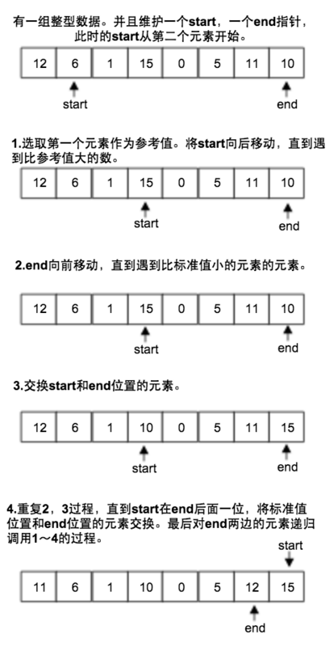

##### 2. 填坑法

key元素作为一个坑，右边遍历比key小的，左边遍历比key大的，都与坑交换


##### 3. 顺序遍历法

1和2都是前后向中间遍历,此处顺序遍历

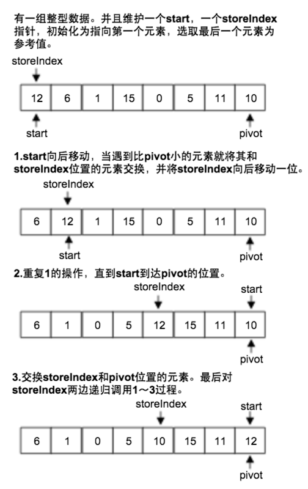

##### 4. 排序+切分一体

```java
    private static void sort(Comparable[] a, int lo, int hi) {
        if (lo >= hi) {
            return;
        }
        int lt=lo,gt=hi,i=lo+1;
        Comparable v=a[lo];
        while (i<=gt){
            int cmp=a[i].compareTo(v);
            if(cmp<0) {
                exch(a,lt++,i++);
            } else if(cmp>0) {
                exch(a,i,gt--);
            } else {
                i++;
            }
        }
        show(a);
        sort(a, lo, lt - 1);
        sort(a, gt + 1, hi);
    }
```

#### 完整代码

```java
package sort;

/**
 * 快速排序
 *
 * @author humingk
 */
public class Quick {
    public static void sort(Comparable[] a) {
//        StdRandom.shuffle(a);
        sort(a, 0, a.length - 1);
    }

    private static void sort(Comparable[] a, int lo, int hi) {
        if (lo >= hi) {
            return;
        }
        //j为切分值替换的位置
        int j = partition(a, lo, hi);
        sort(a, lo, j - 1);
        sort(a, j + 1, hi);
    }

    /**
     * 1. 交换法
     *
     * @param a
     * @param lo
     * @param hi
     * @return
     */
    private static int partition(Comparable[] a, int lo, int hi) {
        int i = lo, j = hi + 1;
        Comparable v = a[lo];
        while (true) {
            // 从前向后，若当前元素大于v，则需要换到右边
            while (i < hi && less(a[++i], v)) ;
            // 从后向前,若当前元素小于v，则需要换到左边
            while (j > lo && less(v, a[--j])) ;
            if (i >= j) {
                break;
            }
            // ij交换
            exch(a, i, j);
        }
        //前后相遇处替换为 v
        exch(a, lo, j);
        return j;
    }

    //如果v<w,返回true
    private static boolean less(Comparable v, Comparable w) {
        return v.compareTo(w) < 0;
    }

    private static void exch(Comparable[] a, int i, int j) {
        Comparable t = a[i];
        a[i] = a[j];
        a[j] = t;
    }

    private static void show(Comparable[] a) {
        for (int i = 0; i < a.length; i++) {
            System.out.print((a[i] + " "));
        }
        System.out.println();
    }

    public static boolean isSorted(Comparable[] a) {
        for (int i = 1; i < a.length; i++) {
            if (less(a[i], a[i - 1])) {
                return false;
            }
        }
        return true;
    }

    public static void main(String[] args) {
//        String[] a = {"S", "O", "R", "T", "E", "X", "A", "M", "P", "L", "E"};
        String[] a = {"1", "2", "3", "2", "2", "2", "5", "4", "2"};
        sort(a);
        assert isSorted(a) : "wrong";
        show(a);
    }
}
```

#### 快速排序优化之三向切分

对于有很多重复的元素，排序到一定程度本应该已有序，停止排序的，但快速排序仍会继续将重复的元素部分继续切分成更小的部分

这时可以考虑将数组分为三部分：

- 左边部分小于切分值
- 中间部分等于切分值
- 右边部分大于切分值

递归切分的时候，分别递归左边部分和右边部分即可，中间部分均为重复值且已经有序

##### 排序+切分

```java
    private static void sort(Comparable[] a, int lo, int hi) {
        if (lo >= hi) {
            return;
        }
        // i部分为中间部分，为与当前v相等的元素
        int lt = lo, gt = hi, i = lo + 1;
        Comparable v = a[lo];
        while (i <= gt) {
            // 当前元素小于v
            if (less(a[i], v)) {
                exch(a, lt++, i++);
            }
            // 当前元素大于v
            else if (less(v, a[i])) {
                exch(a, i, gt--);
            }
            // 当前元素与v相等
            else {
                i++;
            }
        }
        show(a);
        // 递归归并的时候跳过i部分
        sort(a, lo, lt - 1);
        sort(a, gt + 1, hi);
    }
```

##### 完整代码

```java
package sort;

import edu.princeton.cs.algs4.StdRandom;

public class Quick3way {
    public static void sort(Comparable[] a) {
        StdRandom.shuffle(a);
        show(a);
        sort(a, 0, a.length - 1);
    }

    /**
     * @param a
     * @param lo
     * @param hi
     */
    private static void sort(Comparable[] a, int lo, int hi) {
        if (lo >= hi) {
            return;
        }
        // i部分为中间部分，为与当前v相等的元素
        int lt = lo, gt = hi, i = lo + 1;
        Comparable v = a[lo];
        while (i <= gt) {
            // 当前元素小于v
            if (less(a[i], v)) {
                exch(a, lt++, i++);
            }
            // 当前元素大于v
            else if (less(v, a[i])) {
                exch(a, i, gt--);
            }
            // 当前元素与v相等
            else {
                i++;
            }
        }
        show(a);
        // 递归归并的时候跳过i部分
        sort(a, lo, lt - 1);
        sort(a, gt + 1, hi);
    }


    //如果v<w,返回true
    private static boolean less(Comparable v, Comparable w) {
        return v.compareTo(w) < 0;
    }

    private static void exch(Comparable[] a, int i, int j) {
        Comparable t = a[i];
        a[i] = a[j];
        a[j] = t;
    }

    private static void show(Comparable[] a) {
        for (int i = 0; i < a.length; i++) {
            System.out.print((a[i] + " "));
        }
        System.out.println();
    }

    public static boolean isSorted(Comparable[] a) {
        for (int i = 1; i < a.length; i++) {
            if (less(a[i], a[i - 1])) {
                return false;
            }
        }
        return true;
    }

    public static void main(String[] args) {
        String[] a = {"T", "T", "T", "T", "T", "D", "D", "S", "X", "X", "O", "O", "P", "P", "P", "P", "O", "R", "T", "E", "X", "A", "M", "P", "L", "E"};
        sort(a);
        assert isSorted(a) : "wrong";
        show(a);
    }
}

```

---

### 三、归并排序

递归地将数组切分成两半，左右部分依次排序，然后将左边和右边进行归并操作

当切分成左右各只有一个元素的时候，左右部分就可以认为分别有序了

#### 比较次数 nlogn次

具体来说是：(nlog2n)/2 次 ～ nlog2n-n+1 次

- 最好情况，每一次归并都要比较一半的值，另一半最后再叠加上：

  第一次归并，每次合并两个长度为1的数组，每次比较1次，有n/2次归并，比较n/2次

  第二次归并，每次合并两个长度为2的数组，每次比较2次，有n/4次归并，比较2n/4次

  第三次归并，每次合并两个长度为4的数组，每次比较4次，有n/8次归并，比较4n/8次

- 最差情况，每一次归并都要依次比较所有值，同时遍历完：

  第一次归并，每次合并两个长度为1的数组，每次比较1次，有n/2次归并，比较n/2次

  第二次归并，每次合并两个长度为2的数组，每次比较3次，有n/4次归并，比较3n/4次

  第三次归并，每次合并两个长度为4的数组，每次比较7次，有n/8次归并，比较7n/8次

#### 移动次数

由于是用了辅助空间，故移动次数和比较次数一样

#### 稳定性 稳定

递归切分到左右只有一个元素，排序也就只是**邻近元素交换**,而且归并两个已排序的数组也不会破坏稳定性

#### 时间复杂度 O(Nlog2 N)

1. 排序递归调用，O(logN)
2. 每一次递归调用的时候需要合并，O(N)

#### 空间复杂度 O(N)

相同大小的辅助空间

#### 归并

左右部分均有序，同步遍历

```java
    private static void merge(Comparable[] a, Comparable[] aux, int lo, int mid, int hi) {
        int i = lo, j = mid + 1;
        // a 复制到 aux
        for (int k = lo; k <= hi; k++) {
            aux[k] = a[k];
        }
        for (int k = lo; k <= hi; k++) {
            //i 过界，取剩下的 j / j对应最小
            if (i > mid || (j <= hi && !less(aux[i], aux[j]))) {
                a[k] = aux[j++];
            }
            //j 过界，取剩下的 i / i对应最小
            else if (j > hi || (i <= mid && less(aux[i], aux[j]))) {
                a[k] = aux[i++];
            }
        }
    }
```


#### 排序

```java
        if(hi<=lo) return;
        int mid=lo+(hi-lo)/2;
        //左边排序
        sort(a,aux,lo,mid);
        //右边排序
        sort(a,aux,mid+1,hi);
        //归并
        merge(a,aux,lo,mid,hi);
```


#### 完整代码

```java
package sort;

/**
 * 归并排序
 *
 * @author humingk
 */
public class Merge {
    private static Comparable[] aux;

    private static void merge(Comparable[] a, Comparable[] aux, int lo, int mid, int hi) {
        int i = lo, j = mid + 1;
        // a 复制到 aux
        for (int k = lo; k <= hi; k++) {
            aux[k] = a[k];
        }
        for (int k = lo; k <= hi; k++) {
            //i 过界，取剩下的 j / j对应最小
            if (i > mid || (j <= hi && !less(aux[i], aux[j]))) {
                a[k] = aux[j++];
            }
            //j 过界，取剩下的 i / i对应最小
            else if (j > hi || (i <= mid && less(aux[i], aux[j]))) {
                a[k] = aux[i++];
            }
        }
    }

    public static void sort(Comparable[] a) {
        aux = new Comparable[a.length];
        sort(a, aux, 0, a.length - 1);
    }

    private static void sort(Comparable[] a, Comparable[] aux, int lo, int hi) {
        if (hi <= lo) {
            return;
        }
        int mid = lo + (hi - lo) / 2;
        //左边排序
        sort(a, aux, lo, mid);
        //右边排序
        sort(a, aux, mid + 1, hi);
        //归并
        merge(a, aux, lo, mid, hi);
    }

    //如果v<w,返回true
    private static boolean less(Comparable v, Comparable w) {
        return v.compareTo(w) < 0;
    }

    private static void exch(Comparable[] a, int i, int j) {
        Comparable t = a[i];
        a[i] = a[j];
        a[j] = t;
    }

    private static void show(Comparable[] a) {
        for (int i = 0; i < a.length; i++) {
            System.out.print((a[i] + " "));
        }
        System.out.println();
    }

    public static boolean isSorted(Comparable[] a) {
        for (int i = 1; i < a.length; i++) {
            if (less(a[i], a[i - 1])) {
                return false;
            }
        }
        return true;
    }

    public static void main(String[] args) {
        String[] a = {"S", "O", "R", "T", "E", "X", "A", "M", "P", "L", "E"};
        sort(a);
        assert isSorted(a) : "wrong";
        show(a);
    }
}
```

### 四、希尔排序

使数组中任意间隔为h的元素都是有序的

对由不同固定间隔的元素组成的序列进行插入排序，间隔由某个数一直除到1

#### 相比于插入排序的优点

希尔排序是针对插入排序的优化，希尔排序比插入排序快得多，并且数组越大，优势越大，适合大数组

使数组中任意间隔为H的元素都是有序的，如果H很大，就能将元素移动到很远的地方，为实现更小的H有序创造方便

例如对于最大值位于开头，插入排序只能一步步将最大值传递交换到末尾，而希尔排序能以Ｈ为间隔将最大值交换到末尾

#### 比较次数 不确定

与序列间隔选取值有关

#### 移动次数 不确定

与初始顺序有关

#### 稳定性 不稳定

对由不同固定间隔的元素组成的序列进行插入排序，虽然相对于每组序列来说是稳定的，但不同的序列多次进行插入排序，变得不稳定

#### 时间复杂度 O(n^x)

- 若采用　k=2^h　策略，时间复杂度为：O(n^2)
  1. 每个子数组进行插入排序，时间复杂度为　Ｎ^2/k
  2. 共进行ｌｏｇＮ次插入排序

- 若采用　h=3*h+1　，时间复杂度为：O(n^(3/2))

###　空间复杂度  O(1)

#### 排序

```java
    public static void sort(Comparable[] a) {
        int h = 1;
        while (h < a.length / 3) {
            h = 3 * h + 1;
        }
        // 对每一个H，用 插入排序 将H个子数组独立地排序
        while (h >= 1) {
            for (int i = 0; i < a.length; i++) {
                for (int j = i; j >= h; j -= h) {
                    if (less(a[j], a[j - h])) {
                        exch(a, j, j - h);
                    }
                    // 当前元素比当前元素的左边元素大，当前元素已在它在左边有序部分中该有的位置
                    else {
                        break;
                    }
                }
            }
            h /= 3;
        }
    }
```


如下图所示，当h=13的时候，分别对以下三个序列进行插入排序：

S P

H L

E E

这三个序列都是以h为间隔

若h=4，分别对以下4个序列进行插入排序（假设未进行h=13的插入排序）：

S L T M

H S E P

E O X L

L R A E


#### 完整代码

```java
package sort;

public class Shell {
    public static void sort(Comparable[] a) {
        int h = 1;
        while (h < a.length / 3) {
            h = 3 * h + 1;
        }
        // 对每一个H，用 插入排序 将H个子数组独立地排序
        while (h >= 1) {
            for (int i = 0; i < a.length; i++) {
                for (int j = i; j >= h; j -= h) {
                    if (less(a[j], a[j - h])) {
                        exch(a, j, j - h);
                    }
                    // 当前元素比当前元素的左边元素大，当前元素已在它在左边有序部分中该有的位置
                    else {
                        break;
                    }
                }
            }
            h /= 3;
        }
    }

    //如果v<w,返回true
    private static boolean less(Comparable v, Comparable w) {
        return v.compareTo(w) < 0;
    }

    private static void exch(Comparable[] a, int i, int j) {
        Comparable t = a[i];
        a[i] = a[j];
        a[j] = t;
    }

    private static void show(Comparable[] a) {
        for (int i = 0; i < a.length; i++) {
            System.out.print((a[i] + " "));
        }
        System.out.println();
    }

    public static boolean isSorted(Comparable[] a) {
        for (int i = 1; i < a.length; i++) {
            if (less(a[i], a[i - 1])) {
                return false;
            }
        }
        return true;
    }

    public static void main(String[] args) {
        String[] a = {"S", "O", "R", "T", "E", "X", "A", "M", "P", "L", "E"};
        sort(a);
        assert isSorted(a) : "wrong";
        show(a);
    }
}
```

### 五、插入排序


- 插入排序时间取决于 数组的初始顺序，有序的数组更快

类似于整理桥牌，将乱序中的牌插入已有序的部分

外循环 i 遍历无序序列

内循环 j 遍历序列的0～i包括i的部分，若j小于i，则将当前的j通过邻近交换的方式插入到j该有的位置

排序过程中，前面部分有序，后面部分无序

#### 比较次数 n-1次 ～ n(n-1)/2次

- 最好情况下，即原始数组已有序的情况下：

  每一次选择的元素只需要和前面所有已有序元素比较一次，即n-1次

- 最坏情况下，即原始数组倒序的情况下：

  每一次选择的元素需要和前面的所有已有序元素比较一次，即1、2、3...n-1共n(n-1)/2次

#### 移动次数 0次 ～ n(n-1)/2次

- 最好情况下，即原始数组已有序的情况下：

  每一次选择的元素不需要移动

- 最坏情况下，即原始数组倒序的情况下：

  每一次选择的元素需要移动到所有已有序元素的前面，即1、2、3...n-1共n(n-1)/2次

#### 稳定性 稳定

插入排序是将无序部分的数依次插入到左部有序部分中，插入操作是通过**邻近元素交换**

#### 时间复杂度 O(n)~O(n^2)

- 最好情况，对于正序的有序数组，对于本代码情况（有提前的break），仅O(n)

  若原数组有序，即任何左边元素都小于右边元素，内循环只需要做一次判断即可退出内循环

- 最坏情况，对于倒序的有序数组，为Ｏ(n^2)

#### 空间复杂度　Ｏ(1)

#### 排序

```java
    public static void sort(Comparable[] a) {
        for (int i = 1; i < a.length; i++) {
            for (int j = i; j > 0; j--) {
                if (less(a[j], a[j - 1])) {
                    exch(a, j, j - 1);
                }
                // 若当前不需要交换，则说明j已经到了有序部分该有的位置
                else {
                    break;
                }
            }
        }
    }
```

#### 完整代码

```java
package sort;

public class Insertion {
    public static void sort(Comparable[] a) {
        for (int i = 1; i < a.length; i++) {
            for (int j = i; j > 0; j--) {
                if (less(a[j], a[j - 1])) {
                    exch(a, j, j - 1);
                }
                // 若当前不需要交换，则说明j已经到了有序部分该有的位置
                else {
                    break;
                }
            }
        }
    }

    //如果v<w,返回true
    private static boolean less(Comparable v, Comparable w) {
        return v.compareTo(w) < 0;
    }

    private static void exch(Comparable[] a, int i, int j) {
        Comparable t = a[i];
        a[i] = a[j];
        a[j] = t;
    }

    private static void show(Comparable[] a) {
        for (int i = 0; i < a.length; i++) {
            System.out.print((a[i] + " "));
        }
        System.out.println();
    }

    public static boolean isSorted(Comparable[] a) {
        for (int i = 1; i < a.length; i++) {
            if (less(a[i], a[i - 1])) {
                return false;
            }
        }
        return true;
    }

    public static void main(String[] args) {
        String[] a = {"S", "O", "R", "T", "E", "X", "A", "M", "P", "L", "E"};
        sort(a);
        assert isSorted(a) : "wrong";
        show(a);
    }
}
```

### 六、选择排序

外循环 i 遍历序列

内循环 j 不断选择 i 及i之后剩余元素的最小者，每次选出最小值然后与 i 交换

排序过程中，前面部分有序，后面部分无序

#### 比较次数 O(n^2) 恒定

即使已经是有序的数组，每次寻找剩余元素的最小值的时候都需要全部比较一遍

#### 移动次数 N次 线性 最少

选择排序是数据移动最少的排序算法，是线性的，其他排序算法一般都是线性对数或平方级别

最多交换n-1次

#### 稳定性 不稳定

选择排序是将当期无序部分的最小值依次移到左部形成有序部分，选择操作是通过**直接和最小值交换**

#### 时间复杂度 O(n^2)

最好情况最坏情况（有序无序）所花时间都一样

#### 空间复杂度　Ｏ(1)

#### 排序

```java
        for (int i = 0; i <a.length ; i++) {
            int min=i;
            for (int j = i+1; j <a.length ; j++) {
                if(less(a[j],a[min]))
                    min=j;
            }
            exch(a,i,min);
        }
```

#### 完整代码

```java
package test.sort;
public class Selection {
    public static void sort(Comparable[] a){
        for (int i = 0; i <a.length ; i++) {
            int min=i;
            for (int j = i+1; j <a.length ; j++) {
                if(less(a[j],a[min]))
                    min=j;
            }
            exch(a,i,min);
        }
    }
    //如果v<w,返回true
    private static boolean less(Comparable v,Comparable w){
        return v.compareTo(w)<0;
    }
    private static void exch(Comparable[]a,int i,int j){
        Comparable t=a[i];
        a[i]=a[j];
        a[j]=t;
    }
    private static void show(Comparable[]a){
        for (int i = 0; i <a.length ; i++) {
            System.out.print((a[i]+" "));
        }
        System.out.println();
    }
    public static boolean isSorted(Comparable[]a){
        for (int i = 1; i <a.length ; i++) {
            if(less(a[i],a[i-1]))
                return false;
        }
        return true;
    }
    public static void main(String[] args) {
        String[]a= {"S","O","R","T","E","X","A","M","P","L","E"};
        sort(a);
        assert isSorted(a);
        show(a);
    }
}
```

### 七、冒泡排序

外循环倒序 i 遍历整个序列

内循环 j 遍历序列的 0～i 部分，每次在无序队列中将相邻的两个数进行比较，小的在前大的在后，直到将当前最大的数移到序列末尾

若内循环没有交换操作，则说明当前已有序

每一次都是将最大的数移向最后，故而得称冒泡排序

排序过程中，前面部分无序，后面部分有序

#### 比较次数 n(n-1)/2 恒定

第一次冒泡，相邻元素比较n-1次

第二次冒泡，相邻元素比较n-2次

...

#### 移动次数 初始顺序的逆序数

每一次冒泡中只改变相邻的两个元素的位置的时候，即逆序数减1，并不会影响其他元素的逆序关系

#### 稳定性 稳定

冒泡排序是将当前无序部分的最大值依次移到右部形成有序部分，冒泡操作是通过**邻近元素交换**

#### 时间复杂度 O(N) ~ O(n^2)

最好情况，对于已经有序的序列，在此算法代码情况下，只需要外循环遍历一次，执行所有内循环有flag即可退出，因而为O(n)

最差情况下，为O(n^2)

若为朴素版本的冒泡排序，即没有添加标志位flag，则最好最差均为O(n^2)

#### 空间复杂度 O(1)

#### 排序

```java
    public static void sort(Comparable[] a) {
        // 标志位
        boolean flag;
        // 外循环
        for (int i = a.length - 1; i >= 0; i--) {
            flag = false;
            for (int j = 0; j < i; j++) {
                if (!less(a[j], a[j + 1])) {
                    exch(a, j, j + 1);
                    flag = true;
                }
            }
            // 只要有一次内循环没有交换，则说明已有序
            if (!flag) {
                return;
            }
        }
    }
```

#### 完整代码

```java
package sort;

/**
 * 冒泡排序
 *
 * @author humingk
 */
public class bubble {
    public static void sort(Comparable[] a) {
        // 标志位
        boolean flag;
        // 外循环
        for (int i = a.length - 1; i >= 0; i--) {
            flag = false;
            for (int j = 0; j < i; j++) {
                if (!less(a[j], a[j + 1])) {
                    exch(a, j, j + 1);
                    flag = true;
                }
            }
            // 只要有一次内循环没有交换，则说明已有序
            if (!flag) {
                return;
            }
        }
    }

    //如果v<w,返回true
    private static boolean less(Comparable v, Comparable w) {
        return v.compareTo(w) < 0;
    }

    private static void exch(Comparable[] a, int i, int j) {
        Comparable t = a[i];
        a[i] = a[j];
        a[j] = t;
    }

    private static void show(Comparable[] a) {
        for (int i = 0; i < a.length; i++) {
            System.out.print((a[i] + " "));
        }
        System.out.println();
    }

    public static boolean isSorted(Comparable[] a) {
        for (int i = 1; i < a.length; i++) {
            if (less(a[i], a[i - 1])) {
                return false;
            }
        }
        return true;
    }

    public static void main(String[] args) {
        String[] a = {"S", "O", "R", "T", "E", "X", "A", "M", "P", "L", "E"};
        sort(a);
        assert isSorted(a);
        show(a);
    }
}
```


## 选择类型


参考了[算法第四版](https://algs4.cs.princeton.edu/home/)这本书，比较详细的讲解了各种选择算法的实现方式，其中包括二叉树、红黑树等基础数据结构的实现原理

---

从这里开始使用**阿里巴巴代码规约**

https://github.com/alibaba/p3c

---

#### 时间复杂度


### 顺序查找:无序链表

- get(),put() 实现均为遍历链表进行比较
- 基于链表的实现和顺序查找是非常低效的

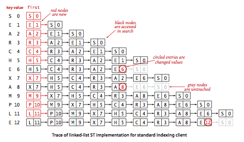

#### 完整代码

```java
package test.sort;

import edu.princeton.cs.algs4.Queue;

/**
 * @author humingk
 */
public class SequentialSearchSt<Key, Value> {
    private int n;
    private Node first;

    private class Node {
        private Key key;
        private Value value;
        private Node next;

        public Node(Key key, Value value, Node next) {
            this.key = key;
            this.value = value;
            this.next = next;
        }
    }

    public SequentialSearchSt() {

    }

    public Value get(Key key) {
        for (Node i = first; i != null; i = i.next) {
            if (key.equals(i.key)) {
                return i.value;
            }
        }
        return null;
    }

    public void put(Key key, Value value) {
        if (value == null) {
            delete(key);
            return;
        }
        // 修改value
        for (Node i = first; i != null; i = i.next) {
            if (key.equals(i.key)) {
                i.value = value;
                return;
            }
        }
        // 新添加
        first = new Node(key, value, first);
        n++;
        return;
    }

    public boolean contains(Key key) {
        return get(key) != null;
    }

    public void delete(Key key) {
        first = delete(key, first);
    }

    public Node delete(Key key, Node node) {
        if (key == null) {
            return null;
        }
        if (key.equals(node.key)) {
            n--;
            return node.next;
        }
        node.next = delete(key, node.next);
        return node;
    }

    public int size() {
        return n;
    }

    public boolean isEmpty() {
        return n == 0;
    }

    public Iterable<Key> keys() {
        Queue<Key> queue = new Queue<Key>();
        for (Node i = first; i != null; i = i.next) {
            queue.enqueue(i.key);
        }
        return queue;
    }

    public static void main(String[] args) {
        String[] a = {"S", "O", "R", "T", "E", "X", "A", "M", "P", "L", "E"};
        SequentialSearchSt<String, Integer> st = new SequentialSearchSt<String, Integer>();
        int i = 0;
        for (String s : a) {
            st.put(s, i);
            i++;
        }
        System.out.print("Key:  ");
        for (int j = 0; j < a.length; j++) {
            System.out.print(a[j] + " ");
        }
        System.out.println();
        System.out.print("Value:");
        for (int j = 0; j < a.length; j++) {
            System.out.print(j + " ");
        }
        System.out.println();

        System.out.println();
        st.delete("A");
        st.delete("E");
        System.out.println("delete A and E then:");
        for (String s : st.keys()) {
            System.out.print(st.get(s) + " ");
        }
        System.out.println();
    }
}
```

### 二分查找:有序数组

一对平行的有序数组，分别存储keys和values

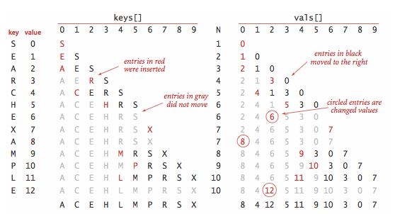

#### 递归的二分查找

- rank() 返回key在keys中的位置

```java
    public int rank(Key key) {
        int lo = 0, hi = n - 1;
        while (lo <= hi) {
            int mid = lo + (hi - lo) / 2;
            int cmp = key.compareTo(keys[mid]);
            if (cmp < 0) {
                hi = mid - 1;
            } else if (cmp > 0) {
                lo = mid + 1;
            } else {
                return mid;
            }
        }
        return lo;
    }
```

### 完整代码

```java
package test.sort;

import edu.princeton.cs.algs4.Queue;

/**
 * @author humingk
 */
public class BinarySearchSt<Key extends Comparable<Key>, Value> {
    private static final int LOW = 4;
    private static final int DOUBLE = 2;
    private Key[] keys;
    private Value[] values;
    private int n = 0;

    public BinarySearchSt() {
        keys = (Key[]) new Comparable[2];
        values = (Value[]) new Object[2];
    }

    public Value get(Key key) {
        if (isEmpty()) {
            return null;
        }
        int i = rank(key);
        if (i < n && i >= 0 && keys[i].compareTo(key) == 0) {
            return values[i];
        }
        return null;
    }

    public void put(Key key, Value value) {
        if (value == null) {
            delete(key);
            return;
        }
        int i = rank(key);
        if (i < n && i >= 0 && keys[i].compareTo(key) == 0) {
            values[i] = value;
            return;
        }
        // keys扩容
        if (n == keys.length) {
            resize(2 * keys.length);
        }
        //比key大的（在key后面）的元素向后移一位
        for (int j = n; j > i; j--) {
            keys[j] = keys[j - 1];
            values[j] = values[j - 1];
        }
        keys[i] = key;
        values[i] = value;
        n++;
    }

    /**
     * 返回key在keys中的位置
     *
     * @param key
     * @return
     */
    public int rank(Key key) {
        int lo = 0, hi = n - 1;
        while (lo <= hi) {
            int mid = lo + (hi - lo) / 2;
            int cmp = key.compareTo(keys[mid]);
            if (cmp < 0) {
                hi = mid - 1;
            } else if (cmp > 0) {
                lo = mid + 1;
            } else {
                return mid;
            }
        }
        return lo;
    }

    public void delete(Key key) {
        if (isEmpty()) {
            return;
        }
        int i = rank(key);
        // 表中没有此元素
        if (i == n || keys[i].compareTo(key) != 0) {
            return;
        }
        // 比key大的元素向前移一位
        for (int j = i; j < n - 1; j++) {
            keys[j] = keys[j + 1];
            values[j] = values[j + 1];
        }
        n--;
        keys[n] = null;
        values[n] = null;
        // keys 减容
        if (n > 0 && n == keys.length / LOW) {
            resize(keys.length / DOUBLE);
        }
    }

    public int size() {
        return n;
    }

    public boolean isEmpty() {
        return n == 0;
    }

    public boolean contains(Key key) {
        return get(key) != null;
    }

    private void resize(int capacity) {
        assert capacity >= n;
        Key[] tempKeys = (Key[]) new Comparable[capacity];
        Value[] tempvalues = (Value[]) new Object[capacity];
        for (int i = 0; i < n; i++) {
            tempKeys[i] = keys[i];
            tempvalues[i] = values[i];
        }
        keys = tempKeys;
        values = tempvalues;
    }

    public Iterable<Key> keys() {
        return keys(keys[0], keys[n - 1]);
    }

    public Iterable<Key> keys(Key lo, Key hi) {
        Queue<Key> queue = new Queue<Key>();
        if (lo.compareTo(hi) > 0) {
            return queue;
        }
        for (int i = rank(lo); i < rank(hi); i++) {
            queue.enqueue(keys[i]);
        }
        if (contains(hi)) {
            queue.enqueue(keys[rank(hi)]);
        }
        return queue;
    }

    public static void main(String[] args) {
        String[] a = {"S", "O", "R", "T", "E", "X", "A", "M", "P", "L", "E"};
        BinarySearchSt<String, Integer> st = new BinarySearchSt<String, Integer>();
        int i = 0;
        for (String s : a) {
            st.put(s, i);
            i++;
        }
        System.out.println("orign:");
        for (String s : st.keys()) {
            System.out.print(st.get(s) + " ");
        }
        System.out.println();
        st.delete("A");
        st.delete("E");
        System.out.println("delete A and E then:");
        for (String s : st.keys()) {
            System.out.print(st.get(s) + " ");
        }
        System.out.println();
    }
}
```

### 二叉树查找:二叉查找树

#### 插入节点

```java
    private Node put(Node x, Key key, Value value) {
        // 树是空树，返回一个根节点
        // key不存在，将key 和 value 作为新节点插入到该子树中
        if (x == null) {
            return new Node(key, value, 1);
        }
        int cmp = key.compareTo(x.key);
        // 小于当前节点 继续在左侧插入
        if (cmp < 0) {
            x.left = put(x.left, key, value);
        }
        // 大于当前节点 继续在右侧插入
        else if (cmp > 0) {
            x.right = put(x.right, key, value);
        }
        // 更新key对应的value新值
        else {
            x.value = value;
        }
        x.n = size(x.left) + size(x.right) + 1;
        return x;
    }
```

#### floor 小于等于key的节点中的最大节点

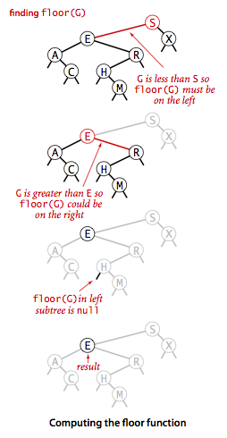

```java
    private Node floor(Node x, Key key) {
        if (x == null) {
            return null;
        }
        int cmp = key.compareTo(x.key);
        // key等于x，小于等于key的节点为x
        if (cmp == 0) {
            return x;
        }
        // key小于x, 那么floor一定在x的左子树中，向左递归
        if (cmp < 0) {
            return floor(x.left, key);
        }
        // key大于x, 那么floor可能在 "x的右子树中/x"，向右递归
        Node t = floor(x.right, key);
        // 当x右子树存在floor时，返回t
        if (t != null) {
            return t;
        }
        // 当x右子树不存在floor时，返回x
        else {
            return x;
        }
    }
```

#### select 找出排名为k的节点

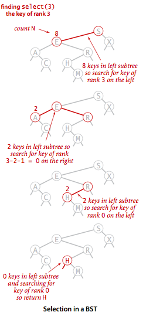

```java
    private Node select(Node x, int k) {
        if (x == null) {
            return null;
        }
        int t = size(x.left);
        if (t > k) {
            return select(x.left, k);
        } else if (t < k) {
            return select(x.right, k);
        } else {
            return x;
        }
    }
```

#### deleteMin 删除最小节点

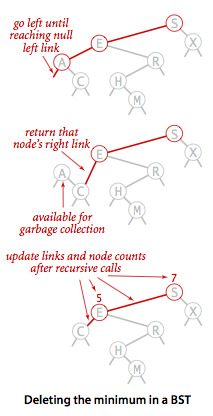

```java
    private Node deleteMin(Node x) {
        // 返回x的右节点,等同于：
        // 将x的上一节点指向x，改成x的上一节点指向x的右节点
        // 此时没有任何链接指向x，x会被当做垃圾回收
        if (x.left == null) {
            return x.right;
        }
        x.left = deleteMin(x.left);
        //计数器更新
        x.n = size(x.left) + size(x.right) + 1;
        return x;
    }
```

#### delete 删除操作

删除x节点，右子树中的最小节点将代替x节点，代替后，将右子树最小节点删除，新的x节点右链接指向新的右子树，左链接指向原来的x节点左子树

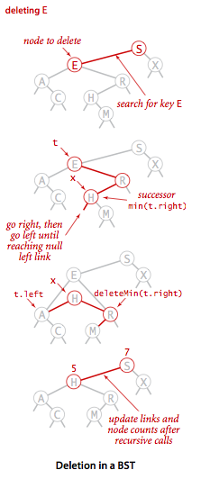

```java
    public Node delete(Node x, Key key) {
        if (x == null) {
            return null;
        }
        int cmp = key.compareTo(x.key);
        if (cmp < 0) {
            x.left = delete(x.left, key);
        } else if (cmp > 0) {
            x.right = delete(x.right, key);
        } else {
            // 删除任意只有一个的左/右子节点
            if (x.left == null) {
                return x.right;
            }
            if (x.right == null) {
                return x.left;
            }
            // t为将要删除的节点
            Node t = x;
            // x为t的后继节点，即t的右子树中最小的节点
            // 删除t后，x将要顶替t
            x = min(t.right);
            // 删除掉t的右子树(R)中最小的节点x，右子树调整好后(R+)
            // 将要代替t的x的右子树指向R+
            x.right = deleteMin(t.right);
            // 将要代替t的x的左子树指向t原来的左子树
            x.left = t.left;
        }
        x.n = size(x.left) + size(x.right) + 1;
        return x;
    }
```

#### 完整代码

```java
package test.sort;

import edu.princeton.cs.algs4.Queue;

/**
 * @author humingk
 */
public class Bst<Key extends Comparable<Key>, Value> {
    private Node root;

    private class Node {
        private Key key;
        private Value value;
        private Node left, right;
        /**
         * 以该节点为根的子节点总数
         */
        private int n;

        public Node() {
        }

        public Node(Key key, Value value, int n) {
            this.key = key;
            this.value = value;
            this.n = n;
        }
    }

    public Bst() {
    }

    public Value get(Key key) {
        return get(root, key);
    }

    private Value get(Node x, Key key) {
        if (x == null) {
            return null;
        }
        int cmp = key.compareTo(x.key);
        if (cmp < 0) {
            return get(x.left, key);
        } else if (cmp > 0) {
            return get(x.right, key);
        } else {
            return x.value;
        }
    }

    public void put(Key key, Value value) {
        if (value == null) {
            delete(key);
            return;
        }
        root = put(root, key, value);
    }

    private Node put(Node x, Key key, Value value) {
        // 树是空树，返回一个根节点
        // key不存在，将key 和 value 作为新节点插入到该子树中
        if (x == null) {
            return new Node(key, value, 1);
        }
        int cmp = key.compareTo(x.key);
        // 小于当前节点 继续在左侧插入
        if (cmp < 0) {
            x.left = put(x.left, key, value);
        }
        // 大于当前节点 继续在右侧插入
        else if (cmp > 0) {
            x.right = put(x.right, key, value);
        }
        // 更新key对应的value新值
        else {
            x.value = value;
        }
        x.n = size(x.left) + size(x.right) + 1;
        return x;
    }

    public boolean isEmpty() {
        return size(root) == 0;
    }

    public Iterable<Key> keys() {
        return keys(min(), max());
    }

    public Iterable<Key> keys(Key lo, Key hi) {
        Queue<Key> queue = new Queue<Key>();
        keys(root, queue, lo, hi);
        return queue;
    }

    /**
     * 查找lo-hi范围内的key
     *
     * @param x
     * @param queue
     * @param lo
     * @param hi
     */
    private void keys(Node x, Queue<Key> queue, Key lo, Key hi) {
        if (x == null) {
            return;
        }
        int cmplo = lo.compareTo(x.key);
        int cmphi = hi.compareTo(x.key);
        // lo < x.key
        if (cmplo < 0) {
            keys(x.left, queue, lo, hi);
        }
        // lo <= x.key <= hi
        if (cmplo <= 0 && cmphi >= 0) {
            queue.enqueue(x.key);
        }
        // x.key < hi
        if (cmphi > 0) {
            keys(x.right, queue, lo, hi);
        }

    }

    public int size() {
        return size(root);
    }

    private int size(Node x) {
        if (x == null) {
            return 0;
        } else {
            return x.n;
        }
    }

    public Key min() {
        return min(root).key;
    }

    private Node min(Node x) {
        if (x.left == null) {
            return x;
        }
        return min(x.left);
    }

    public Key max() {
        return max(root).key;
    }

    private Node max(Node x) {
        if (x.right == null) {
            return x;
        }
        return max(x.right);
    }

    public Key floor(Key key) {
        Node x = floor(root, key);
        if (x == null) {
            return null;
        }
        return x.key;
    }

    /**
     * @param x
     * @param key
     * @return 小于等于key节点中的最大键
     */
    private Node floor(Node x, Key key) {
        if (x == null) {
            return null;
        }
        int cmp = key.compareTo(x.key);
        // key等于x，小于等于key的节点为x
        if (cmp == 0) {
            return x;
        }
        // key小于x, 那么floor一定在x的左子树中，向左递归
        if (cmp < 0) {
            return floor(x.left, key);
        }
        // key大于x, 那么floor可能在 "x的右子树中/x"，向右递归
        Node t = floor(x.right, key);
        // 当x右子树存在floor时，返回t
        if (t != null) {
            return t;
        }
        // 当x右子树不存在floor时，返回x
        else {
            return x;
        }
    }

    public Key ceiling(Key key) {
        Node x = ceiling(root, key);
        if (x == null) {
            return null;
        }
        return x.key;
    }

    /**
     * @param x
     * @param key
     * @return 大于等于key的最小键节点
     */
    private Node ceiling(Node x, Key key) {
        if (x == null) {
            return null;
        }
        int cmp = key.compareTo(x.key);
        // key等于x，大于等于key的节点为x
        if (cmp == 0) {
            return x;
        }
        // key小于x, 那么floor可能在 "x的左子树中/x"，向左递归
        if (cmp < 0) {
            Node t = ceiling(x.left, key);
            //key小于x，且x的左子数存在floor，返回t
            if (t != null) {
                return t;
            }
            //key小于x，且x的左子数不存在floor，返回x
            else {
                return x;
            }
        }
        //key大于x，那么floor一定在x的右子树中，向右递归
        return ceiling(x.right, key);
    }

    public Key select(int k) {
        return select(root, k).key;
    }

    /**
     * @param x
     * @param k
     * @return 返回排名为k的节点
     */
    private Node select(Node x, int k) {
        if (x == null) {
            return null;
        }
        int t = size(x.left);
        if (t > k) {
            return select(x.left, k);
        } else if (t < k) {
            return select(x.right, k);
        } else {
            return x;
        }
    }

    public int rank(Key key) {
        return rank(root, key);
    }

    /**
     * @param x
     * @param key
     * @return 给定键的排名
     */
    private int rank(Node x, Key key) {
        if (x == null) {
            return 0;
        }
        int cmp = key.compareTo(x.key);
        if (cmp < 0) {
            return rank(x.left, key);
        } else if (cmp > 0) {
            return rank(x.right, key) + rank(x.left, key) + 1;
        } else {
            return size(x.left);
        }
    }

    public void deleteMin() {
        root = deleteMin(root);
    }

    private Node deleteMin(Node x) {
        // 返回x的右节点,等同于：
        // 将x的上一节点指向x，改成x的上一节点指向x的右节点
        // 此时没有任何链接指向x，x会被当做垃圾回收
        if (x.left == null) {
            return x.right;
        }
        x.left = deleteMin(x.left);
        //计数器更新
        x.n = size(x.left) + size(x.right) + 1;
        return x;
    }

    public void deleteMax() {
        root = deleteMax(root);
    }

    private Node deleteMax(Node x) {
        if (x.right == null) {
            return x.left;
        }
        x.right = deleteMax(x.right);
        x.n = size(x.left) + size(x.right) + 1;
        return x;
    }

    public void delete(Key key) {
        root = delete(root, key);
    }

    public Node delete(Node x, Key key) {
        if (x == null) {
            return null;
        }
        int cmp = key.compareTo(x.key);
        if (cmp < 0) {
            x.left = delete(x.left, key);
        } else if (cmp > 0) {
            x.right = delete(x.right, key);
        } else {
            // 删除任意只有一个的左/右子节点
            if (x.left == null) {
                return x.right;
            }
            if (x.right == null) {
                return x.left;
            }
            // t为将要删除的节点
            Node t = x;
            // x为t的后继节点，即t的右子树中最小的节点
            // 删除t后，x将要顶替t
            x = min(t.right);
            // 删除掉t的右子树(R)中最小的节点x，右子树调整好后(R+)
            // 将要代替t的x的右子树指向R+
            x.right = deleteMin(t.right);
            // 将要代替t的x的左子树指向t原来的左子树
            x.left = t.left;
        }
        x.n = size(x.left) + size(x.right) + 1;
        return x;
    }

    public static void main(String[] args) {
        String[] a = {"S", "O", "R", "T", "E", "X", "A", "M", "P", "L"};
        Bst<String, Integer> st = new Bst<>();
        int i = 0;
        for (String s : a) {
            st.put(s, i);
            i++;
        }
        System.out.print("Key:  ");
        for (int j = 0; j < a.length; j++) {
            System.out.print(a[j] + " ");
        }
        System.out.println();
        System.out.print("Value:");
        for (int j = 0; j < a.length; j++) {
            System.out.print(j + " ");
        }
        System.out.println();

        System.out.print("less than or equal to D：");
        System.out.println(st.floor("D"));
        System.out.print("greater or equal to D：");
        System.out.println(st.ceiling("D"));

        System.out.print("5st ：");
        System.out.println(st.select(4));

        System.out.print("E's ranking:");
        System.out.println(st.rank("E"));

        System.out.println("delete Max and Min then:");
        st.deleteMin();
        st.deleteMax();
        for (String s : st.keys()) {
            System.out.print(st.get(s) + " ");
        }
        System.out.println();

        st.delete("P");
        st.delete("E");
        System.out.println("delete P and E then:");
        for (String s : st.keys()) {
            System.out.print(st.get(s) + " ");
        }
        System.out.println();
    }
}
```

运行结果

```
Key:  S O R T E X A M P L 
Value:0 1 2 3 4 5 6 7 8 9 
less than or equal to D：A
greater or equal to D：E
5st ：O
E's ranking:1
delete Max and Min then:
4 9 7 1 8 2 0 3 
delete P and E then:
9 7 1 2 0 3 
```

### 2-3查找树:红黑树

#### 红黑树定义

- 红链接均为左链接

- 没有任何一个节点同时与两条红链接相连(即最多两个节点-三个链接)

- 完美黑色平衡，即根节点到任意空链接的路径上黑链接数目相同

#### 左旋转


#### 颜色转换


可以改成翻转颜色,如下:

```java
    private void flipColors(Node x) {
        x.color = !x.color;
        x.left.color = !x.left.color;
        x.right.color = !x.right.color;
    }
```

#### 插入

**五种情况**：

一、向二节点插入：

- 1.左插入，成红色左链接
- 2.右插入，成红色右链接，左旋


二、向三节点插入：

- 3.最大的位置插入，成红色右链接，'八'形红色链接，颜色转换
- 4.最小的位置插入，成红色左链接，'/'形红色链接,先右旋转下部，'八'形红色链接,再颜色转换
- 5.中间的位置插入，成红色右链接，'<'型红色链接，先左旋转下部，'/'型红色链接，再右旋转上部，'八'型红色链接，再颜色转换

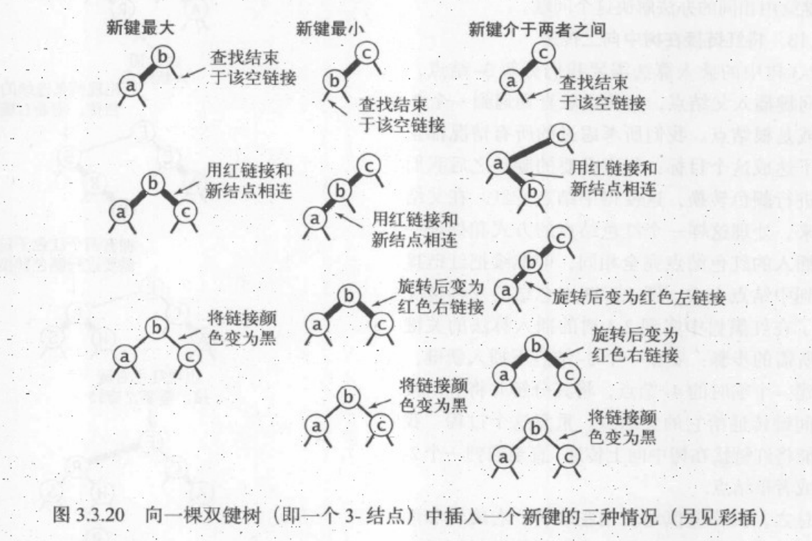


```java
    private Node put(Node x, Key key, Value value) {
        // 树是空树，返回一个根节点
        // key不存在，将key 和 value 作为新节点插入到该子树中
        if (x == null) {
            return new Node(key, value, RED, 1);
        }
        int cmp = key.compareTo(x.key);
        // 小于当前节点 继续在左侧插入
        if (cmp < 0) {
            x.left = put(x.left, key, value);
        }
        // 大于当前节点 继续在右侧插入
        else if (cmp > 0) {
            x.right = put(x.right, key, value);
        }
        // 更新key对应的value新值
        else {
            x.value = value;
        }
        // 红色右链接 转化为 红色左链接
        if (!isRed(x.left) && isRed(x.right)) {
            x = rotateLeft(x);
        }
        // 连续两个红色左链接 转化为 红色左链接+红色右链接
        if (isRed(x.left) && isRed(x.left.left)) {
            x = rotateRight(x);
        }
        // 红色左链接+红色右链接 转化为 红色父节点链接
        if (isRed(x.left) && isRed(x.right)) {
            flipColors(x);
        }
        x.n = size(x.left) + size(x.right) + 1;
        return x;
    }
```

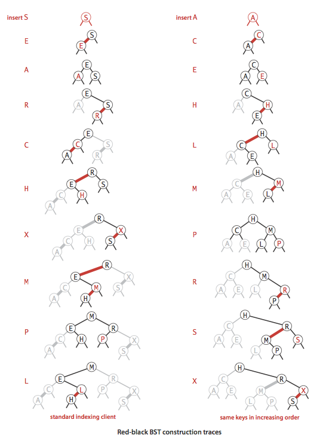

#### balance

put()的后半部分

```java
    private Node balance(Node x) {
        // 红色右链接 转化为 红色左链接
        if (!isRed(x.left) && isRed(x.right)) {
            x = rotateLeft(x);
        }
        // 连续两个红色左链接 转化为 红色左链接+红色右链接
        if (isRed(x.left) && isRed(x.left.left)) {
            x = rotateRight(x);
        }
        // 红色左链接+红色右链接 转化为 红色父节点链接
        if (isRed(x.left) && isRed(x.right)) {
            flipColors(x);
        }
        x.n = size(x.left) + size(x.right) + 1;
        return x;
    }
```

#### moveRedLeft

x是红色节点，x.left 和 x.left.left 都是黑色节点  

将x.left 或 x.left的左子节点 变成红色节点


```java
    private Node moveRedLeft(Node x) {
        flipColors(x);
        if (isRed(x.right.left)) {
            x.right = rotateRight(x.right);
            x = rotateLeft(x);
            flipColors(x);
        }
        return x;
    }
```

#### moveRedRight

x为红色节点，x.right 和 x.right.left是黑色节点  

将x.right 或 x.right 的右子节点 变成红色

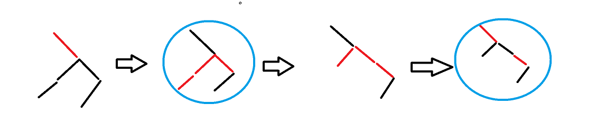

```java
    private Node moveRedRight(Node x) {
        flipColors(x);
        if (isRed(x.left.left)) {
            x = rotateRight(x);
        }
        return x;
    }
```

#### 删除最小值

沿着左链接向下，确保当前节点不是二节点（可以是三节点和临时的四节点），


```java
    public void deleteMin() {
        //沿着左链接向下，并且确保当前节点不是二节点(可以是三节点和四节点)
        if (!isRed(root.left) && !isRed(root.right)) {
            root.color = RED;
        }
        root = deleteMin(root);
        if (!isEmpty()) {
            root.color = BLACK;
        }
    }

    private Node deleteMin(Node x) {
        // 返回x的右节点,等同于：
        // 将x的上一节点指向x，改成x的上一节点指向x的右节点
        // 此时没有任何链接指向x，x会被当做垃圾回收
        if (x.left == null) {
            return null;
        }
        // moveRedLeft()
        if (!isRed(x.left) && !isRed(x.left.left)) {
            x = moveRedLeft(x);
        }
        x.left = deleteMin(x.left);
        return balance(x);
    }
```

#### 删除操作

等价于： 在一棵根节点不是2节点的子树中删除最小的键  
分别向左和向右递归，递归的时候倾向于将二节点转化为三、四节点

```java
    private Node delete(Node h, Key key) {
        // 向左递归
        if (key.compareTo(h.key) < 0) {
            // x是红色节点，x.left 和 x.left.left 都是黑色节点
            // 将x.left 或 x.left的左子节点 变成红色节点
            if (!isRed(h.left) && !isRed(h.left.left)) {
                h = moveRedLeft(h);
            }
            h.left = delete(h.left, key);
        }
        // 向右递归
        else {
            if (isRed(h.left)) {
                h = rotateRight(h);
            }
            if (key.compareTo(h.key) == 0 && h.right == null) {
                return null;
            }
            // x为红色节点，x.right 和 x.right.left是黑色节点
            // 将x.right 或 x.right 的右子节点 变成红色
            if (!isRed(h.right) && !isRed(h.right.left)) {
                h = moveRedRight(h);
            }
            // 删除操作
            if (key.compareTo(h.key) == 0) {
                Node x = min(h.right);
                h.key = x.key;
                h.value = x.value;
                h.right = deleteMin(h.right);
            } else {
                h.right = delete(h.right, key);
            }
        }
        return balance(h);
    }
```


#### 完整代码

```java
package test.sort;

import edu.princeton.cs.algs4.Queue;

/**
 * @author humingk
 */
public class RedBlackBst<Key extends Comparable<Key>, Value> {
    private static final boolean RED = true;
    private static final boolean BLACK = false;
    private Node root;

    private class Node {
        private Key key;
        private Value value;
        private Node left, right;
        /**
         * 红色：true
         * 黑色：false
         * 空链接为黑色
         */
        private boolean color;
        /**
         * 以该节点为根的子节点总数
         */
        private int n;

        public Node(Key key, Value value, boolean color, int n) {
            this.key = key;
            this.value = value;
            this.color = color;
            this.n = n;
        }
    }

    public RedBlackBst() {
    }

    public Value get(Key key) {
        return get(root, key);
    }

    private Value get(Node x, Key key) {
        if (x == null) {
            return null;
        }
        int cmp = key.compareTo(x.key);
        if (cmp < 0) {
            return get(x.left, key);
        } else if (cmp > 0) {
            return get(x.right, key);
        } else {
            return x.value;
        }
    }

    public void put(Key key, Value value) {
        if (value == null) {
            delete(key);
            return;
        }
        root = put(root, key, value);
        // 根节点总是黑色的，若由红色变为黑色，说明树高度加1
        root.color = BLACK;
    }

    private Node put(Node x, Key key, Value value) {
        // 树是空树，返回一个根节点
        // key不存在，将key 和 value 作为新节点插入到该子树中
        if (x == null) {
            return new Node(key, value, RED, 1);
        }
        int cmp = key.compareTo(x.key);
        // 小于当前节点 继续在左侧插入
        if (cmp < 0) {
            x.left = put(x.left, key, value);
        }
        // 大于当前节点 继续在右侧插入
        else if (cmp > 0) {
            x.right = put(x.right, key, value);
        }
        // 更新key对应的value新值
        else {
            x.value = value;
        }
        // 红色右链接 转化为 红色左链接
        if (!isRed(x.left) && isRed(x.right)) {
            x = rotateLeft(x);
        }
        // 连续两个红色左链接 转化为 红色左链接+红色右链接
        if (isRed(x.left) && isRed(x.left.left)) {
            x = rotateRight(x);
        }
        // 红色左链接+红色右链接 转化为 红色父节点链接
        if (isRed(x.left) && isRed(x.right)) {
            flipColors(x);
        }
        x.n = size(x.left) + size(x.right) + 1;
        return x;
    }

    private boolean isRed(Node x) {
        if (x == null) {
            return false;
        }
        return x.color == RED;
    }

    private boolean is23() {
        return is23(root);
    }

    /**
     * 检查是否存在：
     * 一个节点连接两个红色链接
     * 红色右链接
     *
     * @param x
     * @return
     */
    private boolean is23(Node x) {
        if (x == null) {
            return true;
        }
        if (isRed(x.right)) {
            return false;
        }
        if (x != root && isRed(x) && isRed(x.left)) {
            return false;
        }
        return is23(x.left) && is23(x.right);
    }

    private boolean isBalanced() {
        int black = 0;
        Node x = root;
        while (x != null) {
            if (!isRed(x)) {
                black++;
            }
            x = x.left;
        }
        return isBalanced(root, black);
    }

    /**
     * 检查从某一节点到所有空链接的路径上的黑链接数量是否相同
     *
     * @param x
     * @param black
     * @return
     */
    private boolean isBalanced(Node x, int black) {
        if (x == null) {
            return black == 0;
        }
        if (!isRed(x)) {
            black--;
        }
        return isBalanced(x.left, black) && isBalanced(x.right, black);
    }

    private boolean isBst() {
        return isBst(root, null, null);
    }

    /**
     * 判断是否是一个RedBlackBST
     *
     * @param x
     * @param min
     * @param max
     * @return
     */
    private boolean isBst(Node x, Key min, Key max) {
        if (x == null) {
            return true;
        }
        if (min != null && x.key.compareTo(min) <= 0) {
            return false;
        }
        if (max != null && x.key.compareTo(max) >= 0) {
            return false;
        }
        return isBst(x.left, null, x.key) && isBst(x.right, x.key, null) && isBalanced();
    }

    /**
     * 红色右链接左旋为红色左链接
     *
     * @param h 上面的节点
     * @return
     */
    private Node rotateLeft(Node h) {
        Node x = h.right;

        h.right = x.left;
        x.left = h;

        x.color = h.color;
        h.color = RED;

        x.n = h.n;
        h.n = size(h.left) + size(h.right) + 1;
        return x;
    }

    /**
     * 红色左链接右旋为红色右链接
     *
     * @param h 上面的节点
     * @return
     */
    private Node rotateRight(Node h) {
        Node x = h.left;

        h.left = x.right;
        x.right = h;

        x.color = h.color;
        h.color = RED;

        x.n = h.n;
        h.n = size(h.left) + size(h.right) + 1;
        return x;
    }

    /**
     * --- 根节点总是黑色的
     * 一个节点的左右链接都是红色
     * 节点转化为红链接
     * 节点的子节点转化为黑链接
     *
     * @param x
     */
    private void flipColors(Node x) {
        x.color = !x.color;
        x.left.color = !x.left.color;
        x.right.color = !x.right.color;
    }

    public boolean isEmpty() {
        return size(root) == 0;
    }

    public Iterable<Key> keys() {
        return keys(min(), max());
    }

    public Iterable<Key> keys(Key lo, Key hi) {
        Queue<Key> queue = new Queue<Key>();
        keys(root, queue, lo, hi);
        return queue;
    }

    /**
     * 查找lo-hi范围内的key
     *
     * @param x
     * @param queue
     * @param lo
     * @param hi
     */
    private void keys(Node x, Queue<Key> queue, Key lo, Key hi) {
        if (x == null) {
            return;
        }
        int cmplo = lo.compareTo(x.key);
        int cmphi = hi.compareTo(x.key);
        // lo < x.key
        if (cmplo < 0) {
            keys(x.left, queue, lo, hi);
        }
        // lo <= x.key <= hi
        if (cmplo <= 0 && cmphi >= 0) {
            queue.enqueue(x.key);
        }
        // x.key < hi
        if (cmphi > 0) {
            keys(x.right, queue, lo, hi);
        }

    }

    public int size() {
        return size(root);
    }

    private int size(Node x) {
        if (x == null) {
            return 0;
        } else {
            return x.n;
        }
    }

    public Key min() {
        return min(root).key;
    }

    private Node min(Node x) {
        if (x.left == null) {
            return x;
        }
        return min(x.left);
    }

    public Key max() {
        return max(root).key;
    }

    private Node max(Node x) {
        if (x.right == null) {
            return x;
        }
        return max(x.right);
    }

    public Key floor(Key key) {
        Node x = floor(root, key);
        if (x == null) {
            return null;
        }
        return x.key;
    }

    /**
     * @param x
     * @param key
     * @return 小于等于key节点中的最大键
     */
    private Node floor(Node x, Key key) {
        if (x == null) {
            return null;
        }
        int cmp = key.compareTo(x.key);
        // key等于x，小于等于key的节点为x
        if (cmp == 0) {
            return x;
        }
        // key小于x, 那么floor一定在x的左子树中，向左递归
        if (cmp < 0) {
            return floor(x.left, key);
        }
        // key大于x, 那么floor可能在 "x的右子树中/x"，向右递归
        Node t = floor(x.right, key);
        // 当x右子树存在floor时，返回t
        if (t != null) {
            return t;
        }
        // 当x右子树不存在floor时，返回x
        else {
            return x;
        }
    }

    public Key ceiling(Key key) {
        Node x = ceiling(root, key);
        if (x == null) {
            return null;
        }
        return x.key;
    }

    /**
     * @param x
     * @param key
     * @return 大于等于key的最小键节点
     */
    private Node ceiling(Node x, Key key) {
        if (x == null) {
            return null;
        }
        int cmp = key.compareTo(x.key);
        // key等于x，大于等于key的节点为x
        if (cmp == 0) {
            return x;
        }
        // key小于x, 那么floor可能在 "x的左子树中/x"，向左递归
        if (cmp < 0) {
            Node t = ceiling(x.left, key);
            //key小于x，且x的左子数存在floor，返回t
            if (t != null) {
                return t;
            }
            //key小于x，且x的左子数不存在floor，返回x
            else {
                return x;
            }
        }
        //key大于x，那么floor一定在x的右子树中，向右递归
        return ceiling(x.right, key);
    }

    public Key select(int k) {
        return select(root, k).key;
    }

    /**
     * @param x
     * @param k
     * @return 返回排名为k的节点
     */
    private Node select(Node x, int k) {
        if (x == null) {
            return null;
        }
        int t = size(x.left);
        if (t > k) {
            return select(x.left, k);
        } else if (t < k) {
            return select(x.right, k);
        } else {
            return x;
        }
    }

    public int rank(Key key) {
        return rank(root, key);
    }

    /**
     * @param x
     * @param key
     * @return 给定键的排名
     */
    private int rank(Node x, Key key) {
        if (x == null) {
            return 0;
        }
        int cmp = key.compareTo(x.key);
        if (cmp < 0) {
            return rank(x.left, key);
        } else if (cmp > 0) {
            return rank(x.right, key) + rank(x.left, key) + 1;
        } else {
            return size(x.left);
        }
    }

    /**
     * 节点x不能有：
     * 红色右链接
     * 连续两个红色左链接
     * 红色左链接+红色右链接
     *
     * @param x
     * @return
     */
    private Node balance(Node x) {
        // 红色右链接 转化为 红色左链接
        if (!isRed(x.left) && isRed(x.right)) {
            x = rotateLeft(x);
        }
        // 连续两个红色左链接 转化为 红色左链接+红色右链接
        if (isRed(x.left) && isRed(x.left.left)) {
            x = rotateRight(x);
        }
        // 红色左链接+红色右链接 转化为 红色父节点链接
        if (isRed(x.left) && isRed(x.right)) {
            flipColors(x);
        }
        x.n = size(x.left) + size(x.right) + 1;
        return x;
    }

    /**
     * x是红色节点，x.left 和 x.left.left 都是黑色节点
     * 将x.left 或 x.left的左子节点 变成红色节点
     *
     * @param x
     * @return
     */
    private Node moveRedLeft(Node x) {
        flipColors(x);
        if (isRed(x.right.left)) {
            x.right = rotateRight(x.right);
            x = rotateLeft(x);
            flipColors(x);
        }
        return x;
    }

    public void deleteMin() {
        //沿着左链接向下，并且确保当前节点不是二节点(可以是三节点和四节点)
        if (!isRed(root.left) && !isRed(root.right)) {
            root.color = RED;
        }
        root = deleteMin(root);
        if (!isEmpty()) {
            root.color = BLACK;
        }
    }

    private Node deleteMin(Node x) {
        // 返回x的右节点,等同于：
        // 将x的上一节点指向x，改成x的上一节点指向x的右节点
        // 此时没有任何链接指向x，x会被当做垃圾回收
        if (x.left == null) {
            return null;
        }
        // moveRedLeft()
        if (!isRed(x.left) && !isRed(x.left.left)) {
            x = moveRedLeft(x);
        }
        x.left = deleteMin(x.left);
        return balance(x);
    }

    /**
     * x为红色节点，x.right 和 x.right.left是黑色节点
     * 将x.right 或 x.right 的右子节点 变成红色
     *
     * @param x
     * @return
     */
    private Node moveRedRight(Node x) {
        flipColors(x);
        if (isRed(x.left.left)) {
            x = rotateRight(x);
            flipColors(x);
        }
        return x;
    }

    public void deleteMax() {
        if (!isRed(root.left) && !isRed(root.right)) {
            root.color = RED;
        }
        root = deleteMax(root);
        if (!isEmpty()) {
            root.color = BLACK;
        }
    }

    private Node deleteMax(Node x) {
        if (isRed(x.left)) {
            x = rotateRight(x);
        }
        if (x.right == null) {
            return null;
        }
        if (!isRed(x.right) && !isRed(x.right.left)) {
            x = moveRedRight(x);
        }
        x.right = deleteMax(x.right);
        return balance(x);
    }

    public void delete(Key key) {
        if (!isRed(root.left) && !isRed(root.right)) {
            root.color = RED;
        }
        root = delete(root, key);
        if (isEmpty()) {
            root.color = BLACK;
        }
    }

    private Node delete(Node h, Key key) {
        // 向左递归
        if (key.compareTo(h.key) < 0) {
            // x是红色节点，x.left 和 x.left.left 都是黑色节点
            // 将x.left 或 x.left的左子节点 变成红色节点
            if (!isRed(h.left) && !isRed(h.left.left)) {
                h = moveRedLeft(h);
            }
            h.left = delete(h.left, key);
        }
        // 向右递归
        else {
            if (isRed(h.left)) {
                h = rotateRight(h);
            }
            if (key.compareTo(h.key) == 0 && h.right == null) {
                return null;
            }
            // x为红色节点，x.right 和 x.right.left是黑色节点
            // 将x.right 或 x.right 的右子节点 变成红色
            if (!isRed(h.right) && !isRed(h.right.left)) {
                h = moveRedRight(h);
            }
            // 删除操作
            if (key.compareTo(h.key) == 0) {
                Node x = min(h.right);
                h.key = x.key;
                h.value = x.value;
                h.right = deleteMin(h.right);
            } else {
                h.right = delete(h.right, key);
            }
        }
        return balance(h);
    }

    public static void main(String[] args) {
        String[] a = {"S", "O", "R", "T", "E", "X", "A", "M", "P", "L"};
        RedBlackBst<String, Integer> st = new RedBlackBst<>();
        int i = 0;
        for (String s : a) {
            st.put(s, i);
            i++;
        }
        System.out.print("Key:  ");
        for (int j = 0; j < a.length; j++) {
            System.out.print(a[j] + " ");
        }
        System.out.println();
        System.out.print("Value:");
        for (int j = 0; j < a.length; j++) {
            System.out.print(j + " ");
        }
        System.out.println();

        System.out.println("isBalanced?: " + st.isBalanced());
        System.out.println("isRedBlackBST?: " + st.isBst());

        System.out.print("less than or equal to D：");
        System.out.println(st.floor("D"));
        System.out.print("greater or equal to D：");
        System.out.println(st.ceiling("D"));

        System.out.print("5st ：");
        System.out.println(st.select(4));

        System.out.print("E's ranking:");
        System.out.println(st.rank("E"));

        System.out.println("delete Max and Min then:");
        st.deleteMin();
        st.deleteMax();
        for (String s : st.keys()) {
            System.out.print(st.get(s) + " ");
        }
        System.out.println();

        st.delete("P");
        st.delete("E");
        System.out.println("delete P and E then:");
        for (String s : st.keys()) {
            System.out.print(st.get(s) + " ");
        }
        System.out.println();
    }
}
```

运行结果

```
Key:  S O R T E X A M P L
Value:0 1 2 3 4 5 6 7 8 9
isBalanced?: true
isRedBlackBST?: true
less than or equal to D：A
greater or equal to D：E
5st ：O
E's ranking:1
delete Max and Min then:
4 9 7 1 8 2 0 3
delete P and E then:
9 7 1 2 0 3
```

### 拉链法:链表数组


#### 完整代码

```java
package test.sort;

import edu.princeton.cs.algs4.Queue;

/**
 * @author humingk
 */
public class SepatateChainingHashSt<Key, Value> {
    private static final int HIGH_AVERAGE = 10;
    private static final int LOW_AVERAGE = 2;
    private static final int DOUBLE = 2;
    /**
     * 键值对总数
     */
    private int n;
    /**
     * 散列表大小
     */
    private int m;
    /**
     * 存放链表对象的数组
     */
    private SequentialSearchSt<Key, Value>[] st;

    public SepatateChainingHashSt() {
        this(997);
    }

    public SepatateChainingHashSt(int m) {
        this.m = m;
        st = (SequentialSearchSt<Key, Value>[]) new SequentialSearchSt[m];
        for (int i = 0; i < m; i++) {
            st[i] = new SequentialSearchSt();
        }
    }

    private int hash(Key key) {
        return (key.hashCode() & 0x7fffffff) % m;
    }

    public Value get(Key key) {
        return (Value) st[hash(key)].get(key);
    }

    public void put(Key key, Value value) {
        if (value == null) {
            delete(key);
            return;
        }
        // 如果存放链表对象的数组平均长度大于HIGH_AVERAGE,扩容
        if (n >= HIGH_AVERAGE * m) {
            resize(DOUBLE * m);
        }
        // 键值对总数递增
        if (!st[hash(key)].contains(key)) {
            n++;
        }
        st[hash(key)].put(key, value);

    }

    public void delete(Key key) {
        // 键值对数递减
        if (st[hash(key)].contains(key)) {
            n--;
        }
        st[hash(key)].delete(key);
        // 如果存放链表对象的数组平均长度小于LOW_AVERAGE,缩容
        if (n <= LOW_AVERAGE * m) {
            resize(m / DOUBLE);
        }
    }

    private Iterable<Key> keys() {
        Queue queue = new Queue<Key>();
        for (int i = 0; i < m; i++) {
            for (Key key : st[i].keys()) {
                queue.enqueue(key);
            }
        }
        return queue;
    }

    /**
     * 调整存放链表对象数组的大小
     *
     * @param chains
     */
    private void resize(int chains) {
        SepatateChainingHashSt temp = new SepatateChainingHashSt<Key, Value>(chains);
        for (int i = 0; i < m; i++) {
            for (Key key : st[i].keys()) {
                temp.put(key, st[i].get(key));
            }
        }
        this.m = temp.m;
        this.n = temp.n;
        this.st = temp.st;
    }

    public boolean contains(Key key) {
        return get(key) != null;
    }

    public int size() {
        return n;
    }

    public boolean isEmpty() {
        return size() == 0;
    }

    public static void main(String[] args) {
        String[] a = {"S", "O", "R", "T", "E", "X", "A", "M", "P", "L"};
        SepatateChainingHashSt<String, Integer> st = new SepatateChainingHashSt<String, Integer>(5);
        int i = 0;
        for (String s : a) {
            st.put(s, i);
            i++;
        }
        System.out.print("Key:  ");
        for (int j = 0; j < a.length; j++) {
            System.out.print(a[j] + " ");
        }
        System.out.println();
        System.out.print("Value:");
        for (int j = 0; j < a.length; j++) {
            System.out.print(j + " ");
        }
        System.out.println();

        System.out.println("orogin:");
        System.out.println("st     key:value");
        for (int j = 0; j < st.m; j++) {
            System.out.print(j + "      ");
            for (String string : st.st[j].keys()) {
                System.out.print(string + ":" + st.get(string) + " ");
            }
            System.out.println();
        }

        st.delete("P");
        st.delete("E");
        System.out.println("delete P and E then:");
        System.out.println("st     key:value");
        for (int j = 0; j < st.m; j++) {
            System.out.print(j + "      ");
            for (String string : st.st[j].keys()) {
                System.out.print(string + ":" + st.get(string) + " ");
            }
            System.out.println();
        }
    }
}

```

运行结果

```
Key:  S O R T E X A M P L 
Value:0 1 2 3 4 5 6 7 8 9 
orogin:
st     key:value
0      P:8 A:6 
1      L:9 
2      M:7 R:2 
3      X:5 S:0 
4      E:4 T:3 O:1 
delete P and E then:
st     key:value
0      T:3 X:5 R:2 L:9 
1      O:1 S:0 M:7 A:6 
```

### 线性探测法:并行数组

#### 完整代码

```java
package test.sort;

import edu.princeton.cs.algs4.Queue;

/**
 * @author humingk
 */
public class LinearProbingHashSt<Key, Value> {
    private static final float HIGH_FULL = (float) 1 / (float) 2;
    private static final float LOW_FULL = (float) 1 / (float) 8;
    private static final int DOUBLE = 2;
    /**
     * 键值对总数
     */
    private int n;
    /**
     * 线性探测表大小
     */
    private int m;
    /**
     * 存放链表对象的数组
     */
    private Key[] keys;
    private Value[] values;

    public LinearProbingHashSt() {
        this(4);
    }

    public LinearProbingHashSt(int m) {
        this.m = m;
        this.n = 0;
        keys = (Key[]) new Object[m];
        values = (Value[]) new Object[m];
    }

    private int hash(Key key) {
        return (key.hashCode() & 0x7fffffff) % m;
    }

    public Value get(Key key) {
        for (int i = hash(key); keys[i] != null; i = (i + 1) % m) {
            if (key.equals(keys[i])) {
                return values[i];
            }
        }
        return null;
    }

    public void put(Key key, Value value) {
        if (value == null) {
            delete(key);
            return;
        }
        // 如果线性表长度占用百分比大于HIGH_FULL,扩容
        if (n >= HIGH_FULL * m) {
            resize(DOUBLE * m);
        }
        int i;
        for (i = hash(key); keys[i] != null; i = (i + 1) % m) {
            if (key.equals(keys[i])) {
                values[i] = value;
                return;
            }
        }
        keys[i] = key;
        values[i] = value;
        n++;
    }

    public void delete(Key key) {
        if (!contains(key)) {
            return;
        }
        int i = hash(key);
        while (!key.equals(keys[i])) {
            i = (i + 1) % m;
        }
        keys[i] = null;
        values[i] = null;

        // 刷新剩余key的hash值
        for (int j = (i + 1) % m; keys[j] != null; j = (j + 1) % m) {
            Key keyTemp = keys[j];
            Value valueTemp = values[j];
            keys[j] = null;
            values[j] = null;
            n--;
            put(keyTemp, valueTemp);
        }

        n--;
        // 如果线性表长度占用百分比大于HIGH_FULL,扩容
        if (n <= LOW_FULL * m) {
            resize(m / DOUBLE);
        }
    }

    private Iterable<Key> keys() {
        Queue queue = new Queue<Key>();
        for (int i = 0; i < m; i++) {
            if (keys[i] != null) {
                queue.enqueue(keys[i]);
            }
        }
        return queue;
    }

    /**
     * 调整存放链表对象数组的大小
     *
     * @param chains
     */
    private void resize(int chains) {
        LinearProbingHashSt<Key, Value> temp = new LinearProbingHashSt<Key, Value>(chains);
        for (int i = 0; i < m; i++) {
            if (keys[i] != null) {
                temp.put(keys[i], values[i]);
            }
        }
        this.m = temp.m;
        this.n = temp.n;
        this.keys = temp.keys;
        this.values = temp.values;
    }

    public boolean contains(Key key) {
        return get(key) != null;
    }

    public int size() {
        return n;
    }

    public boolean isEmpty() {
        return size() == 0;
    }

    public static void main(String[] args) {
        String[] a = {"S", "O", "R", "T", "E", "X", "A", "M", "P", "L"};
        LinearProbingHashSt<String, Integer> st = new LinearProbingHashSt<String, Integer>(4);
        int i = 0;
        for (String s : a) {
            st.put(s, i);
            i++;
        }
        System.out.print("Key:  ");
        for (int j = 0; j < a.length; j++) {
            System.out.print(a[j] + " ");
        }
        System.out.println();
        System.out.print("Value:");
        for (int j = 0; j < a.length; j++) {
            System.out.print(j + " ");
        }
        System.out.println();

        System.out.println("origin:");
        for (String string : st.keys()) {
            System.out.print(string + ":" + st.get(string) + " ");
        }
        System.out.println();
        st.delete("P");
        st.delete("E");
        System.out.println("delete P and E then:");
        for (String string : st.keys()) {
            System.out.print(string + ":" + st.get(string) + " ");
        }
        System.out.println();
    }
}
```

运行结果

```
Key:  S O R T E X A M P L 
Value:0 1 2 3 4 5 6 7 8 9 
origin:
A:6 E:4 L:9 M:7 O:1 P:8 R:2 S:0 T:3 X:5 
delete P and E then:
A:6 L:9 M:7 O:1 R:2 S:0 T:3 X:5 
```


## 数组结构

### 数组模板工具类

**第4-8题**使用此模板:

```java
package array;

import java.util.ArrayList;

/**
 * @author humingk
 */
public class ArrayBase {
    // ------------------------------------------------------------------------------------------
    // start
    // 1.测试用例方法

    public void test() {

    }

    // 2.算法题方法

    public String solution() {

        return null;
    }
    // end
    // ------------------------------------------------------------------------------------------

    private void printArray(int[] test) {
        for (int i = 0; i < test.length; i++) {
            System.out.print(test[i] + " ");
        }
        System.out.println();
    }

    private void printArraylist(ArrayList<Integer> test) {
        for (int i = 0; i < test.size(); i++) {
            System.out.print(test.get(i) + " ");
        }
        System.out.println();
    }

    private void printMatrix(int[][] test) {
        for (int i = 0; i < test.length; i++) {
            for (int j = 0; j < test[i].length; j++) {
                System.out.print(test[i][j] + " ");
            }
            System.out.println();
        }
    }

    public static void main(String[] args) {
        new ArrayBase().test();
    }
}
```

---

### 数组中重复的数字

[OJ](https://www.nowcoder.com/practice/623a5ac0ea5b4e5f95552655361ae0a8?tpId=13&tqId=11203&tPage=3&rp=1&ru=%2Fta%2Fcoding-interviews&qru=%2Fta%2Fcoding-interviews%2Fquestion-ranking)

二分法的[OJ](https://www.acwing.com/problem/content/description/15/)

一、

在一个长度为n的数组里的所有数字都在0到n-1的范围内。 数组中某些数字是重复的，但不知道有几个数字是重复的。也不知道每个数字重复几次。请找出数组中任意一个重复的数字。 例如，如果输入长度为7的数组{2,3,1,0,2,5,3}，那么对应的输出是第一个重复的数字2

二、（二分法专用）

给定一个长度为 n+1n+1 的数组`nums`，数组中所有的数均在 1∼n1∼n 的范围内，其中 n≥1n≥1。

请找出数组中任意一个重复的数，但不能修改输入的数组。

样例

```
给定 nums = [2, 3, 5, 4, 3, 2, 6, 7]。

返回 2 或 3。
```


PS：

- 要求空间复杂度为O(1) 解法2
- 要求不能修改原数组 解法1
- 要求空间复杂度为O(1)且不能修改原数组 解法3

#### 测试用例

1. 有无重复
2. 包含要求范围内的数字
3. 无效输入

#### 解法123+测试 另建哈希表  / 自身哈希表 / 二分法

- 1.另建哈希表 O(n)+O(n)

  满足不修改元素组，但空间复杂度为O(n)

  用一个int型号数组当做哈希表存放下标值在数组中的出现次数，遍历一遍数组即可获得数组中所有数字的出现次数

- 2.自身哈希表 O(n)+O(1)

  满足空间复杂度为O(1)，但修改了元素组

  数组自身当做哈希表，利用哈希表特性：如果数组没有重复的数字，那么数字将和数字下标一一相同

  循环数组，如果当前数字不与当期下标相同，则与当期数字对应下标的数字进行交换

  交换第二个重复数字的时候，第二个重复数字所对应下标的位置已有第一个重复数字，返回false

- 3.二分法 O(NlogN) + O(1)

  既满足不修改元素组，且空间复杂度为O(1)

  **（但仅仅适用于n+1个数，位于1~n之间这种情况）**

  类似二分查找算法,将1～n划分成左右两个子区间，左右两个子区间里一定至少存在一个子区间，子区间中的数在数组中的个数大于此子区间长度

  调用计算count的for循环共O(logN)次，每次O(n)时间，共O(NlogN),但空间为O(1),以时间换空间

```java
package array;

/**
 * 数组中重复的数字
 *
 * @author humingk
 */
public class RepeatNumberInArray {
    /**
     * 1.另建哈希表
     * 共n个数，在1～n-1之间
     *
     * @param numbers
     * @param length
     * @param duplication
     * @return
     */
    public boolean findRepeatNumberInArray1(int[] numbers, int length, int[] duplication) {
        if (numbers == null || length <= 0) {
            return false;
        }
        // 哈希表存放哈希表数组下标在numbers数组中出现的次数
        int[] counts = new int[length];
        for (int i = 0; i < length; i++) {
            if (numbers[i] < 0 || numbers[i] > length - 1) {
                return false;
            }
            // 标记次数
            counts[numbers[i]]++;
        }
        for (int i = 0; i < length; i++) {
            if (counts[numbers[i]] > 1) {
                duplication[0] = numbers[i];
                return true;
            }
        }
        return false;
    }

    /**
     * 2.自身哈希表
     * 共n个数，在0～n-1之间
     *
     * @param numbers
     * @param length
     * @param duplication
     * @return true    有重复
     * false   没有重复
     */
    public boolean findRepeatNumberInArray2(int[] numbers, int length, int[] duplication) {
        if (numbers == null || length <= 0) {
            return false;
        }
        for (int i = 0; i < length; i++) {
            if (numbers[i] < 0 || numbers[i] > length - 1) {
                return false;
            }
        }
        int m;
        for (int i = 0; i < length; i++) {
            if (numbers[i] != i) {
                m = numbers[i];
                // 出现了重复的数字
                if (numbers[m] == m) {
                    duplication[0] = m;
                    return true;
                }
                // 交换
                else {
                    numbers[i] = numbers[m];
                    numbers[m] = m;
                }
            }
        }
        return false;
    }


    /**
     * 3.二分法
     * 共n+1个数
     * 位于1～n之间
     *
     * @param nums
     * @return
     */
    public int findRepeatNumberInArray3(int[] nums) {
        if (nums == null || nums.length <= 0) {
            return -1;
        }
        int start = 1, end = nums.length - 1, middle, count;
        while (start < end) {
            middle = (start + end) >> 1;
            // start-middle之间的数字（数组下标数字）在数组（数组的值）中出现的次数
            count = 0;
            for (int i = 0; i < nums.length; i++) {
                if (nums[i] <= middle && nums[i] >= start) {
                    count++;
                }
            }
            // start-middle下标值在数组中出现次数大于start-middle的数字个数，说明在数组start-middle之间存在重复值
            if (count > (middle - start + 1)) {
                end = middle;
            }
            // 否则在数组middle+1 - end之间存在重复值
            else {
                start = middle + 1;
            }
        }
        return start;
    }

    public void test1(int[] numbers, int[] duplication) {
        if (findRepeatNumberInArray2(numbers, numbers.length, duplication)) {
            System.out.println(duplication[0]);
        } else {
            System.out.println("repeat none");
        }
    }

    public void test3(int[] numbers) {
        System.out.println(findRepeatNumberInArray3(numbers));
    }

    public static void main(String[] args) {
        RepeatNumberInArray r = new RepeatNumberInArray();
        System.out.println("哈希表2========");
        int[] numbersTwo1 = {3, 1, 2, 4, 7, 5, 6, 7, 0, 9};
        System.out.println("没有重复");
        r.test1(numbersTwo1, new int[numbersTwo1.length]);
        System.out.println("有一个重复");
        int[] numbersTwo2 = {3, 1, 2, 4, 7, 7, 6, 8, 0, 9};
        r.test1(numbersTwo2, new int[numbersTwo2.length]);
        System.out.println("无效输入");
        int[] numbersTwo3 = {};
        r.test1(numbersTwo3, new int[numbersTwo3.length]);
        System.out.println("包含 0~n-1 之外的数字");
        int[] numbersTwo4 = {3, 1, 2, 24, 7, 5, 13, 7, 0, 9};
        r.test1(numbersTwo4, new int[numbersTwo4.length]);

        System.out.println("二分法=========");
        System.out.println("有两个重复");
        int[] numbersThree1 = {3, 1, 2, 4, 7, 7, 6, 8, 3, 9, 5};
        r.test3(numbersThree1);
        System.out.println("有一个重复");
        int[] numbersThree2 = {3, 1, 2, 4, 7, 7, 6, 8, 10, 9, 5};
        r.test3(numbersThree2);
        System.out.println("无效输入");
        int[] numbersThree3 = {};
        r.test3(numbersThree3);

    }
}
```

#### 运行结果

```java
哈希表2========
没有重复
7
有一个重复
7
无效输入
repeat none
包含 0~n-1 之外的数字
repeat none
二分法=========
有两个重复
3
有一个重复
7
无效输入
-1
```

---

### 在二维数组中查找

[OJ](https://www.nowcoder.com/practice/abc3fe2ce8e146608e868a70efebf62e?tpId=13&tqId=11154&tPage=1&rp=1&ru=%2Fta%2Fcoding-interviews&qru=%2Fta%2Fcoding-interviews%2Fquestion-ranking)

在一个二维数组中（每个一维数组的长度相同），每一行都按照从左到右递增的顺序排序，每一列都按照从上到下递增的顺序排序。请完成一个函数，输入这样的一个二维数组和一个整数，判断数组中是否含有该整数。

#### 测试用例

1. 有无此数
2. 此数刚好为最小值
3. 此数刚好为最大值
4. 此数刚好小于最小值
5. 此数刚好大于最大值
6. 无效输入

#### 解法1+测试 右上角开始查找

从右上角或左下角与指定的数进行大小比较

从左上角（右下角）开始的话，如果当前数比目标数小，不能确定目标数是在当前数的下边还是右边，也就不能排除当前列或者行了

```java
package array;

/**
 * 二维数组是否包含某数
 *
 * @author humingk
 */
public class NumberInDoubleArray {

    /**
     * @param array
     * @param target
     * @return true    有此数
     * false   无此数
     */
    public static boolean findNumberInDoubleArray(int[][] array, int target) {
        if(array==null || array.length==0 || array[0].length==0){
            return false;
        }
        int i = 0,j = array.length - 1;
        while (i < array.length && j >= 0) {
            if (array[i][j] == target) {
                return true;
            }
            // 第j列第i个数比 target 大，第j列下面的数均大于 target
            else if (array[i][j] > target) {
                // 在第i行中跳至第jTemp列的下一列
                j--;
                continue;
            }
            // 第j列第i个数比 target 小，target 可能是第j列下面的数
            else {
                // 在jTemp列中跳至第i行的下一行
                i++;
                continue;
            }
        }
        return false;
    }

    public static void test(int[][] array, int target) {
        if (findNumberInDoubleArray(array, target)) {
            System.out.println("有此数" + target);
        } else {
            System.out.println("无此数" + target);
        }
    }

    public static void main(String[] args) {
        System.out.println("测试该二维数组是否含有该整数");
        System.out.println("1.含有该整数");
        int[][] array1 ={ {1, 2, 8, 9}, {2, 4, 9, 12}, {4, 7, 10, 13}, {6, 8, 11, 15} };
        int target1 = 10;
        test(array1, target1);

        System.out.println("2.不含有该整数");
        int[][] array2 = { {1, 2, 8, 9}, {2, 4, 9, 12}, {4, 7, 10, 13}, {6, 8, 11, 15} };
        int target2 = 20;
        test(array2, target2);

        System.out.println("3.该整数是最小的");
        int[][] array3 ={ {1, 2, 8, 9}, {2, 4, 9, 12}, {4, 7, 10, 13}, {6, 8, 11, 15} };
        int target3 = 1;
        test(array3, target3);

        System.out.println("4.该整数是最大的");
        int[][] array4 ={ {1, 2, 8, 9}, {2, 4, 9, 12}, {4, 7, 10, 13}, {6, 8, 11, 15} };
        int target4 = 15;
        test(array4, target4);

        System.out.println("5.该整数刚好比最小数小");
        int[][] array5 ={ {1, 2, 8, 9}, {2, 4, 9, 12}, {4, 7, 10, 13}, {6, 8, 11, 15} };
        int target5 = 0;
        test(array5, target5);

        System.out.println("6.该整数刚好比最大数大");
        int[][] array6 ={ {1, 2, 8, 9}, {2, 4, 9, 12}, {4, 7, 10, 13}, {6, 8, 11, 15} };
        int target6 = 16;
        test(array6, target6);

        System.out.println("7.无效输入");
        int[][] array7 ={ {} };
        int target7 = 10;
        test(array7, target7);
    }
}
```

---

### 旋转数组的最小值

[OJ](https://www.nowcoder.com/practice/9f3231a991af4f55b95579b44b7a01ba?tpId=13&tqId=11159&tPage=1&rp=1&ru=%2Fta%2Fcoding-interviews&qru=%2Fta%2Fcoding-interviews%2Fquestion-ranking)

把一个数组最开始的若干个元素搬到数组的末尾，我们称之为数组的旋转。 输入一个非减排序的数组的一个旋转，输出旋转数组的最小元素。 例如数组{3,4,5,1,2}为{1,2,3,4,5}的一个旋转，该数组的最小值为1。 NOTE：给出的所有元素都大于0，若数组大小为0，请返回0。

#### 测试用例

- 有没有重复数字
- 是否有序

#### 解法1 顺序查找 O(n)+O(n)

#### 解法2+测试 二分法 O(logN)+O(1)

```java
    // ------------------------------------------------------------------------------------------
    // start
    // 1.测试用例方法

    public void test() {
        System.out.println("1.没有重复数字:" + " 3,4,5,6,7,8,9,1,2");
        System.out.println(solution(new int[]{3, 4, 5, 6, 7, 8, 9, 1, 2}));
        System.out.println("1.2 没有重复数字且有序:" + " 1,2,3,4,5,6,7,8,9");
        System.out.println(solution(new int[]{1, 2, 3, 4, 5, 6, 7, 8, 9}));
        System.out.println("2.有重复数字:" + " 3,4,4,6,7,7,9,1,1");
        System.out.println(solution(new int[]{3, 4, 4, 6, 7, 7, 9, 1, 1}));
        System.out.println("2.2 有重复数字且有序:" + " 1,1,2,3,4,4,6,6,6,9");
        System.out.println(solution(new int[]{1, 1, 2, 3, 4, 4, 6, 6, 6, 9}));
        System.out.println("3.只有一个数字:" + "1,1,1,1,1,1,1,1,1,1");
        System.out.println(solution(new int[]{1, 1, 1, 1, 1, 1, 1, 1, 1, 1}));
        System.out.println("4.输入为空:");
        System.out.println(solution(null));
    }

    // 2.算法题方法

    public int solution(int[] array) {
        if (array == null || array.length == 0) {
            return 0;
        }
        int start = 0, end = array.length - 1, middle = (start+end) >> 1;
        while (start <= end) {
            // 有序数组
            if (array[start] < array[end]) {
                return array[start];
            }
            // 最小值
            else if (start == middle) {
                return array[middle + 1];
            }
            // 中间值位于左边递增数组，最小值在middle和end之间，不包括middle
            else if (array[middle] > array[start]) {
                start = middle;
            }
            // 中间值位于右边递增数组，最小值在start和middle之间，包括middle
            else if (array[middle] < array[start]) {
                end = middle;
            }
            // 中间值与start相等，最小值为start(middle)或者end
            else if (array[middle] == array[start]) {
                if(array[start]>array[end]){
                    return array[end];
                }else{
                    return array[start];
                }
            }
            middle = start + (end - start) / 2;
        }
        return 0;
    }
    // end
    // ------------------------------------------------------------------------------------------
```

#### 运行结果

```java
1.没有重复数字: 3,4,5,6,7,8,9,1,2
1
1.2 没有重复数字且有序: 1,2,3,4,5,6,7,8,9
1
2.有重复数字: 3,4,4,6,7,7,9,1,1
1
2.2 有重复数字且有序: 1,1,2,3,4,4,6,6,6,9
1
3.只有一个数字:1,1,1,1,1,1,1,1,1,1
1
4.输入为空:
0
```

---

### 矩阵中的路径

[OJ](https://www.nowcoder.com/practice/c61c6999eecb4b8f88a98f66b273a3cc?tpId=13&tqId=11218&tPage=4&rp=1&ru=%2Fta%2Fcoding-interviews&qru=%2Fta%2Fcoding-interviews%2Fquestion-ranking)

请设计一个函数，用来判断在一个矩阵中是否存在一条包含某字符串所有字符的路径。路径可以从矩阵中的任意一个格子开始，每一步可以在矩阵中向左，向右，向上，向下移动一个格子。如果一条路径经过了矩阵中的某一个格子，则之后不能再次进入这个格子。 例如 a b c e s f c s a d e e 这样的3 X 4 矩阵中包含一条字符串"bcced"的路径，但是矩阵中不包含"abcb"路径，因为字符串的第一个字符b占据了矩阵中的第一行第二个格子之后，路径不能再次进入该格子

#### 测试用例

- 边界值
- 是否存在
- 多条路径

#### 解法1+测试 回溯法（待优化）

遍历矩阵，找到路径的第一个字符，开始通过递归来回溯路径

```java
    // ------------------------------------------------------------------------------------------
    // start
    // 1.测试用例方法

    public void test() {
        System.out.println("1. 多行多列存在路径：");
        solution(new char[]{'a', 'b', 't', 'g', 'c', 'f', 'c', 's', 'j', 'd', 'e', 'h'}, 3, 4, new char[]{'b', 'f', 'c', 'e'});
        System.out.println();
        System.out.println("2. 多行多列不存在路径：");
        solution(new char[]{'a', 'b', 't', 'g', 'c', 'f', 'c', 's', 'j', 'd', 'e', 'h'}, 3, 4, new char[]{'b', 'f', 'c', 'd'});
        System.out.println();
        System.out.println("3. 只有一行存在路径：");
        solution(new char[]{'a', 'b', 't', 'g', 'c', 'f', 'c', 's', 'j', 'd', 'e', 'h'}, 1, 12, new char[]{'g', 'c', 'f', 'c'});
        System.out.println();
        System.out.println("4. 只有一行不存在路径：");
        solution(new char[]{'a', 'b', 't', 'g', 'c', 'f', 'c', 's', 'j', 'd', 'e', 'h'}, 1, 12, new char[]{'g', 'c', 'f', 'j'});
        System.out.println();
        System.out.println("5. 矩阵字符串都相同:");
        solution(new char[]{'a', 'a', 'a', 'a'}, 2, 2, new char[]{'a', 'a', 'a'});
        System.out.println();
        System.out.println("6. 输入为空:");
        solution(new char[]{}, 0, 0, new char[]{});
        System.out.println();
        System.out.println("7. 错误测试例子1：(非第一个元素)");
        solution(new char[]{'A','B','C','E','S','F','C','S','A','D','E','E'},3,4,new char[]{'S','E','E'});
        System.out.println();
        System.out.println("8. 错误测试例子2：(下 左 边界出错)");
        solution(new char[]{'A','B','C','E','S','F','C','S','A','D','E','E'},3,4,new char[]{'A','B','C','B'});
        System.out.println("9. 错误例子3：（出错的路径需要重置）");
        solution(new char[]{'A','B','C','E','S','F','C','S','A','D','E','E'},3,4,new char[]{'E','E','D','A','S','A','B','C','E','S'});
    }

    // 2.算法题方法

    public boolean solution(char[] matrix, int rows, int cols, char[] str) {
        if(matrix==null || matrix.length==0){
            return false;
        }
        if(str==null||str.length==0){
            return true;
        }
        // 标记是否走过,默认false未走过
        boolean[] flags = new boolean[rows * cols];
        // 初始化路径的起始元素
        int startRow = -1, startCol = -1;
        for (int i = 0; i < rows * cols; i++) {
            if (matrix[i] == str[0]) {
                startRow = i / cols;
                startCol = i % cols;
                flags[i] = false;
                // 有一项成功，则成功
                if(recursion(matrix, rows, cols, startRow, startCol, str, 0, "start", flags)){
                    System.out.print("true ");
                    return true;
                }else {
                    // 重置flags
                    flags=new boolean[rows*cols];
                    System.out.print("false ");
                    System.out.println();
                }
            }
        }
        return false;
    }

    /**
     * 递归
     *
     * @param matrix
     * @param rows
     * @param cols
     * @param i 当前位置在矩阵中的行数
     * @param j 当前位置在矩阵中的列数
     * @param str
     * @param nowS
     * @param type
     * @param flags
     * @return
     */
    private boolean recursion(char[] matrix, int rows, int cols, int i, int j, char[] str, int nowS, String type, boolean[] flags) {
        int index=i*cols+j;
        // 路径经过标记true
        flags[index] = true;
        // 走完路径
        if (nowS >= str.length - 1) {
            System.out.print(matrix[index]+" -> ");
            return true;
        }
        // 路径回溯到第一个，路径不通
        else if (nowS < 0) {
            return false;
        }
        // 还没有走完路径
        else {
            System.out.print(str[nowS] + " -> ");
            // 左边
            if (j > 0 && cols != 1 && !flags[index - 1] && matrix[index - 1] == str[nowS + 1]) {
                return recursion(matrix, rows, cols, i, j - 1, str, nowS + 1, "left", flags);
            }
            // 右边
            else if (j < cols - 1 && cols != 1 && !flags[index + 1] && matrix[index + 1] == str[nowS + 1]) {
                return recursion(matrix, rows, cols, i, j + 1, str, nowS + 1, "right", flags);
            }
            // 上边
            else if (i > 0 && rows != 1 && !flags[index-cols] && matrix[index-cols] == str[nowS + 1]) {
                return recursion(matrix, rows, cols, i - 1, j, str, nowS + 1, "up", flags);
            }
            // 下边
            else if (i < rows - 1 && rows != 1 && !flags[index+cols] && matrix[index+cols] == str[nowS + 1]) {
                return recursion(matrix, rows, cols, i + 1, j, str, nowS + 1, "down", flags);
            }
            // 回溯
            else {
                System.out.print(str[nowS] + " -> ");
                if ("left".equals(type)) {
                    // 恢复上一个的flags为true
                    flags[index + 1] = false;
                    return recursion(matrix, rows, cols, i, j + 1, str, nowS - 1, "right", flags);
                } else if ("right".equals(type)) {
                    flags[index - 1] = false;
                    return recursion(matrix, rows, cols, i, j - 1, str, nowS - 1, "left", flags);
                } else if ("up".equals(type)) {
                    flags[index+cols] = false;
                    return recursion(matrix, rows, cols, i + 1, j, str, nowS - 1, "down", flags);
                } else if ("down".equals(type)) {
                    flags[index-cols] = false;
                    return recursion(matrix, rows, cols, i - 1, j, str, nowS - 1, "up", flags);
                }
            }
        }
        return false;
    }
    // end
    // ------------------------------------------------------------------------------------------
```

#### 运行结果

```java
1. 多行多列存在路径：
b -> f -> c -> c -> f -> c -> e -> true 
2. 多行多列不存在路径：
b -> f -> c -> c -> f -> c -> c -> f -> f -> b -> b -> false 

3. 只有一行存在路径：
g -> c -> f -> c -> true 
4. 只有一行不存在路径：
g -> c -> f -> f -> c -> c -> g -> c -> c -> g -> g -> false 

5. 矩阵字符串都相同:
a -> a -> a -> true 
6. 输入为空:

7. 错误测试例子1：(非第一个元素)
S -> S -> false 
S -> E -> E -> S -> E -> E -> true 
8. 错误测试例子2：(下 左 边界出错)
A -> B -> C -> C -> B -> B -> A -> A -> false 
A -> A -> false 
9. 错误例子3：（出错的路径需要重置）
E -> E -> false 
E -> E -> E -> E -> E -> false 
E -> E -> D -> A -> S -> A -> B -> C -> E -> S -> true 
```

#### 解法2+测试 回溯法 （已优化）

```java
    // ------------------------------------------------------------------------------------------
    // start
    // 1.测试用例方法

    public void test() {
        System.out.println("1. 多行多列存在路径：");
        solution(new char[]{'a', 'b', 't', 'g', 'c', 'f', 'c', 's', 'j', 'd', 'e', 'h'}, 3, 4, new char[]{'b', 'f', 'c', 'e'});
        System.out.println();
        System.out.println("2. 多行多列不存在路径：");
        solution(new char[]{'a', 'b', 't', 'g', 'c', 'f', 'c', 's', 'j', 'd', 'e', 'h'}, 3, 4, new char[]{'b', 'f', 'c', 'd'});
        System.out.println();
        System.out.println("3. 只有一行存在路径：");
        solution(new char[]{'a', 'b', 't', 'g', 'c', 'f', 'c', 's', 'j', 'd', 'e', 'h'}, 1, 12, new char[]{'g', 'c', 'f', 'c'});
        System.out.println();
        System.out.println("4. 只有一行不存在路径：");
        solution(new char[]{'a', 'b', 't', 'g', 'c', 'f', 'c', 's', 'j', 'd', 'e', 'h'}, 1, 12, new char[]{'g', 'c', 'f', 'j'});
        System.out.println();
        System.out.println("5. 矩阵字符串都相同:");
        solution(new char[]{'a', 'a', 'a', 'a'}, 2, 2, new char[]{'a', 'a', 'a'});
        System.out.println();
        System.out.println("6. 输入为空:");
        solution(new char[]{}, 0, 0, new char[]{});
        System.out.println();
        System.out.println("7. 错误测试例子1：(非第一个元素)");
        solution(new char[]{'A', 'B', 'C', 'E', 'S', 'F', 'C', 'S', 'A', 'D', 'E', 'E'}, 3, 4, new char[]{'S', 'E', 'E'});
        System.out.println();
        System.out.println("8. 错误测试例子2：(下 左 边界出错)");
        solution(new char[]{'A', 'B', 'C', 'E', 'S', 'F', 'C', 'S', 'A', 'D', 'E', 'E'}, 3, 4, new char[]{'A', 'B', 'C', 'B'});
        System.out.println();
        System.out.println("9. 错误例子3：（出错的路径需要重置）");
        solution(new char[]{'A', 'B', 'C', 'E', 'S', 'F', 'C', 'S', 'A', 'D', 'E', 'E'}, 3, 4, new char[]{'E', 'E', 'D', 'A', 'S', 'A', 'B', 'C', 'E', 'S'});
        System.out.println();
    }
    
    // 2.算法题方法
    
    public boolean solution(char[] matrix, int rows, int cols, char[] str) {
        if (matrix == null || matrix.length == 0) {
            return false;
        }
        if (str == null || str.length == 0) {
            return true;
        }
        /**
         * 标记是否走过
         * true     走过
         * false    没走过(默认)
         *
         */
        boolean[] flags = new boolean[rows * cols];
        // 起始元素
        for (int i = 0; i < rows * cols; i++) {
            if (matrix[i] == str[0]) {
                if (recursion(matrix, rows, cols, i / cols, i % cols, str, 0, flags)) {
                    System.out.print("true ");
                    return true;
                } else {
                    System.out.print("false ");
                    System.out.println();
                }
            }
        }
        return false;
    }
    
    /**
     * 递归回溯
     *
     * @param matrix
     * @param rows
     * @param cols
     * @param i
     * @param j
     * @param str
     * @param nowS
     * @param flags
     * @return
     */
    private boolean recursion(char[] matrix, int rows, int cols, int i, int j, char[] str, int nowS, boolean[] flags) {
        int index = i * cols + j;
        // 标记此点上下左右能不能走通,默认不能走通
        boolean flag = false;
        // 此点满足str
        if (i >= 0 && i < rows && j >= 0 && j < cols && matrix[index] == str[nowS] && !flags[index]) {
            nowS++;
            // 标记为走过此点
            flags[index] = true;
            System.out.print(matrix[index] + " -> ");
            // 成功走完路径
            if (nowS == str.length) {
                return true;
            }
            // 回溯 判断此点上下左右能不能走通
            flag = recursion(matrix, rows, cols, i, j - 1, str, nowS, flags) ||
                    recursion(matrix, rows, cols, i - 1, j, str, nowS, flags) ||
                    recursion(matrix, rows, cols, i, j + 1, str, nowS, flags) ||
                    recursion(matrix, rows, cols, i + 1, j, str, nowS, flags);
    
            // 若不能走通
            if (!flag) {
                nowS--;
                // 标记为未走过此点
                flags[index] = false;
                System.out.print("x ");
            }
        }
        return flag;
    }
    // end
    // ------------------------------------------------------------------------------------------
```

#### 运行结果

```java
1. 多行多列存在路径：
b -> f -> c -> x c -> e -> true 
2. 多行多列不存在路径：
b -> f -> c -> x c -> x x x false 

3. 只有一行存在路径：
g -> c -> f -> c -> true 
4. 只有一行不存在路径：
g -> c -> f -> x x x false 

5. 矩阵字符串都相同:
a -> a -> a -> true 
6. 输入为空:

7. 错误测试例子1：(非第一个元素)
S -> x false 
S -> E -> x E -> E -> true 
8. 错误测试例子2：(下 左 边界出错)
A -> B -> C -> x x x false 
A -> x false 

9. 错误例子3：（出错的路径需要重置）
E -> x false 
E -> E -> x x false 
E -> E -> D -> A -> S -> A -> B -> C -> E -> S -> true 

```

---

### 机器人运动范围

[OJ](https://www.nowcoder.com/practice/6e5207314b5241fb83f2329e89fdecc8?tpId=13&tqId=11219&tPage=4&rp=1&ru=%2Fta%2Fcoding-interviews&qru=%2Fta%2Fcoding-interviews%2Fquestion-ranking)

地上有一个m行和n列的方格。一个机器人从坐标0,0的格子开始移动，每一次只能向左，右，上，下四个方向移动一格，但是不能进入行坐标和列坐标的数位之和大于k的格子。 例如，当k为18时，机器人能够进入方格（35,37），因为3+5+3+7 = 18。但是，它不能进入方格（35,38），因为3+5+3+8 = 19。请问该机器人能够达到多少个格子？

#### 测试用例

- 边界值
- 是否存在
- 多条路径

#### 解法1+测试 回溯法

```java
    // ------------------------------------------------------------------------------------------
    // start
    // 1.测试用例方法

    public void test() {
        System.out.println("1.多行多列");
        int s1 = solution(18, 100, 100);
        System.out.println();
        System.out.println(s1);
        System.out.println("2.一行多列");
        int s2 = solution(18, 1, 100);
        System.out.println();
        System.out.println(s2);
        System.out.println("3.多行一列");
        int s3 = solution(18, 100, 1);
        System.out.println();
        System.out.println(s3);
        System.out.println("4.一行一列");
        int s4 = solution(18, 1, 1);
        System.out.println();
        System.out.println(s4);
        System.out.println("5.threshold 为负数");
        int s5 = solution(-18, 10, 10);
        System.out.println();
        System.out.println(s5);
    }

    // 2.算法题方法

    /**
     * @param threshold 数位和最大值
     * @param rows
     * @param cols
     * @return
     */
    public int solution(int threshold, int rows, int cols) {
        if (rows == 0 || cols == 0 || threshold <= 0) {
            return 0;
        }
        /**
         * true 走过
         * false 没走过 (默认)
         */
        boolean[] flags = new boolean[rows * cols];
        return recall(threshold, rows, cols, 0, 0, flags);
    }

    /**
     * 回溯
     *
     * @param threshold
     * @param rows
     * @param cols
     * @param x
     * @param y
     * @param flags
     * @return
     */
    private int recall(int threshold, int rows, int cols, int x, int y, boolean[] flags) {
        // 从当前格子出发能到达的格子数
        int count = 0;
        // x与y的数位之和
        int sum = 0,xx=x,yy=y;
        while (xx > 0) {
            sum += xx % 10;
            xx /= 10;
        }
        while (yy > 0) {
            sum += yy % 10;
            yy /= 10;
        }
        // 当前格子不超范围，没有走过以及数位之和不超过threshold，即能经过此点
        if (x >= 0 && x < rows && y >= 0 && y < cols
                && !flags[x * cols + y]
                && sum <= threshold) {
            flags[x * cols + y] = true;
            System.out.print(x + "-" + y + " -> ");
            count = 1
                    + recall(threshold, rows, cols, x + 1, y, flags)
                    + recall(threshold, rows, cols, x, y + 1, flags)
                    + recall(threshold, rows, cols, x - 1, y, flags)
                    + recall(threshold, rows, cols, x, y - 1, flags);
        } else {
            System.out.print(" | ");
        }
        return count;
    }
    // end
    // ------------------------------------------------------------------------------------------
```

#### 运行结果

```java
1.多行多列
0-0 -> 1-0 -> 2-0 -> 3-0 -> 4-0 -> 5-0 -> 6-0 -> 7-0 -> 8-0 -> 9-0 -> 10-0 -> 11-0 -> 12-0 -> 13-0 -> 14-0 -> 15-0  ...
    
4585
2.一行多列
0-0 ->  | 0-1 ->  | 0-2 ->  | 0-3 ->  | 0-4 ->  | 0-5 ->  | 0-6 ->  | 0-7 ->  | 0-8 ->  | 0-9 ->  | 0-10 ->  | 0-11 ->  | 0-12 ->  | 0-13 ->...
100
3.多行一列
0-0 -> 1-0 -> 2-0 -> 3-0 -> 4-0 -> 5-0 -> 6-0 -> 7-0 -> 8-0 -> 9-0 -> 10-0 -> 11-0 -> 12-0 -> 13-0 -> 14-0 -> 15-0 -> ...
4.一行一列
0-0 ->  |  |  |  | 
1
5.threshold 为负数

0
```

---

###调整数组顺序，奇数位于前面

[OJ](https://www.nowcoder.com/practice/beb5aa231adc45b2a5dcc5b62c93f593?tpId=13&tqId=11166&tPage=1&rp=1&ru=%2Fta%2Fcoding-interviews&qru=%2Fta%2Fcoding-interviews%2Fquestion-ranking)

输入一个整数数组，实现一个函数来调整该数组中数字的顺序，使得所有的奇数位于数组的前半部分，所有的偶数位于数组的后半部分，并保证奇数和奇数，偶数和偶数之间的相对位置不变。

PS:

- 要求相对位置稳定

  解法2+3+4

- 要求空间复杂度为O(1) 

  解法1+3+4

- 要求相对位置稳定且空间复杂度为O(1) 

  解法3+4

PS：

这里只有是否为奇数这一个判断条件来区分前后部分，考虑将判断这一条件提取出来isCondition()方法，可以解决一系列同类型的问题，比如，能被3整除的数放前面，不能被3整除的数放后面等等，就可以一并加入isCondition()方法

#### 解法1+测试 类快速排序(不稳定) O(n)+O(1)

不考虑相对位置的情况，是不稳定方法，不能保证相对位置不变

空间复杂度为O(1)

类似快速排序的切分，两个指针向中间移动并比较，对于左边的指针，遇到奇数跳过，遇到偶数与右边的指针交换，右边同理

```java
// ------------------------------------------------------------------------------------------
    // start
    // 1.测试用例方法

    private int[][] nums = {
            null,
            {},
            {5},
            {1, 2, 3, 4, 5, 6, 7, 8, 9, 10},
            {1, 3, 5, 7, 9, 2, 4, 6, 8, 10},
            {2, 4, 6, 8, 10, 1, 3, 5, 7, 9},
            {3, 3, 3, 3, 3, 3, 3, 3, 3, 3},
            {8, 8, 8, 8, 8, 8, 8, 8, 8, 8}
    };

    public void test() {
        for (int i = 0; i < nums.length; i++) {
            solution(nums[i]);
            if (i == 0) {
                continue;
            }
            for (int j = 0; j < nums[i].length; j++) {
                System.out.print(nums[i][j] + " ");
            }
            System.out.println();
        }
    }

    // 2.算法题方法

    public void solution(int[] array) {
        if (array == null || array.length == 0) {
            return;
        }
        int i = 0, j = array.length - 1;
        while (i < j) {
            while (i < j && isCondiction(array[i])) {
                i++;
            }
            while (i < j && !isCondiction(array[j])) {
                j--;
            }
            if (i < j) {
                int temp = array[i];
                array[i] = array[j];
                array[j] = temp;
            }
        }
    }

    /**
     * 奇数返回true
     * 偶数返回false
     *
     * @param now
     * @return
     */
    private boolean isCondiction(int now) {
        return ((now & 1) == 1);
    }

    // end
    // ------------------------------------------------------------------------------------------
```

#### 运行结果1

```java
5 
1 9 3 7 5 6 4 8 2 10 
1 3 5 7 9 2 4 6 8 10 
9 7 5 3 1 10 8 6 4 2 
3 3 3 3 3 3 3 3 3 3 
8 8 8 8 8 8 8 8 8 8 
```

#### 解法2+测试 另建数组 (稳定) O(n)+O(n)

考虑相对位置的情况，是稳定方法，能保证相对位置不变

空间复杂度为O(n)

新建数组，分别找奇数和偶数

时间换空间，时间O(n),空间O(n)

```java
// ------------------------------------------------------------------------------------------
    // start
    // 1.测试用例方法

    private int[][] nums = {
            null,
            {},
            {5},
            {1, 2, 3, 4, 5, 6, 7, 8, 9, 10},
            {1, 3, 5, 7, 9, 2, 4, 6, 8, 10},
            {2, 4, 6, 8, 10, 1, 3, 5, 7, 9},
            {3, 3, 3, 3, 3, 3, 3, 3, 3, 3},
            {8, 8, 8, 8, 8, 8, 8, 8, 8, 8}
    };

    public void test() {
        for (int i = 0; i < nums.length; i++) {
            solution(nums[i]);
            if (i == 0) {
                continue;
            }
            for (int j = 0; j < nums[i].length; j++) {
                System.out.print(nums[i][j] + " ");
            }
            System.out.println();
        }
    }

    // 2.算法题方法

    public void solution(int[] array) {
        if (array == null || array.length == 0) {
            return;
        }
        int[] aux = new int[array.length];
        int j = 0;
        for (int i = 0; i < array.length; i++) {
            if (isCondiction(array[i])) {
                aux[j++] = array[i];
            }
        }
        for (int i = 0; i < array.length; i++) {
            if (!isCondiction(array[i])) {
                aux[j++] = array[i];
            }
        }
        for (int i = 0; i < array.length; i++) {
            array[i] = aux[i];
        }
    }

    /**
     * 奇数返回true
     * 偶数返回false
     *
     * @param now
     * @return
     */
    private boolean isCondiction(int now) {
        return ((now & 1) == 1);
    }

    // end
    // ------------------------------------------------------------------------------------------
```

#### 运行结果2

```java
5 
1 2 3 4 5 6 7 8 9 10 
1 3 5 7 9 2 4 6 8 10 
2 4 6 8 10 1 3 5 7 9 
3 3 3 3 3 3 3 3 3 3 
8 8 8 8 8 8 8 8 8 8 
```

#### 解法3+测试 类插入排序 (稳定) O(n^2)+O(1)

考虑相对位置的情况，是稳定方法，能保证相对位置不变

且空间复杂度为O(1)

采用类似插入排序、冒泡排序等稳定的排序算法，时间O(n^2)，空间O(1)

这里类似插入排序，遍历数组，遇到奇数的话就将当前奇数前移，即当前奇数之前的所有偶数后移一位，当前奇数移到所有偶数前面

```java
// ------------------------------------------------------------------------------------------
    // start
    // 1.测试用例方法

    private int[][] nums = {
            null,
            {},
            {5},
            {1, 2, 3, 4, 5, 6, 7, 8, 9, 10},
            {1, 3, 5, 7, 9, 2, 4, 6, 8, 10},
            {2, 4, 6, 8, 10, 1, 3, 5, 7, 9},
            {3, 3, 3, 3, 3, 3, 3, 3, 3, 3},
            {8, 8, 8, 8, 8, 8, 8, 8, 8, 8}
    };

    public void test() {
        for (int i = 0; i < nums.length; i++) {
            solution(nums[i]);
            if (i == 0) {
                continue;
            }
            for (int j = 0; j < nums[i].length; j++) {
                System.out.print(nums[i][j] + " ");
            }
            System.out.println();
        }
    }

    // 2.算法题方法

    public void solution(int[] array) {
        if (array == null || array.length == 0) {
            return;
        }
        int temp;
        // 从第二位开始遍历找奇数
        for (int i = 1; i < array.length; i++) {
            // 奇数
            if (isCondiction(array[i])) {
                // 暂存当前奇数
                temp = array[i];
                // 遍历i之前的所有偶数
                int j = i;
                while (j >= 1 && !isCondiction(array[j - 1])) {
                    // 将i之前所有的偶数后移一位
                    array[j] = array[j - 1];
                    j--;
                }
                // 当前奇数前移到所有偶数前面
                array[j] = temp;
            }
        }
    }

    /**
     * 奇数返回true
     * 偶数返回false
     *
     * @param now
     * @return
     */
    private boolean isCondiction(int now) {
        return ((now & 1) == 1);
    }

    // end
    // ------------------------------------------------------------------------------------------
```

#### 运行结果

```java
5 
1 3 5 7 9 2 4 6 8 10 
1 3 5 7 9 2 4 6 8 10 
1 3 5 7 9 2 4 6 8 10 
3 3 3 3 3 3 3 3 3 3 
8 8 8 8 8 8 8 8 8 8 
```

#### 解法4+测试 类冒泡排序 (稳定) O(n^2)+O(1)

考虑相对位置的情况，是稳定方法，能保证相对位置不变

且空间复杂度为O(1)

采用类似插入排序、冒泡排序等稳定的排序算法，时间O(n^2)，空间O(1)

这里类似冒泡排序，遍历数组的一半（第一层循环只需要一半即可完成排序，因为每执行一次内循环，就处理了两个数字的关系），内循环依次比较相邻的两个数是否为前偶后奇的关系，是的话交换一下即可

```java
// ------------------------------------------------------------------------------------------
    // start
    // 1.测试用例方法

    private int[][] nums = {
            null,
            {},
            {5},
            {1, 2, 3, 4, 5, 6, 7, 8, 9, 10},
            {1, 3, 5, 7, 9, 2, 4, 6, 8, 10},
            {2, 4, 6, 8, 10, 1, 3, 5, 7, 9},
            {3, 3, 3, 3, 3, 3, 3, 3, 3, 3},
            {8, 8, 8, 8, 8, 8, 8, 8, 8, 8}
    };

    public void test() {
        for (int i = 0; i < nums.length; i++) {
            solution(nums[i]);
            if (i == 0) {
                continue;
            }
            for (int j = 0; j < nums[i].length; j++) {
                System.out.print(nums[i][j] + " ");
            }
            System.out.println();
        }
    }

    // 2.算法题方法

    public void solution(int[] array) {
        if (array == null || array.length == 0) {
            return;
        }
        int temp;
        // 外循环遍历数组的一半
        for (int i = 0; i < array.length >> 1; i++) {
            for (int j = 0; j < array.length - 1; j++) {
                // 前偶后奇的关系,需要交换
                if (!isCondiction(array[j]) && isCondiction(array[j + 1])) {
                    temp = array[j];
                    array[j] = array[j + 1];
                    array[j + 1] = temp;
                }
            }
        }
    }

    /**
     * 奇数返回true
     * 偶数返回false
     *
     * @param now
     * @return
     */
    private boolean isCondiction(int now) {
        return ((now & 1) == 1);
    }

    // end
    // ------------------------------------------------------------------------------------------
```

#### 运行结果

```java
5 
1 3 5 7 9 2 4 6 8 10 
1 3 5 7 9 2 4 6 8 10 
1 3 5 7 9 2 4 6 8 10 
3 3 3 3 3 3 3 3 3 3 
8 8 8 8 8 8 8 8 8 8 
```


---


### 顺时针打印矩阵

[OJ](https://www.nowcoder.com/practice/9b4c81a02cd34f76be2659fa0d54342a?tpId=13&tqId=11172&tPage=1&rp=1&ru=%2Fta%2Fcoding-interviews&qru=%2Fta%2Fcoding-interviews%2Fquestion-ranking)

输入一个矩阵，按照从外向里以顺时针的顺序依次打印出每一个数字，例如，如果输入如下4 X 4矩阵： 1 2 3 4 5 6 7 8 9 10 11 12 13 14 15 16 则依次打印出数字1,2,3,4,8,12,16,15,14,13,9,5,6,7,11,10.

#### 解法1 向右旋转遍历 O(mn)+O(1)

**会修改原矩阵**

每走过一个元素，将该元素置为-1

遍历矩阵，当即将遇到边界或者-1的时候，向右旋转90度即可

向右旋转90度：

di=dj,dj=-di,比如：

- di=0,dj=1

  向右遍历

- di=1,dj=0

  向下遍历

- di=0,dj=-1

  向左遍历

- di=-1,dj=0

  向上遍历

- di=0,dj=1

  继续 向右遍历

```java
import java.util.ArrayList;

public class Solution {
    public ArrayList<Integer> printMatrix(int[][] matrix) {
        ArrayList<Integer> result = new ArrayList<>();
        if (matrix == null || matrix.length == 0 || matrix[0].length == 0) {
            return result;
        }
        int i = 0, j = 0;
        // i和j遍历
        int di = 0, dj = 1;
        // 遍历矩阵所有元素
        for (int k = 0; k < matrix.length * matrix[0].length; k++) {
            result.add(matrix[i][j]);
            // 标记为已经走过
            matrix[i][j] = -1;
            // 如果下一步超出当前顺时针循环的边界 或 已经走过
            if ((i + di) > matrix.length - 1 || (i + di) < 0
                    || (j + dj) > matrix[0].length-1 || (j + dj) < 0
                    || matrix[i + di][j + dj] == -1) {
                // 右转90度
                int temp = di;
                di = dj;
                dj = -temp;
            }
            i += di;
            j += dj;
        }
        return result;
    }
}
```

#### 解法2+测试 顺时针模拟 O(mn)+O(1)

分成多次顺时针循环，其中每一次：

- 分成四次循环，如下：

  - 第一步 向右 条件: start < endX

  - 第二步 向下 条件：start < endY

  - 第三步 向左 条件: 已执行第二步

    如果没有执行第二步（向下），则说明当前只剩下一行，不需要再向左以避免重复

  - 第四步 向上 条件：已执行第一步 and 第二步不止一次移动

    如果没有执行第一步（向右）， 则说明当前只有一列，不需要再向上以避免重复

    如果第二步（向下）没执行或只执行了一次的话，说明当前只有一列/两列，不需要再向上以避免重复

```java
    // ------------------------------------------------------------------------------------------
    // start
    // 1.测试用例方法

    public void test() {
        int[][] test1 = {
                {1, 2, 3, 4},
                {5, 6, 7, 8},
                {9, 10, 11, 12},
                {13, 14, 15, 16}
        };
        printMatrix(test1);
        printArraylist(solution(test1));
        System.out.println("-----------------");

        int[][] test2 = {
                {1, 2, 3, 4},
                {5, 6, 7, 8},
                {9, 10, 11, 12},
                {13, 14, 15, 16},
                {17, 18, 19, 20}
        };
        printMatrix(test2);
        printArraylist(solution(test2));
        System.out.println("-----------------");

        int[][] test3 = {
                {1, 2, 3, 4}
        };
        printMatrix(test3);
        printArraylist(solution(test3));
        System.out.println("-----------------");

        int[][] test4 = {
                {1},
                {5},
                {9},
                {13}
        };
        printMatrix(test4);
        printArraylist(solution(test4));
        System.out.println("-----------------");

        int[][] test5 = {
                {13}
        };
        printMatrix(test5);
        printArraylist(solution(test5));
        System.out.println("-----------------");

        int[][] test6 = {
                {1, 2, 3, 4},
                {5, 6, 7, 8},
                {9, 10, 11, 12},
                {13, 14, 15, 16},
        };
        printMatrix(test6);
        printArraylist(solution(test6));
        System.out.println("-----------------");

        int[][] test7 = {
                {1, 2, 3, 4, 31},
                {5, 6, 7, 8, 32},
                {9, 10, 11, 12, 33},
                {13, 14, 15, 16, 34},
                {17, 18, 19, 20, 35}
        };
        printMatrix(test7);
        printArraylist(solution(test7));
        System.out.println("-----------------");
    }

    // 2.算法题方法

    public ArrayList<Integer> solution(int[][] matrix) {
        if (matrix == null || matrix.length == 0 || matrix[0].length == 0) {
            return null;
        }
        ArrayList<Integer> result = new ArrayList<>();
        int start = 0;
        while (start * 2 < matrix.length && start * 2 < matrix[0].length) {
            int endX = matrix[0].length - start - 1;
            int endY = matrix.length - start - 1;
            // 第一步 向右 条件: start < endX
            for (int i = start; i <= endX; i++) {
                result.add(matrix[start][i]);
            }
            // 第二步 向下 条件：start < endY
            for (int i = start + 1; i <= endY; i++) {
                result.add(matrix[i][endX]);
            }
            // 第三步 向左 条件: 已执行第二步
            // 如果没有执行第二步（向下），则说明当前只剩下一行，不需要再向左以避免重复
            if (start < endY) {
                for (int i = endX - 1; i >= start; i--) {
                    result.add(matrix[endY][i]);
                }
            }
            // 第四步 向上 条件：已执行第一步 and 第二步不止一次移动
            // 如果没有执行第一步（向右）， 则说明当前只有一列，不需要再向上以避免重复
            // 如果第二步（向下）没执行或只执行了一次的话，说明当前只有一列/两列，不需要再向上以避免重复
            if (start < endX && start < endY - 1) {
                for (int i = endY - 1; i >= start + 1; i--) {
                    result.add(matrix[i][start]);
                }
            }
            start++;
        }
        return result;
    }
    // end
    // ------------------------------------------------------------------------------------------
```

#### 运行结果

```java
1 2 3 4 
5 6 7 8 
9 10 11 12 
13 14 15 16 
1 2 3 4 8 12 16 15 14 13 9 5 6 7 11 10 
-----------------
1 2 3 4 
5 6 7 8 
9 10 11 12 
13 14 15 16 
17 18 19 20 
1 2 3 4 8 12 16 20 19 18 17 13 9 5 6 7 11 15 14 10 
-----------------
1 2 3 4 
1 2 3 4 
-----------------
1 
5 
9 
13 
1 5 9 13 
-----------------
13 
13 
-----------------
1 2 3 4 
5 6 7 8 
9 10 11 12 
13 14 15 16 
1 2 3 4 8 12 16 15 14 13 9 5 6 7 11 10 
-----------------
1 2 3 4 31 
5 6 7 8 32 
9 10 11 12 33 
13 14 15 16 34 
17 18 19 20 35 
1 2 3 4 31 32 33 34 35 20 19 18 17 13 9 5 6 7 8 12 16 15 14 10 11 
-----------------
```

------


### 数组中出现次数超过一半的数字

[OJ](https://www.nowcoder.com/practice/e8a1b01a2df14cb2b228b30ee6a92163?tpId=13&tqId=11181&tPage=2&rp=1&ru=%2Fta%2Fcoding-interviews&qru=%2Fta%2Fcoding-interviews%2Fquestion-ranking)

数组中有一个数字出现的次数超过数组长度的一半，请找出这个数字。例如输入一个长度为9的数组{1,2,3,2,2,2,5,4,2}。由于数字2在数组中出现了5次，超过数组长度的一半，因此输出2。如果不存在则输出0。

#### 测试用例

- 存在、不存在
- partition数组只有一个元素

#### 解法1 类快速排序 O(NlogN)+O(1)

**基于切分的选择算法的运行时间是线性级别的**

排序后，一定就是位于数组中间的那个数，中位数

```java
public class Solution {
    public int MoreThanHalfNum_Solution(int [] array) {
        if(array==null||array.length==0){
            return 0;
        }
        int start=0;
        int end=array.length-1;
        int p=partition(array,start,end);
        int middle=array.length>>1;
        while(p!=middle){
            // p在middle右边，继续在p的左边切分寻找中位数
            if(p>middle){
                end=p-1;
                p=partition(array,start,end);
            }
            // p在middle左边，继续在p的右边切分寻找中位数
            else if(p<middle){
                start=p+1;
                p=partition(array,start,end);
            }
        }
        // 当前中位数在数组中的出现次数
        int sum=0;
        for (int i = 0; i <array.length ; i++) {
            if(array[i]==array[p]){
                sum++;
            }
        }
        // 当前的中位数array[p]的次数没有超过数组长度一半
        if(sum<=middle){
            return 0;
        }
        // p==middle,p就是中位数
        return array[p];
    }
    private int partition(int[]array,int start,int end){
        if(start==end){
            return start;
        }
        int i=start,j=end+1;
        int key=array[start];
        while (true){
            while(i<end && array[++i]<key);
            while(j>start && array[--j]>key);
            if(i>=j){
                break;
            }
            exch(array,i,j);
        }
        exch(array,start,j);
        return j;
    }

    private void exch(int[] array,int i,int j){
        int temp=array[i];
        array[i]=array[j];
        array[j]=temp;
    }
}
```

------

#### 解法2 贪吃蛇吃果子 O(n)+O(1)

贪吃蛇每次只能吃同一类型的水果，每吃一个同类型水果生命值++，每吃一个不同类型水果生命值--，若贪吃蛇生命值为0，贪吃蛇死亡并原地复活，并且吃下当前的果子，生命值++为1

最后留在贪吃蛇肚子里的水果就是当前数组中出现次数超过一半的一种果子。

相当于所有不同类型的果子互相抵消，一半果子都与其他类型的果子相抵消了，只剩下超出一半的那些果子。

```java
public class Solution {
    public int MoreThanHalfNum_Solution(int [] array) {
        if(array==null||array.length==0){
            return 0;
        }
        int fruit=array[0];
        int life=1;
        // 贪吃蛇遍历吃数组里的果子
        for(int i=1;i<array.length;i++){
            // 和贪吃蛇肚子里的果子类型相同，生命++
            if(fruit==array[i]){
                life++;
            }
            // 和贪吃蛇肚子里的果子类型不同，生命--
            else{
                life--;
                // 如果此时贪吃蛇生命为0，原地复活并吃下了当前的果子，生命值也变为了1
                if(life==0){
                    life++;
                    fruit=array[i];
                }
            }
        }
        // fruit在数组中出现的次数
        int sum=0;
        for (int i = 0; i <array.length ; i++) {
            if(array[i]==fruit){
                sum++;
            }
        }
        // 不存在
        if(sum<=array.length>>1){
            return 0;
        }
        return fruit;
    }
}
```

------

### 最小的k个数

[OJ](https://www.nowcoder.com/practice/6a296eb82cf844ca8539b57c23e6e9bf?tpId=13&tqId=11182&tPage=2&rp=1&ru=%2Fta%2Fcoding-interviews&qru=%2Fta%2Fcoding-interviews%2Fquestion-ranking)

输入n个整数，找出其中最小的K个数。例如输入4,5,1,6,2,7,3,8这8个数字，则最小的4个数字是1,2,3,4,。

PS：

- 要求不能修改原数组 解法1部分算法 + 解法3

#### 测试用例

- k小于、等于、大于input长度
- partition数组只有一个元素

#### 解法1 先排序再取值 O(NlogN)

---

#### 解法2 类快速排序 O(N) + O(1)

比第k个数字小的所有数字都在k的左边，比第k个数字大的都在k的右边

```java
import java.util.ArrayList;

public class Solution {
    public ArrayList<Integer> GetLeastNumbers_Solution(int[] input, int k) {
        ArrayList<Integer> resultList = new ArrayList<>();
        if (input == null || input.length == 0 || input.length < k || k <= 0) {
            return resultList;
        }
        int start = 0;
        int end = input.length - 1;
        int p = partition(input,  start, end);
        while (p != k-1) {
            // p小于k，最小的k个数不够，向右继续找
            if (p < k-1) {
                start = p + 1;
                p = partition(input, start, end);
            }
            // p大于k，最小的k个数太多了，向左缩减
            else if (p > k-1) {
                end = p - 1;
                p = partition(input, start, end);
            }
        }
        for (int i = 0; i < k; i++) {
            resultList.add(input[i]);
        }
        return resultList;
    }

    private int partition(int[] input, int start, int end) {
        if (start == end) {
            return start;
        }
        int i = start, j = end + 1;
        int key = input[start];
        while (true) {
            while (i < end && input[++i] < key) ;
            while (j > start && input[--j] > key) ;
            if (i >= j) {
                break;
            }
            exch(input, i, j);
        }
        exch(input, start, j);
        return j;
    }

    private void exch(int[] input, int i, int j) {
        int temp = input[i];
        input[i] = input[j];
        input[j] = temp;
    }

    public static void main(String[] args) {
        int[] input = new int[]{4, 5, 1, 6, 2, 7, 3, 8};
        System.out.println(new Solution().GetLeastNumbers_Solution(input, 6));
        System.out.println(new Solution().GetLeastNumbers_Solution(input, 7));
        System.out.println(new Solution().GetLeastNumbers_Solution(input, 8));
        System.out.println(new Solution().GetLeastNumbers_Solution(input, 9));
    }
}
```

------

#### 解法3 构造最大堆 O(NlogK)+O(k)

类似堆排序，准备一个最大堆，也可以用红黑树实现

循环数组，每次和k值或容器里最大值比较来决定是否插入容器

相比于解法2有两个优点：

- 不会改变原始数组，但需要辅助空间O(k)

- 对于大容量的数组，不用一次性取到内存

  可以从硬盘中每读取一个数字，就通过k以及当前最大堆中的最大值来判断是否需要放入最大堆：

  - 如果最大堆未满，则直接放入最大堆
  - 如果最大堆已满，且当前值比最大堆的最大值小，则替换最大值并调整堆
  - 如果最大堆已满，且当前值比最大堆的最大值大，则舍弃当前值

每插入/删除一个数，需要调整当前堆，时间复杂度为O(logk)，循环数组时间复杂度为O(n)

这里直接借用Java的PriorityQueue 优先队列，由完全二叉树实现的二叉小顶堆

```java
import java.util.ArrayList;
import java.util.PriorityQueue;

public class Solution {
    public ArrayList<Integer> GetLeastNumbers_Solution(int [] input, int k) {
        ArrayList<Integer> resultList = new ArrayList<>();
        if (input == null || input.length == 0 || input.length < k || k <= 0) {
            return resultList;
        }
        // 最大堆
        PriorityQueue<Integer> maxHeap = new PriorityQueue<>(k,(o1,o2)->o2-o1);
        // 遍历数组构造最大堆
        for(int i=0;i<input.length;i++){
            // 最大堆未满
            if(maxHeap.size()!=k){
                maxHeap.offer(input[i]);
            }
            // 当前值比最大堆的最大值小
            else if(input[i]<maxHeap.peek()){
                maxHeap.poll();
                maxHeap.offer(input[i]);
            }
        }
        for(int q:maxHeap){
            resultList.add(q);
        }
        return resultList;
    }
}
```


---

### 连续子数组的最大和

[OJ](https://www.nowcoder.com/practice/459bd355da1549fa8a49e350bf3df484?tpId=13&tqId=11183&tPage=2&rp=1&ru=%2Fta%2Fcoding-interviews&qru=%2Fta%2Fcoding-interviews%2Fquestion-ranking)

HZ偶尔会拿些专业问题来忽悠那些非计算机专业的同学。今天测试组开完会后,他又发话了:在古老的一维模式识别中,常常需要计算连续子向量的最大和,当向量全为正数的时候,问题很好解决。但是,如果向量中包含负数,是否应该包含某个负数,并期望旁边的正数会弥补它呢？例如:{6,-3,-2,7,-15,1,2,2},连续子向量的最大和为8(从第0个开始,到第3个为止)。给一个数组，返回它的最大连续子序列的和，你会不会被他忽悠住？(子向量的长度至少是1)

#### 测试用例

- null
- 只有一个元素
- 所有元素都是负数
- ...

#### 解法1 先求所有子数组的和 O(n^2)

对于一个长度为n的数组，其共有2^n个子序列，其中连续子序列共有n(n+1)/2，1+2+3+...+n等差数列

计算这些连续子序列的和的最大值

#### 解法2 动态规划 f(n)=Max{上一个子序列和+当前元素值，当前元素值}

以当前i结尾的子序列最大和为：

1. 当前元素 （上一个节点i-1的子序列和小于0）
2. 上一个节点i-1的子序列和+当前元素 (上一个节点i-1的子序列和大于0)

即：

f(n)=Max{上一个子序列和+当前元素值，当前元素值}

```java
public class Solution {
    public int FindGreatestSumOfSubArray(int[] array) {
        if(array==null){
            return 0;
        }
        // 当前子序列和
        int now=0;
        // 子序列和最大值
        int max=Integer.MIN_VALUE;
        for(int i=0;i<array.length;i++){
            now=Math.max(now+array[i],array[i]);
            if(now>max){
                max=now;
            }
        }
        return max;
    }
}
```

------

### 数据流中的中位数

[OJ](https://www.nowcoder.com/practice/9be0172896bd43948f8a32fb954e1be1?tpId=13&tqId=11216&tPage=4&rp=1&ru=%2Fta%2Fcoding-interviews&qru=%2Fta%2Fcoding-interviews%2Fquestion-ranking)

如何得到一个数据流中的中位数？如果从数据流中读出奇数个数值，那么中位数就是所有数值排序之后位于中间的数值。如果从数据流中读出偶数个数值，那么中位数就是所有数值排序之后中间两个数的平均值。我们使用Insert()方法读取数据流，使用GetMedian()方法获取当前读取数据的中位数。

#### 解法1 无序数组 / 有序链表 / 二叉搜索树 / 平衡二叉搜索树

插入 + 取中位数的时间复杂度分别为：

- 无序数组，O(1)，O(n)

  取中位数采用类似快速排序的二分切分法

- 排序数组/链表，O(n),O(1)

  插入元素需要遍历操作，取中位数的话可以维护两个指针始终指向链表中间节点

- 二叉搜索树，O(logN)-O(N),O(1)-O(N)

  向有序的二叉树插入新数据:

  - 最好情况是当前二叉树是平衡的，时间复杂度为o(logN)
  - 最差情况是当期二叉树是极度不平衡的，像有序链表一样，时间复杂度为O(n)

  取中位数：

  - 最好情况是当前二叉树是平衡的，当前根节点或附近就是中位数，时间复杂度为O(1)
  - 最差情况是当期二叉树是极度不平衡的，像有序链表一样，时间复杂度为O(n)

- 平衡的二叉搜索树（AVL），O(logN),O(1)

  AVL为二叉搜索树的最好情况

------

#### 解法2 最大堆和最小堆 插入：O(logN) 取出中位数: O(1)

将数据分为最大堆（左边）和最小堆（右边），最大堆<=最小堆，

插入：

为了平均分配插入两个堆，可以考虑偶数时插入最小堆(右边)，奇数时插入最大堆(左边)：

- 插入最大堆(左边)：

  为了保证所有最大堆（左边）的数比所有最小堆（右边）小，需要先插入最小堆(右边)，然后把最小堆中的最小数插入最大堆。

- 插入最小堆(右边)：

  同理

```java
import java.util.PriorityQueue;

public class Solution {
    private int count = 0;
    // 最小堆，存储右边，可取最小的元素
    private PriorityQueue<Integer> minHeap = new PriorityQueue<>();
    // 最大堆，存储左边，可取最大的元素
    private PriorityQueue<Integer> maxHeap = new PriorityQueue<>((o1, o2) -> o2 - o1);
    public void Insert(Integer num) {
        // 偶数，插入最小堆(右边)
        if (count % 2 == 0) {
            // 先插入最大堆(左边)
            maxHeap.add(num);
            // 最大堆的最大值存入最小堆(右边)
            minHeap.add(maxHeap.poll());
        }
        // 奇数，插入最大堆(左边)
        else {
            // 先存入最小堆(右边)
            minHeap.add(num);
            // 最小堆的最小值存入最大堆(左边)
            maxHeap.add(minHeap.poll());
        }
        count++;
    }

    public Double GetMedian() {
        if (count % 2 == 0) {
            return ((double) (minHeap.peek() + maxHeap.peek())) / 2.00;
        } else {
            return new Double(minHeap.peek());
        }
    }

    public static void main(String[] args) {
        Solution s = new Solution();
        s.Insert(5);
        System.out.println(s.GetMedian());
        s.Insert(2);
        System.out.println(s.GetMedian());
        s.Insert(3);
        System.out.println(s.GetMedian());
        s.Insert(4);
        System.out.println(s.GetMedian());
        s.Insert(1);
        System.out.println(s.GetMedian());
        s.Insert(6);
        System.out.println(s.GetMedian());
        s.Insert(7);
        System.out.println(s.GetMedian());
        s.Insert(0);
        System.out.println(s.GetMedian());
        s.Insert(8);
        System.out.println(s.GetMedian());
    }
}
```

------

### 整数中1出现的次数

OJ

求出1~13的整数中1出现的次数,并算出100~1300的整数中1出现的次数？为此他特别数了一下1~13中包含1的数字有1、10、11、12、13因此共出现6次,但是对于后面问题他就没辙了。ACMer希望你们帮帮他,并把问题更加普遍化,可以很快的求出任意非负整数区间中1出现的次数（从1 到 n 中1出现的次数）。

#### 解法1 循环判断累加 O(NlogN)

 循环1-n,分别除以10直到只剩下个位数，累加每个数中1的个数

共有n个数字，每个数字有O(logN)位

```java
public class Solution {
    public int NumberOf1Between1AndN_Solution(int n) {
        int count=0;
        for(int i=1;i<=n;i++){
            int ii=i;
            while(ii>0){
                // 当前个位为1
                if(ii%10==1){
                    count++;
                }
                ii/=10;
            } 
        }
        return count;
    }
}
```

------

#### 解法2 位数循环分情况累加 O(logN)

循环位数，分析每个位数上包含1的点的个数

left表示左边位数上的数字，right表示右边位数上的数字

当i==100(百位)，求当前百位上出现1的次数：

- 若n=31056,left=310,right=56

  要使i位为1，left有0~30共31次，这31次中对应的right有0~99共100次

  共计(left/10)*i=3100次

- 若n=31156,left=311,right=56

  要使i位为1，left有0~31共32次，其中:

  - 第0~30次对应的right有0~99共100次
  - 第31次对应的right只有0~56共57次

  共计(left/10)\*i+(1)\*(1+right)次

- 若n=31256/31956,left=312,right=56

  要使i位为1，left有0~31共32次，这32次中对应的right有0~99共100次

  共计(left/10+1)*i次

一个数字n共有O(logN)位，因此时间复杂度为O(logN)

```java
public class Solution {
    public int NumberOf1Between1AndN_Solution(int n) {
        int count=0;
        for(int i=1;i<=n;i*=10){
            // 左边部分，包含当前位
            int left=n/i;
            // 右边部分，不包含当前位
            int right=n%i;
            // 当前位为0,(0～left)个连续i个点
            if(left%10==0){
                count+=left/10*i;
            }
            // 当前位为1，(0～left)个连续i个点，1个连续(right+1)个点
            else if(left%10==1){
                count+=left/10*i+right+1;
            }
            // 当前位为2-9，(0～left+1)个连续i个点
            else{
                count+=(left/10+1)*i;
            }
        }
        return count;
    }
}
```

------


### 把数组排成最小的数

[OJ](https://www.nowcoder.com/practice/8fecd3f8ba334add803bf2a06af1b993?tpId=13&tqId=11185&tPage=2&rp=1&ru=%2Fta%2Fcoding-interviews&qru=%2Fta%2Fcoding-interviews%2Fquestion-ranking)

输入一个正整数数组，把数组里所有数字拼接起来排成一个数，打印能拼接出的所有数字中最小的一个。例如输入数组{3，32，321}，则打印出这三个数字能排成的最小数字为321323。

#### 解法1 全排列再取最小值 O(n!)

数组n个数字组合成一个字符串，共有n!个排列，先找出所有组合出来的字符串，再找出这些字符串的最小值

------

#### 解法2 自定义比较规则的排序 O(NlogN)

- a<b，则有：ab<ba
- a>b，则有：ab>ba

满足比较规则的三要素:

1. 自反性

   a=a,则a=a

2. 对称性

   ab<ba,则ba>ab

3. 传递性

   ab<ac<bc,则ab<bc

排序时采用快速排序算法,O(NlogN)

```java
import java.util.ArrayList;

public class Solution {
    public String PrintMinNumber(int[] numbers) {
        String result = "";
        if (numbers == null || numbers.length == 0) {
            return result;
        }
        sort(numbers, 0, numbers.length - 1);
        for (int i = 0; i < numbers.length; i++) {
            result += numbers[i];
        }
        return result;
    }

    private void sort(int[] numbers, int start, int end) {
        if (start >= end) {
            return;
        }
        int p = partition(numbers, start, end);
        sort(numbers, start, p - 1);
        sort(numbers, p + 1, end);
    }

    private int partition(int[] numbers, int start, int end) {
        int i = start, j = end + 1, key = numbers[start];
        while (true) {
            while(less(numbers[++i],key)&&i<end);
            while(less(key,numbers[--j])&&j>start);
            if (i >= j) {
                break;
            }
            exch(numbers, i, j);
        }
        exch(numbers, start, j);
        return j;
    }

    private void exch(int[] numbers, int i, int j) {
        int temp = numbers[i];
        numbers[i] = numbers[j];
        numbers[j] = temp;
    }

    private boolean less(int a, int b) {
        if ((a + "" + b).compareTo(b + "" + a) < 0) {
            return true;
        } else {
            return false;
        }
    }

    public static void main(String[] args) {
        System.out.println(new Solution().PrintMinNumber(new int[]{3, 5, 1, 4, 2}));
    }
}
```

------


### 礼物的最大价值

[OJ](https://www.acwing.com/problem/content/56/) (本题采用)

[类似题备用OJ](https://www.nowcoder.com/questionTerminal/72a99e28381a407991f2c96d8cb238ab?toCommentId=641714)

在一个m×n的棋盘的每一格都放有一个礼物，每个礼物都有一定的价值（价值大于0）。

你可以从棋盘的左上角开始拿格子里的礼物，并每次向右或者向下移动一格直到到达棋盘的右下角。

给定一个棋盘及其上面的礼物，请计算你最多能拿到多少价值的礼物？

**注意：**

- m,n>0m,n>0

样例：

```
输入：
[
  [2,3,1],
  [1,7,1],
  [4,6,1]
]

输出：19

解释：沿着路径 2→3→7→6→1 可以得到拿到最大价值礼物。
```


PS:

- 要求不能修改原数组 解法1 解法2
- 要求可以修改原数组 解法3

#### 解法1 动态规划(二维辅助空间) O(n^2)+o(n^2)

用一个对应的二维数组存放到达每一个元素时候的最大值

二维数组最后一个值即为最大值

f(n)=Max{f(n)+left,f(n)+up}

```java
class Solution {
    public int getMaxValue(int[][] grid) {
        if (grid == null || grid.length == 0) {
            return 0;
        }
        int rows = grid.length;
        int cols = grid[0].length;
       // 存储走到当前位置的最大价值
        int[][] max = new int[rows][cols];
        for (int i = 0; i < rows; i++) {
            for (int j = 0; j < cols; j++) {
                int fromUp = 0, fromLeft = 0;
                if (i != 0) {
                    fromUp = max[i - 1][j];
                }
                if (j != 0) {
                    fromLeft = max[i][j - 1];
                }
                max[i][j] = Math.max(fromLeft, fromUp) + grid[i][j];
            }
        }
        return max[rows - 1][cols - 1];
    }
}
```

---

#### 解法2 动态规划(一维辅助空间) O(n^2)+O(n)

解法1可改进：

可仅用一维数组存放用到的最大值

因为某个格子的max值仅与左边和上边的max有关，上一行格子右边部分后面会用到，但左边部分不会用到，可以用于存放当前行左边部分新生成的值

```java
class Solution {
    public int getMaxValue(int[][] grid) {
        if (grid == null || grid.length == 0) {
            return 0;
        }
        int rows = grid.length;
        int cols = grid[0].length;
        // 存储走到当前位置的最大价值
        // 当前元素左边为矩阵当前行的新值，当前元素及右边为矩阵上一行的旧值
        int[] max = new int[cols];
        // 当前元素上面，左边的max值
        int fromUp, fromLeft;
        for (int i = 0; i < rows; i++) {
            for (int j = 0; j < cols; j++) {
                fromUp = 0;
                fromLeft = 0;
                if (i != 0) {
                    // 当前元素上边的值就是max当前位置的值
                    fromUp = max[j];
                }
                if (j != 0) {
                    // 当前元素左边的值就是max当前位置左边的值
                    fromLeft = max[j - 1];
                }
                max[j] = Math.max(fromLeft, fromUp) + grid[i][j];
            }
        }
        return max[cols - 1];
    }
}
```

---

#### 解法3 动态规划(不用辅助空间) O(n^2)+O(1)

看了网上的一些题解关于动态规划普遍就是以上两种解法，其实如果题目中没有“**不能修改原始数组**”这样的条件的话，完全可以用给定二维数组的第一行甚至整个给定的二维数组充当辅助空间。

解法2可改进：

用给定二维数组的第一行充当辅助空间，第一行最后一个值为最终结果

```java
class Solution {
    public int getMaxValue(int[][] grid) {
        if (grid == null || grid.length == 0) {
            return 0;
        }
        int rows = grid.length;
        int cols = grid[0].length;
        // 当前元素上面、左边的值
        int fromUp, fromLeft;
        for (int i = 0; i < rows; i++) {
            for (int j = 0; j < cols; j++) {
                fromUp = 0;
                fromLeft = 0;
                if (i != 0) {
                    // 当前元素上边的值就是grid第一行当前位置的值
                    fromUp = grid[0][j];
                }
                if (j != 0) {
                    // 当前元素左边的值就是grid第一行当前位置左边的值
                    fromLeft = grid[0][j - 1];
                }
                grid[0][j] = Math.max(fromLeft, fromUp) + grid[i][j];
            }
        }
        return grid[0][cols - 1];
    }
}
```

------

#### 解法4 有向图的广度优先遍历及剪枝(BFS)

从左上角开始进行BFS，注意这里**不能使用贪心算法**，比如以下这样的矩阵：

2 3 1

1 7 1

100 6 1

如果采用贪心算法，就错过左下角的100了

且只适合小数组，大数组会超时/超出使用内存，故此处的BFS应该**剪枝**，即：

对于某一个元素，有很多不同的路径到达，体现在将相同位置的元素添加到广度优先搜索队列中,剪枝就是只添加相同位置元素中最大的那个

BFS再加上剪枝就是前面几种解法使用的动态规划算法，:)

```java
import java.util.Queue;
import java.util.LinkedList;

class Solution {
    class Node{
        int row;
        int col;
        int sum;
        Node(int row,int col,int sum){
            this.row=row;
            this.col=col;
            this.sum=sum;
        }
    }
    public int getMaxValue(int[][] grid) {
        if (grid == null || grid.length == 0) {
            return 0;
        }
        int rows = grid.length;
        int cols = grid[0].length;
        // 存储广度优先队列
        Queue<Node> queue=new LinkedList<>();
        queue.offer(new Node(0,0,grid[0][0]));
        // 广度遍历矩阵,直到遍历到最后一个元素
        while(!(queue.peek().row==rows-1 && queue.peek().col==cols-1)){
            Node now = queue.poll();
            // 右边搜索
            if(now.row<rows){
                queue.offer(now.row+1,now.col,now.sum+grid[now.row+1][now.col]);
            }
            // 下边搜索
            else if(now.row<cols){
                queue.offer(now.row,now.col+1,now.sum+grid[now.row][now.col+1]);
            }
            // 这时queue里面的元素全部都是由不同路径达到矩阵最后一个元素的总和
            int max=0,temp=0;
            while(!queue.isEmpty()){
                temp=queue.poll().sum;
                if(temp>max){
                    max=temp;
                }
            }
            return max;
        }
    }
}
```

------


### 数组中的逆序对

[OJ](https://www.nowcoder.com/practice/96bd6684e04a44eb80e6a68efc0ec6c5?tpId=13&tqId=11188&tPage=2&rp=1&ru=%2Fta%2Fcoding-interviews&qru=%2Fta%2Fcoding-interviews%2Fquestion-ranking)

在数组中的两个数字，如果前面一个数字大于后面的数字，则这两个数字组成一个逆序对。输入一个数组,求出这个数组中的逆序对的总数P。并将P对1000000007取模的结果输出。 即输出P%1000000007

 输入描述:

```
题目保证输入的数组中没有的相同的数字
数据范围：
对于%50的数据,size<=10^4	
对于%75的数据,size<=10^5	
对于%100的数据,size<=2*10^5
```

示例1

输入

```
1,2,3,4,5,6,7,0
```

输出

```
7
```

#### 解法1 循环 O(n^2)

遍历数组，将每个元素与该元素后面的元素比较，累加逆序数

#### 解法2 类归并排序

将数组分为左右两半，分别依次对左右两边排序和求逆序数,O(logN)，再归并左右两边排序和求逆序数，O(N),总时间复杂度为O(NlogN)

eg: 13,6,9,11,5分为13,6,9和11，5


13,6,9分为13,6和9

左13,6有一个逆序对，排序后6,13

右9没有逆序对

对13,6和9进行归并，有一个逆序对，排序后6,9,13


11,5分为11,和5

左11和右5没有逆序对

对11和5进行归并，有一个逆序对，排序后5,11


对6,9,13和5,11进行归并，有4个逆序对，排序后5,6,9,11,13

其中:

- 13>11，则13对于右边有5、11共两个逆序数
- 9>5，则9对于右边有5共一个逆序数
- 6>5，则6对于右边有5共一个逆序数


故13,6,9,11,5共有7个逆序对

```java
public class Solution {
    public int InversePairs(int[] array) {
        if (array == null || array.length == 0) {
            return 0;
        }
        // 归并的辅助空间
        int[] copy = new int[array.length];
        return recursion(array, copy, 0, array.length - 1);
    }

    private int recursion(int[] array, int[] copy, int start, int end) {
        // 仅一个元素
        if (start == end) {
            return 0;
        }
        int middle = (start + end) >> 1;
        // 左边的逆序数
        int left = recursion(array, copy, start, middle) % 1000000007;
        // 右边的逆序数
        int right = recursion(array, copy, middle + 1, end) % 1000000007;
        // 归并产生的逆序数
        int count = 0;
        int i = middle, j = end, k = end;
        // 归并
        while (i >= start && j > middle) {
            // 左边大于右边
            if (array[i] > array[j]) {
                // 左边此元素大于右边的剩下部分
                count += j - middle;
                copy[k--] = array[i--];
                if (count > 1000000007) {
                    count %= 1000000007;
                }
            }
            // 左边此元素小于右边此元素
            else {
                copy[k--] = array[j--];
            }
        }
        // 右边遍历完，左边剩余部分接上
        while (i >= start) {
            copy[k--] = array[i];
            i--;
        }
        // 左边遍历完，右边剩余部分接上
        while (j > middle) {
            copy[k--] = array[j];
            j--;
        }
        // 更新array至有序
        for (int l = start; l <= end; l++) {
            array[l] = copy[l];
        }
        return (count + left + right) % 1000000007;
    }
}
```

------


### 数字在排序数组中出现的次数

在排序数组中查找数字(1)

[OJ](https://www.nowcoder.com/practice/70610bf967994b22bb1c26f9ae901fa2?tpId=13&tqId=11190&tPage=2&rp=1&ru=%2Fta%2Fcoding-interviews&qru=%2Fta%2Fcoding-interviews%2Fquestion-ranking)

统计一个数字在排序数组中出现的次数。

#### 解法1 循环 O(N)

循环排序数组，若遇到指定数字的则开始计数

------

#### 解法2 二分查找再左右遍历 O(N)

二分查找到指定数字，再分别向前和向后遍历排序数组并计数

命中率比解法1的循环高一点，但仍然为O(n)

```java
public class Solution {
    public int GetNumberOfK(int [] array , int k) {
        if(array==null || array.length==0 || array[0]>k || array[array.length-1]<k){
            return 0;
        }
        int count=0;
        int start=0,end=array.length-1;
        int middle= (start+end)>>1;
        // 二分
        while(true){
            if(array[start]>k || array[end]<k){
                return 0;
            }
            // 找到k
            if(array[middle]==k){
                count++;
                break;
            }
            // k在左边
            else if(array[middle]>k){
                end=middle-1;
            }
            // k在右边
            else {
                start=middle+1;
            }
            middle=(start+end)>>1;
        }
        // 左右遍历
        int i=middle-1,j=middle+1;
        while(i>=0&&array[i--]==k){
            count++;
        }
        while(j<array.length&&array[j++]==k){
            count++;
        }
        return count;
    }
}
```

------

#### 解法3 二分查找数字始末位置 O(logN)

两次的二分查找O(logN)，总的时间复杂度仍然为O(logN)

```java
public class Solution {
    public int GetNumberOfK(int[] array, int k) {
        if (array == null || array.length == 0 || array[0] > k || array[array.length - 1] < k) {
            return 0;
        }
        // 数字k开始的位置
        int first = getPosition(array, k, 0, array.length - 1, 1);
        if (first != -1) {
            // 数字k结束的位置
            int last = getPosition(array, k, 0, array.length - 1, 2);
            return last - first + 1;
        } else {
            return 0;
        }
    }

    /**
     * 获取k在数组中的起始/末尾位置
     *
     * @param array
     * @param k
     * @param start
     * @param end
     * @param type  1为起始，2为末尾
     * @return
     */
    private int getPosition(int[] array, int k, int start, int end, int type) {
        if (start > end) {
            return -1;
        }
        int middle = (start + end) >> 1;
        if (array[middle] == k) {
            // 求起始位置
            if (type == 1) {
                // 第一个K
                if ((middle > 0 && array[middle - 1] != k) || middle == 0) {
                    return middle;
                }
                // 非第一个K
                else {
                    end = middle - 1;
                }
            }
            // 求末尾位置
            else {
                // 最后一个K
                if ((middle < array.length - 1 && array[middle + 1] != k) || middle == array.length - 1) {
                    return middle;
                }
                // 非最后一个K
                else {
                    start = middle + 1;
                }
            }
        }
        // K在左边
        else if (array[middle] > k) {
            end = middle - 1;
        }
        // K在右边
        else {
            start = middle + 1;
        }
        return getPosition(array, k, start, end, type);
    }

    public static void main(String[] args) {
        System.out.println(new Solution().GetNumberOfK(new int[]{1, 2, 3, 3, 3, 3}, 3));
    }
}
```

------


### 0到n-1中缺失的数字

在排序数组中查找数字(2)

[OJ](https://www.acwing.com/problem/content/64/)

一个长度为n-1的递增排序数组中的所有数字都是唯一的，并且每个数字都在范围0到n-1之内。

在范围0到n-1的n个数字中有且只有一个数字不在该数组中，请找出这个数字。

样例

```
输入：[0,1,2,4]

输出：3
```

#### 解法1 循环 O(N)

下标应该和值相等，遍历数组取第一个不相等的元素的下标

------

#### 解法2 和差 O(N)

缺失值=数组下标和-数组元素和

------

#### 解法3 二分查找 O(logN)

```java
class Solution {
    public int getMissingNumber(int[] nums) {
        if (nums == null || nums.length == 0) {
            return 0;
        }
        return recursion(nums, 0, nums.length - 1);
    }

    private int recursion(int[] nums, int start, int end) {
        int middle = (start + end) >>1;
        if (nums[middle] != middle) {
            // 刚好为缺失值
            if ((middle > 0 && nums[middle - 1] == middle - 1) || middle == 0) {
                return middle;
            }
            // 缺失值还在前面
            else {
                end = middle - 1;
            }
        }
        // 只有一个值且相等的情况
        else if (start == end) {
            return start + 1;
        }
        // 缺失值还在后面
        else {
            start = middle + 1;
        }
        return recursion(nums, start, end);
    }

    public static void main(String[] args) {
        System.out.println(new Solution().getMissingNumber(new int[]{0}));
        System.out.println(new Solution().getMissingNumber(new int[]{1}));
    }
}
```

------


### 数组中数值和下标相等的元素

在排序数组中查找数字(3)

[OJ](https://www.acwing.com/problem/content/65/)

假设一个单调递增的数组里的每个元素都是整数并且是唯一的。

请编程实现一个函数找出数组中任意一个数值等于其下标的元素。

例如，在数组[-3, -1, 1, 3, 5]中，数字3和它的下标相等。

样例

```
输入：[-3, -1, 1, 3, 5]

输出：3
```

**注意**:如果不存在，则返回-1。

#### 解法1 循环 O(N)

循环遍历数组，元素和下标相等

------

#### 解法2 二分查找 O(logN)

```java
class Solution {
    public int getNumberSameAsIndex(int[] nums) {
        if (nums == null || nums.length == 0) {
            return -1;
        }
        return recursion(nums, 0, nums.length - 1);
    }

    private int recursion(int[] nums, int start, int end) {
        if (start == end) {
            if (nums[start] == start) {
                return start;
            } else {
                return -1;
            }
        }
        int middle = (start + end) / 2;
        if (nums[middle] == middle) {
            return middle;
        }
        // 该元素大于此下标，则该元素右边的值均大于其对应的下标,因此在左边找
        else if (nums[middle] > middle) {
            end = middle - 1;
        }
        // 同理
        else {
            start = middle + 1;
        }
        return recursion(nums, start, end);
    }
}
```

------

### 数组中只出现一次的两个数字

数组中数字出现次数(1)

[OJ](https://www.nowcoder.com/practice/e02fdb54d7524710a7d664d082bb7811?tpId=13&tqId=11193&tPage=2&rp=1&ru=%2Fta%2Fcoding-interviews&qru=%2Fta%2Fcoding-interviews%2Fquestion-ranking)

一个整型数组里除了两个数字之外，其他的数字都出现了两次。请写程序找出这两个只出现一次的数字。

PS:

- 要求时间复杂度 O(N) 解法1 解法2
- 要求空间复杂度O(1) 解法2
- 要求时间复杂度O(N)且空间复杂度O(1) 解法2

#### 解法1 哈希表 O(n)+O(n)

另建一个哈希表，保存数组中元素出现的次数

#### 解法2 数组位数异或 O(n)+O(1)

异或：相同为0，不同为1

任何数字异或自己都为0

对于此数组，遍历异或，最终结果只有某一位结果为1，其他均为0，即其他相同的数字每一位都两两抵消，不同的这两个数字某一位分别为1和0

如果数组中只有一个只出现一次的数字，直接遍历异或原始数组即可，但此处有两个只出现一次的数字，如果直接遍历原始数组，只能得到这两个只出现一次的数字的异或结果

将数组分为某指定位为0和1的两个子数组，这样两个不同的数分别位于这俩个子数组里，每一个子数组只有一个不同的数，分别对两个子数组进行遍历异或，子数组中两两相同的元素都抵消为0，剩下的即为当前子数组的不同数

eg:

2,4,3,6,3,2,55

遍历异或得：0010

- 第二位为1的数字组成的子数组：

  2,3,6,3,2

  遍历异或得0110，即6

- 第二位为0的数字组成的子数组：

  4,5,5

  遍历异或得0100，即4

```java
//num1,num2分别为长度为1的数组。传出参数
//将num1[0],num2[0]设置为返回结果
public class Solution {
    public void FindNumsAppearOnce(int [] array,int num1[] , int num2[]) {
        // 原始数组异或结果
        int diff=0;
        // 异或，不同的两个数某一位分别为0和1,此位异或结果为1，其他均为0
        for(int i=0;i<array.length;i++){
            diff^=array[i];
        }
        num1[0]=0;
        num2[0]=0;
        // 分成两个数组，不同的两个数字分别位于两个数组
        for(int i=0;i<array.length;i++){
            /*
             指定位异或为1的子数组
            令 diff中位数为1的位置为x，有：
            2^x=diff,
            x=log2(diff)=ln(diff)/ln(2)
            */
            if(((array[i]>>(int)(Math.log(diff)/Math.log(2)))&1)==1){
                num1[0]^=array[i];
            }
            // 指定位异或为0的子数组
            else{
                num2[0]^=array[i];
            }
        }
    }
}
```

------

### 数组中唯一只出现一次的数字

数组中数字出现次数(2)

[OJ](https://www.acwing.com/problem/content/70/)

在一个数组中除了一个数字只出现一次之外，其他数字都出现了三次。

请找出那个只出现一次的数字。

你可以假设满足条件的数字一定存在。

样例

```
输入：[1,1,1,2,2,2,3,4,4,4]

输出：3
```

PS:

- 要求时间复杂度 O(N) 解法1 解法2
- 要求空间复杂度O(1) 解法2
- 要求时间复杂度O(N)且空间复杂度O(1) 解法2

#### 解法1 哈希表 O(n)+O(n)

另建一个哈希表，保存数组中元素出现的次数

#### 解法2 数组位数相加 O(n)+O(1)

出现3次的数字每一位分别加起来，则每一位都能被3整除

长度为32的数组保存int型32位上的位数和

```java
class Solution {
    public int findNumberAppearingOnce(int[] nums) {
        // 位数分别相加结果
        int[] sum = new int[32];
        int bit;
        for (int i = 0; i < nums.length; i++) {
            bit = 0;
            // 每一位的位数加到sum
            while (nums[i] > 0) {
                sum[bit++] += (nums[i] & 1);
                nums[i] = nums[i] >> 1;
            }
        }
        int result = 0;
        for (int i = 0; i < sum.length; i++) {
            // 当前位能被3整除，即为0，不能被3整除，即为1
            if (sum[i] % 3 == 1) {
                result += Math.pow(2, i);
            }
        }
        return result;
    }
}
```

------

### 和为s的两个数字

[OJ](https://www.nowcoder.com/practice/390da4f7a00f44bea7c2f3d19491311b?tpId=13&tqId=11195&tPage=3&rp=1&ru=%2Fta%2Fcoding-interviews&qru=%2Fta%2Fcoding-interviews%2Fquestion-ranking)

题目描述

输入一个递增排序的数组和一个数字S，在数组中查找两个数，使得他们的和正好是S，如果有多对数字的和等于S，输出两个数的乘积最小的。

输出描述:

```
对应每个测试案例，输出两个数，小的先输出。
```

#### 解法1 双循环 O(N^2)

双循环计算所有的和值

------

#### 解法2 前后遍历 O(N)

由于是递增数组，如果和过大，j左移，如果和过小，i右移

```java
import java.util.ArrayList;
public class Solution {
    public ArrayList<Integer> FindNumbersWithSum(int [] array,int sum) {
        ArrayList<Integer> result=new ArrayList<>();
        if(array==null||array.length==0){
            return result;
        }
        int i=0,j=array.length-1;
        while(i<j){
            if(array[i]+array[j]==sum){
                result.add(array[i]);
                result.add(array[j]);
                break;
            }
            // 过大，j向左移
            else if(array[i]+array[j]>sum){
                j--;
            }
            // 过小，i向右移
            else{
                i++;
            }
        }
        return result;
    }
}
```

------

### 和为s的连续正数序列

[OJ](https://www.nowcoder.com/practice/c451a3fd84b64cb19485dad758a55ebe?tpId=13&tqId=11194&tPage=3&rp=1&ru=%2Fta%2Fcoding-interviews&qru=%2Fta%2Fcoding-interviews%2Fquestion-ranking)

题目描述

小明很喜欢数学,有一天他在做数学作业时,要求计算出9~16的和,他马上就写出了正确答案是100。但是他并不满足于此,他在想究竟有多少种连续的正数序列的和为100(至少包括两个数)。没多久,他就得到另一组连续正数和为100的序列:18,19,20,21,22。现在把问题交给你,你能不能也很快的找出所有和为S的连续正数序列? Good Luck!

输出描述:

```
输出所有和为S的连续正数序列。序列内按照从小至大的顺序，序列间按照开始数字从小到大的顺序
```

#### 解法1 滑动窗口

i j 两个指针组成一个滑动窗口：

- 如果当前滑动窗口的和值小于目标值，滑动窗口需右移：
  - 如果j还能右移，则右移 j ，增大滑动窗口
  - 如果j不能右移，则右移 i ，减小滑动窗口
- 如果当前滑动窗口的和值等于目标值，则添加此窗口序列

```java
import java.util.ArrayList;

public class Solution {
    public ArrayList<ArrayList<Integer>> FindContinuousSequence(int sum) {
        ArrayList<ArrayList<Integer>> result = new ArrayList<>();
        if (sum < 1) {
            return result;
        }
        // 存储和结果为sum的当前序列
        ArrayList<Integer> now;
        int i = 1, j = 1;
        // 当前序列now的和
        int count = 1;
        while (i <= j) {
            // i～j和刚好为sum,i<j是因为至少要包括两个数
            if (count == sum && i < j) {
                // 添加now+result
                now = new ArrayList<>();
                for (int k = i; k <= j; k++) {
                    now.add(k);
                }
                result.add(now);
                // 刷新count
                count = 0;
                if (i == j) {
                    count = i + (++j);
                } else {
                    for (int k = ++i; k <= j; k++) {
                        count += k;
                    }
                }
            }
            // i~j和小于sum
            // 滑动窗口向右移动
            else if (count < sum) {
                // j还可以继续++
                if (count + j + 1 <= sum) {
                    count += ++j;
                }
                // j不能继续++
                else {
                    count -= i++;
                }
            }
            // i～j和大于sum
            else {
                break;
            }
        }
        return result;
    }
}
```

------

#### 解法2 滑动窗口改进版

相比于解法1，优化：

- 采用等差序列求和公式Sn=n(a1+an)/2
- 滑动窗口右移：
  - 窗口值过小，则右移 j ，增大滑动窗口
  - 窗口值过大，则右移 i ，减小滑动窗口

```java
import java.util.ArrayList;

public class Solution {
    public ArrayList<ArrayList<Integer>> FindContinuousSequence(int sum) {
        ArrayList<ArrayList<Integer>> result = new ArrayList<>();
        if (sum < 1) {
            return result;
        }
        ArrayList<Integer> now;
        int i = 1, j = 2;
        int count;
        while (i < j) {
            // 计算count,等差序列求和Sn=n(a1+an)/2
            count=(i+j)*(j-i+1)/2;
            // i～j和刚好为sum
            if (count == sum) {
                now = new ArrayList<>();
                for (int k = i; k <= j; k++) {
                    now.add(k);
                }
                result.add(now);
                i++;
            }
            // i~j和小于sum
            else if (count < sum) {
                j++;
            }
            // i～j和大于sum
            else {
                i++;
            }
        }
        return result;
    }
}
```

------

### 滑动窗口的最大值

[OJ](https://www.nowcoder.com/practice/1624bc35a45c42c0bc17d17fa0cba788?tpId=13&tqId=11217&tPage=4&rp=1&ru=%2Fta%2Fcoding-interviews&qru=%2Fta%2Fcoding-interviews%2Fquestion-ranking)

给定一个数组和滑动窗口的大小，找出所有滑动窗口里数值的最大值。例如，如果输入数组{2,3,4,2,6,2,5,1}及滑动窗口的大小3，那么一共存在6个滑动窗口，他们的最大值分别为{4,4,6,6,6,5}； 针对数组{2,3,4,2,6,2,5,1}的滑动窗口有以下6个： {[2,3,4],2,6,2,5,1}， {2,[3,4,2],6,2,5,1}， {2,3,[4,2,6],2,5,1}， {2,3,4,[2,6,2],5,1}， {2,3,4,2,[6,2,5],1}， {2,3,4,2,6,[2,5,1]}。

#### 解法1 循环 O(nk)+O(1)

循环，计算窗口的最大值

#### 解法2 双向队列保存最大值 O(n)+O(n)

双向队列的头部始终为当前窗口的最大值

eg 2 3 4 2 6 2 5 1

双向队列为：

2

3>2,清空，3放头部

3

4>3,清空，4放头部

4，最大值4

2<4，2放尾部

4 2，最大值4

6>4,清空,6放头部 

6，最大值6

2<6,2放尾部

6 2,最大值6

5<6,5放尾部，且5>2，移除2

6 5，最大值6

1<6,1放尾部

6 5 1，此处由6的数组下标得知，6已在滑动窗口外部，移除6

5 1，最大值5 


```java
import java.util.ArrayList;
import java.util.ArrayDeque;
import java.util.Deque;
public class Solution {
    public ArrayList<Integer> maxInWindows(int [] num, int size)
    {
        ArrayList<Integer> result=new ArrayList<>();
        if(num==null||size>num.length||size<=0){
            return result;
        }
        // 双向队列用于保存当前滑动窗口最大值及可能存在的下一窗口最大值
        Deque<Integer> deque=new ArrayDeque<>();
        for(int i=0;i<num.length;i++){
            if(deque.isEmpty()){
                deque.offerFirst(0);
            }
            // 插入比队列头部大的数，清空队列,并添加到队列头部
            else if(num[i]>num[deque.peekFirst()]){
                deque.clear();
                deque.offerFirst(i);
            }
            // 插入比队列头部小的数
            else{
                // 从队列尾部添加，比此数小的数都删除
                while(num[i]>num[deque.peekLast()]){
                    deque.pollLast();
                }
                deque.offerLast(i);
            }
            // 若头部元素超出滑动窗口范围，移除头部
            while(i-deque.peekFirst()>=size){
                deque.pollFirst();
            }
            // 滑动窗口最大值
            if(i>=size-1){
                result.add(num[deque.peekFirst()]);
            }
        }
        return result;
    }
}
```

------

### 骰子的点数

[OJ](https://www.acwing.com/problem/content/76/)

将一个骰子投掷n次，获得的总点数为s，s的可能范围为n~6n。

掷出某一点数，可能有多种掷法，例如投掷2次，掷出3点，共有[1,2],[2,1]两种掷法。

请求出投掷n次，掷出n~6n点分别有多少种掷法。

 样例1

```
输入：n=1

输出：[1, 1, 1, 1, 1, 1]

解释：投掷1次，可能出现的点数为1-6，共计6种。每种点数都只有1种掷法。所以输出[1, 1, 1, 1, 1, 1]。
```

样例2

```
输入：n=2

输出：[1, 2, 3, 4, 5, 6, 5, 4, 3, 2, 1]

解释：投掷2次，可能出现的点数为2-12，共计11种。每种点数可能掷法数目分别为1,2,3,4,5,6,5,4,3,2,1。

      所以输出[1, 2, 3, 4, 5, 6, 5, 4, 3, 2, 1]。
```

#### 解法1 递归

- 效率低，有很多重复计算

要求出n个骰子的点数和可以先将n个骰子分为1个骰子和n-1个骰子，一个骰子有1~6的点数情况

计算1~6的每一种点数和剩下的n-1个骰子的点数和

再将n-1个骰子分为1个骰子和n-2个骰子

将第一轮的1个骰子和第二轮的1个骰子的点数相加，再和剩下的n-2个骰子计算点数和

eg：

3个骰子的情况，有：


```java
class Solution {
    public int Dice = 6;

    public int[] numberOfDice(int n) {
        if (n <= 0) {
            return null;
        }
        // 存储由当前下标加上n所表示的点数和的次数
        int[] times = new int[Dice * n - n + 1];
        // 递归
        for (int i = 1; i <= Dice; i++) {
            recursion(n, n, i, times);
        }
        // 返回结果
        return times;
    }

    /**
     * 递归求current个骰子的点数和的次数
     *
     * @param n       总骰子数
     * @param current 当前所求骰子数
     * @param sum     当前所求骰子current的点数和
     * @param times   点数和次数数组
     */
    public void recursion(int n, int current, int sum, int[] times) {
        // 只有一个骰子，只有1-6点数和情况，每种情况次数++
        if (current == 1) {
            times[sum - n]++;
        }
        // 要求current个骰子的点数和的次数，先求current-1个骰子的点数和次数
        else {
            for (int i = 1; i <= Dice; i++) {
                recursion(n, current - 1, sum + i, times);
            }
        }
    }

    public static void main(String[] args) {
        int[] test1 = new Solution().numberOfDice(1);
        int[] test2 = new Solution().numberOfDice(2);
        int[] test3 = new Solution().numberOfDice(3);
        int[] test4 = new Solution().numberOfDice(4);
        int[] test5 = new Solution().numberOfDice(5);
        int[] test6 = new Solution().numberOfDice(6);
    }
}
```

#### 解法2 动态规划(循环)

假设f(n,s)表示投第n个骰子时，点数之和s出现的次数,投第n个骰子时的点数之和只与投第n-1个骰子时有关。

递归方程：

 f(n,s)=f(n-1,s-1)+f(n-1,s-2)+...+f(n-1,s-6)

表示本轮点数和为s出现次数等于上一轮n-1点数和为s-1，s-2，s-3，s-4，s-5，s-6出现的次数之和。

初始条件：

第一轮的f(1),f(2),f(3),f(4),f(5),f(6)均等于1.

此处用一个二维数组来交替保存上一轮的点数和

eg:

第二个骰子的点数和只和第一个骰子的点数和有关，即：

f(2,2)=f(1,2-1)=1

f(2,3)=f(1,3-1)+f(1,3-2)=1+1=2

...

f(2,6)=f(1,6-1)+f(1,6-2)+f(1,6-3)+f(1,6-4)+f(1,6-5)=f(1,5)+f(1,4)+f(1,3)+f(1,2)+f(1,1)=1+1+1+1+1=5

...

f(2,11)=f(1,11-6)+f(1,11-5)=f(1,5)+f(1,6)=1+1=2

f(2,12)=f(1,12-6)=f(1,6)=1

第三个骰子的点数和只和第二个骰子的点数和有关

...

```java
import java.util.Arrays;

class Solution {
    private int Dice = 6;

    public int[] numberOfDice(int n) {
        if (n <= 0) {
            return null;
        }
        // 两个数组交替
        // 0,下标为和数 n~Dice*n ，对应值为次数
        // 1,下标s为和数 n~Dice*n , 对应值为上一次掷出 s-1 s-2 ... s-6 的和
        int[][] times = new int[2][Dice * n + 1];
        // 交替标记为上一轮次点数和数组为 flag
        // 交替标记为当前轮次点数和数组为 1-flag
        int flag = 0;
        // 第1个骰子
        for (int i = 1; i <= Dice; i++) {
            times[flag][i] = 1;
        }
        // 第2～n个骰子
        for (int i = 2; i <= n; i++) {
            // 1～i范围内，计算和数
            // i之前的和不存在
            // eg： i=2，则和为1的情况不存在
            for (int j = 0; j < i; j++) {
                times[1 - flag][j] = 0;
            }
            // n~Dice*n范围，计算当前和数
            for (int j = i; j <= Dice * n; j++) {
                // 重置
                times[1 - flag][j] = 0;
                // n为第n个骰子，s为当前和数
                // f(n,s)=f(n-1,s-1)+f(n-1,s-2)+...+f(n-1,s-6)
                // f(i,j)=f(i-1,j-k) k=1,2,3,4,5,6
                for (int k = 1; k <= j && k <= Dice; k++) {
                    times[1 - flag][j] += times[flag][j - k];
                }
            }
            flag = 1 - flag;
        }
        return Arrays.copyOfRange(times[flag], n, Dice * n + 1);
    }

    public static void main(String[] args) {
        int[] test1 = new Solution().numberOfDice(1);
        int[] test2 = new Solution().numberOfDice(2);
        int[] test3 = new Solution().numberOfDice(3);
        int[] test4 = new Solution().numberOfDice(4);
        int[] test5 = new Solution().numberOfDice(5);
        int[] test6 = new Solution().numberOfDice(6);
    }
}
```

------

### 扑克牌顺子

[OJ](https://www.nowcoder.com/practice/762836f4d43d43ca9deb273b3de8e1f4?tpId=13&tqId=11198&tPage=3&rp=1&ru=%2Fta%2Fcoding-interviews&qru=%2Fta%2Fcoding-interviews%2Fquestion-ranking)

LL今天心情特别好,因为他去买了一副扑克牌,发现里面居然有2个大王,2个小王(一副牌原本是54张^_^)...他随机从中抽出了5张牌,想测测自己的手气,看看能不能抽到顺子,如果抽到的话,他决定去买体育彩票,嘿嘿！！“红心A,黑桃3,小王,大王,方片5”,“Oh My God!”不是顺子.....LL不高兴了,他想了想,决定大\小 王可以看成任何数字,并且A看作1,J为11,Q为12,K为13。上面的5张牌就可以变成“1,2,3,4,5”(大小王分别看作2和4),“So Lucky!”。LL决定去买体育彩票啦。 现在,要求你使用这幅牌模拟上面的过程,然后告诉我们LL的运气如何， 如果牌能组成顺子就输出true，否则就输出false。为了方便起见,你可以认为大小王是0。

#### 解法1 位数哈希表 O(n)+O(1)

循环数组，若出现以下情况，说明不是顺子：

- max-min>=5 
- 除0以外出现重复数字

其中，数组取值范围为 0-13

用一个Int类型（32位）存放0-13是否出现，若某位已出现，则标记为1

PS:

**BitMap排序**，将数组的元素值作为位数，遍历数组，出现某元素，将某元素对应的位数值记为1，遍历位数，即可得出排序数组

要求：无重复元素

```java
public class Solution {
    public boolean isContinuous(int [] numbers) {
        if(numbers==null||numbers.length!=5){
            return false;
        }
        // flag 32位int用于存储是否已出现1-13数字
        int max=-1,min=14,flag=0;
        for(int i=0;i<numbers.length;i++){
            if(numbers[i]<0||numbers[i]>13){
                return false;
            }
            // 大王小王可以替换任何数
            if(numbers[i]==0){
                continue;
            }
            // 判断是否重复
            // flag的第numbers[i]位为1的话，重复
            if(((flag>>numbers[i])&1)==1){
                return false;
            }
            // 更新flag第numbers[i]位为1
            flag|=(1<<numbers[i]);
            // 更新max，min
            if(max<numbers[i]){
                max=numbers[i];
            }
            if(min>numbers[i]){
                min=numbers[i];
            }
        	// 若max-min>=5，则不连续
            if(max-min>=5){
                return false;
            }
        }
        return true;
    }
}
```

------

### 构建乘积数组

OJ

给定一个数组A[0,1,...,n-1],请构建一个数组B[0,1,...,n-1],其中B中的元素B[i]=A[0]\*A[1]\*...\*A[i-1]\*A[i+1]\*...\*A[n-1]。不能使用除法。

#### 解法1 左右累乘 O(n)

```java
import java.util.ArrayList;
public class Solution {
    public int[] multiply(int[] A) {
        int[] result=new int[A.length];
        if(A==null||A.length==0){
            return result;
        }
        // 累乘左边乘积
        // B[i]=B[i-1]*A[i-1]
        result[0]=1;
        for(int i=1;i<result.length;i++){
            result[i]=result[i-1]*A[i-1];
        }
        // 累乘右边乘积
        int temp=1;
        for(int i=result.length-2;i>=0;i--){
            temp*=A[i+1];
            result[i]*=temp;
        }
        return result;
    }
}
```

------

### 逆波兰表达式求值

[OJ](https://leetcode-cn.com/problems/evaluate-reverse-polish-notation)

根据逆波兰表示法，求表达式的值。

有效的运算符包括 +, -, *, / 。每个运算对象可以是整数，也可以是另一个逆波兰表达式。

说明：

整数除法只保留整数部分。
给定逆波兰表达式总是有效的。换句话说，表达式总会得出有效数值且不存在除数为 0 的情况。
示例 1：

输入: ["2", "1", "+", "3", "*"]
输出: 9
解释: ((2 + 1) * 3) = 9
示例 2：

输入: ["4", "13", "5", "/", "+"]
输出: 6
解释: (4 + (13 / 5)) = 6
示例 3：

输入: ["10", "6", "9", "3", "+", "-11", "*", "/", "*", "17", "+", "5", "+"]
输出: 22
解释: 
  ((10 * (6 / ((9 + 3) * -11))) + 17) + 5
= ((10 * (6 / (12 * -11))) + 17) + 5
= ((10 * (6 / -132)) + 17) + 5
= ((10 * 0) + 17) + 5
= (0 + 17) + 5
= 17 + 5
= 22

#### 解法1 栈

```java
import java.util.Stack;

class Solution {
    public int evalRPN(String[] tokens) {
        Stack<Integer> stack = new Stack<>();
        // 从左到右遍历
        for (String token : tokens) {
            switch (token) {
                case "+":
                    stack.push(stack.pop() + stack.pop());
                    break;
                case "-":
                    stack.push(-(stack.pop() - stack.pop()));
                    break;
                case "*":
                    stack.push(stack.pop() * stack.pop());
                    break;
                case "/":
                    int right = stack.pop(), left = stack.pop();
                    stack.push(left / right);
                    break;
                default:
                    stack.push(Integer.valueOf(token));
            }
        }
        return stack.pop();
    }
}
```

------

### 两数之和

[OJ](https://leetcode-cn.com/problems/two-sum)

给定一个整数数组 nums 和一个目标值 target，请你在该数组中找出和为目标值的那 两个 整数，并返回他们的数组下标。

你可以假设每种输入只会对应一个答案。但是，你不能重复利用这个数组中同样的元素。

示例:

给定 nums = [2, 7, 11, 15], target = 9

因为 nums[0] + nums[1] = 2 + 7 = 9
所以返回 [0, 1]


#### 解法1 类选择排序 O(n^2)+O(1)

类似选择排序的：将右部无序部分的最小值依次通过直接交换选择到左部末尾形成有序部分

这里是将右部的值依次与左部当前值进行比较，得出是否和为target

```java
class Solution {
    public int[] twoSum(int[] nums, int target) {
        if(nums==null||nums.length<2){
            return new int[]{};
        }
        for(int i=0;i<nums.length;i++){
            for(int j=i;j<nums.length;j++){
                if(i!=j&&nums[i]+nums[j]==target){
                    return new int[]{i,j};
                }
            }
        }
        return new int[]{};
    }
}
```

------

#### 解法2 哈希表 O(n)+O(n)

将元素存入哈希表中，哈希表的插入和读取均为O(1)

```java
import java.util.HashMap;
import java.util.Map;

class Solution {
    public int[] twoSum(int[] nums, int target) {
        if (nums == null || nums.length < 2) {
            return new int[]{};
        }
        Map<Integer, Integer> hashmap = new HashMap<>();
        for (int i = 0; i < nums.length; i++) {
            int now = target - nums[i];
            // 哈希表中已有对应和为target的元素
            if (hashmap.containsKey(now)) {
                return new int[]{i, hashmap.get(now)};
            }
            // 当前元素存入哈希表
            // 比较后再存，就无需判断是否是与自身比较
            hashmap.put(nums[i], i);
        }
        return null;
    }
}
```

------

### 两个有序数组的中位数

[OJ](https://leetcode-cn.com/problems/median-of-two-sorted-arrays)

给定两个大小为 m 和 n 的有序数组 nums1 和 nums2。

请你找出这两个有序数组的中位数，并且要求算法的时间复杂度为 O(log(m + n))。

你可以假设 nums1 和 nums2 不会同时为空。

示例 1:

nums1 = [1, 3]
nums2 = [2]

则中位数是 2.0
示例 2:

nums1 = [1, 2]
nums2 = [3, 4]

则中位数是 (2 + 3)/2 = 2.5

PS:

- 要求时间复杂度为O(logN)
- 要求空间复杂度为O(1)
- 要求时间复杂度为O(logN)，且空间复杂度为O(1)

#### 解法1 类归并排序 O(N/2)+O(N/2)

类似归并排序的归并操作，将两个有序数组归并直到求出中位数

归并结果用辅助数组存储

达不到题目要求

```java
class Solution {
    public double findMedianSortedArrays(int[] nums1, int[] nums2) {
        int length = nums1.length + nums2.length;
        // 保存前半已排序部分
        int[] nums = new int[length / 2 + 1];
        int i = 0, j = 0;
        // 归并
        for (int k = 0; k < nums.length; k++) {
            // nums2已遍历完 / nums1取当前最小值
            if (j == nums2.length || (i < nums1.length && nums1[i] < nums2[j])) {
                nums[k] = nums1[i++];
            }
            // nums1已遍历完 / nums2取当前最小值
            else if (i == nums1.length || (j < nums2.length && nums1[i] >= nums2[j])) {
                nums[k] = nums2[j++];
            }
        }
        // 偶数
        if (length % 2 == 0) {
            return (nums[nums.length - 1] + nums[nums.length - 2]) / 2.0;
        }
        // 奇数
        else {
            return nums[nums.length - 1];
        }
    }
}
```

#### 运行结果

```java
执行用时 :
6 ms
, 在所有 Java 提交中击败了
90.58%
的用户
内存消耗 :
52.3 MB
, 在所有 Java 提交中击败了
70.97%
的用户
```


------

#### 解法2 类归并排序优化 O(N/2)+O(1)

并不需要保存已归并的部分，用left和right分别保存当前数的上一个数和当前数

遍历length/2+1次：

- 如果是奇数数组，则中位数为第length/2+1个数
- 如果是偶数数组，则中位数为第length/2个数与第length/2+1个数的平均值

遍历的时候，left更新为right，right更新为下一个数

达不到题目时间复杂度要求，能达到空间复杂度要求

```java
class Solution {
    public double findMedianSortedArrays(int[] nums1, int[] nums2) {
        int length = nums1.length + nums2.length;
        int i = 0, j = 0, left = 0, right = 0;
        // 归并
        for (int k = 0; k < length / 2 + 1; k++) {
            left = right;
            // nums2已遍历完 / nums1取当前最小值
            if (j == nums2.length || (i < nums1.length && nums1[i] < nums2[j])) {
                right = nums1[i++];
            }
            // nums1已遍历完 / nums2取当前最小值
            else if (i == nums1.length || (j < nums2.length && nums1[i] >= nums2[j])) {
                right = nums2[j++];
            }
        }
        // 偶数
        if (length % 2 == 0) {
            return (left + right) / 2.0;
        }
        // 奇数
        else {
            return right;
        }
    }
}
```

#### 运行结果

```java
执行用时 :
4 ms
, 在所有 Java 提交中击败了
98.45%
的用户
内存消耗 :
51 MB
, 在所有 Java 提交中击败了
76.36%
的用户
```

------

#### 解法3 类二分查找 O(log(m+n))+O(1)

要想达到O(logN)的复杂度，需要用到二分法

要找到中位数，解法12都是从第一个数到中位数，一个一个地排除，其实可以用二分法，一半一半的排除

如果是一个数组中找中位数，则可以直接一分为二，中位数就在中间

由于这里是从两个有序数组中找共同中位数，因此可以设置两个二分切分点c1，c2

要想找到c1、c2在两个数组中的具体位置，就需要不断比较：

- c1左边的数与c2右边的数
- c2左边的数与c1右边的数

其中对于c1、c2，有以下性质：

- c1不一定要将nums1一分为2,4,8...，c2同理
- 由于是找中位数，因此c1+c2是固定的，两个数组结合的c1+c2处为中位数
- c1 c2在当前数组起始位置，说明当前数组整个都在中位数右边
- c1 c2在当前数组末尾位置，说明当前数组整个都在中位数左边

二分查找中，以最短的那个数组nums1做二分范围lo，hi，可以相应得出c1，c2的值为：

- c1 = (lo + hi) / 2;

- c2=(c1+c2)-c1=两个数组总长度-c1

由于奇数数组的中位数为中间的数，偶数数组的中位数为中间的两个数平均值

这里对这两个数组的每个元素下标值乘以2，用虚拟的下标值做二分运算，这样只需要考虑求偶数数组的中位数

```java
class Solution {
    public double findMedianSortedArrays(int[] nums1, int[] nums2) {
        /**
         * 两个数组的总和可能为奇数可能为偶数
         * 将每个元素的真实下标都乘以2，保证两个数组的总和为偶数
         *
         * 每个元素的虚拟下标除以2即为原数组的真实下标
         * 以下均采用虚拟下标
         */
        // 保证nums1最小
        if (nums1.length > nums2.length) {
            return findMedianSortedArrays(nums2, nums1);
        }
        // nums1,二分切分位置，左边的最大值与右边的最小值
        int lMax1 = 0, c1, rMin1 = 0;
        int lMax2 = 0, c2, rMin2 = 0;
        // nums1的二分范围
        int lo = 0, hi = 2 * nums1.length;
        // 二分
        while (lo <= hi) {
            // nums1切分
            c1 = (lo + hi) / 2;
            // nums2切分
            // c1+c2为总虚拟长度的一半
            c2 = nums1.length + nums2.length - c1;

            // c1为nums1起始,nums1整体都在c1右边，c1左边为空，左边用min表示
            lMax1 = (c1 == 0) ? Integer.MIN_VALUE : nums1[(c1 - 1) / 2];
            // c2为nums2起始,nums2整体都在c2右边，c2左边为空，左边用min表示
            lMax2 = (c2 == 0) ? Integer.MIN_VALUE : nums2[(c2 - 1) / 2];

            // c1为nums1末尾,nums1整体都在c1左边，c1右边为空，右边用max表示
            rMin1 = (c1 == 2 * nums1.length) ? Integer.MAX_VALUE : nums1[c1 / 2];
            // c2为nums2末尾,nums2整体都在c2左边，c2右边为空，右边用max表示
            rMin2 = (c2 == 2 * nums2.length) ? Integer.MAX_VALUE : nums2[c2 / 2];

            // lMax1 > rMin2，c1多了，c1向左二分,c1+c2固定,c2向右
            if (lMax1 > rMin2) {
                hi = c1 - 1;
            }
            // lMax2 > rMin1，c2多了，c2向左,c1+c2固定,c1向右二分
            else if (lMax2 > rMin1) {
                lo = c1 + 1;
            }
            // 找到中位数
            else {
                break;
            }
        }
        return (Math.max(lMax1, lMax2) + Math.min(rMin1, rMin2)) / 2.0;
    }
}
```

#### 运行结果

```java
执行用时 :
4 ms
, 在所有 Java 提交中击败了
98.45%
的用户
内存消耗 :
51.6 MB
, 在所有 Java 提交中击败了
73.56%
的用户
```

------

### 最小差值

[OJ](https://leetcode-cn.com/problems/smallest-range-ii)

给定一个整数数组 A，对于每个整数 A[i]，我们可以选择 x = -K 或是 x = K，并将 x 加到 A[i] 中。

在此过程之后，我们得到一些数组 B。

返回 B 的最大值和 B 的最小值之间可能存在的最小差值。

 

示例 1：

输入：A = [1], K = 0
输出：0
解释：B = [1]
示例 2：

输入：A = [0,10], K = 2
输出：6
解释：B = [2,8]
示例 3：

输入：A = [1,3,6], K = 3
输出：3
解释：B = [4,6,3]


提示：

1 <= A.length <= 10000
0 <= A[i] <= 10000
0 <= K <= 10000


#### 解法 取最大值最小值

先将数组排序，前半部分+K，后半部分-K，这样是差值会最小。

遍历数组，寻找到A[i]+K,A[i+1]-K的情况，这种情况差值最小

最终差值只和这四个数有关：

- 前半部分：
  - 第一个数+K：A[0]+K  （最小值）
  - 最后一个数+K: A[i]+K （最大值）
- 后半部分：
  - 第一个数-K:  A[i+1]-K    （最小值）
  - 最后一个数-K:  A[N-1]-K  （最大值）

```java
import java.util.Arrays;

class Solution {
    public int smallestRangeII(int[] A, int K) {
        Arrays.sort(A);
        int result = A[A.length - 1] - A[0];
        for (int i = 0; i < A.length - 1; i++) {
            //最大值只和这两个有关 前半部分最大值 A[i]+K  后半部分最大值 A[N-1]-K
            int high = Math.max(A[A.length - 1] - K, A[i] + K);
            //最小值只和这两个有关 前半部分最小值 A[0]+K  后半部分最小值 A[i+1]-K
            int low = Math.min(A[0] + K, A[i + 1] - K);
            result = Math.min(high - low, result);
        }
        return result;
    }
}
```

------

### 旋转矩阵

给你一幅由 N × N 矩阵表示的图像，其中每个像素的大小为 4 字节。请你设计一种算法，将图像旋转 90 度。

不占用额外内存空间能否做到？

 

示例 1:

给定 matrix = 
[
  [1,2,3],
  [4,5,6],
  [7,8,9]
],

原地旋转输入矩阵，使其变为:
[
  [7,4,1],
  [8,5,2],
  [9,6,3]
]
示例 2:

给定 matrix =
[
  [ 5, 1, 9,11],
  [ 2, 4, 8,10],
  [13, 3, 6, 7],
  [15,14,12,16]
], 

原地旋转输入矩阵，使其变为:
[
  [15,13, 2, 5],
  [14, 3, 4, 1],
  [12, 6, 8, 9],
  [16, 7,10,11]
]

来源：力扣（LeetCode）
链接：https://leetcode-cn.com/problems/rotate-matrix-lcci
著作权归领扣网络所有。商业转载请联系官方授权，非商业转载请注明出处。


#### 解法1 分圈旋转

每一圈按逆时针依次位移，时间复杂度为o(n^3)

也可以直接交换两个数的位置，避免多次移位，时间复杂度为o(n^2)

```java
class Solution {
    public void rotate(int[][] matrix) {
        if(matrix==null || matrix.length==0 || matrix.length==1){
            return;
        }
        // 需要旋转的层（圈）次数
        int count=matrix.length/2+matrix.length%2;
        for(int i=0;i<count;i++){
            // 当前层各元素位移次数
            int step=matrix.length-i*2-1;
            if(step==0){
                return;
            }
            for(int l=0;l<step;l++){
                int temp=matrix[i][i];
                int max=step+i;
                // 左边上移
                for(int k=i;k<max;k++){
                    matrix[k][i]=matrix[k+1][i];
                }
                // 下边左移
                for(int k=i;k<max;k++){
                    matrix[max][k]=matrix[max][k+1];
                }
                // 右边下移
                for(int k=max;k>i;k--){
                    matrix[k][max]=matrix[k-1][max];
                }
                // 上边右移
                for(int k=max;k>i;k--){
                    matrix[i][k]=matrix[i][k-1];
                }
                matrix[i][i+1]=temp;
            }
        }
    }
}
```

------

#### 解法2 翻转矩阵

先水平翻转，再按主对角线翻转

时间复杂度为o(n^2)

```java

```

------


## 链表结构


#### 链表模板

此链表模板分两种情况：

- 默认单链表第一个节点为头指针，包含单链表的长度值，符合本代码情况
- 默认单链表第一个节点为头指针，符合部分算法题测试代码情况

分别在三个地方进行切换：

1. 测试用例生成链表头节点数组
2. 算法部分传入头节点
3. 算法部分返回链表头节点

PS：从第二题开始，第八题结束，采用此模板:

```java
package list;

import java.util.LinkedList;
import java.util.List;

/**
 * 此链表模板分两种情况：
 *
 * - 默认单链表第一个节点为头指针，包含单链表的长度值，符合本代码情况
 * - 默认单链表第一个节点为头指针，符合部分算法题测试代码情况
 *
 * 分别在三个地方进行切换：
 *
 * 1. 测试用例生成链表头节点数组
 * 2. 算法部分传入头节点
 * 3. 算法部分返回链表头节点
 *
 * @author humingk
 */
public class ListBase {
    /**
     * 此链表头节点
     */
    public ListNode first;

    /**
     * 此链表结构
     */
    public class ListNode {
        int val;
        ListNode next;

        public ListNode() {
            this.val = -1;
            this.next = null;
        }

        public ListNode(int val) {
            this.val = val;
            this.next = null;
        }

        public ListNode(int val, ListNode next) {
            this.val = val;
            this.next = next;
        }
    }

    /**
     * 创建链表,头指针存放链表长度
     *
     * @param values
     * @return
     */
    public ListNode createLinkList(int[] values) {
        ListNode head = new ListNode(values.length, null);
        for (int i = 0; i < values.length; i++) {
            ListNode node = new ListNode(values[i], null);
            node.next = head.next;
            head.next = node;
        }
        first = head;
        return head;
    }

    /**
     * 打印链表
     *
     * @param listNode
     */
    public void showLinkList(ListNode listNode) {
        while (listNode != null) {
            System.out.print(listNode.val + " ");
            if (listNode.next != null) {
                System.out.print("-> ");
            }
            listNode = listNode.next;
        }
        System.out.println();
    }
    // ------------------------------------------------------------------------------------------
    // start
    // 1.测试用例方法

    public void test() {
        /**
         * 测试用例创建单链表分两种情况:
         * 1. 默认单链表第一个节点为头指针，包含单链表的长度值，符合本代码情况
         * 2. 默认单链表第一个节点为头节点，符合部分算法题测试代码部分
         * 注意：
         *  若采用2，需将isFirst赋值为false
         */

        // 标记是否有头指针
        boolean isFirst = true;
        // 链表头节点数组
        List<ListNode> listNodes = new LinkedList<>();
        for (int i = 0; i < 20; i++) {
            int[] integers = new int[i];
            for (int j = 0; j < i; j++) {
                integers[j] = j;
            }

            // 1. 默认单链表第一个节点为头指针
            ListNode head = createLinkList(integers);

            // 2. 默认单链表第一个节点为头节点
//            ListNode head = createLinkList(integers).next;
//            isFirst = false;

            listNodes.add(head);
            showLinkList(head);
        }


        // 测试代码start -----------------------


        // 测试代码end -------------------------
    }

    // 2.算法题方法

    public ListNode solution(ListNode pHead) {
        /**
         * 算法部分分两种情况
         *
         * 1. 默认单链表第一个节点为头指针，包含单链表的长度值，符合本代码情况
         * 2. 默认单链表第一个节点为头节点，符合部分算法题测试代码部分
         * 注意：
         *
         * 若采用1，若对节点进行增删操作，头指针长度值对应增删
         * 若采用2，返回头节点应该是头指针的下一个节点,即：pHead.next
         *
         */

        if(pHead==null){
            return null;
        }
        // 2. 默认单链表第一个节点为头节点
//        ListNode first = new ListNode(-1);
//        first.next = pHead;
//        pHead = first;

        // 算法代码start -----------------------


        // 算法代码end ------------------------

        // 1. 默认单链表第一个节点为头指针
        return pHead;

        // 2. 默认单链表第一个节点为头节点
//        return pHead.next;
    }

    // end
    // ------------------------------------------------------------------------------------------

    public static void main(String[] args) {
        new ListBase().test();
    }
}
```

---

####  一、从尾到头打印链表

[OJ](https://www.nowcoder.com/practice/d0267f7f55b3412ba93bd35cfa8e8035?tpId=13&tqId=11156&tPage=1&rp=1&ru=/ta/coding-interviews&qru=/ta/coding-interviews/question-ranking)

输入一个链表，按链表值从尾到头的顺序返回一个ArrayList。

##### 测试用例

- 输入的链表有多个节点

- 输入的链表只有一个节点

- 输入的链表头节点为空

##### 解法+测试 栈 / 递归

- 遍历链表的时候压入栈，弹出栈的时候打印
- 递归遍历链表顺便打印,缺点：链表太长的话，函数调用层级越深，可能会导致函数调用栈溢出

```java
package list;

import java.util.ArrayList;
import java.util.Stack;

/**
 * @author humingk
 */
public class PrintListFromTailToHead {
    private ListNode first;
    ArrayList<Integer> arrayList1 = new ArrayList<>();
    ArrayList<Integer> arrayList2 = new ArrayList<>();
    Stack<Integer> stack = new Stack<>();

    public class ListNode {
        ListNode next;
        int value;

        ListNode(int value, ListNode next) {
            this.value = value;
            this.next = next;
        }
    }

    /**
     * 遍历链表的时候压入栈，弹出栈的时候打印
     *
     * @param listNode
     * @return
     */
    public ArrayList<Integer> printStack(ListNode listNode) {
        while (listNode != null) {
            stack.push(listNode.value);
            listNode = listNode.next;
        }
        while (!stack.isEmpty()) {
            arrayList1.add(stack.pop());
        }
        return arrayList1;
    }

    /**
     * 递归遍历链表顺便打印
     *
     * @param listNode
     * @return
     */
    public ArrayList<Integer> printRecursion(ListNode listNode) {
        if (listNode != null) {
            arrayList2 = printRecursion(listNode.next);
            arrayList2.add(listNode.value);
        }
        return arrayList2;
    }

    public void put(int[] values) {
        for (int i = 0; i < values.length; i++) {
            first = new ListNode(values[i],first);
        }
    }

    public void test(ArrayList<Integer> arrayList) {
        for (int i = 0; i < arrayList.size(); i++) {
            System.out.print(arrayList.get(i) + " ");
        }
        System.out.println();
    }

    public static void main(String[] args) {
        System.out.println("1.输入的链表有多个节点");
        PrintListFromTailToHead p1 = new PrintListFromTailToHead();
        p1.put(new int[]{1, 2, 3, 4, 5});
        System.out.println("栈法");
        p1.test(p1.printStack(p1.first));
        System.out.println("递归");
        p1.test(p1.printRecursion(p1.first));

        System.out.println("2.输入的链表只有一个节点");
        PrintListFromTailToHead p2 = new PrintListFromTailToHead();
        p2.put(new int[]{1});
        System.out.println("栈法");
        p2.test(p2.printStack(p2.first));
        System.out.println("递归");
        p2.test(p2.printRecursion(p2.first));

        System.out.println("3.输入的链表头节点为空");
        PrintListFromTailToHead p3 = new PrintListFromTailToHead();
        p3.put(new int[]{});
        System.out.println("栈法");
        p3.test(p3.printStack(p3.first));
        System.out.println("递归");
        p3.test(p3.printRecursion(p3.first));
    }
}

```

##### 运行结果

```
1.输入的链表有多个节点
栈法
1 2 3 4 5 
递归
1 2 3 4 5 
2.输入的链表只有一个节点
栈法
1 
递归
1 
3.输入的链表头节点为空
栈法

递归

```


---

#### 二、删除链表的节点

O(1)时间内

##### 解法1 循环遍历 O(n)

顺序遍历链表，将指向删除节点的指针指向下一个节点，时间复杂度 O(n)

##### 解法2+测试 用删除节点的下一节点覆盖删除节点 O(1)

指定删除节点，并用删除节点的下一个节点覆盖删除节点

若删除节点为尾节点，则采用顺序遍历方式

```java
package list;

import java.util.LinkedList;
import java.util.List;
import java.util.Random;

/**
 * 删除节点
 *
 * @author humingk
 */
public class DeleteNode {
    /**
     * 此链表头节点
     */
    public ListNode first;

    /**
     * 此链表结构
     */
    public class ListNode {
        int val;
        ListNode next;

        public ListNode() {
            this.val = -1;
            this.next = null;
        }

        public ListNode(int val) {
            this.val = val;
            this.next = null;
        }

        public ListNode(int val, ListNode next) {
            this.val = val;
            this.next = next;
        }
    }

    /**
     * 创建链表,头指针存放链表长度
     *
     * @param values
     * @return
     */
    public ListNode createLinkList(int[] values) {
        ListNode head = new ListNode(values.length, null);
        for (int i = 0; i < values.length; i++) {
            ListNode node = new ListNode(values[i], null);
            node.next = head.next;
            head.next = node;
        }
        first = head;
        return head;
    }

    /**
     * 打印链表
     *
     * @param listNode
     */
    public void showLinkList(ListNode listNode) {
        while (listNode != null) {
            System.out.print(listNode.val + " ");
            if (listNode.next != null) {
                System.out.print("-> ");
            }
            listNode = listNode.next;
        }
        System.out.println();
    }
    // ------------------------------------------------------------------------------------------
    // start
    // 1.测试用例方法

    public void test() {
        /**
         * 测试用例创建单链表分两种情况:
         * 1. 默认单链表第一个节点为头指针，包含单链表的长度值，符合本代码情况
         * 2. 默认单链表第一个节点为头节点，符合部分算法题测试代码部分
         * 注意：
         *  若采用2，需将isFirst赋值为false
         */

        // 标记是否有头指针
        boolean isFirst = true;
        // 链表头节点数组
        List<ListNode> listNodes = new LinkedList<>();
        for (int i = 0; i < 20; i++) {
            int[] integers = new int[i];
            for (int j = 0; j < i; j++) {
                integers[j] = j;
            }

            // 1. 默认单链表第一个节点为头指针
            ListNode head = createLinkList(integers);

            // 2. 默认单链表第一个节点为头节点
//            ListNode head = createLinkList(integers).next;
//            isFirst = false;

            listNodes.add(head);
            showLinkList(head);
        }


        // 测试代码start -----------------------
        
        for (int i = 0; i < listNodes.size(); i++) {
            showLinkList(listNodes.get(i));
            System.out.println("=========================");
            // 可删除节点数
            int randomSum = i;
            for (int j = 0; j < i; j++) {
                // 删除任意节点
                int randomDelete = new Random().nextInt(randomSum);
                ListNode deleteNode = listNodes.get(i);
                if (isFirst) {
                    for (int k = -1; k < randomDelete; k++) {
                        deleteNode = deleteNode.next;
                    }
                } else {
                    for (int k = 0; k < randomDelete; k++) {
                        deleteNode = deleteNode.next;
                    }
                }
                randomSum--;
                System.out.println("delete " + deleteNode.val);
                showLinkList(solution(listNodes.get(i), deleteNode));
                System.out.println("-------------------------");
            }
        }


        // 测试代码end -------------------------
    }

    // 2.算法题方法

    /**
     * 删除节点
     *
     * @param pHead
     * @param deleteNode
     * @return
     */
    public ListNode solution(ListNode pHead, ListNode deleteNode) {
        /**
         * 算法部分分两种情况
         *
         * 1. 默认单链表第一个节点为头指针，包含单链表的长度值，符合本代码情况
         * 2. 默认单链表第一个节点为头节点，符合部分算法题测试代码部分
         * 注意：
         *
         * 若采用1，若对节点进行增删操作，头指针长度值对应增删
         * 若采用2，返回头节点应该是头指针的下一个节点,即：pHead.next
         *
         */

        // 2. 默认单链表第一个节点为头节点
//        ListNode first = new ListNode(-1);
//        first.next = pHead;
//        pHead = first;

        // 算法代码start -----------------------

        if (pHead == null || deleteNode == null) {
            return null;
        }
        // 只有一个节点,删除节点并删除头节点
        else if (pHead.next == deleteNode && deleteNode.next == null) {
            pHead.next = null;
            return null;
        }
        // 删除节点为尾节点，尾节点没有下一个节点，采用顺序遍历 O(n)
        else if (deleteNode.next == null) {
            ListNode pNode = pHead;
            while (pNode.next != deleteNode) {
                pNode = pNode.next;
            }
            pNode.next = null;
        }
        // 删除节点为中间节点 O(1)
        else {
            ListNode pNode = deleteNode.next;
            deleteNode.val = pNode.val;
            deleteNode.next = pNode.next;
            pNode.next = null;
        }

        // 算法代码end ------------------------

        // 1. 默认单链表第一个节点为头指针
        pHead.val--;
        return pHead;

        // 2. 默认单链表第一个节点为头节点
//        return pHead.next;
    }

    // end
    // ------------------------------------------------------------------------------------------

    public static void main(String[] args) {
        new DeleteNode().test();
    }
}
```

##### 运行结果

第一个节点为头指针的情况，头指针包含链表长度

```
-------------------------
11 -> 10 -> 9 -> 8 -> 7 -> 6 -> 5 -> 4 -> 3 -> 2 -> 1 -> 0 
=========================
delete 3
10 -> 10 -> 9 -> 8 -> 7 -> 6 -> 5 -> 4 -> 2 -> 1 -> 0 
-------------------------
delete 7
9 -> 10 -> 9 -> 8 -> 6 -> 5 -> 4 -> 2 -> 1 -> 0 
-------------------------
delete 1
8 -> 10 -> 9 -> 8 -> 6 -> 5 -> 4 -> 2 -> 0 
-------------------------
delete 0
7 -> 10 -> 9 -> 8 -> 6 -> 5 -> 4 -> 2 
-------------------------
delete 6
6 -> 10 -> 9 -> 8 -> 5 -> 4 -> 2 
-------------------------
delete 2
5 -> 10 -> 9 -> 8 -> 5 -> 4 
-------------------------
delete 8
4 -> 10 -> 9 -> 5 -> 4 
-------------------------
delete 5
3 -> 10 -> 9 -> 4 
-------------------------
delete 10
2 -> 9 -> 4 
-------------------------
delete 9
1 -> 4 
-------------------------
delete 4

-------------------------
```

第一个节点为头节点的情况

```
-------------------------
11 -> 10 -> 9 -> 8 -> 7 -> 6 -> 5 -> 4 -> 3 -> 2 -> 1 -> 0 
=========================
delete 4
11 -> 10 -> 9 -> 8 -> 7 -> 6 -> 5 -> 3 -> 2 -> 1 -> 0 
-------------------------
delete 2
11 -> 10 -> 9 -> 8 -> 7 -> 6 -> 5 -> 3 -> 1 -> 0 
-------------------------
delete 7
11 -> 10 -> 9 -> 8 -> 6 -> 5 -> 3 -> 1 -> 0 
-------------------------
delete 10
11 -> 9 -> 8 -> 6 -> 5 -> 3 -> 1 -> 0 
-------------------------
delete 6
11 -> 9 -> 8 -> 5 -> 3 -> 1 -> 0 
-------------------------
delete 1
11 -> 9 -> 8 -> 5 -> 3 -> 0 
-------------------------
delete 3
11 -> 9 -> 8 -> 5 -> 0 
-------------------------
delete 11
9 -> 8 -> 5 -> 0 
-------------------------
delete 0
9 -> 8 -> 5 
-------------------------
delete 8
9 -> 5 
-------------------------
delete 9
5 
-------------------------
delete 5

-------------------------
```

---

#### 三、返回倒数第k个节点

[OJ](https://www.nowcoder.com/practice/529d3ae5a407492994ad2a246518148a?tpId=13&tqId=11167&tPage=1&rp=1&ru=%2Fta%2Fcoding-interviews&qru=%2Fta%2Fcoding-interviews%2Fquestion-ranking)

输入一个链表，输出该链表中倒数第k个节点。

##### 解法1+测试 双指针间隔K移位

两个指针,第一个指针先走k-1步，两个指针再同时走，当第一个指针到达末尾的时候，第二个指针到达倒数第k个节点处

```java
    // ------------------------------------------------------------------------------------------
    // start
    // 1.测试用例方法

    public void test() {
        /**
         * 测试用例创建单链表分两种情况:
         * 1. 默认单链表第一个节点为头指针，包含单链表的长度值，符合本代码情况
         * 2. 默认单链表第一个节点为头节点，符合部分算法题测试代码部分
         * 注意：
         *  若采用2，需将isFirst赋值为false
         */

        // 标记是否有头指针
        boolean isFirst = true;
        // 链表头节点数组
        List<ListNode> listNodes = new LinkedList<>();
        for (int i = 0; i < 20; i++) {
            int[] integers = new int[i];
            for (int j = 0; j < i; j++) {
                integers[j] = j;
            }

            // 1. 默认单链表第一个节点为头指针
//            ListNode head = createLinkList(integers);

            // 2. 默认单链表第一个节点为头节点
            ListNode head = createLinkList(integers).next;
            isFirst = false;

            listNodes.add(head);
            showLinkList(head);
        }


        // 测试代码start -----------------------

        for (int i = 1; i < listNodes.size(); i++) {
            showLinkList(listNodes.get(i));
            System.out.println(i / 2 + " between ");
            showLinkList(solution(listNodes.get(i), i / 2));
            System.out.println(i + " head ");
            showLinkList(solution(listNodes.get(i), i));
            System.out.println(1 + " last ");
            showLinkList(solution(listNodes.get(i), 1));
            System.out.println((i + 1) + " more ");
            showLinkList(solution(listNodes.get(i), i + 1));
            System.out.println(0 + " zero ");
            showLinkList(solution(listNodes.get(i), 0));
            System.out.println("------------------------------------------");
        }
        showLinkList(solution(null, 1));


        // 测试代码end -------------------------
    }

    // 2.算法题方法

    public ListNode solution(ListNode head, int k) {
        /**
         * 算法部分分两种情况
         *
         * 1. 默认单链表第一个节点为头指针，包含单链表的长度值，符合本代码情况
         * 2. 默认单链表第一个节点为头节点，符合部分算法题测试代码部分
         * 注意：
         *
         * 若采用1，若对节点进行增删操作，头指针长度值对应增删
         * 若采用2，返回头节点应该是头指针的下一个节点,即：pHead.next
         *
         */

        if (head == null || k == 0) {
            return null;
        }

        // 2. 默认单链表第一个节点为头节点
        ListNode first = new ListNode(-1);
        first.next = head;
        head = first;

        // 算法代码start -----------------------

        ListNode i = head;
        ListNode j = head;

        for (int l = 0; l < k - 1; l++) {
            j = j.next;
            if (j.next == null) {
                return null;
            }
        }
        // i和j始终相差k-1
        while (j.next != null) {
            j = j.next;
            i = i.next;
        }
        return i;


        // 算法代码end ------------------------

        // 1. 默认单链表第一个节点为头指针
//        return pHead;

        // 2. 默认单链表第一个节点为头节点
//        return head.next;
    }

    // end
    // ------------------------------------------------------------------------------------------
```

##### 运行结果

```java
------------------------------------------
14 -> 13 -> 12 -> 11 -> 10 -> 9 -> 8 -> 7 -> 6 -> 5 -> 4 -> 3 -> 2 -> 1 -> 0 
7 between 
6 -> 5 -> 4 -> 3 -> 2 -> 1 -> 0 
15 head 
14 -> 13 -> 12 -> 11 -> 10 -> 9 -> 8 -> 7 -> 6 -> 5 -> 4 -> 3 -> 2 -> 1 -> 0 
1 last 
0 
16 more 

0 zero 

------------------------------------------
```


------

#### 四、链表中环的入口节点

[OJ](https://www.nowcoder.com/practice/253d2c59ec3e4bc68da16833f79a38e4?tpId=13&tqId=11208&tPage=3&rp=1&ru=%2Fta%2Fcoding-interviews&qru=%2Fta%2Fcoding-interviews%2Fquestion-ranking)

给一个链表，若其中包含环，请找出该链表的环的入口结点，否则，输出null。

##### 解法1+测试 快慢指针+双指针间隔K

方法1：

- 确定是否有环

  两个指针，快慢不同，若快指针追上慢指针，则有环

- 确定环的节点数n

  相遇指针处肯定为环内，可以计数再次回到相遇节点

- 确定入口节点

  头指针出发，P2 先走n步，P1P2再同时走，相遇处即为入口节点

  当P1P2相遇，此时P2绕了一圈刚好比P1多走n步，多走的n步就是链表中的环

```java
    // ------------------------------------------------------------------------------------------
    // start
    // 1.测试用例方法

    public void test() {
        /**
         * 测试用例创建单链表分两种情况:
         * 1. 默认单链表第一个节点为头指针，包含单链表的长度值，符合本代码情况
         * 2. 默认单链表第一个节点为头节点，符合部分算法题测试代码部分
         * 注意：
         *  若采用2，需将isFirst赋值为false
         */

        // 标记是否有头指针
        boolean isFirst = true;
        // 链表头节点数组
        List<ListNode> listNodes = new LinkedList<>();
        for (int i = 0; i < 20; i++) {
            int[] integers = new int[i];
            for (int j = 0; j < i; j++) {
                integers[j] = j;
            }

            // 1. 默认单链表第一个节点为头指针
//            ListNode head = createLinkList(integers);

            // 2. 默认单链表第一个节点为头节点
            ListNode head = createLinkList(integers).next;
            isFirst = false;

            listNodes.add(head);
            showLinkList(head);
        }


        // 测试代码start -----------------------
        showLinkList(listNodes.get(0));
        showLinkList(solution(listNodes.get(0)));
        System.out.println("----------------");
        System.out.println("null");
        showLinkList(solution(null));
        System.out.println("----------------");
        showLinkList(listNodes.get(19));
        ListNode start = listNodes.get(19);
        ListNode end = listNodes.get(19);
        for (int i = 0; i < 9; i++) {
            start = start.next;
        }
        for (int i = 0; i < 14; i++) {
            end = end.next;
        }
        System.out.println("start="+start.val);
        end.next = start;
        System.out.println("end="+end.val);
//        showLinkList(listNodes.get(19));
//        showLinkList(solution(listNodes.get(19)));
        System.out.println(solution(listNodes.get(19)).val);
        System.out.println("----------------");
        System.out.println(solution(listNodes.get(18)));
        // 测试代码end -------------------------
    }

    // 2.算法题方法

    public ListNode solution(ListNode pHead) {
        /**
         * 算法部分分两种情况
         *
         * 1. 默认单链表第一个节点为头指针，包含单链表的长度值，符合本代码情况
         * 2. 默认单链表第一个节点为头节点，符合部分算法题测试代码部分
         * 注意：
         *
         * 若采用1，若对节点进行增删操作，头指针长度值对应增删
         * 若采用2，返回头节点应该是头指针的下一个节点,即：pHead.next
         *
         */

        if (pHead == null || pHead.next == null) {
            return null;
        }

        // 2. 默认单链表第一个节点为头节点
        ListNode first = new ListNode(-1);
        first.next = pHead;
        pHead = first;

        // 算法代码start -----------------------

        // 确定是否有环
        // i走一步，j走两步
        ListNode meetNode = null;
        ListNode i = pHead;
        ListNode j = pHead;
        while (true) {
            if (i == j && i != pHead) {
                // i j相遇的节点
                meetNode = i;
                break;
            }
            if (i.next == null || j.next == null || j.next.next == null) {
                break;
            }
            i = i.next;
            j = j.next.next;
        }
        if (meetNode == null) {
            return null;
        }

        // 获得环的节点数
        int count = 1;
        j = j.next;
        while (i != j) {
            j = j.next;
            count++;
        }

        // 定位环的入口
        // j比i多走了count步
        i = pHead;
        j = pHead;
        for (int k = 0; k < count; k++) {
            j = j.next;
        }
        while (i != j) {
            i = i.next;
            j = j.next;
        }
        return i;


        // 算法代码end ------------------------

        // 1. 默认单链表第一个节点为头指针
//        return pHead;

        // 2. 默认单链表第一个节点为头节点
//        return pHead.next;
    }

    // end
    // ------------------------------------------------------------------------------------------
```

##### 运行结果

```java

----------------
null

----------------
18 -> 17 -> 16 -> 15 -> 14 -> 13 -> 12 -> 11 -> 10 -> 9 -> 8 -> 7 -> 6 -> 5 -> 4 -> 3 -> 2 -> 1 -> 0 
start=9
end=4
9
----------------
null
```


------

#### 五、反转链表

[OJ](https://www.nowcoder.com/practice/75e878df47f24fdc9dc3e400ec6058ca?tpId=13&tqId=11168&tPage=1&rp=1&ru=%2Fta%2Fcoding-interviews&qru=%2Fta%2Fcoding-interviews%2Fquestion-ranking)

输入一个链表，反转链表后，输出新链表的表头。

##### 解法1+测试 三个相邻指针后移

三个指针从头结点开始依次后移，分为P1、P2、P3，原始链表为 p1 -> p2 -> p3

第一步：P2 -> P1,P1=P2

第二步：P2=P3，P3 -> P1(以前的P2)

第三步：P3=P3的下一个节点

可得到p1 <- p2 <- p1，循环执行以上三步

```java
    // ------------------------------------------------------------------------------------------
    // start
    // 1.测试用例方法

    public void test() {
        /**
         * 测试用例创建单链表分两种情况:
         * 1. 默认单链表第一个节点为头指针，包含单链表的长度值，符合本代码情况
         * 2. 默认单链表第一个节点为头节点，符合部分算法题测试代码部分
         * 注意：
         *  若采用2，需将isFirst赋值为false
         */

        // 标记是否有头指针
        boolean isFirst = true;
        // 链表头节点数组
        List<ListNode> listNodes = new LinkedList<>();
        for (int i = 0; i < 20; i++) {
            int[] integers = new int[i];
            for (int j = 0; j < i; j++) {
                integers[j] = j;
            }

            // 1. 默认单链表第一个节点为头指针
//            ListNode head = createLinkList(integers);

            // 2. 默认单链表第一个节点为头节点
            ListNode head = createLinkList(integers).next;
            isFirst = false;

            listNodes.add(head);
            showLinkList(head);
        }


        // 测试代码start -----------------------
        System.out.println("===================");
        for (int i = 0; i < listNodes.size(); i++) {
            showLinkList(listNodes.get(i));
            showLinkList(solution(listNodes.get(i)));
        }
        System.out.println();
        showLinkList(solution(null));
        showLinkList(listNodes.get(0));
        showLinkList(solution(listNodes.get(0)));


        // 测试代码end -------------------------
    }

    // 2.算法题方法

    public ListNode solution(ListNode head) {
        /**
         * 算法部分分两种情况
         *
         * 1. 默认单链表第一个节点为头指针，包含单链表的长度值，符合本代码情况
         * 2. 默认单链表第一个节点为头节点，符合部分算法题测试代码部分
         * 注意：
         *
         * 若采用1，若对节点进行增删操作，头指针长度值对应增删
         * 若采用2，返回头节点应该是头指针的下一个节点,即：pHead.next
         *
         */

        if (head == null) {
            return null;
        } else if (head.next == null) {
            return head;
        }
        // 2. 默认单链表第一个节点为头节点
        ListNode first = new ListNode(-1);
        first.next = head;
        head = first;

        // 算法代码start -----------------------
        ListNode pNode = head.next;
        ListNode newNode = null;
        ListNode oldNode = pNode.next;
        while (oldNode != null) {
            pNode.next = newNode;
            newNode = pNode;
            pNode = oldNode;
            if (oldNode.next == null) {
                oldNode.next = newNode;
                break;
            }
            oldNode = oldNode.next;
        }
        return oldNode;


        // 算法代码end ------------------------

        // 1. 默认单链表第一个节点为头指针
//        return pHead;

        // 2. 默认单链表第一个节点为头节点
//        return pHead.next;
    }

    // end
    // ------------------------------------------------------------------------------------------
```

##### 运行结果

```java
16 -> 15 -> 14 -> 13 -> 12 -> 11 -> 10 -> 9 -> 8 -> 7 -> 6 -> 5 -> 4 -> 3 -> 2 -> 1 -> 0 
0 -> 1 -> 2 -> 3 -> 4 -> 5 -> 6 -> 7 -> 8 -> 9 -> 10 -> 11 -> 12 -> 13 -> 14 -> 15 -> 16 
17 -> 16 -> 15 -> 14 -> 13 -> 12 -> 11 -> 10 -> 9 -> 8 -> 7 -> 6 -> 5 -> 4 -> 3 -> 2 -> 1 -> 0 
0 -> 1 -> 2 -> 3 -> 4 -> 5 -> 6 -> 7 -> 8 -> 9 -> 10 -> 11 -> 12 -> 13 -> 14 -> 15 -> 16 -> 17 
18 -> 17 -> 16 -> 15 -> 14 -> 13 -> 12 -> 11 -> 10 -> 9 -> 8 -> 7 -> 6 -> 5 -> 4 -> 3 -> 2 -> 1 -> 0 
0 -> 1 -> 2 -> 3 -> 4 -> 5 -> 6 -> 7 -> 8 -> 9 -> 10 -> 11 -> 12 -> 13 -> 14 -> 15 -> 16 -> 17 -> 18 
```

------


#### 六、合并两个有序的链表

[OJ](https://www.nowcoder.com/practice/d8b6b4358f774294a89de2a6ac4d9337?tpId=13&tqId=11169&tPage=1&rp=1&ru=%2Fta%2Fcoding-interviews&qru=%2Fta%2Fcoding-interviews%2Fquestion-ranking)

输入两个单调递增的链表，输出两个链表合成后的链表，当然我们需要合成后的链表满足单调不减规则。

##### 解法1+测试 类归并排序

归并排序中的归并思想

```java
    // ------------------------------------------------------------------------------------------
    // start
    // 1.测试用例方法

    public void test() {
        /**
         * 测试用例创建单链表分两种情况:
         * 1. 默认单链表第一个节点为头指针，包含单链表的长度值，符合本代码情况
         * 2. 默认单链表第一个节点为头节点，符合部分算法题测试代码部分
         * 注意：
         *  若采用2，需将isFirst赋值为false
         */

        // 标记是否有头指针
        boolean isFirst = true;
        // 链表头节点数组
        List<ListNode> listNodes = new LinkedList<>();
        for (int i = 0; i < 20; i++) {
            int[] integers = new int[i];
            for (int j = 0; j < i; j++) {
                integers[j] = listNodes.size() - j;
            }

            // 1. 默认单链表第一个节点为头指针
//            ListNode head = createLinkList(integers);

            // 2. 默认单链表第一个节点为头节点
            ListNode head = createLinkList(integers).next;
            isFirst = false;

            listNodes.add(head);
            showLinkList(head);
        }


        // 测试代码start -----------------------
        System.out.println("---------------------");
        showLinkList(solution(null, null));
        System.out.println("---------------------");
        showLinkList(solution(null, listNodes.get(5)));
        System.out.println("---------------------");
        showLinkList(solution(listNodes.get(5), null));
        System.out.println("---------------------");
        ListNode one=new ListNode(1);
        ListNode two=new ListNode(1);
        showLinkList(solution(one,two));
        System.out.println("---------------------");
        showLinkList(listNodes.get(18));
        showLinkList(listNodes.get(8));
        showLinkList(solution(listNodes.get(18), listNodes.get(8)));

        // 测试代码end -------------------------
    }

    // 2.算法题方法

    public ListNode solution(ListNode list1, ListNode list2) {
        /**
         * 算法部分分两种情况
         *
         * 1. 默认单链表第一个节点为头指针，包含单链表的长度值，符合本代码情况
         * 2. 默认单链表第一个节点为头节点，符合部分算法题测试代码部分
         * 注意：
         *
         * 若采用1，若对节点进行增删操作，头指针长度值对应增删
         * 若采用2，返回头节点应该是头指针的下一个节点,即：pHead.next
         *
         */

//        if (pHead == null) {
//            return null;        showLinkList(listNodes.get(18));
//        }
        // 2. 默认单链表第一个节点为头节点
//        ListNode first = new ListNode(-1);
//        first.next = pHead;
//        pHead = first;

        // 算法代码start -----------------------
        if (list1 == null && list2 == null) {
            return null;
        } else if (list1 == null) {
            return list2;
        } else if (list2 == null) {
            return list1;
        }
        ListNode p1 = list1;
        ListNode p2 = list2;
        ListNode newHead = new ListNode(-1);
        ListNode pNode = newHead;
        while (true) {
            if (p1.val < p2.val) {
                pNode.next = p1;
                if (p1.next == null) {
                    pNode.next.next = p2;
                    break;
                } else {
                    p1 = p1.next;
                }
            } else {
                pNode.next = p2;
                if (p2.next == null) {
                    pNode.next.next = p1;
                    break;
                } else {
                    p2 = p2.next;
                }
            }
            pNode = pNode.next;
        }
        return newHead.next;

        // 算法代码end ------------------------

        // 1. 默认单链表第一个节点为头指针
//        return pHead;

        // 2. 默认单链表第一个节点为头节点
//        return pHead.next;
    }

    // end
    // ------------------------------------------------------------------------------------------
```


##### 运行结果

```java
---------------------

---------------------
1 -> 2 -> 3 -> 4 -> 5 
---------------------
1 -> 2 -> 3 -> 4 -> 5 
---------------------
1 -> 1 
---------------------
1 -> 2 -> 3 -> 4 -> 5 -> 6 -> 7 -> 8 -> 9 -> 10 -> 11 -> 12 -> 13 -> 14 -> 15 -> 16 -> 17 -> 18 
1 -> 2 -> 3 -> 4 -> 5 -> 6 -> 7 -> 8 
1 -> 1 -> 2 -> 2 -> 3 -> 3 -> 4 -> 4 -> 5 -> 5 -> 6 -> 6 -> 7 -> 7 -> 8 -> 8 -> 9 -> 10 -> 11 -> 12 -> 13 -> 14 -> 15 -> 16 -> 17 -> 18 
```


------


#### 七、复杂链表的复制

[OJ](https://www.nowcoder.com/practice/f836b2c43afc4b35ad6adc41ec941dba?tpId=13&tqId=11178&tPage=2&rp=1&ru=%2Fta%2Fcoding-interviews&qru=%2Fta%2Fcoding-interviews%2Fquestion-ranking)

输入一个复杂链表（每个节点中有节点值，以及两个指针，一个指向下一个节点，另一个特殊指针指向任意一个节点），返回结果为复制后复杂链表的head。（注意，输出结果中请不要返回参数中的节点引用，否则判题程序会直接返回空）

##### 解法1 依次复制 O(n^2) + O(n)

复制旧链表的每一个旧节点的label，next到新链表

复制旧链表的每一个旧节点的random：

对于旧链表中的某个旧节点的random指向的节点，通过遍历旧链表找到其在链表中的位置，将新链表对应的新节点的random指向新链表中对应的位置

##### 解法2 递归+哈希表 O(n)+O(2n)

递归遍历旧链表的同时建立新链表

复制每一个节点的label，并且用哈希表存储每一个旧节点key及对应的新节点value

next由递归时候旧节点.next指定

random由旧节点.random所指向的旧节点通过hashmap找到新节点

```java
/*
public class RandomListNode {
    int label;
    RandomListNode next = null;
    RandomListNode random = null;

    RandomListNode(int label) {
        this.label = label;
    }
}
*/
import java.util.HashMap;
public class Solution {
    HashMap<RandomListNode,RandomListNode> hashMap=new HashMap<>();
    public RandomListNode Clone(RandomListNode pHead)
    {
        if(pHead==null){
            return null;
        }
        // 复制pHead节点 label
        RandomListNode copy = new RandomListNode(pHead.label);
        // 保存旧节点-新节点对应关系
        hashMap.put(pHead,copy);
        // 递归建立链表
        copy.next=Clone(pHead.next);
        // pHead节点的random指向的是旧链表中的节点,通过hashMap获取旧节点对应的新节点
        copy.random=hashMap.get(pHead.random);
        return copy;
    }
}
```

##### 解法3+测试 复制新节点到旧节点后 O(n)+O(n)

1. 遍历链表，old节点后面复制为new节点

   1 ->2 -> 3 则为 1-> 1 -> 2 -> 2 -> 3 -> 3

   old节点有random，new节点没有random

2. 复制每一个old节点的random到new节点

3. 分离新旧链表

```java
package list;

import java.util.LinkedList;
import java.util.List;
import java.util.Random;

/**
 * 此链表模板分两种情况：
 * <p>
 * - 默认单链表第一个节点为头指针，包含单链表的长度值，符合本代码情况
 * - 默认单链表第一个节点为头指针，符合部分算法题测试代码情况
 * <p>
 * 分别在三个地方进行切换：
 * <p>
 * 1. 测试用例生成链表头节点数组
 * 2. 算法部分传入头节点
 * 3. 算法部分返回链表头节点
 *
 * @author humingk
 */
public class CopyComplexList {
    /**
     * 此链表头节点
     */
    public RandomListNode first;

    /**
     * 此链表结构
     */
    public class RandomListNode {
        int label;
        RandomListNode next;
        RandomListNode random;

        public RandomListNode() {
            this.label = -1;
            this.next = null;
            this.random = null;
        }

        public RandomListNode(int label) {
            this.label = label;
            this.next = null;
            this.random = null;
        }

        public RandomListNode(int label, RandomListNode next) {
            this.label = label;
            this.next = next;
            this.random = null;
        }

        public RandomListNode(int label, RandomListNode next, RandomListNode random) {
            this.label = label;
            this.next = next;
            this.random = random;
        }
    }

    /**
     * 创建链表,头指针存放链表长度
     *
     * @param labelues
     * @return
     */
    public RandomListNode createLinkList(int[] labelues) {
        RandomListNode head = new RandomListNode(labelues.length, null);
        for (int i = 0; i < labelues.length; i++) {
            RandomListNode node = new RandomListNode(labelues[i], null);
            node.next = head.next;
            head.next = node;
        }
        first = head;
        return head;
    }

    /**
     * 打印链表
     *
     * @param listNode
     */
    public void showLinkList(RandomListNode listNode) {
        while (listNode != null) {
            System.out.print(listNode.label + " ");
            if (listNode.random != null) {
                System.out.print("(" + listNode.random.label + ")");
            }
            if (listNode.next != null) {
                System.out.print("-> ");
            }
            listNode = listNode.next;
        }
        System.out.println();
    }
    // ------------------------------------------------------------------------------------------
    // start
    // 1.测试用例方法

    public void test() {
        /**
         * 测试用例创建单链表分两种情况:
         * 1. 默认单链表第一个节点为头指针，包含单链表的长度值，符合本代码情况
         * 2. 默认单链表第一个节点为头节点，符合部分算法题测试代码部分
         * 注意：
         *  若采用2，需将isFirst赋值为false
         */

        // 标记是否有头指针
        boolean isFirst = true;
        // 链表头节点数组
        List<RandomListNode> listNodes = new LinkedList<>();
        for (int i = 0; i < 20; i++) {
            int[] integers = new int[i];
            for (int j = 0; j < i; j++) {
                integers[j] = j;
            }

            // 1. 默认单链表第一个节点为头指针
//            RandomListNode head = createLinkList(integers);

            // 2. 默认单链表第一个节点为头节点
            RandomListNode head = createLinkList(integers).next;
            isFirst = false;

            listNodes.add(head);
            showLinkList(head);
        }
        // 添加random指针
        for (int j = 3; j < listNodes.size(); j++) {
            for (int i = 0; i < j; i++) {
                RandomListNode pNode = theNode(listNodes.get(j), i);
                pNode.random = randomNode(listNodes.get(j), j);
            }
        }
        for (int i = 0; i < listNodes.size(); i++) {
            showLinkList(listNodes.get(i));
        }

        // 测试代码start -----------------------
        for (int i = 0; i < listNodes.size(); i++) {
            System.out.println("origin:");
            showLinkList(listNodes.get(i));
            System.out.println("copy:");
            showLinkList(solution(listNodes.get(i)));
            System.out.println("------------------------------------------------------");
        }


        // 测试代码end -------------------------
    }

    private RandomListNode theNode(RandomListNode root, int the) {
        RandomListNode node = root;
        for (int i = 0; i < the && node.next != null; i++) {
            node = node.next;
        }
        return node;
    }

    /**
     * 节点添加随机random指针
     *
     * @param root
     * @param size
     * @return
     */
    private RandomListNode randomNode(RandomListNode root, int size) {
        int random = new Random().nextInt(size);
        RandomListNode node = root;
        int count = 0;
        while (node.next != null && count <= random) {
            node = node.next;
            count++;
        }
        return node;
    }

    // 2.算法题方法

    public RandomListNode solution(RandomListNode pHead) {
        /**
         * 算法部分分两种情况
         *
         * 1. 默认单链表第一个节点为头指针，包含单链表的长度值，符合本代码情况
         * 2. 默认单链表第一个节点为头节点，符合部分算法题测试代码部分
         * 注意：
         *
         * 若采用1，若对节点进行增删操作，头指针长度值对应增删
         * 若采用2，返回头节点应该是头指针的下一个节点,即：pHead.next
         *
         */

        if (pHead == null) {
            return null;
        }
        // 2. 默认单链表第一个节点为头节点
        RandomListNode first = new RandomListNode(-1);
        first.next = pHead;
        pHead = first;

        // 算法代码start -----------------------

        RandomListNode pNode = pHead.next;
        // 复制每一个节点new在当前节点old后面
        while (pNode != null) {
            RandomListNode temp = new RandomListNode(pNode.label);
            temp.next = pNode.next;
            pNode.next = temp;
            pNode = temp.next;
        }
        // 复制每一个节点的random指针
        RandomListNode cNode = pHead.next;
        while (cNode != null) {
            // 复制old上的random到new上
            cNode.next.random = cNode.random != null ? cNode.random.next : null;
            cNode = cNode.next.next;
        }
        // 分离新旧list
        RandomListNode sNode = pHead.next;
        RandomListNode newHead = sNode.next;
        while (sNode != null) {
            RandomListNode cloneNode = sNode.next;
            sNode.next = cloneNode.next;
            cloneNode.next = cloneNode.next != null ? cloneNode.next.next : null;
            sNode = sNode.next;
        }
        return newHead;

        // 算法代码end ------------------------

        // 1. 默认单链表第一个节点为头指针
//        return pHead;

        // 2. 默认单链表第一个节点为头节点
//        return pHead.next;
    }

    // end
    // ------------------------------------------------------------------------------------------

    public static void main(String[] args) {
        new CopyComplexList().test();
    }
}
```

##### 运行结果

```java
0 
1 -> 0 
2 -> 1 -> 0 
3 -> 2 -> 1 -> 0 
4 -> 3 -> 2 -> 1 -> 0 
5 -> 4 -> 3 -> 2 -> 1 -> 0 
6 -> 5 -> 4 -> 3 -> 2 -> 1 -> 0 
7 -> 6 -> 5 -> 4 -> 3 -> 2 -> 1 -> 0 
8 -> 7 -> 6 -> 5 -> 4 -> 3 -> 2 -> 1 -> 0 
9 -> 8 -> 7 -> 6 -> 5 -> 4 -> 3 -> 2 -> 1 -> 0 
10 -> 9 -> 8 -> 7 -> 6 -> 5 -> 4 -> 3 -> 2 -> 1 -> 0 
11 -> 10 -> 9 -> 8 -> 7 -> 6 -> 5 -> 4 -> 3 -> 2 -> 1 -> 0 
12 -> 11 -> 10 -> 9 -> 8 -> 7 -> 6 -> 5 -> 4 -> 3 -> 2 -> 1 -> 0 
13 -> 12 -> 11 -> 10 -> 9 -> 8 -> 7 -> 6 -> 5 -> 4 -> 3 -> 2 -> 1 -> 0 
14 -> 13 -> 12 -> 11 -> 10 -> 9 -> 8 -> 7 -> 6 -> 5 -> 4 -> 3 -> 2 -> 1 -> 0 
15 -> 14 -> 13 -> 12 -> 11 -> 10 -> 9 -> 8 -> 7 -> 6 -> 5 -> 4 -> 3 -> 2 -> 1 -> 0 
16 -> 15 -> 14 -> 13 -> 12 -> 11 -> 10 -> 9 -> 8 -> 7 -> 6 -> 5 -> 4 -> 3 -> 2 -> 1 -> 0 
17 -> 16 -> 15 -> 14 -> 13 -> 12 -> 11 -> 10 -> 9 -> 8 -> 7 -> 6 -> 5 -> 4 -> 3 -> 2 -> 1 -> 0 
18 -> 17 -> 16 -> 15 -> 14 -> 13 -> 12 -> 11 -> 10 -> 9 -> 8 -> 7 -> 6 -> 5 -> 4 -> 3 -> 2 -> 1 -> 0 

0 
1 -> 0 
2 (1)-> 1 (0)-> 0 (0)
3 (2)-> 2 (1)-> 1 (2)-> 0 (0)
4 (1)-> 3 (2)-> 2 (1)-> 1 (0)-> 0 (1)
5 (0)-> 4 (0)-> 3 (1)-> 2 (3)-> 1 (1)-> 0 (3)
6 (3)-> 5 (1)-> 4 (0)-> 3 (4)-> 2 (1)-> 1 (5)-> 0 (2)
7 (0)-> 6 (0)-> 5 (1)-> 4 (6)-> 3 (0)-> 2 (0)-> 1 (4)-> 0 (3)
8 (1)-> 7 (0)-> 6 (0)-> 5 (0)-> 4 (5)-> 3 (7)-> 2 (1)-> 1 (4)-> 0 (4)
9 (7)-> 8 (3)-> 7 (6)-> 6 (4)-> 5 (4)-> 4 (8)-> 3 (5)-> 2 (8)-> 1 (4)-> 0 (7)
10 (7)-> 9 (2)-> 8 (1)-> 7 (5)-> 6 (0)-> 5 (7)-> 4 (0)-> 3 (4)-> 2 (0)-> 1 (4)-> 0 (0)
11 (10)-> 10 (9)-> 9 (4)-> 8 (5)-> 7 (9)-> 6 (1)-> 5 (4)-> 4 (7)-> 3 (9)-> 2 (4)-> 1 (2)-> 0 (4)
12 (5)-> 11 (1)-> 10 (0)-> 9 (9)-> 8 (10)-> 7 (7)-> 6 (3)-> 5 (5)-> 4 (0)-> 3 (11)-> 2 (11)-> 1 (0)-> 0 (10)
13 (2)-> 12 (5)-> 11 (12)-> 10 (7)-> 9 (4)-> 8 (3)-> 7 (10)-> 6 (10)-> 5 (0)-> 4 (12)-> 3 (6)-> 2 (9)-> 1 (0)-> 0 (4)
14 (2)-> 13 (8)-> 12 (5)-> 11 (6)-> 10 (2)-> 9 (8)-> 8 (1)-> 7 (11)-> 6 (12)-> 5 (10)-> 4 (3)-> 3 (4)-> 2 (12)-> 1 (6)-> 0 (12)
15 (6)-> 14 (4)-> 13 (13)-> 12 (8)-> 11 (8)-> 10 (11)-> 9 (0)-> 8 (5)-> 7 (0)-> 6 (4)-> 5 (12)-> 4 (8)-> 3 (1)-> 2 (11)-> 1 (4)-> 0 (0)
16 (1)-> 15 (4)-> 14 (14)-> 13 (12)-> 12 (0)-> 11 (7)-> 10 (14)-> 9 (1)-> 8 (0)-> 7 (6)-> 6 (13)-> 5 (7)-> 4 (3)-> 3 (4)-> 2 (7)-> 1 (13)-> 0 (3)
17 (11)-> 16 (14)-> 15 (12)-> 14 (13)-> 13 (10)-> 12 (2)-> 11 (8)-> 10 (11)-> 9 (0)-> 8 (1)-> 7 (14)-> 6 (8)-> 5 (0)-> 4 (11)-> 3 (9)-> 2 (12)-> 1 (2)-> 0 (4)
18 (11)-> 17 (9)-> 16 (1)-> 15 (7)-> 14 (5)-> 13 (17)-> 12 (11)-> 11 (10)-> 10 (0)-> 9 (0)-> 8 (8)-> 7 (15)-> 6 (10)-> 5 (8)-> 4 (0)-> 3 (12)-> 2 (3)-> 1 (8)-> 0 (1)
origin:

copy:

------------------------------------------------------
origin:
0 
copy:
0 
------------------------------------------------------
origin:
1 -> 0 
copy:
1 -> 0 
------------------------------------------------------
origin:
2 (1)-> 1 (0)-> 0 (0)
copy:
2 (1)-> 1 (0)-> 0 (0)
------------------------------------------------------
origin:
3 (2)-> 2 (1)-> 1 (2)-> 0 (0)
copy:
3 (2)-> 2 (1)-> 1 (2)-> 0 (0)
------------------------------------------------------
origin:
4 (1)-> 3 (2)-> 2 (1)-> 1 (0)-> 0 (1)
copy:
4 (1)-> 3 (2)-> 2 (1)-> 1 (0)-> 0 (1)
------------------------------------------------------
origin:
5 (0)-> 4 (0)-> 3 (1)-> 2 (3)-> 1 (1)-> 0 (3)
copy:
5 (0)-> 4 (0)-> 3 (1)-> 2 (3)-> 1 (1)-> 0 (3)
------------------------------------------------------
origin:
6 (3)-> 5 (1)-> 4 (0)-> 3 (4)-> 2 (1)-> 1 (5)-> 0 (2)
copy:
6 (3)-> 5 (1)-> 4 (0)-> 3 (4)-> 2 (1)-> 1 (5)-> 0 (2)
------------------------------------------------------
origin:
7 (0)-> 6 (0)-> 5 (1)-> 4 (6)-> 3 (0)-> 2 (0)-> 1 (4)-> 0 (3)
copy:
7 (0)-> 6 (0)-> 5 (1)-> 4 (6)-> 3 (0)-> 2 (0)-> 1 (4)-> 0 (3)
------------------------------------------------------
origin:
8 (1)-> 7 (0)-> 6 (0)-> 5 (0)-> 4 (5)-> 3 (7)-> 2 (1)-> 1 (4)-> 0 (4)
copy:
8 (1)-> 7 (0)-> 6 (0)-> 5 (0)-> 4 (5)-> 3 (7)-> 2 (1)-> 1 (4)-> 0 (4)
------------------------------------------------------
origin:
9 (7)-> 8 (3)-> 7 (6)-> 6 (4)-> 5 (4)-> 4 (8)-> 3 (5)-> 2 (8)-> 1 (4)-> 0 (7)
copy:
9 (7)-> 8 (3)-> 7 (6)-> 6 (4)-> 5 (4)-> 4 (8)-> 3 (5)-> 2 (8)-> 1 (4)-> 0 (7)
------------------------------------------------------
origin:
10 (7)-> 9 (2)-> 8 (1)-> 7 (5)-> 6 (0)-> 5 (7)-> 4 (0)-> 3 (4)-> 2 (0)-> 1 (4)-> 0 (0)
copy:
10 (7)-> 9 (2)-> 8 (1)-> 7 (5)-> 6 (0)-> 5 (7)-> 4 (0)-> 3 (4)-> 2 (0)-> 1 (4)-> 0 (0)
------------------------------------------------------
origin:
11 (10)-> 10 (9)-> 9 (4)-> 8 (5)-> 7 (9)-> 6 (1)-> 5 (4)-> 4 (7)-> 3 (9)-> 2 (4)-> 1 (2)-> 0 (4)
copy:
11 (10)-> 10 (9)-> 9 (4)-> 8 (5)-> 7 (9)-> 6 (1)-> 5 (4)-> 4 (7)-> 3 (9)-> 2 (4)-> 1 (2)-> 0 (4)
------------------------------------------------------
origin:
12 (5)-> 11 (1)-> 10 (0)-> 9 (9)-> 8 (10)-> 7 (7)-> 6 (3)-> 5 (5)-> 4 (0)-> 3 (11)-> 2 (11)-> 1 (0)-> 0 (10)
copy:
12 (5)-> 11 (1)-> 10 (0)-> 9 (9)-> 8 (10)-> 7 (7)-> 6 (3)-> 5 (5)-> 4 (0)-> 3 (11)-> 2 (11)-> 1 (0)-> 0 (10)
------------------------------------------------------
origin:
13 (2)-> 12 (5)-> 11 (12)-> 10 (7)-> 9 (4)-> 8 (3)-> 7 (10)-> 6 (10)-> 5 (0)-> 4 (12)-> 3 (6)-> 2 (9)-> 1 (0)-> 0 (4)
copy:
13 (2)-> 12 (5)-> 11 (12)-> 10 (7)-> 9 (4)-> 8 (3)-> 7 (10)-> 6 (10)-> 5 (0)-> 4 (12)-> 3 (6)-> 2 (9)-> 1 (0)-> 0 (4)
------------------------------------------------------
origin:
14 (2)-> 13 (8)-> 12 (5)-> 11 (6)-> 10 (2)-> 9 (8)-> 8 (1)-> 7 (11)-> 6 (12)-> 5 (10)-> 4 (3)-> 3 (4)-> 2 (12)-> 1 (6)-> 0 (12)
copy:
14 (2)-> 13 (8)-> 12 (5)-> 11 (6)-> 10 (2)-> 9 (8)-> 8 (1)-> 7 (11)-> 6 (12)-> 5 (10)-> 4 (3)-> 3 (4)-> 2 (12)-> 1 (6)-> 0 (12)
------------------------------------------------------
origin:
15 (6)-> 14 (4)-> 13 (13)-> 12 (8)-> 11 (8)-> 10 (11)-> 9 (0)-> 8 (5)-> 7 (0)-> 6 (4)-> 5 (12)-> 4 (8)-> 3 (1)-> 2 (11)-> 1 (4)-> 0 (0)
copy:
15 (6)-> 14 (4)-> 13 (13)-> 12 (8)-> 11 (8)-> 10 (11)-> 9 (0)-> 8 (5)-> 7 (0)-> 6 (4)-> 5 (12)-> 4 (8)-> 3 (1)-> 2 (11)-> 1 (4)-> 0 (0)
------------------------------------------------------
origin:
16 (1)-> 15 (4)-> 14 (14)-> 13 (12)-> 12 (0)-> 11 (7)-> 10 (14)-> 9 (1)-> 8 (0)-> 7 (6)-> 6 (13)-> 5 (7)-> 4 (3)-> 3 (4)-> 2 (7)-> 1 (13)-> 0 (3)
copy:
16 (1)-> 15 (4)-> 14 (14)-> 13 (12)-> 12 (0)-> 11 (7)-> 10 (14)-> 9 (1)-> 8 (0)-> 7 (6)-> 6 (13)-> 5 (7)-> 4 (3)-> 3 (4)-> 2 (7)-> 1 (13)-> 0 (3)
------------------------------------------------------
origin:
17 (11)-> 16 (14)-> 15 (12)-> 14 (13)-> 13 (10)-> 12 (2)-> 11 (8)-> 10 (11)-> 9 (0)-> 8 (1)-> 7 (14)-> 6 (8)-> 5 (0)-> 4 (11)-> 3 (9)-> 2 (12)-> 1 (2)-> 0 (4)
copy:
17 (11)-> 16 (14)-> 15 (12)-> 14 (13)-> 13 (10)-> 12 (2)-> 11 (8)-> 10 (11)-> 9 (0)-> 8 (1)-> 7 (14)-> 6 (8)-> 5 (0)-> 4 (11)-> 3 (9)-> 2 (12)-> 1 (2)-> 0 (4)
------------------------------------------------------
origin:
18 (11)-> 17 (9)-> 16 (1)-> 15 (7)-> 14 (5)-> 13 (17)-> 12 (11)-> 11 (10)-> 10 (0)-> 9 (0)-> 8 (8)-> 7 (15)-> 6 (10)-> 5 (8)-> 4 (0)-> 3 (12)-> 2 (3)-> 1 (8)-> 0 (1)
copy:
18 (11)-> 17 (9)-> 16 (1)-> 15 (7)-> 14 (5)-> 13 (17)-> 12 (11)-> 11 (10)-> 10 (0)-> 9 (0)-> 8 (8)-> 7 (15)-> 6 (10)-> 5 (8)-> 4 (0)-> 3 (12)-> 2 (3)-> 1 (8)-> 0 (1)
------------------------------------------------------
```

------


#### 八、两个链表的第一个公共结点

[OJ](https://www.nowcoder.com/practice/6ab1d9a29e88450685099d45c9e31e46?tpId=13&tqId=11189&tPage=2&rp=1&ru=%2Fta%2Fcoding-interviews&qru=%2Fta%2Fcoding-interviews%2Fquestion-ranking)

输入两个链表，找出它们的第一个公共结点。

##### 解法1 循环 O(n^2)+O(1)

循环链表1 的每一个节点的时候，循环链表2比较

------

##### 解法2 双栈 O(n)+O(2n)

用两个栈存放两个链表，倒序走进行比较

------

##### 解法3 双指针间隔距离差 O(n)+O(1)

先求长度差k，最长的链表先走k步，再同步遍历并比较

```java
/*
public class ListNode {
    int val;
    ListNode next = null;

    ListNode(int val) {
        this.val = val;
    }
}*/
public class Solution {
    public ListNode FindFirstCommonNode(ListNode pHead1, ListNode pHead2) {
        int l1=0,l2=0;
        ListNode pNode=pHead1;
        while(pNode!=null){
            pNode=pNode.next;
            l1++;
        }
        pNode=pHead2;
        while(pNode!=null){
            pNode=pNode.next;
            l2++;
        }
        // 保证l1<l2
        if(l1>l2){
            return F(pHead2,pHead1,l2,l1);
        }else{
            return F(pHead1,pHead2,l1,l2);
        }   
    }
    public ListNode F(ListNode pHead1,ListNode pHead2,int l1,int l2){
        ListNode pNode1=pHead1;
        ListNode pNode2=pHead2;
        int distance=l2-l1;
        // 链表2提前走distance步
        for(int i=0;i<distance;i++){
            pNode2=pNode2.next;
        }
        while(pNode1!=null&&pNode2!=null){
            if(pNode1.val==pNode2.val){
                return pNode1;
            }
            pNode1=pNode1.next;
            pNode2=pNode2.next;
        }
        return null;
    }
}
```

------


#### 九、圆圈中最后剩下的数

[OJ](https://www.nowcoder.com/practice/f78a359491e64a50bce2d89cff857eb6?tpId=13&tqId=11199&tPage=3&rp=1&ru=%2Fta%2Fcoding-interviews&qru=%2Fta%2Fcoding-interviews%2Fquestion-ranking)

每年六一儿童节,牛客都会准备一些小礼物去看望孤儿院的小朋友,今年亦是如此。HF作为牛客的资深元老,自然也准备了一些小游戏。其中,有个游戏是这样的:首先,让小朋友们围成一个大圈。然后,他随机指定一个数m,让编号为0的小朋友开始报数。每次喊到m-1的那个小朋友要出列唱首歌,然后可以在礼品箱中任意的挑选礼物,并且不再回到圈中,从他的下一个小朋友开始,继续0...m-1报数....这样下去....直到剩下最后一个小朋友,可以不用表演,并且拿到牛客名贵的“名侦探柯南”典藏版(名额有限哦!!^_^)。请你试着想下,哪个小朋友会得到这份礼品呢？(注：小朋友的编号是从0到n-1)

##### 解法1 自定义链表环 O(m*n)+O(n)

```java
public class Solution {
    public int LastRemaining_Solution(int n, int m) {
        if(n<=0){
            return -1;
        }
        // 初始化链表环
        ListNode head = new ListNode(0);
        ListNode pNode = head;
        for (int i = 1; i < n; i++) {
            pNode.next = new ListNode(i);
            pNode = pNode.next;
        }
        pNode.next = head;
        // 循环删除第m个节点
        pNode = head;
        while (true) {
            // 待删除节点的上一个节点
            for (int i = 0; i < m - 2; i++) {
                pNode = pNode.next;
            }
            // 删除此节点的下一个节点
            pNode.next = pNode.next.next;
            pNode = pNode.next;
            // 只剩下一个节点
            if (pNode.val == pNode.next.val) {
                break;
            }
        }
        return pNode.val;
    }

    class ListNode {
        int val;
        ListNode next;

        ListNode(int val) {
            this.val = val;
        }
    }

    public static void main(String[] args) {
        System.out.println(new Solution().LastRemaining_Solution(5, 3));
    }
}
```

------

##### 解法2 动态规划 O(n)+O(1)

解法1每次都要删除一个节点，很多节点都可能会重复遍历

用f(n,m)表示n个数字中循环删除第m个数字后最后剩下的一个数字，有：

f(n,m)=

- n=1,0
- n>1,[f(n-1,m)+m]%n

可以从n=2开始循环算出n=3,4,5...时f(n,m)的值


公式推导eg: 

n=5,m=3，即：

0,1,2,3,4

第一次删除第k=m个数，即第k=(m-1)%n个数:

0,1,3,4

对应：

k-2,k-1,k+1,k+2

此时，3为新数组第一个数，则：

3,4,0,1 即：

K+1,K+2,K-2,K-1

p(i)为新数组的映射，表示新数组下标元素i对应的值，即：

p(i)=(i+k+1)%n，

eg：

i=0

i=1

i=2对应的k-2（0），原始数组位置为 2+2+1%5=0

i=3对应的k-1（1），原始数组位置为 3+2+1%5=1

由k=(m-1)%n,i代表旧数组,代入 p(i)=(i+k+1)%n 得：

f(n,m)=[f(n-1,m)+m]%n

```java
public class Solution {
    public int LastRemaining_Solution(int n, int m) {
        if (n <= 0) {
            return -1;
        } else if (n == 1) {
            return 0;
        }
        int result = 0;
        for (int i = 2; i <= n; i++) {
            result = (result + m) % i;
        }
        return result;
    }
}
```

------


#### 十、两数相加

[OJ](https://leetcode-cn.com/problems/add-two-numbers)

给出两个 非空 的链表用来表示两个非负的整数。其中，它们各自的位数是按照 逆序 的方式存储的，并且它们的每个节点只能存储 一位 数字。

如果，我们将这两个数相加起来，则会返回一个新的链表来表示它们的和。

您可以假设除了数字 0 之外，这两个数都不会以 0 开头。

示例：

输入：(2 -> 4 -> 3) + (5 -> 6 -> 4)
输出：7 -> 0 -> 8
原因：342 + 465 = 807

##### 解法 模拟位数相加 *O*(max(*m*,*n*))+*O*(max(*m*,*n*))

从最低位 即表头开始，逐位相加，并加上上一位相加的进位值0或1

```java
/**
 * Definition for singly-linked list.
 * public class ListNode {
 * int val;
 * ListNode next;
 * ListNode(int x) { val = x; }
 * }
 */
class Solution {
    public ListNode addTwoNumbers(ListNode l1, ListNode l2) {
        ListNode head = new ListNode(-1);
        ListNode node = head;
        // 当前位的和
        int sum = 0;
        // 进位
        int carry = 0;
        // l1、l2没有遍历完或上一次相加有进位
        while (l1 != null || l2 != null || carry == 1) {
            if (l1 != null) {
                sum += l1.val;
                l1 = l1.next;
            }
            if (l2 != null) {
                sum += l2.val;
                l2 = l2.next;
            }
            // 加上一次相加的进位
            sum += carry;
            if (sum >= 10) {
                sum -= 10;
                carry = 1;
            } else {
                // 重置进位
                carry = 0;
            }
            ListNode p = new ListNode(sum);
            node.next = p;
            node = node.next;
            sum = 0;
        }
        return head.next;
    }
}
```

------


## 字符串结构


### 字符串模板

第2-3题使用此模板:

```java
package String;

/**
 * @author humingk
 */
public class StringBase {
    // ------------------------------------------------------------------------------------------
    // start
    // 1.测试用例方法

    public void test() {

    }

    // 2.算法题方法

    public String solution() {


        return null;
    }

    // end
    // ------------------------------------------------------------------------------------------

    public static void main(String[] args) {
        new StringBase().test();
    }
}
```

---

### 一、替换空格

[OJ](https://www.nowcoder.com/practice/4060ac7e3e404ad1a894ef3e17650423?tpId=13&tqId=11155&tPage=1&rp=1&ru=%2Fta%2Fcoding-interviews&qru=%2Fta%2Fcoding-interviews%2Fquestion-ranking)

请实现一个函数，将一个字符串中的每个空格替换成“%20”。例如，当字符串为We Are Happy.则经过替换之后的字符串为We%20Are%20Happy。

#### 测试用例

1. 空格位于最前面
2. 空格位于中间
3. 空格位于最后面
4. 多个连续的空格
5. 没有空格
6. 输入为空字符串
7. 输入为空
8. 输入为连续的空格

#### 解法1 从前向后遍历后移 O(n^2)

循环替换，字符串后移 (后移次数过多，不推荐)

#### 解法2+测试 先算空格数 O(n)+O(n)

先得出空格数，确定新StringBuffer大小，再从后向前移动

```java
package string;

/**
 * 替换字符串中的空格
 *
 * @author humingk
 */
public class ReplaceSpaceInString {
    private final static char SPACE=' ';

    /**
     * 将空格替换为 %20
     *
     * @param str
     * @return
     */
    public static String replace(StringBuffer str) {
        if (str == null) {
            return null;
        }
        if (str.length() == 1) {
            if (str.charAt(0) == SPACE) {
                return "%20";
            } else {
                return str.toString();
            }
        }
        int numberOfSpace = 0;
        for (int i = 0; i <= str.length() - 1; i++) {
            if (str.charAt(i) == SPACE) {
                numberOfSpace++;
            }
        }
        str.setLength(str.length() + numberOfSpace * 2);
        int i = str.length() - 1;
        int j = str.length() - numberOfSpace * 2 - 1;
        while (i >= 0 && j >= 0) {
            if (str.charAt(j) == SPACE) {
                str.setCharAt(i, '0');
                str.setCharAt(i - 1, '2');
                str.setCharAt(i - 2, '%');
                i -= 3;
            } else {
                str.setCharAt(i, str.charAt(j));
                i--;
            }
            j--;
        }
        return str.toString();
    }

    public static void main(String[] args) {
        System.out.println("测试是否将空格替换为 %20 ");

        System.out.println("1.空格位于最前面");
        StringBuffer str1 = new StringBuffer(" stupidisasstupiddoes");
        System.out.println(replace(str1));

        System.out.println("2.空格位于中间");
        StringBuffer str2 = new StringBuffer("stupid is as stupid does");
        System.out.println(replace(str2));

        System.out.println("3.空格位于最后面");
        StringBuffer str3 = new StringBuffer("stupidisasstupiddoes ");
        System.out.println(replace(str3));

        System.out.println("4.多个连续的空格");
        StringBuffer str4 = new StringBuffer("stupid  is as  stupid does");
        System.out.println(replace(str4));

        System.out.println("5.没有空格");
        StringBuffer str5 = new StringBuffer("stupidisasstupiddoes");
        System.out.println(replace(str5));

        System.out.println("6.输入为空字符串");
        StringBuffer str6 = new StringBuffer("");
        System.out.println(replace(str6));

        System.out.println("7.输入为空");
        StringBuffer str7 = new StringBuffer();
        System.out.println(replace(str7));

        System.out.println("8.输入为连续的空格");
        StringBuffer str8 = new StringBuffer("   ");
        System.out.println(replace(str8));

    }
}
```

#### 运行结果

```
测试是否将空格替换为 %20 
1.空格位于最前面
%20stupidisasstupiddoes
2.空格位于中间
stupid%20is%20as%20stupid%20does
3.空格位于最后面
stupidisasstupiddoes%20
4.多个连续的空格
stupid%20%20is%20as%20%20stupid%20does
5.没有空格
stupidisasstupiddoes
6.输入为空字符串

7.输入为空

8.输入为连续的空格
%20%20%20
```

#### 解法3 String新建叠加 O(n)+O(N\*N/2)

利用string的+，遍历str，遇到空格+"%20",其它不变

java的String是final的，这里每+一次，都会建一个新的String，空间复杂度为O(N\*N/2)，不推荐

```java
public class Solution {
    public String replaceSpace(StringBuffer str) {
        if(str==null){
            return "";
        }
        String result="";
        for(int i=0;i<str.length();i++){
            if(str.charAt(i)==' '){
                result+="%20";
            }else{
                result+=str.charAt(i);
            }
        }
        return result;
    }
}
```

---

### 二、正则表达式匹配

[OJ](https://www.nowcoder.com/practice/45327ae22b7b413ea21df13ee7d6429c?tpId=13&tqId=11205&tPage=3&rp=1&ru=%2Fta%2Fcoding-interviews&qru=%2Fta%2Fcoding-interviews%2Fquestion-ranking)

请实现一个函数用来匹配包括'.'和'\*'的正则表达式。模式中的字符'.'表示任意一个字符，而'\*'表示它前面的字符可以出现任意次（包含0次）。 在本题中，匹配是指字符串的所有字符匹配整个模式。例如，字符串"aaa"与模式"a.a"和"ab\*ac\*a"匹配，但是与"aa.a"和"ab*a"均不匹配

#### 解法1+测试 双指针移位

两个指针分别指向字符串、模式，循环遍历两者，当两者都能遍历完说明能匹配

遍历到某个字符(包括"."),对于第二个字符是否为"\*",分两种情况AB：

- A - pattern第二个字符为\*,即"x\*"，对于此模式有没有匹配,分两种情况ab:

  - a - 当前匹配,对于\*取几次,有两种形式(1)(2):

    - (1) - \*取1次,  a... -> a\*...  str后移1位，pattern不变
  
    - (2) -  \*取0或2-n次，b... -> a\*...  str不变，pattern后移两位
  
    这里也有情况3=情况1+情况2的组合，\*取1-n次=\*取1次+\*取2-n次，即：
  
    aaab... -> a\*...  str后移n位，然后pattern也后移两位
  
  - b - 当前不匹配,\*只能取0次，只有一种形式(1):
  
    - (1) -  b... -> a\*...  str不变，pattern后移两位
  
  PS：
  
  这里的a-(2)情况和b-(1)情况虽然执行效果一样，但用处不同：
  
  b-(1)情况仅仅对应\* 取0次的情况，而a-(2)情况不仅包括\*取0次情况，还包括\*取1-n次的情况
  
- B -  pattern第二个字符不为\*,此时分两种情况:

  - a - 第一个字符不匹配， a... -> b...  ，返回false
  - b - 第一个字符匹配， a... -> a...  ，str后移一位，pattern后移一位

PS：

这里采用的是先判断第二个字符是否为"\*"再判断第一个字符是否相等，也可以反着来

PS：

因为在A-a中，有两种形式可选，故此处需要用递归来实现循环遍历

```java
package String;

/**
 * 正则表达式匹配
 *
 * @author humingk
 */
public class RegexString {
    // ------------------------------------------------------------------------------------------
    // start
    // 1.测试用例方法

    public void test() {
//        test2("test01", null, "", true);
//        test2("test01", "", null, true);
//        test2("test01", null, null, true);

        test2("test01", "", "", true);
        test2("test02", "", ".*", true);
        test2("test03", "", ".", false);
        test2("test04", "", "c*", true);
        test2("test05", "a", ".*", true);
        test2("test06", "a", "a.", false);
        test2("test07", "a", "", false);
        test2("test08", "a", ".", true);
        test2("test09", "a", "ab*", true);
        test2("test10", "a", "ab*a", false);
        test2("test11", "aa", "aa", true);
        test2("test12", "aa", "a*", true);
        test2("test13", "aa", ".*", true);
        test2("test14", "aa", ".", false);
        test2("test15", "ab", ".*", true);
        test2("test16", "ab", ".*", true);
        test2("test17", "aaa", "aa*", true);
        test2("test18", "aaa", "aa.a", false);
        test2("test19", "aaa", "a.a", true);
        test2("test20", "aaa", ".a", false);
        test2("test21", "aaa", "a*a", true);
        test2("test22", "aaa", "ab*a", false);
        test2("test23", "aaa", "ab*ac*a", true);
        test2("test24", "aaa", "ab*a*c*a", true);
        test2("test25", "aaa", ".*", true);
        test2("test26", "aab", "c*a*b", true);
        test2("test27", "aaca", "ab*a*c*a", true);
        test2("test28", "aaba", "ab*a*c*a", false);
        test2("test29", "bbbba", ".*a*a", true);
        test2("test30", "bcbbabab", ".*a*a", false);
    }

    private void test2(String name, String str_string, String pattern_string, boolean isMatch) {
        char[] str = str_string.toCharArray();
        char[] pattern = pattern_string.toCharArray();
        System.out.println(str_string + " " + pattern_string + "  " + isMatch + " " + solution(str, pattern));
    }

    // 2.算法题方法

    public boolean solution(char[] str, char[] pattern) {
        if (str == null || pattern == null) {
            return false;
        }
        return recursion(str, 0, pattern, 0);
    }

    private boolean recursion(char[] str, int i, char[] pattern, int j) {
     	// 模式遍历完
        if (j == pattern.length) {
        	// 若字符串也遍历完，返回true
            return i==str.length;
        } 
        //A, pattern[j+1]='*'，遇到"x*"
        if (j < pattern.length - 1 && pattern[j + 1] == '*') {
            if (i != str.length && (str[i] == pattern[j] || pattern[j] == '.')) {
            	// (1),str[i]=pattern[j],即： a... -> a*...
                return recursion(str, i + 1, pattern, j) ||
                        // *取0，a*不匹配任何字符,比如a... -> a*a*...
                        recursion(str, i, pattern, j + 2);
            } 
            //(2), str[i]!=pattern[j],即： b... -> a*...
            else {
                return recursion(str, i, pattern, j + 2);
            }
        }
        //B, pattern[j+1]!='*',遇到"x",且第一个字符相等
        else if (i != str.length &&
                (str[i] == pattern[j] || pattern[j] == '.')) {
            return recursion(str, i + 1, pattern, j + 1);
        }
        return false;
    }

    // end
    // ------------------------------------------------------------------------------------------

    public static void main(String[] args) {
        new RegexString().test();
    }
}
```

#### 运行结果

```java
   true true
 .*  true true
 .  false false
 c*  true true
a .*  true true
a a.  false false
a   false false
a .  true true
a ab*  true true
a ab*a  false false
aa aa  true true
aa a*  true true
aa .*  true true
aa .  false false
ab .*  true true
ab .*  true true
aaa aa*  true true
aaa aa.a  false false
aaa a.a  true true
aaa .a  false false
aaa a*a  true true
aaa ab*a  false false
aaa ab*ac*a  true true
aaa ab*a*c*a  true true
aaa .*  true true
aab c*a*b  true true
aaca ab*a*c*a  true true
aaba ab*a*c*a  false false
bbbba .*a*a  true true
bcbbabab .*a*a  false false
```

#### 解法2 动态规划 O(m\*n)+O(m\*n)

设置dp[]\[\]保存str和pattern的匹配关系true or false，从后向前一一对应

有：

dp[i]\[j\]={dp[i+1]\[j\],dp[i]\[j+2\],dp[i+1]\[j+1\]}

dp[0]\[0\]即最终的结果

类似解法1，i指针从后向前遍历str，j指针从后向前遍历pattern，分两种情况AB：

- A - pattern当前字符为"\*",对于下一个pattern字符分两种情况ab：

  - a - 下一个pattern字符与当前str字符相等，即 ...a -> ...a* ,分两种情况(1)(2):

    - （1）-  \*匹配1次,i前移一个字符，j不变

      dp[i]\[j\]=dp[i+1]\[j\]

    - （2）-  \*匹配0次或2-n次,i不变，j前移两个字符

      dp[i]\[j\]=dp[i]\[j+2\]

  - b - 下一个pattern字符与当前str字符不相等，即 ...b -> ...a* ,仅一种情况:

    - （1）-  \*匹配0次,i不变，j前移两个字符

      dp[i]\[j\]=dp[i]\[j+2\]

- A - pattern当前字符不为为"\*",分两种情况ab:

  - a - 不匹配，即 ...b -> ...a ,i不变，j前移一个字符

    不匹配默认false

  - b - 匹配，即 ...a -> ...a ,i前移一个字符，j前移一个字符

    dp[i]\[j\]=dp[i+1]\[j+1\]

```java
public class Solution {
    public boolean match(char[] str, char[] pattern) {
        if (str == null || pattern == null) {
            return false;
        }
        // 存储str和pattern的对应关系,从后向前
        boolean[][] dp = new boolean[str.length + 1][pattern.length + 1];
        // 初始化，""和""匹配
        dp[str.length][pattern.length] = true;
        // 开始遍历，str从末尾""开始
        for (int i = str.length; i >= 0; i--) {
            // pattern从末尾最后一个字符开始
            for (int j = pattern.length - 1; j >= 0; j--) {
                // pattern当前字符后面的字符为*,j不能超范围
                if (j <= pattern.length - 2 && pattern[j + 1] == '*') {
                    // pattern当前字符与str当前字符相等，i不能超范围
                    if (i <= str.length - 1 && (pattern[j] == str[i] || pattern[j] == '.')) {
                        dp[i][j] = dp[i + 1][j] || dp[i][j + 2];
                    }
                    // pattern当前字符与str当前字符不相等
                    else {
                        dp[i][j] = dp[i][j + 2];
                    }
                }
                // pattern当前字符后面字符不为*
                else {
                    // pattern当前字符与str当前字符相等，i不能超范围
                    if (i <= str.length - 1 && (pattern[j] == str[i] || pattern[j] == '.')) {
                        dp[i][j] = dp[i + 1][j + 1];
                    }
                }
            }
        }
        return dp[0][0];
    }
}
```

---


### 三、表示数值的字符串

[OJ](https://www.nowcoder.com/practice/6f8c901d091949a5837e24bb82a731f2?tpId=13&tqId=11206&tPage=3&rp=1&ru=%2Fta%2Fcoding-interviews&qru=%2Fta%2Fcoding-interviews%2Fquestion-ranking)

请实现一个函数用来判断字符串是否表示数值（包括整数和小数）。例如，字符串"+100","5e2","-123","3.1416"和"-1E-16"都表示数值。 但是"12e","1a3.14","1.2.3","+-5"和"12e+4.3"都不是。

#### 解法1+测试 正则表达式判断

依次判断，A[.[B]\[e|EC\]] 或 .[B]\[e|EC\]
- A C 为正负整数串
- B为无符号整数串
- 可以没有A

```java
    // ------------------------------------------------------------------------------------------
    // start
    // 1.测试用例方法

    public void test() {
        test2("Test1", "100", true);
        test2("Test2", "123.45e+6", true);
        test2("Test3", "+500", true);
        test2("Test4", "5e2", true);
        test2("Test5", "3.1416", true);
        test2("Test6", "600.", true);
        test2("Test7", "-.123", true);
        test2("Test8", "-1E-16", true);
        test2("Test9", "1.79769313486232E+308", true);

        test2("Test10", "12e", false);
        test2("Test11", "1a3.14", false);
        test2("Test12", "1+23", false);
        test2("Test13", "1.2.3", false);
        test2("Test14", "+-5", false);
        test2("Test15", "12e+5.4", false);
        test2("Test16", ".", false);
        test2("Test17", ".e1", false);
        test2("Test18", "e1", false);
        test2("Test19", "+.", false);
        test2("Test20", "", false);
        test2("Test21", null, false);
    }

    private void test2(String name, String str_string, boolean isNumber) {
        i = 0;
        char[] str;
        if (str_string == null) {
            str = null;
        } else {
            str = str_string.toCharArray();
        }
        System.out.println(str_string + " " + isNumber + " " + solution(str));
    }

    // 2.算法题方法

    private int i = 0;

    public boolean solution(char[] str) {
        if (str == null || str.length == 0) {
            return false;
        }
        // A[.[B][e|EC]] 中的 A
        boolean isNumber = isNum(str);
        // A[.[B][e|EC]] 中的 .
        if (i < str.length && str[i] == '.') {
            i++;
            // A[.[B][e|EC]] 中的 B 或 .[B][e|EC] 中的 B
            // eg: 符合要求的 .233 | 233. | 233.233
            isNumber = isUnsignedNum(str) || isNumber;
        }
        // A[.[B][e|EC]] 中的 e|E
        if (i < str.length && (str[i] == 'e' || str[i] == 'E')) {
            i++;
            // A[.[B][e|EC]] 中的 C
            // eg: 不符合要求的 e233 | .e233 | 233.e233 | 233e | 233e+ | 233e+233.233
            isNumber = isNumber && isNum(str);
        }
        return isNumber && i == str.length;
    }

    private boolean isNum(char[] str) {
        if (i < str.length && (str[i] == '+' || str[i] == '-')) {
            i++;
        }
        return isUnsignedNum(str);
    }

    private boolean isUnsignedNum(char[] str) {
        int start = i;
        while (i < str.length && str[i] >= '0' && str[i] <= '9') {
            i++;
        }
        return i > start;
    }

    // end
    // ------------------------------------------------------------------------------------------
```

#### 运行结果

```java
100 true true
123.45e+6 true true
+500 true true
5e2 true true
3.1416 true true
600. true true
-.123 true true
-1E-16 true true
1.79769313486232E+308 true true
12e false false
1a3.14 false false
1+23 false false
1.2.3 false false
+-5 false false
12e+5.4 false false
. false false
.e1 false false
e1 false false
+. false false
 false false
null false false
```

------

### 四、字符串的字典序排列

[OJ](https://www.nowcoder.com/practice/fe6b651b66ae47d7acce78ffdd9a96c7?tpId=13&tqId=11180&tPage=2&rp=1&ru=%2Fta%2Fcoding-interviews&qru=%2Fta%2Fcoding-interviews%2Fquestion-ranking)
输入一个字符串,按字典序打印出该字符串中字符的所有排列。例如输入字符串abc,则打印出由字符a,b,c所能排列出来的所有字符串abc,acb,bac,bca,cab和cba。

输入描述:

输入一个字符串,长度不超过9(可能有字符重复),字符只包括大小写字母。

#### 解法1 递归求所有排列再排序成字典序

固定第一个，依次与后面的元素交换

后面的元素固定第一个，继续交换...

若abb，a与第一个b交换得：bab，第二个b与第一个b重复，a不与第二个b交换

即：轮到第二个b，需要与前面的a、b比较一下是否相同,相同的话跳过，以避免重复

eg：

abc，固定第一个a,并分别与后面交换,递归：

abc bac cba

对于abc,固定第二个b,递归:

abc acb (最后一级，添加到result)

对于bac,固定第二个a,递归:

bac bca (最后一级，添加到result)

对于cba,固定第二个b,递归:

cba cab (最后一级，添加到result)

```java
import java.util.ArrayList;
import java.util.Collections;

public class Solution {
    public ArrayList<String> Permutation(String str) {
        if (str == null || "".trim().equals(str)) {
            return result;
        }
        recursion(new StringBuffer().append(str), 0);
        // 排序成字典序
        Collections.sort(result);
        return result;
    }

    ArrayList<String> result = new ArrayList<>();

    private void recursion(StringBuffer str, int index) {
        // 固定元素到了最后一个，只有一种情况
        if (index == str.length()-1) {
            result.add(str.toString());
            return;
        }
        // 交换元素之前，本身
        recursion(str, index + 1);
        for (int i = index + 1; i < str.length(); i++) {
            StringBuffer s = new StringBuffer(str.toString());
            boolean flag = true;
            for (int j = index; j < i; j++) {
                // 判断当前需要交换的元素，有没有与前面重复
                if (str.charAt(i) == str.charAt(j)) {
                    flag = false;
                }
            }
            // 没有重复
            if (flag) {
                s.replace(index, index + 1, String.valueOf(str.charAt(i)));
                s.replace(i, i + 1, String.valueOf(str.charAt(index)));
                // 递归
                recursion(s, index + 1);
            }
        }
    }

}
```

------

#### 解法2 字典序排列算法

可以从最小的（字典序第一个）排列开始，循环求其在字典序列中的下一个排列

求字典序中的下一个排列，就是求字典序中第一个比其大的排列

eg：1234 -> 1243 -> 1324 -> 1342 ...

eg: 346987521在字典序中的下一个排列为3471256789

首先，将当期排列中从右到左的第一个变小的数字6与从右到左第一个比6大的数字7交换

即：347986521

再将目前序列中7后面的序列排成正序，即当期的倒序再进行倒序即可

即：347125689

```java
import java.util.ArrayList;
import java.util.Arrays;
public class Solution {
    public ArrayList<String> Permutation(String str) {
        ArrayList<String> result=new ArrayList<>();
        if(str==null||str.length()==0){
            return result;
        }
        int i,j;
        char[] c=str.toCharArray();
        Arrays.sort(c);
        result.add(String.valueOf(c));
        while(true){
            // 找到i,i为从右到左第一个变小的数
            i=c.length-2;
            while(i>=0&&c[i]>=c[i+1]){
                i--;
            }
            // 当前序列为最后一个字典序
            if(i<0){
                break;
            }
            // 找到j,j为从右到左第一个比i大的数
            j=c.length-1;
            while(j>i&&c[j]<=c[i]){
                j--;
            }
            // 交换i j
            swap(c,i,j);
            // 排序i后面的序列为正序，由于i后面为倒序，故再倒序即可
            reverse(c,i+1);
            // 此序列就是当前序列的下一个字典序
            result.add(String.valueOf(c));
        }
        return result;
    }
    public void swap(char[] c,int i,int j){
        char temp=c[i];
        c[i]=c[j];
        c[j]=temp;
    }
    public void reverse(char[] c,int start){
        for(int i=start;i<(start+c.length)/2;i++){
            swap(c,i,c.length-1-(i-start));
        }
    }
}
```

------


### 五、把数字翻译成字符串

[OJ](https://www.acwing.com/problem/content/description/55/)

给定一个数字，我们按照如下规则把它翻译为字符串：

0翻译成”a”，1翻译成”b”，……，11翻译成”l”，……，25翻译成”z”。

一个数字可能有多个翻译。例如12258有5种不同的翻译，它们分别是”bccfi”、”bwfi”、”bczi”、”mcfi”和”mzi”。

请编程实现一个函数用来计算一个数字有多少种不同的翻译方法。

```
输入："12258"

输出：5
```

#### 解法1 动态规划 O(n)+O(n)

- 从左到右递归

  f(i)为从第i个元素开始的数目，有

  f(i)=

  - f(i+1) ,当i和i+1不能拼接
  - f(i+1)+f(i+2),当i和i+1能拼接

但会求解重复子问题，因此通过循环实现从右到左递归:

辅助数组存放存储以当前元素为起始值的子字符串所对应的翻译方法总数

```java
class Solution {
    public int getTranslationCount(String s) {
        if (s == null || "".equals(s)) {
            return 0;
        }
        // 存储以当前元素为起始值的子字符串所对应的翻译方法总数
        int[] countList = new int[s.length() + 1];
        countList[s.length()] = 0;
        countList[s.length() - 1] = 1;
        for (int i = s.length() - 2; i >= 0; i--) {
            countList[i] = countList[i + 1];
            // 如果s[i]s[i+1]<26,能拼接
            if (s.charAt(i) == '1' || (s.charAt(i) == '2' && s.charAt(i + 1) < '6')) {
                countList[i] += countList[i + 2];
            }
        }
        return countList[0];
    }

    public static void main(String[] args) {
        System.out.println(new Solution().getTranslationCount("12258"));
    }
}
```

#### 解法2 动态规划-优化辅助空间 O(n)+O(1)

计算now（以now对应元素为起始值的子字符串所对应的翻译方法总数）的时候，只需要now右边的元素（pre对应的元素）和now右边右边的元素（prepre对应的元素）

```java
class Solution {
    public int getTranslationCount(String s) {
        if (s == null || "".equals(s.trim())) {
            return 0;
        }
        // pre,prepre,now均为当前元素为起始值的子字符串所对应翻译总数
        // pre初始化为以length-1即最后一位开头的子字符串翻译总数，prepre初始化为length即...
        int pre = 1, prepre = 1;
        // now为以length-2开头的子字符串翻译总数（考虑到了now与pre是否能拼接）,初始化为s仅一个数情况
        int now = 1;
        for (int i = s.length() - 2; i >= 0; i--) {
            now = pre;
            // 如果或s[i]s[i+1]<26,now与pre可以拼接
            if (s.charAt(i) == '1' || (s.charAt(i) == '2' && s.charAt(i + 1) < '6')) {
                // now与pre拼接后，再加上prepre的总数
                now += prepre;
            }
            // 向左移动
            prepre = pre;
            pre = now;
        }
        return now;
    }
}
```

------


### 六、第一个只出现一次的字符

[OJ](https://www.nowcoder.com/practice/1c82e8cf713b4bbeb2a5b31cf5b0417c?tpId=13&tqId=11187&tPage=2&rp=1&ru=%2Fta%2Fcoding-interviews&qru=%2Fta%2Fcoding-interviews%2Fquestion-ranking)

在一个字符串(0<=字符串长度<=10000，全部由字母组成)中找到第一个只出现一次的字符,并返回它的位置, 如果没有则返回 -1（需要区分大小写）.

#### 解法1 循环每个元素 O(n^2)


------

#### 解法2 自定义字母哈希表 O(N)+O(1)

ASCII码表中

65 - A

...

90 - Z

6个其他字符

97 - a

...

122 - z

```java
public class Solution {
    public int FirstNotRepeatingChar(String str) {
        if(str==null||"".equals(str)){
            return -1;
        }
        // 小写字母和大写字母之间还有6个其他符号 26+26+6
        int[] repeatList=new int[58];
        for(int i=0;i<str.length();i++){
            repeatList[str.charAt(i)-'A']++;
        }
        for(int i=0;i<str.length();i++){
            if(repeatList[str.charAt(i)-'A']==1){
                return i;
            }
        }
        return -1;
    }
}
```

------


### 七、字符流中第一个不重复的字符

[OJ](https://www.nowcoder.com/practice/00de97733b8e4f97a3fb5c680ee10720?tpId=13&tqId=11207&tPage=3&rp=1&ru=%2Fta%2Fcoding-interviews&qru=%2Fta%2Fcoding-interviews%2Fquestion-ranking)

请实现一个函数用来找出字符流中第一个只出现一次的字符。例如，当从字符流中只读出前两个字符"go"时，第一个只出现一次的字符是"g"。当从该字符流中读出前六个字符“google"时，第一个只出现一次的字符是"l"。

输出描述:

如果当前字符流没有存在出现一次的字符，返回#字符。

#### 解法1 自定义ASCII哈希表

ascill码第一个字符是空格' '

```java
import java.util.LinkedList;
import java.util.List;

public class Solution {
    //Insert one char from stringstream
    public void Insert(char ch) {
        stream.add(ch);
        repeatList[ch - ' ']++;
    }

    // 字符流
    private List<Character> stream = new LinkedList<>();
    // 字符出现次数
    private int[] repeatList = new int[256];

    //return the first appearence once char in current stringstream
    public char FirstAppearingOnce() {
        for (int i = 0; i < stream.size(); i++) {
            if (repeatList[stream.get(i) - ' '] == 1) {
                return stream.get(i);
            }
        }
        return '#';
    }

    public static void main(String[] args) {
        Solution s = new Solution();
        s.Insert('a');
        System.out.println(s.FirstAppearingOnce());
        s.Insert('e');
        System.out.println(s.FirstAppearingOnce());
        s.Insert('a');
        System.out.println(s.FirstAppearingOnce());
        s.Insert('y');
        System.out.println(s.FirstAppearingOnce());
        s.Insert('e');
        System.out.println(s.FirstAppearingOnce());
        s.Insert('g');
        System.out.println(s.FirstAppearingOnce());
        s.Insert('a');
        System.out.println(s.FirstAppearingOnce());
    }
}
```

------

### 八、翻转字符串-翻转单词顺序

[OJ](https://www.nowcoder.com/practice/3194a4f4cf814f63919d0790578d51f3?tpId=13&tqId=11197&tPage=3&rp=1&ru=%2Fta%2Fcoding-interviews&qru=%2Fta%2Fcoding-interviews%2Fquestion-ranking)

牛客最近来了一个新员工Fish，每天早晨总是会拿着一本英文杂志，写些句子在本子上。同事Cat对Fish写的内容颇感兴趣，有一天他向Fish借来翻看，但却读不懂它的意思。例如，“student. a am I”。后来才意识到，这家伙原来把句子单词的顺序翻转了，正确的句子应该是“I am a student.”。Cat对一一的翻转这些单词顺序可不在行，你能帮助他么？

#### 解法1 栈存放单词起始值

eg:

"I am a student."

栈中依次压入单词起始值：

0 1 2 4 5 6 7 14

```java
import java.util.Stack;

public class Solution {
    public String ReverseSentence(String str) {
        if (str == null || "".equals(str.trim())) {
            return str;
        }
        Stack<Integer> stack = new Stack<>();
        int i = 0;
        while (i < str.length()) {
            stack.push(i++);
            while (i < str.length() - 1 && str.charAt(i) != ' ') {
                i++;
            }
            stack.push(i++);
        }
        i = 0;
        int j = 0;
        int count = 0;
        String result = "";
        while (!stack.isEmpty()) {
            j = stack.pop();
            i = stack.pop();
            result += str.substring(i, j + 1);
            if (count == 0) {
                result += " ";
            }
            count++;
        }
        return result.trim();
    }

    public static void main(String[] args) {
//        System.out.println(new Solution().ReverseSentence("I am a student."));
        System.out.println(new Solution().ReverseSentence("  "));
    }
}
```

------

#### 解法2 字符串数组存放单词

```java
public class Solution {
    public String ReverseSentence(String str) {
        if(str==null||"".equals(str.trim())){
            return str;
        }
        String [] wordList=str.split(" ");
        String result="";
        for(int i=wordList.length-1;i>=0;i--){
            result+=wordList[i]+" ";
        }
        return result.trim();   
    }
}
```

------

#### 解法3 翻转整体再翻转单词

先翻转整个字符串，再分别翻转每个单词

```java
public class Solution {
    public String ReverseSentence(String str) {
        if(str==null||str.length()==0||"".equals(str.trim())){
            return str;
        }
        char[] c=str.toCharArray();
        // 翻转所有字符串
        reverse(c,0,c.length-1);
        int start=0,end=0;
        int i=0;
        while(i<c.length){
            start=i;
            while(i<c.length&&c[i]!=' '){
                i++;
            }
            if(i==c.length-1){
                end=i;
            }else{
                end=i-1;
            }
            // 翻转所有单词
            reverse(c,start,end);
            i++;
        }
        return String.valueOf(c);
        
    }
    public void reverse(char[]c,int start,int end){
        char temp;
        while(start<end){
            temp=c[start];
            c[start]=c[end];
            c[end]=temp;
            start++;
            end--;
        }
    }
}
```

------

### 八、翻转字符串-左旋转字符串

[OJ](https://www.nowcoder.com/practice/12d959b108cb42b1ab72cef4d36af5ec?tpId=13&tqId=11196&tPage=3&rp=1&ru=%2Fta%2Fcoding-interviews&qru=%2Fta%2Fcoding-interviews%2Fquestion-ranking)

汇编语言中有一种移位指令叫做循环左移（ROL），现在有个简单的任务，就是用字符串模拟这个指令的运算结果。对于一个给定的字符序列S，请你把其循环左移K位后的序列输出。例如，字符序列S=”abcXYZdef”,要求输出循环左移3位后的结果，即“XYZdefabc”。是不是很简单？OK，搞定它！

#### 解法1 字符串拼接 Ｏ(n)+O(n)

利用java的String内置函数 substring(int start,int end)，start包括，end不包括

但Java的字符串拼接会用掉辅助空间

```java
public class Solution {
    public String LeftRotateString(String str,int n) {
        if(str==null||"".equals(str.trim())){
            return "";
        }
        return str.substring(n,str.length())+str.substring(0,n);
    }
}
```


#### 解法２ 翻转部分再翻转整体　O(n)+(1)

```java
public class Solution {
    public String LeftRotateString(String str,int n) {
        if(str==null||"".equals(str.trim())){
            return "";
        }
        char[] c=str.toCharArray();
        // 翻转前部分
        reverse(c,0,n-1);
        // 翻转后部分
        reverse(c,n,c.length-1);
        // 翻转整体
        reverse(c,0,c.length-1);
        return String.valueOf(c);
    }
    public void reverse(char[] c,int start,int end){
        char temp;
        while(start<end){
            temp=c[start];
            c[start]=c[end];
            c[end]=temp;
            start++;
            end--;
        }
    }
}
```


### 九、字符串转换成整数

[OJ](https://www.nowcoder.com/practice/1277c681251b4372bdef344468e4f26e?tpId=13&tqId=11202&tPage=3&rp=1&ru=%2Fta%2Fcoding-interviews&qru=%2Fta%2Fcoding-interviews%2Fquestion-ranking)

题目描述

将一个字符串转换成一个整数(实现Integer.valueOf(string)的功能，但是string不符合数字要求时返回0)，要求不能使用字符串转换整数的库函数。 数值为0或者字符串不是一个合法的数值则返回0。

输入描述:

```
输入一个字符串,包括数字字母符号,可以为空
```

#输出描述:

```
如果是合法的数值表达则返回该数字，否则返回0
```

示例1

输入

```
+2147483647
    1a33
```

输出

```
2147483647
    0
```

#### 测试用例

- 0x8000 000 ～0x7fff fff之间的32位int型整数
- 0x8000 000 ～0x7fff fff之外的非32位int型整数
- null
- 空串
- 包含+-的数
- 只有+-
- 除+-以外的非法字符

#### 解法1 多条件考虑

32位int型最大值为2147483647

```java
public class Solution {
    public int StrToInt(String str) {
        if(str==null||"".equals(str.trim())){
            return 0;
        }
        int result=0;
        boolean isPositive=true;
        for(int i=0;i<str.length();i++){
            char now = str.charAt(i);
            // 无符号数
            if(now-'0'<=9&&now-'0'>=0){
                // 溢出，32位int型最大值为2147483647
                // 原始值大于214748364 || 原始值等于214748364但最新值个位数大于7
                if(i>=9&&(result>(0x7fffffff/10)||(result==0x7fffffff&&now-'0'>7))){
                    return 0;
                }
                result=result*10+now-'0';
            }
            // 符号
            else if(now=='-'||now=='+'){
                // 符号位于最高位
                if(i==0){
                    // 符号位后面有数字
                    if(str.length()>1&&(str.charAt(i+1)-'0')<=9&&(str.charAt(i+1)-'0')>=0){
                        if(now=='-'){
                            isPositive=false;
                        }
                    }
                    // 符号后面不是数字
                    else{
                        return 0;
                    }
                }
                // 符号不位于最高位
                else{
                    return 0;
                }
            }
            // 包含非法字符
            else{
                return 0;
            }
        }
        if(!isPositive){
            result=0-result;
        }
        return result;
    }
}
```

------

### 十、索引处的解码字符串

[OJ](https://leetcode-cn.com/problems/decoded-string-at-index/)

给定一个编码字符串 S。为了找出解码字符串并将其写入磁带，从编码字符串中每次读取一个字符，并采取以下步骤：

如果所读的字符是字母，则将该字母写在磁带上。
如果所读的字符是数字（例如 d），则整个当前磁带总共会被重复写 d-1 次。
现在，对于给定的编码字符串 S 和索引 K，查找并返回解码字符串中的第 K 个字母。

 

示例 1：

输入：S = "leet2code3", K = 10
输出："o"
解释：
解码后的字符串为 "leetleetcodeleetleetcodeleetleetcode"。
字符串中的第 10 个字母是 "o"。
示例 2：

输入：S = "ha22", K = 5
输出："h"
解释：
解码后的字符串为 "hahahaha"。第 5 个字母是 "h"。
示例 3：

输入：S = "a2345678999999999999999", K = 1
输出："a"
解释：
解码后的字符串为 "a" 重复 8301530446056247680 次。第 1 个字母是 "a"。


提示：

2 <= S.length <= 100
S 只包含小写字母与数字 2 到 9 。
S 以字母开头。
1 <= K <= 10^9
解码后的字符串保证少于 2^63 个字母。

#### 解法1 保存解码字符串(超时)

将解码的字符串保存起来，再读取第K个元素

当遇到数字比较多的情况，会超出时间限制，甚至会内存溢出

```java
import java.util.LinkedList;
import java.util.List;

class Solution {
    public String decodeAtIndex(String S, int K) {
        if (S == null || "".equals(S.trim())) {
            return "";
        }
        // 保存解码后的字符串
        List<Character> list = new LinkedList<>();
        for (int i = 0; i < S.length(); i++) {
            // 第k个字符已求出
            if (list.size() >= K) {
                return list.get(K - 1).toString();
            }
            char now = S.charAt(i);
            int size = list.size();
            // 小写字母
            if (now >= 'a' && now <= 'z') {
                list.add(now);
            }
            // 数字
            else if (now >= '2' && now <= '9') {
                // 复制 now-1 次
                for (int k = 0; k < now - '1'; k++) {
                    // 复制
                    for (int j = 0; j < size; j++) {
                        list.add(list.get(j));
                    }
                }
            } else {
                return "";
            }
        }
        // 可能最后一个字符为数字
        return list.get(K - 1).toString();
    }

    public static void main(String[] args) {
        System.out.println(new Solution().decodeAtIndex("leet2code3", 10));
    }
}
```

------

#### 解法2 逆向求解 O(n)+O(1)

先求出编码后的字符串的长度，倒序遍历当前字符串S：

- 遇到数字说明字符串重复，删除重复字符串的长度
- 遇到字母则仅减去当前字符的长度

倒序遍历的同时，对K进行除余操作，当K==size的时候，说明遍历到目标字符

```java
	class Solution {
    public String decodeAtIndex(String S, int K) {
        if (S == null || "".equals(S.trim())) {
            return "";
        }
        // int可能会溢出
        long size = 0;
        // 计算解码后字符串的长度
        for (int i = 0; i < S.length(); i++) {
            char now = S.charAt(i);
            // 小写字母
            if (now <= 'z' && now >= 'a') {
                size++;
            }
            // 数字的话将前面部分的字符串重复
            else if (now <= '9' && now >= '0') {
                size *= now - '0';
            }
            // 违规字符
            else {
                return "";
            }
        }
        for (int i = S.length() - 1; i >= 0; i--) {
            // 如果某个单词长度为size，重复n次，总长度为size*n次
            // 若有size<K<size*n，则第K个元素相当于第K%size个元素
            K %= size;
            char now = S.charAt(i);
            // K==size的时候，K%size=0，已经逆向到求解字符处
            if (K == 0 && now <= 'z' && now >= 'a') {
                return String.valueOf(now);
            }
            // 遇到数字，删去重复字符
            if (now <= '9' && now >= '2') {
                size /= now - '0';
            } else {
                size--;
            }
        }
        return "";
    }
}
```

------


### 十一、最长不含重复字符的子字符串

[OJ](https://leetcode-cn.com/problems/longest-substring-without-repeating-characters)

给定一个字符串，请你找出其中不含有重复字符的 最长子串 的长度。

示例 1:

输入: "abcabcbb"
输出: 3 
解释: 因为无重复字符的最长子串是 "abc"，所以其长度为 3。
示例 2:

输入: "bbbbb"
输出: 1
解释: 因为无重复字符的最长子串是 "b"，所以其长度为 1。
示例 3:

输入: "pwwkew"
输出: 3
解释: 因为无重复字符的最长子串是 "wke"，所以其长度为 3。
     请注意，你的答案必须是 子串 的长度，"pwke" 是一个子序列，不是子串。

#### 解法1 暴力循环 O(n^3)

找出所有子字符串O(n^2)个，依次判断每个子字符串是否包括重复字符O(n)，共计O(n^3)

#### 解法2  滑动窗口+哈希集合 O(2n)+O(n)

维持一个滑动窗口i j：

- 如果下一个元素不在滑动窗口内重复，j右移

- 如果下一个元素在滑动窗口内重复，从哈希集合中移除滑动窗口最左边的元素，i右移

滑动窗口最大值即为最长子串长度

这里使用哈希集合来判断下一个元素是否在窗口内重复，重复的话i右移

其最坏情况是字符串均由同一个字符组成，每一次j右移后都出现重复，i需要右移，即每一个字符都要被i、j依次访问一次,O(2n)

```java
import java.util.HashSet;

class Solution {
    public int lengthOfLongestSubstring(String s) {
        if (s == null) {
            return 0;
        }
        int i = 0, j = 0, max = 0;
        // 保存当前滑动窗口中的值
        HashSet<Character> hashset = new HashSet<>();
        while (i < s.length() && j < s.length()) {
            // 下一个元素不在滑动窗口内重复，j右移
            if (!hashset.contains(s.charAt(j))) {
                hashset.add(s.charAt(j));
                max = Math.max(max, j - i + 1);
                j++;
            }
            // 下一个元素在滑动窗口内重复，i右移
            else {
                hashset.remove(s.charAt(i));
                i++;
            }
        }
        return max;
    }
}
```

#### 运行结果

时间和内存消耗比较大

```java
执行用时 :
37 ms
, 在所有 Java 提交中击败了
32.39%
的用户
内存消耗 :
39.9 MB
, 在所有 Java 提交中击败了
75.71%
的用户
```

#### 解法3  滑动窗口优化+哈希表 O(n)+O(n)

上一个解法中，如果下一个元素在滑动窗口内重复，i右移一位,其最坏情况是字符串均由同一个字符组成，每一次j右移后都出现重复，i需要右移，即每一个字符都要被i、j依次访问一次,O(2n)

我们可以采用哈希表存储当前滑动窗口中元素及其索引，这样不需要i每次只右移一位，而是i直接跳到滑动窗口中出现重复元素的位置后面

```java
import java.util.HashMap;

class Solution {
    public int lengthOfLongestSubstring(String s) {
        if (s == null) {
            return 0;
        }
        int i = 0, j = 0, max = 0;
        // 保存当前滑动窗口中的值及其下标
        HashMap<Character, Integer> hashMap = new HashMap<>();
        // j右移
        for (; j < s.length(); j++) {
            // 下一个元素在滑动窗口内重复，i跳转到重复元素的后面
            if (hashMap.containsKey(s.charAt(j))) {
                // 如果j对应的重复值，i早已跳过，不在滑动窗口内，则 其值+1 必定 <= i，此语句相当于没执行
                // 这样就不需要手动从hashmap中删除i跳过的元素
                i = Math.max(hashMap.get(s.charAt(j)) + 1, i);
            }
            max = Math.max(max, j - i + 1);
            hashMap.put(s.charAt(j), j);
        }
        return max;
    }

    public static void main(String[] args) {
        new Solution().lengthOfLongestSubstring("abba");
    }
}
```

#### 运行结果

相对于解法2，解法3的时间和内存均有提升

```java
执行用时 :
26 ms
, 在所有 Java 提交中击败了
64.96%
的用户
内存消耗 :
38.6 MB
, 在所有 Java 提交中击败了
87.33%
的用户
```

#### 解法4 滑动窗口优化+哈希表优化 O(n)+O(k)

由于题中仅仅用到了ASCII码，故可用int型数组来实现哈希表

- int [26] 用于字母 'a'-'z' 或 'A'-'Z'
- int[58] 用于 字符 'a'-'z'-...-'A'-'Z' （小写大写字母之间有6个其他字符）
- int [128] 用于ASCII码
- int [256] 用于扩展ASCII码

PS:

以上的解法中，哈希表中存储的都是元素在字符串中对应的下标值

而这里哈希表中存储的是元素在字符串中对应的下标值+1

因为此处的int型数组哈希表初始化的时候元素默认值就为0，这里避免冲突

```java
class Solution {
    public int lengthOfLongestSubstring(String s) {
        if (s == null || s.length() == 0) {
            return 0;
        } else if ("".equals(s.trim())) {
            return 1;
        }
        int i = 0, j = 0, max = 0;
        // 保存当前滑动窗口中的值及其下标-1
        int[] hashAsc = new int[128];
        // j右移
        for (; j < s.length(); j++) {
            // 下一个元素在滑动窗口内重复，i跳转到重复元素的后面
            // 如果j对应的重复值，i早已跳过，不在滑动窗口内，则 其值+1 必定 <= i，此语句相当于没执行
            // 这样就不需要手动从hashmap中删除i跳过的元素
            i = Math.max(hashAsc[s.charAt(j)], i);
            max = Math.max(max, j - i + 1);
            hashAsc[s.charAt(j)] = j + 1;
        }
        return max;
    }
}
```

#### 运行结果

因为用到了int型数组的哈希表，时间和内存优化明显

```java
执行用时 :
8 ms
, 在所有 Java 提交中击败了
95.63%
的用户
内存消耗 :
37.5 MB
, 在所有 Java 提交中击败了
92.07%
的用户
```

#### 解法5 动态规划+哈希表 O(n)+O(n)

其实动态规划和优化后的滑动窗口方法几乎一样。。。

这里仍然用int型的数组作为哈希表

这里采用动态规划的递推：

以当前第i个字符结尾的子字符串的长度有两种情况:

- 此i字符未重复/此i字符上一次出现的位置不在此子字符串中:

  旧子字符串长度=i-1的子字符串长度++

- 此i字符上一次出现的位置在此子字符串中:

  新子字符串长度=i的位置-上一次出现的位置

f(n)=Max{上一子字符串长度++，新子字符串长度}

```java
class Solution {
    public int lengthOfLongestSubstring(String s) {
        if (s == null || "".equals(s)) {
            return 0;
        }
        // ASCII哈希表，存储字符在字符串中的下标值+1
        int[] hashAsc = new int[128];
        // 所有子字符串长度的最大值 当前子字符串长度
        int max = 0, now = 0;
        for (int i = 0; i < s.length(); i++) {
            // i对应的字符上一次出现的位置（字符串下标值+1）
            int pre = hashAsc[s.charAt(i)];
            // pre字符位于当前子字符串范围中
            // 上一次出现的位置(哈希表) >= 当前位置(下标值i+1) - 当前子字符串长度
            if (pre >= i + 1 - now) {
                now = i + 1 - pre;
            }
            // pre字符不位于当前子字符串范围内
            else {
                now++;
            }
            // 更新当前字符出现的位置
            hashAsc[s.charAt(i)] = i + 1;
            if (now > max) {
                max = now;
            }
        }
        return max;
    }
}
```

#### 运行结果

相比于滑动窗口，时间有一点点优化

```java
执行用时 :
6 ms
, 在所有 Java 提交中击败了
98.98%
的用户
内存消耗 :
38.1 MB
, 在所有 Java 提交中击败了
89.80%
的用户
```

------


### 十二、罗马数字转整数

[OJ](https://leetcode-cn.com/problems/roman-to-integer)

罗马数字包含以下七种字符: I， V， X， L，C，D 和 M。

字符          数值
I             1
V             5
X             10
L             50
C             100
D             500
M             1000
例如， 罗马数字 2 写做 II ，即为两个并列的 1。12 写做 XII ，即为 X + II 。 27 写做  XXVII, 即为 XX + V + II 。

通常情况下，罗马数字中小的数字在大的数字的右边。但也存在特例，例如 4 不写做 IIII，而是 IV。数字 1 在数字 5 的左边，所表示的数等于大数 5 减小数 1 得到的数值 4 。同样地，数字 9 表示为 IX。这个特殊的规则只适用于以下六种情况：

I 可以放在 V (5) 和 X (10) 的左边，来表示 4 和 9。
X 可以放在 L (50) 和 C (100) 的左边，来表示 40 和 90。 
C 可以放在 D (500) 和 M (1000) 的左边，来表示 400 和 900。
给定一个罗马数字，将其转换成整数。输入确保在 1 到 3999 的范围内。

示例 1:

输入: "III"
输出: 3
示例 2:

输入: "IV"
输出: 4
示例 3:

输入: "IX"
输出: 9
示例 4:

输入: "LVIII"
输出: 58
解释: L = 50, V= 5, III = 3.
示例 5:

输入: "MCMXCIV"
输出: 1994
解释: M = 1000, CM = 900, XC = 90, IV = 4.


#### 解法1 遍历+哈希表

```java
import java.util.HashMap;

class Solution {
    public int romanToInt(String s) {
        if (s == null || s.length() == 0) {
            return 0;
        }
        // 存储罗马哈希表
        HashMap<Character, Integer> hashmap = new HashMap<Character, Integer>() {
            {
                put('I', 1);
                put('V', 5);
                put('X', 10);
                put('L', 50);
                put('C', 100);
                put('D', 500);
                put('M', 1000);
            }
        };
        int result = 0, i = s.length() - 1;
        while (i > 0) {
            int now = hashmap.get(s.charAt(i));
            int pre = hashmap.get(s.charAt(i - 1));
            // 出现了4 40 400 900这样的组合
            if (pre < now) {
                result += now - pre;
                i -= 2;
            } else {
                result += now;
                i--;
            }
        }
        // 只剩下一位
        if (i == 0) {
            result += hashmap.get(s.charAt(0));
        }
        return result;
    }
}
```

------

### 十三、字符串轮转

字符串轮转。给定两个字符串s1和s2，请编写代码检查s2是否为s1旋转而成（比如，waterbottle是erbottlewat旋转后的字符串）。

示例1:

 输入：s1 = "waterbottle", s2 = "erbottlewat"
 输出：True
示例2:

 输入：s1 = "aa", s2 = "aba"
 输出：False
提示：

字符串长度在[0, 100000]范围内。
说明:

你能只调用一次检查子串的方法吗？

来源：力扣（LeetCode）
链接：https://leetcode-cn.com/problems/string-rotation-lcci
著作权归领扣网络所有。商业转载请联系官方授权，非商业转载请注明出处。

#### 解法1  叠加相同字符串

s1为xy 

s2为yx

则yx必然存在于xyxy中，即s2必然存在于s1s1中

------


### 十四、一次编辑

字符串有三种编辑操作:插入一个字符、删除一个字符或者替换一个字符。 给定两个字符串，编写一个函数判定它们是否只需要一次(或者零次)编辑。

 

示例 1:

输入: 
first = "pale"
second = "ple"
输出: True


示例 2:

输入: 
first = "pales"
second = "pal"
输出: False

来源：力扣（LeetCode）
链接：https://leetcode-cn.com/problems/one-away-lcci
著作权归领扣网络所有。商业转载请联系官方授权，非商业转载请注明出处。


## 树结构


### 二叉树模板工具类

- 生成不同类型的二叉树
- 测试不同用例的二叉树

后续完整代码只包括 test() 和 solution() 两个方法

**第3~9题**开始使用此模板

```java
package tree;

import java.util.ArrayList;
import java.util.LinkedList;
import java.util.List;

/**
 * @author humingk
 */
public class BinaryTreeBase {

    // ------------------------------------------------------------------------------------------
    // start

    // 1.测试用例方法

    public void test() {
        List<TreeNode> treeNodes = createTreeNodes();

    }

    // 2.算法题方法

    public TreeNode solution(TreeNode root) {


        return null;
    }

    // end
    // ------------------------------------------------------------------------------------------

    /**
     * 二叉树根节点
     */
    public TreeNode root;

    /**
     * 二叉树结构
     */
    public class TreeNode {
        int val;
        TreeNode left;
        TreeNode right;
        TreeNode parent;

        public TreeNode(int val) {
            this.val = val;
        }
    }

    /**
     * 前序遍历打印二叉树
     *
     * @param nodeTree
     */
    public void showPreOrder(TreeNode nodeTree) {
        System.out.print("PreOrder: ");
        showPreOrderR(nodeTree);
        System.out.println();
    }

    private void showPreOrderR(TreeNode nodeTree) {
        if (nodeTree != null) {
            System.out.print(nodeTree.val + " ");
            showPreOrderR(nodeTree.left);
            showPreOrderR(nodeTree.right);
        }
    }

    /**
     * 中序遍历打印二叉树
     *
     * @param nodeTree
     */
    public void showInOrder(TreeNode nodeTree) {
        System.out.print("InOrder: ");
        showInOrderR(nodeTree);
        System.out.println();
    }

    private void showInOrderR(TreeNode nodeTree) {
        if (nodeTree != null) {
            showInOrderR(nodeTree.left);
            System.out.print(nodeTree.val + " ");
            showInOrderR(nodeTree.right);
        }
    }

    /**
     * 后序遍历打印二叉树
     *
     * @param nodeTree
     */
    public void showPostOrder(TreeNode nodeTree) {
        System.out.print("PostOrder: ");
        showPostOrderR(nodeTree);
        System.out.println();
    }

    private void showPostOrderR(TreeNode nodeTree) {
        if (nodeTree != null) {
            showPostOrderR(nodeTree.left);
            showPostOrderR(nodeTree.right);
            System.out.print(nodeTree.val + " ");
        }
    }

    /**
     * 按层次打印二叉树
     *
     * @param root
     */
    public void showLevelOrder(TreeNode root) {
        System.out.println("levelOrder: ");
        ArrayList<TreeNode> queue = new ArrayList<>();
        // 当前行节点数
        int current = 0;
        // 下一行节点数
        int next = 0;
        queue.add(root);
        current++;
        while (!queue.isEmpty()) {
            TreeNode node = queue.remove(0);
            current--;
            if (node != null) {
                if (node.left != null) {
                    queue.add(node.left);
                    next++;
                }
                if (node.right != null) {
                    queue.add(node.right);
                    next++;
                }
                System.out.print(node.val + " ");
            }
            if (current == 0) {
                System.out.println();
                current = next;
                next = 0;
            }
        }
        System.out.println("------------------");
    }

    /**
     * 测试用例生成
     *
     * @return
     */
    public List<TreeNode> createTreeNodes() {
        List<TreeNode> treeNodes = new LinkedList<>();
        treeNodes.add(createBinaryTree(new int[]{10, 6, 4, 8, 14, 12, 16}, new int[]{4, 6, 8, 10, 12, 14, 16}));
        System.out.println("0，完全二叉树");
        /**
         *      10
         *   6      14
         * 4  8   12  16
         */
        showPreOrder(treeNodes.get(0));
        showInOrder(treeNodes.get(0));
        showPostOrder(treeNodes.get(0));
//        showLevelOrder(treeNodes.get(0));

        treeNodes.add(createBinaryTree(new int[]{1, 2, 4, 7, 3, 5, 6, 8}, new int[]{4, 7, 2, 1, 5, 3, 8, 6}));
        System.out.println("1，非完全二叉树");
        /**
         *          1
         *     2        3
         *  4        5      6
         *    7           8
         */
        showPreOrder(treeNodes.get(1));
        showInOrder(treeNodes.get(1));
        showPostOrder(treeNodes.get(1));
//        showLevelOrder(treeNodes.get(1));

        treeNodes.add(createBinaryTree(new int[]{1, 2, 3, 4, 5}, new int[]{5, 4, 3, 2, 1}));
        System.out.println("2，没有右子节点的二叉树");
        /**
         *               1
         *            2
         *         3
         *      4
         *   5
         */
        showPreOrder(treeNodes.get(2));
        showInOrder(treeNodes.get(2));
        showPostOrder(treeNodes.get(2));
//        showLevelOrder(treeNodes.get(2));

        treeNodes.add(createBinaryTree(new int[]{1, 2, 3, 4, 5}, new int[]{1, 2, 3, 4, 5}));
        System.out.println("3，没有左子节点的二叉树");
        /**
         *  1
         *    2
         *      3
         *        4
         *          5
         */
        showPreOrder(treeNodes.get(3));
        showInOrder(treeNodes.get(3));
        showPostOrder(treeNodes.get(3));
//        showLevelOrder(treeNodes.get(3));

        treeNodes.add(createBinaryTree(new int[]{1}, new int[]{1}));
        System.out.println("4，只有一个节点的二叉树");
        showInOrder(treeNodes.get(4));

        treeNodes.add(createBinaryTree(new int[]{}, new int[]{}));
        System.out.println("5，没有节点的二叉树");
        showInOrder(treeNodes.get(5));

        System.out.println("========================");
        return treeNodes;
    }

    /**
     * 构造二叉树
     *
     * @param pre 先序遍历数组
     * @param in  中序遍历数组
     * @return 二叉树根节点
     */
    public TreeNode createBinaryTree(int[] pre, int[] in) {
        root = createBinaryTreeSon(pre, in, 0, pre.length - 1, 0, in.length - 1);
        return root;
    }

    /**
     * 递归构造二叉树
     *
     * @param pre
     * @param in
     * @param startPre
     * @param endPre
     * @param startIn
     * @param endIn
     * @return
     */
    private TreeNode createBinaryTreeSon(int[] pre, int[] in, int startPre, int endPre, int startIn, int endIn) {
        // 找出当前子二叉树的根节点在In中的位置 rootInIn
        int rootInIn = -1;
        for (int i = startIn; i <= endIn; i++) {
            if (pre[startPre] == in[i]) {
                rootInIn = i;
                break;
            }
        }
        // 创建新节点
        TreeNode rootTemp = null;
        // 新节点左子二叉树的总节点数
        int leftLength = rootInIn - startIn;
        // 新节点右子二叉树的总节点数
        int rightLength = endIn - rootInIn;

        // 新节点不为空
        if (rootInIn != -1) {
            rootTemp = new TreeNode(in[rootInIn]);
            // 新节点左子树不为空
            if (leftLength != 0) {
                rootTemp.left = createBinaryTreeSon(pre, in, startPre + 1, startPre + leftLength, startIn, startIn + leftLength - 1);
                rootTemp.left.parent = rootTemp;
            }
            // 新节点右子树不为空
            if (rightLength != 0) {
                rootTemp.right = createBinaryTreeSon(pre, in, endPre - rightLength + 1, endPre, endIn - rightLength + 1, endIn);
                rootTemp.right.parent = rootTemp;
            }
        }
        return rootTemp;
    }

    public static void main(String[] args) {
        new BinaryTreeBase().test();
    }
}
```

---

### 一、重建二叉树

[OJ](https://www.nowcoder.com/practice/8a19cbe657394eeaac2f6ea9b0f6fcf6?tpId=13&tqId=11157&tPage=1&rp=1&ru=%2Fta%2Fcoding-interviews&qru=%2Fta%2Fcoding-interviews%2Fquestion-ranking)

输入某二叉树的前序遍历和中序遍历的结果，请重建出该二叉树。假设输入的前序遍历和中序遍历的结果中都不含重复的数字。例如输入前序遍历序列{1,2,4,7,3,5,6,8}和中序遍历序列{4,7,2,1,5,3,8,6}，则重建二叉树并返回。

#### 解法1+测试 递归

前序遍历的第一个值就是根节点的值，对应的中序遍历，左边部分是左子树，右边部分是右子树，采用递归方式

```java
package tree;

/**
 * @author humingk
 */
public class RebuildBinaryTree {
    TreeNode root;

    public class TreeNode {
        int val;
        TreeNode left;
        TreeNode right;

        TreeNode(int val) {
            this.val = val;
        }
    }

    /**
     * 重建二叉树
     *
     * @param pre
     * @param in
     * @return
     */
    public TreeNode rebuild(int[] pre, int[] in) {
        root = rebuildSon(pre, in, 0, pre.length - 1, 0, in.length - 1);
        return root;
    }

    /**
     * 重建二叉树子节点
     *
     * @param pre
     * @param in
     * @param startPre
     * @param endPre
     * @param startIn
     * @param endIn
     * @return
     */
    private TreeNode rebuildSon(int[] pre, int[] in, int startPre, int endPre, int startIn, int endIn) {
        if (startPre > endPre || startIn > endIn) {
            return null;
        }
        // 前序列表的第一个值为当前的根节点
        TreeNode rootNow = new TreeNode(pre[startPre]);
        // 遍历中序列表
        for (int i = startIn; i <= endIn; i++) {
            if (in[i] == pre[startPre]) {
                //中序列表左边为当前的左子树
                rootNow.left = rebuildSon(pre, in, startPre + 1, startPre + i - startIn, startIn, i - 1);
                //中序列表右边为当前的右子树
                rootNow.right = rebuildSon(pre, in, startPre + i - startIn + 1, endPre, i + 1, endIn);
                break;
            }
        }
        return rootNow;
    }

    public void show(TreeNode treeNode) {
        if (treeNode != null) {
            show(treeNode.left);
            System.out.print(treeNode.val + " ");
            show(treeNode.right);
        }
    }

    public static void main(String[] args) {
        System.out.println("1，完全二叉树");
        RebuildBinaryTree r1 = new RebuildBinaryTree();
        r1.rebuild(new int[]{10, 6, 4, 8, 14, 12, 16}, new int[]{4, 6, 8, 10, 12, 14, 16});
        r1.show(r1.root);
        System.out.println();

        System.out.println("2，非完全二叉树");
        RebuildBinaryTree r2 = new RebuildBinaryTree();
        r2.rebuild(new int[]{1, 2, 4, 7, 3, 5, 6, 8}, new int[]{4, 7, 2, 1, 5, 3, 8, 6});
        r2.show(r2.root);
        System.out.println();

        System.out.println("3，没有右子节点的二叉树");
        RebuildBinaryTree r3 = new RebuildBinaryTree();
        r3.rebuild(new int[]{1, 2, 3, 4, 5}, new int[]{5, 4, 3, 2, 1});
        r3.show(r3.root);
        System.out.println();

        System.out.println("4，没有左子节点的二叉树");
        RebuildBinaryTree r4 = new RebuildBinaryTree();
        r4.rebuild(new int[]{1, 2, 3, 4, 5}, new int[]{1, 2, 3, 4, 5});
        r4.show(r4.root);
        System.out.println();

        System.out.println("5，只有一个节点的二叉树");
        RebuildBinaryTree r5 = new RebuildBinaryTree();
        r5.rebuild(new int[]{1}, new int[]{1});
        r5.show(r5.root);
        System.out.println();

    }
}
```

#### 运行结果

```java
1，完全二叉树
4 6 8 10 12 14 16 
2，非完全二叉树
4 7 2 1 5 3 8 6 
3，没有右子节点的二叉树
5 4 3 2 1 
4，没有左子节点的二叉树
1 2 3 4 5 
5，只有一个节点的二叉树
1 
```


---

### 二、二叉树的下一节点

[OJ](https://www.nowcoder.com/practice/9023a0c988684a53960365b889ceaf5e?tpId=13&tqId=11210&tPage=3&rp=1&ru=%2Fta%2Fcoding-interviews&qru=%2Fta%2Fcoding-interviews%2Fquestion-ranking)

给定一个二叉树和其中的一个节点，请找出中序遍历顺序的下一个节点并且返回。注意，树中的节点不仅包含左右子节点，同时包含指向父节点的指针。

#### 解法+测试

分三种情况，当前节点的下一个节点为：

- 当前节点有右子树，当前节点的下一个节点为右子树中的中序遍历第一个节点
- 当前节点为某节点的左子节点，当前节点的下一个节点为当前节点的父节点
- 当前节点为某节点的右子节点，当前节点为当前左子树中序遍历最后一个节点，当前节点的下一个节点为当前左子树的根节点

```java
    // ------------------------------------------------------------------------------------------
    // start
    /*
    相对模板类改变的地方：
        1.添加了parent节点

     */

    // 1.测试用例方法

    public void helpSolution(TreeNode treeNode, FindNextNodeInBinaryTree f) {
        if (treeNode != null) {
            if(treeNode.left!=null){
                helpSolution(treeNode.left,f);
            }
            TreeNode treeNodeTemp=f.solution(treeNode);
            if(treeNodeTemp!=null){
                System.out.print(treeNode.value + "->" + treeNodeTemp.value + " ");
            }
            else {
                System.out.print(treeNode.value + "->"+"null"+" ");
            }
            if(treeNode.right!=null){
                helpSolution(treeNode.right,f);
            }
        }
    }

    public void helpTest(String type, Integer[] pre, Integer[] in) {
        System.out.println(type);
        FindNextNodeInBinaryTree binaryTreeBase = new FindNextNodeInBinaryTree();
        binaryTreeBase.createBinaryTree(pre, in);
        binaryTreeBase.showInOrder(binaryTreeBase.root);
        System.out.println();

        // 测试
        helpSolution(binaryTreeBase.root,binaryTreeBase);

        System.out.println();
    }

    public void test() {
        helpTest("1，完全二叉树", new Integer[]{10, 6, 4, 8, 14, 12, 16}, new Integer[]{4, 6, 8, 10, 12, 14, 16});
        helpTest("2，非完全二叉树", new Integer[]{1, 2, 4, 7, 3, 5, 6, 8}, new Integer[]{4, 7, 2, 1, 5, 3, 8, 6});
        helpTest("3，没有右子节点的二叉树", new Integer[]{1, 2, 3, 4, 5}, new Integer[]{5, 4, 3, 2, 1});
        helpTest("4，没有左子节点的二叉树", new Integer[]{1, 2, 3, 4, 5}, new Integer[]{1, 2, 3, 4, 5});
        helpTest("5，只有一个节点的二叉树", new Integer[]{1}, new Integer[]{1});
        helpTest("6，没有节点的二叉树", new Integer[]{}, new Integer[]{});

    }
    // 2.算法题方法

    public TreeNode solution(TreeNode treeNode) {
        // 当前节点有右子树，当前节点的下一个节点为右子树中的中序遍历第一个节点
        if(treeNode.right!=null){
            treeNode=treeNode.right;
            while (treeNode.left!=null){
                treeNode=treeNode.left;
            }
            return treeNode;
        }
        // 当前节点为某节点的左子节点，当前节点的下一个节点为当前节点的父节点
        else if(treeNode.parent!=null && treeNode.parent.left==treeNode){
            return treeNode.parent;
        }
        // 当前节点为某节点的右子节点，当前节点为当前左子树中序遍历最后一个节点，当前节点的下一个节点为当前左子树的根节点
        else if(treeNode.parent!=null && treeNode.parent.right==treeNode){
            treeNode=treeNode.parent;
            while (treeNode!=null && treeNode.parent !=null){
                if(treeNode.parent.left==treeNode){
                    return treeNode.parent;
                }
                else {
                    treeNode=treeNode.parent;
                }
            }
        }
        return null;
    }

    // end
    // ------------------------------------------------------------------------------------------
```

#### 运行结果

```java
1，完全二叉树
4 6 8 10 12 14 16 
4->6 6->8 8->10 10->12 12->14 14->16 16->null 
2，非完全二叉树
4 7 2 1 5 3 8 6 
4->7 7->2 2->1 1->5 5->3 3->8 8->6 6->null 
3，没有右子节点的二叉树
5 4 3 2 1 
5->4 4->3 3->2 2->1 1->null 
4，没有左子节点的二叉树
1 2 3 4 5 
1->2 2->3 3->4 4->5 5->null 
5，只有一个节点的二叉树
1 
1->null 
6，没有节点的二叉树

```

---


### 三、树的子结构

[OJ](https://www.nowcoder.com/practice/6e196c44c7004d15b1610b9afca8bd88?tpId=13&tqId=11170&tPage=1&rp=1&ru=%2Fta%2Fcoding-interviews&qru=%2Fta%2Fcoding-interviews%2Fquestion-ranking)

输入两棵二叉树A，B，判断B是不是A的子结构。（ps：我们约定空树不是任意一个树的子结构）

#### 解法1+测试 递归

先比较根节点，再用递归比较子树

```java
    // ------------------------------------------------------------------------------------------
    // start

    // 1.测试用例方法

    public void test() {
        List<TreeNode> treeNodes = createTreeNodes();
        treeNodes.add(createBinaryTree(new int[]{6, 4, 8}, new int[]{4, 6, 8}));
        System.out.println("6.子结构1");
        /**
         *   6
         * 4   8
         */
        showInOrder(treeNodes.get(6));

        treeNodes.add(createBinaryTree(new int[]{3, 5, 6}, new int[]{5, 3, 6}));
        System.out.println("7.子结构2");
        /**
         *      3
         *  5      6
         */
        showInOrder(treeNodes.get(7));

        treeNodes.add(createBinaryTree(new int[]{3, 5, 6, 8}, new int[]{5, 3, 8, 6}));
        System.out.println("8.子结构3");
        /**
         *      3
         *  5      6
         *       8
         */
        showInOrder(treeNodes.get(8));
        System.out.println("===================");
        for (int i = 0; i < treeNodes.size() - 3; i++) {
            showInOrder(treeNodes.get(i));
            showInOrder(treeNodes.get(treeNodes.size() - 1));
            System.out.println(HashSubtree(treeNodes.get(i), treeNodes.get(treeNodes.size() - 1)));
            showInOrder(treeNodes.get(treeNodes.size() - 2));
            System.out.println(HashSubtree(treeNodes.get(i), treeNodes.get(treeNodes.size() - 2)));
            showInOrder(treeNodes.get(treeNodes.size() - 3));
            System.out.println(HashSubtree(treeNodes.get(i), treeNodes.get(treeNodes.size() - 3)));
            System.out.println("----------------------------");
        }
    }

    // 2.算法题方法

    public boolean HashSubtree(TreeNode root1, TreeNode root2) {
        boolean result = false;
        if (root1 != null && root2 != null) {
            // 当前节点作为根节点开始比较
            if (root1.val == root2.val) {
                result = isSub(root1, root2);
            }
            // 当前节点的左节点作为根节点开始比较
            else if (!result) {
                result = isSub(root1.left, root2);
            }
            // 当前节点的右节点作为根节点开始比较
            else if (!result) {
                result = isSub(root1.right, root2);
            }
        }
        return result;
    }

    /**
     * 递归判断是否相同
     *
     * @param root1
     * @param root2
     * @return
     */
    private boolean isSub(TreeNode root1, TreeNode root2) {
        // root2遍历到叶节点，为null
        if (root2 == null) {
            return true;
        }
        // root2此节点不为null，root1此节点却为null，不匹配
        if (root1 == null) {
            return false;
        }
        // 此节点不匹配
        if (root1.val != root2.val) {
            return false;
        }
        // 递归
        else {
            return isSub(root1.left, root2.left) && isSub(root1.right, root2.right);
        }
    }

    // end
    // ------------------------------------------------------------------------------------------
```

#### 运行结果

```java
0，完全二叉树
InOrder: 4 6 8 10 12 14 16 
1，非完全二叉树
InOrder: 4 7 2 1 5 3 8 6 
2，没有右子节点的二叉树
InOrder: 5 4 3 2 1 
3，没有左子节点的二叉树
InOrder: 1 2 3 4 5 
4，只有一个节点的二叉树
InOrder: 1 
5，没有节点的二叉树
InOrder: 
========================
6.子结构1
InOrder: 4 6 8 
7.子结构2
InOrder: 5 3 6 
8.子结构3
InOrder: 5 3 8 6 
===================
InOrder: 4 6 8 10 12 14 16 
InOrder: 5 3 8 6 
false
InOrder: 5 3 6 
false
InOrder: 4 6 8 
true
----------------------------
InOrder: 4 7 2 1 5 3 8 6 
InOrder: 5 3 8 6 
true
InOrder: 5 3 6 
true
InOrder: 4 6 8 
false
----------------------------
InOrder: 5 4 3 2 1 
InOrder: 5 3 8 6 
false
InOrder: 5 3 6 
false
InOrder: 4 6 8 
false
----------------------------
InOrder: 1 2 3 4 5 
InOrder: 5 3 8 6 
false
InOrder: 5 3 6 
false
InOrder: 4 6 8 
false
----------------------------
InOrder: 1 
InOrder: 5 3 8 6 
false
InOrder: 5 3 6 
false
InOrder: 4 6 8 
false
----------------------------
InOrder: 
InOrder: 5 3 8 6 
false
InOrder: 5 3 6 
false
InOrder: 4 6 8 
false
----------------------------
```

#### 解法2+测试 与、或短路递归

思路与解法1一致，但采用或、与运算短路的特性进行递归，大大简化代码

```java
    // ------------------------------------------------------------------------------------------
    // start

    // 1.测试用例方法

    public void test() {
        List<TreeNode> treeNodes = createTreeNodes();
        treeNodes.add(createBinaryTree(new int[]{6, 4, 8}, new int[]{4, 6, 8}));
        System.out.println("6.子结构1");
        /**
         *   6
         * 4   8
         */
        showInOrder(treeNodes.get(6));

        treeNodes.add(createBinaryTree(new int[]{3, 5, 6}, new int[]{5, 3, 6}));
        System.out.println("7.子结构2");
        /**
         *      3
         *  5      6
         */
        showInOrder(treeNodes.get(7));

        treeNodes.add(createBinaryTree(new int[]{3, 5, 6, 8}, new int[]{5, 3, 8, 6}));
        System.out.println("8.子结构3");
        /**
         *      3
         *  5      6
         *       8
         */
        showInOrder(treeNodes.get(8));

        System.out.println("===================");
        for (int i = 0; i < treeNodes.size() - 3; i++) {
            showInOrder(treeNodes.get(i));
            showInOrder(treeNodes.get(treeNodes.size() - 1));
            System.out.println(HashSubtree(treeNodes.get(i), treeNodes.get(treeNodes.size() - 1)));
            showInOrder(treeNodes.get(treeNodes.size() - 2));
            System.out.println(HashSubtree(treeNodes.get(i), treeNodes.get(treeNodes.size() - 2)));
            showInOrder(treeNodes.get(treeNodes.size() - 3));
            System.out.println(HashSubtree(treeNodes.get(i), treeNodes.get(treeNodes.size() - 3)));
            System.out.println("----------------------------");
        }

        System.out.println("测试用例-wrong -----------");
        treeNodes.add(createBinaryTree(new int[]{7, 8, 9, 2, 5}, new int[]{5, 2, 9, 8, 7}));
        System.out.println("父结构xx");
        showInOrder(treeNodes.get(9));
        treeNodes.add(createBinaryTree(new int[]{8, 9, 3}, new int[]{3, 9, 8}));
        System.out.println("子结构xx");
        showInOrder(treeNodes.get(10));
        System.out.println(HashSubtree(treeNodes.get(treeNodes.size() - 2), treeNodes.get(treeNodes.size() - 1)));
    }

    // 2.算法题方法

    public boolean HashSubtree(TreeNode root1, TreeNode root2) {
        if (root1 == null || root2 == null) {
            return false;
        }
        return isSub(root1, root2) || HashSubtree(root1.left, root2) || HashSubtree(root1.right, root2);
    }

    /**
     * 递归判断是否相同
     *
     * @param root1
     * @param root2
     * @return
     */
    private boolean isSub(TreeNode root1, TreeNode root2) {
        if (root2 == null) {
            return true;
        }
        if (root1 == null) {
            return false;
        }
        if (root1.val == root2.val) {
            return isSub(root1.left, root2.left) && isSub(root1.right, root2.right);
        } else {
            return false;
        }
    }

    // end
    // ------------------------------------------------------------------------------------------
```


------


### 四、镜像二叉树

[OJ](https://www.nowcoder.com/practice/564f4c26aa584921bc75623e48ca3011?tpId=13&tqId=11171&tPage=1&rp=1&ru=%2Fta%2Fcoding-interviews&qru=%2Fta%2Fcoding-interviews%2Fquestion-ranking)

操作给定的二叉树，将其变换为源二叉树的镜像。

```
二叉树的镜像定义：源二叉树 
    	    8
    	   /  \
    	  6   10
    	 / \  / \
    	5  7 9 11
    	镜像二叉树
    	    8
    	   /  \
    	  10   6
    	 / \  / \
    	11 9 7  5
```

#### 解法+测试 递归

递归交换左右子节点

```java
    // ------------------------------------------------------------------------------------------
    // start

    // 1.测试用例方法

    public void test() {
        List<TreeNode> treeNodes = createTreeNodes();
        for (int i = 0; i < treeNodes.size(); i++) {
            showInOrder(treeNodes.get(i));
            showInOrder(Mirror(treeNodes.get(i)));
            System.out.println("------------------------");
        }

    }

    // 2.算法题方法

    public TreeNode Mirror(TreeNode root) {
        if (root == null) {
            return null;
        }
        TreeNode tempNode = root.right;
        root.right = root.left;
        root.left = tempNode;
        Mirror(root.left);
        Mirror(root.right);
        return root;
    }

    // end
    // ------------------------------------------------------------------------------------------
```

#### 运行结果

```java
0，完全二叉树
InOrder: 4 6 8 10 12 14 16 
1，非完全二叉树
InOrder: 4 7 2 1 5 3 8 6 
2，没有右子节点的二叉树
InOrder: 5 4 3 2 1 
3，没有左子节点的二叉树
InOrder: 1 2 3 4 5 
4，只有一个节点的二叉树
InOrder: 1 
5，没有节点的二叉树
InOrder: 
========================
InOrder: 4 6 8 10 12 14 16 
InOrder: 16 14 12 10 8 6 4 
------------------------
InOrder: 4 7 2 1 5 3 8 6 
InOrder: 6 8 3 5 1 2 7 4 
------------------------
InOrder: 5 4 3 2 1 
InOrder: 1 2 3 4 5 
------------------------
InOrder: 1 2 3 4 5 
InOrder: 5 4 3 2 1 
------------------------
InOrder: 1 
InOrder: 1 
------------------------
InOrder: 
InOrder: 
------------------------
```

------


### 五、对称二叉树

[OJ](https://www.nowcoder.com/practice/ff05d44dfdb04e1d83bdbdab320efbcb?tpId=13&tqId=11211&tPage=3&rp=1&ru=%2Fta%2Fcoding-interviews&qru=%2Fta%2Fcoding-interviews%2Fquestion-ranking)

请实现一个函数，用来判断一颗二叉树是不是对称的。注意，如果一个二叉树同此二叉树的镜像是同样的，定义其为对称的。

#### 解法+测试 遍历

不同的两种遍历，值相同

- 前序遍历

  先访问根节点，再访问左节点，再访问右节点

- 后序遍历

  先访问根节点，再访问右节点，再访问左节点

```java
    // ------------------------------------------------------------------------------------------
    // start

    // 1.测试用例方法

    public void test() {
        List<TreeNode> treeNodes = createTreeNodes();
        treeNodes.add(createBinaryTree(new int[]{8, 6, 5, 7, 6, 7, 5}, new int[]{5, 6, 7, 8, 7, 6, 5}));
        /**
         *      8
         *    6    6
         *   5 7  7 5
         */
        for (int i = 0; i < treeNodes.size(); i++) {
            showInOrder(treeNodes.get(i));
            System.out.println(solution(treeNodes.get(i)));
            System.out.println("-----------------");
        }
    }

    // 2.算法题方法

    public boolean solution(TreeNode pRoot) {
        return isSymmetry(pRoot, pRoot);
    }

    /**
     * 不同遍历顺序
     *
     * @param pRoot1
     * @param pRoot2
     * @return
     */
    private boolean isSymmetry(TreeNode pRoot1, TreeNode pRoot2) {
        if (pRoot1 == null && pRoot2 == null) {
            return true;
        } else if (pRoot1 == null || pRoot2 == null) {
            return false;
        } else if (pRoot1.val != pRoot2.val) {
            return false;
        } else {
            return isSymmetry(pRoot1.left, pRoot2.right) && isSymmetry(pRoot1.right, pRoot2.left);
        }
    }

    // end
    // ------------------------------------------------------------------------------------------
```

#### 运行结果

```java
0，完全二叉树
InOrder: 4 6 8 10 12 14 16 
1，非完全二叉树
InOrder: 4 7 2 1 5 3 8 6 
2，没有右子节点的二叉树
InOrder: 5 4 3 2 1 
3，没有左子节点的二叉树
InOrder: 1 2 3 4 5 
4，只有一个节点的二叉树
InOrder: 1 
5，没有节点的二叉树
InOrder: 
========================
InOrder: 4 6 8 10 12 14 16 
false
-----------------
InOrder: 4 7 2 1 5 3 8 6 
false
-----------------
InOrder: 5 4 3 2 1 
false
-----------------
InOrder: 1 2 3 4 5 
false
-----------------
InOrder: 1 
true
-----------------
InOrder: 
true
-----------------
InOrder: 5 6 7 8 7 6 5 
true
-----------------
```

------


### 六、从上到下打印二叉树

[OJ](https://www.nowcoder.com/practice/7fe2212963db4790b57431d9ed259701?tpId=13&tqId=11175&tPage=2&rp=1&ru=%2Fta%2Fcoding-interviews&qru=%2Fta%2Fcoding-interviews%2Fquestion-ranking)

从上往下打印出二叉树的每个节点，同层节点从左至右打印。

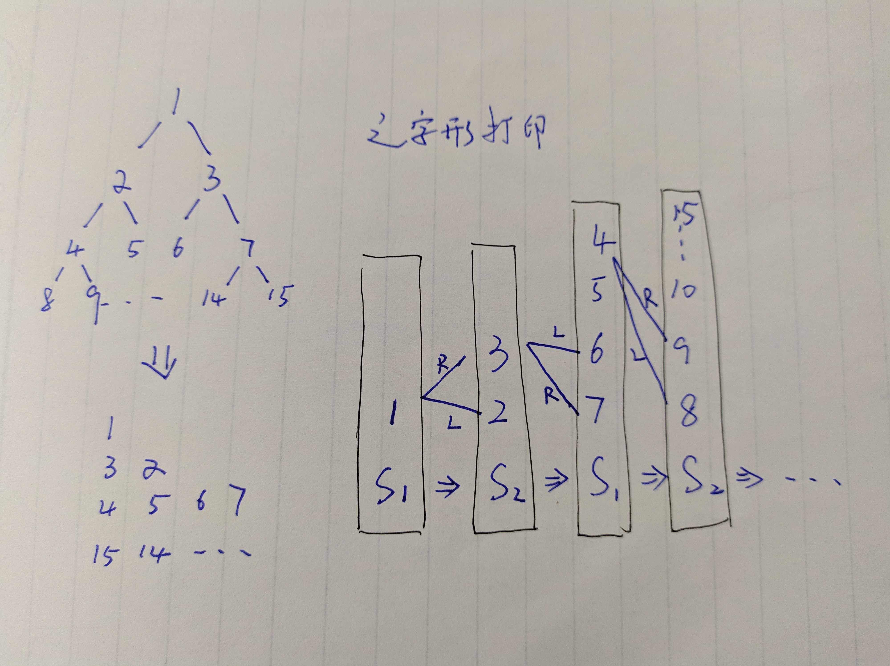

#### 解法1 +测试 打印一行

打印成一行

用队列依次添加当前节点的左节点和右节点，循环条件是队列不为空

```java
    // ------------------------------------------------------------------------------------------
    // start

    // 1.测试用例方法

    public void test() {
        List<TreeNode> treeNodes = createTreeNodes();
        for (int i = 0; i < treeNodes.size(); i++) {
            showInOrder(treeNodes.get(i));
            ArrayList<Integer> result = solution(treeNodes.get(i));
            for (int j = 0; j < result.size(); j++) {
                System.out.print(result.get(j) + " ");
            }
            System.out.println();
            System.out.println("-------------------------------------");
        }

    }

    // 2.算法题方法

    public ArrayList<Integer> solution(TreeNode root) {
        ArrayList<Integer> result = new ArrayList<>();
        ArrayList<TreeNode> queue = new ArrayList<>();
        queue.add(root);
        while (!queue.isEmpty()) {
            TreeNode node = queue.remove(0);
            if (node != null) {
                if (node.left != null) {
                    queue.add(node.left);
                }
                if (node.right != null) {
                    queue.add(node.right);
                }
                result.add(node.val);
            }
        }
        return result;
    }

    // end
    // ------------------------------------------------------------------------------------------
```

#### 运行结果

```java
0，完全二叉树
InOrder: 4 6 8 10 12 14 16 
1，非完全二叉树
InOrder: 4 7 2 1 5 3 8 6 
2，没有右子节点的二叉树
InOrder: 5 4 3 2 1 
3，没有左子节点的二叉树
InOrder: 1 2 3 4 5 
4，只有一个节点的二叉树
InOrder: 1 
5，没有节点的二叉树
InOrder: 
========================
InOrder: 4 6 8 10 12 14 16 
10 6 14 4 8 12 16 
-------------------------------------
InOrder: 4 7 2 1 5 3 8 6 
1 2 3 4 5 6 7 8 
-------------------------------------
InOrder: 5 4 3 2 1 
1 2 3 4 5 
-------------------------------------
InOrder: 1 2 3 4 5 
1 2 3 4 5 
-------------------------------------
InOrder: 1 
1 
-------------------------------------
InOrder: 

-------------------------------------
```


#### 解法2 +测试 打印分行

暂无OJ

分别计数队列中当前行的个数和下一行的个数

```java
    // ------------------------------------------------------------------------------------------
    // start

    // 1.测试用例方法

    public void test() {
        List<TreeNode> treeNodes = createTreeNodes();
        for (int i = 0; i < treeNodes.size(); i++) {
            showInOrder(treeNodes.get(i));
            solution(treeNodes.get(i));
            System.out.println("-------------------------------------");
        }

    }

    // 2.算法题方法

    public void solution(TreeNode root) {
        ArrayList<TreeNode> queue = new ArrayList<>();
        // 当前行节点数
        int current = 0;
        // 下一行节点数
        int next = 0;
        queue.add(root);
        current++;
        while (!queue.isEmpty()) {
            TreeNode node = queue.remove(0);
            current--;
            if (node != null) {
                if (node.left != null) {
                    queue.add(node.left);
                    next++;
                }
                if (node.right != null) {
                    queue.add(node.right);
                    next++;
                }
                System.out.print(node.val + " ");
            }
            if (current == 0) {
                System.out.println();
                current = next;
                next = 0;
            }
        }
    }

    // end
    // ------------------------------------------------------------------------------------------
```

#### 运行结果2

```java
0，完全二叉树
InOrder: 4 6 8 10 12 14 16 
1，非完全二叉树
InOrder: 4 7 2 1 5 3 8 6 
2，没有右子节点的二叉树
InOrder: 5 4 3 2 1 
3，没有左子节点的二叉树
InOrder: 1 2 3 4 5 
4，只有一个节点的二叉树
InOrder: 1 
5，没有节点的二叉树
InOrder: 
========================
InOrder: 4 6 8 10 12 14 16 
10 
6 14 
4 8 12 16 
-------------------------------------
InOrder: 4 7 2 1 5 3 8 6 
1 
2 3 
4 5 6 
7 8 
-------------------------------------
InOrder: 5 4 3 2 1 
1 
2 
3 
4 
5 
-------------------------------------
InOrder: 1 2 3 4 5 
1 
2 
3 
4 
5 
-------------------------------------
InOrder: 1 
1 
-------------------------------------
InOrder: 

-------------------------------------
```

#### 解法3+测试 打印之字行

暂无OJ

用两个栈来分别保存奇数行和偶数行的节点

其中，打印偶数行的时候，保存下一行(奇数行)子结点，先保存右节点，再保存左节点

奇数行相反

如下图所示:

```java
    // ------------------------------------------------------------------------------------------
    // start

    // 1.测试用例方法

    public void test() {
        List<TreeNode> treeNodes = createTreeNodes();
        for (int i = 0; i < treeNodes.size(); i++) {
            showInOrder(treeNodes.get(i));
            solution(treeNodes.get(i));
            System.out.println("-------------------------------------");
        }

    }

    // 2.算法题方法

    public void solution(TreeNode root) {
        // 存储奇数行的节点
        // 先存右节点，再存左节点 因为下一行(偶数行)要倒打印
        Stack<TreeNode> stack1 = new Stack<>();
        // 存储偶数行的节点
        // 先存左节点，再存右节点 因为下一行(奇数行)要正打印
        Stack<TreeNode> stack2 = new Stack<>();
        stack1.push(root);
        // 当前行数
        int row = 1;
        // 当前行节点数
        int current = 1;
        // 下一行节点数
        int next = 0;
        while (!stack1.isEmpty() || !stack2.isEmpty()) {
            TreeNode node = null;
            // 当前打印行为奇数,当前行从stack1取值
            if ((row & 1) == 1) {
                node = stack1.pop();
                if (node != null) {
                    System.out.print(node.val + " ");
                    current--;
                    // 下一行存入stack2，先存左节点
                    if (node.left != null) {
                        stack2.push(node.left);
                        next++;
                    }
                    if (node.right != null) {
                        stack2.push(node.right);
                        next++;
                    }
                }
            }
            // 当前打印行为偶数，当前行从stack2取值
            else {
                node = stack2.pop();
                if (node != null) {
                    System.out.print(node.val + " ");
                    current--;
                    // 下一行存入stack1，先存右节点
                    if (node.right != null) {
                        stack1.push(node.right);
                        next++;
                    }
                    if (node.left != null) {
                        stack1.push(node.left);
                        next++;
                    }
                }
            }
            // 当前行打印完毕
            if (current == 0) {
                System.out.println();
                current = next;
                next = 0;
                row++;
            }
        }
    }

    // end
    // ------------------------------------------------------------------------------------------
```

#### 运行结果3

```java
0，完全二叉树
InOrder: 4 6 8 10 12 14 16 
1，非完全二叉树
InOrder: 4 7 2 1 5 3 8 6 
2，没有右子节点的二叉树
InOrder: 5 4 3 2 1 
3，没有左子节点的二叉树
InOrder: 1 2 3 4 5 
4，只有一个节点的二叉树
InOrder: 1 
5，没有节点的二叉树
InOrder: 
========================
InOrder: 4 6 8 10 12 14 16 
10 
14 6 
4 8 12 16 
-------------------------------------
InOrder: 4 7 2 1 5 3 8 6 
1 
3 2 
4 5 6 
8 7 
-------------------------------------
InOrder: 5 4 3 2 1 
1 
2 
3 
4 
5 
-------------------------------------
InOrder: 1 2 3 4 5 
1 
2 
3 
4 
5 
-------------------------------------
InOrder: 1 
1 
-------------------------------------
InOrder: 
-------------------------------------
```


------


### 七、二叉搜索树的后序遍历序列

[OJ](https://www.nowcoder.com/practice/a861533d45854474ac791d90e447bafd?tpId=13&tqId=11176&tPage=2&rp=1&ru=%2Fta%2Fcoding-interviews&qru=%2Fta%2Fcoding-interviews%2Fquestion-ranking)

输入一个整数数组，判断该数组是不是某二叉搜索树的后序遍历的结果。如果是则输出Yes,否则输出No。假设输入的数组的任意两个数字都互不相同。

#### 解法+测试 递归二分


递归

在后序遍历中，最后一位为树的根结点，前面可分为两部分：

- 左子树，都比根结点小
- 右子树，不能有比根结点小的数，如果有返回false

```java
    // ------------------------------------------------------------------------------------------
    // start

    // 1.测试用例方法

    public void test() {
        ArrayList<int[]> list = new ArrayList<>();
        /**
         *  1
         *    2
         *      3
         *        4
         *          5
         */
        list.add(new int[]{1, 2, 3, 4, 5});
        /**
         *               1
         *            2
         *         3
         *      4
         *   5
         */
        list.add(new int[]{5, 4, 3, 2, 1});
        /**
         *      10
         *   6      14
         * 4  8   12  16
         */
        list.add(new int[]{4, 8, 6, 12, 16, 14, 10});
        /**
         *          1
         *     2        3
         *  4        5      6
         *    7           8
         */
        list.add(new int[]{7, 4, 2, 5, 8, 6, 3, 1});
        /**
         *      4
         *         6
         *           8
         */
        list.add(new int[]{8, 6, 4});
        list.add(new int[]{7, 4, 6, 5});
        list.add(new int[]{4, 6, 7, 5});
        list.add(new int[]{});

        for (int i = 0; i < list.size(); i++) {
            for (int j = 0; j < list.get(i).length; j++) {
                System.out.print(list.get(i)[j] + " ");
            }
            System.out.println(" ==> is post order ?");
            System.out.println(VerifySquenceOfBST(list.get(i)));
        }
    }

    // 2.算法题方法

    public boolean VerifySquenceOfBST(int[] sequence) {
        if (sequence == null || sequence.length == 0) {
            return false;
        } else if (sequence.length == 1) {
            return true;
        }
        return recursion(sequence, 0, sequence.length - 1);
    }

    private boolean recursion(int[] sequence, int start, int end) {
        if (start >= end) {
            return true;
        }
        // 从左向右，找出比根结点小的树为根结点的左子树
        int left = start;
        while (left < end && sequence[left] <= sequence[end]) {
            left++;
        }
        // 判断根结点右子树中是否有小于根结点的值，返回false
        int right = left;
        while (right < end) {
            if (sequence[right] < sequence[end]) {
                return false;
            }
            right++;
        }
        // 递归
        return recursion(sequence, start, left - 1) && recursion(sequence, left, end - 1);
    }

    // end
    // ------------------------------------------------------------------------------------------
```

#### 运行结果

```java
1 2 3 4 5  ==> is post order ?
true
5 4 3 2 1  ==> is post order ?
true
4 8 6 12 16 14 10  ==> is post order ?
true
7 4 2 5 8 6 3 1  ==> is post order ?
false
8 6 4  ==> is post order ?
true
7 4 6 5  ==> is post order ?
false
4 6 7 5  ==> is post order ?
true
 ==> is post order ?
false
```

------


### 八、二叉树中和为某一值的路径

[OJ](https://www.nowcoder.com/practice/b736e784e3e34731af99065031301bca?tpId=13&tqId=11177&tPage=2&rp=1&ru=%2Fta%2Fcoding-interviews&qru=%2Fta%2Fcoding-interviews%2Fquestion-ranking)

输入一颗二叉树的根节点和一个整数，打印出二叉树中结点值的和为输入整数的所有路径。路径定义为从树的根结点开始往下一直到叶结点所经过的结点形成一条路径。(注意: 在返回值的list中，数组长度大的数组靠前)

#### 解法+测试 递归(DFS)

前序遍历递归访问二叉树

在叶节点的时候判断路径的和值是否满足要求

每一次递归的结尾都要删除当前节点以及当前路径和值减去当前节点

```java
    // ------------------------------------------------------------------------------------------
    // start

    // 1.测试用例方法

    public void test() {
        List<TreeNode> treeNodes = createTreeNodes();
        treeNodes.add(createBinaryTree(new int[]{10, 5, 4, 7, 12}, new int[]{4, 5, 7, 10, 12}));
        System.out.println("6.多条相同路径二叉树");
        showLevelOrder(treeNodes.get(6));

        for (int i = 0; i < treeNodes.size(); i++) {
            showInOrder(treeNodes.get(i));
            System.out.println("target:22 ");
            showArraylists(solution(treeNodes.get(i), 22));
            System.out.println("target:24 ");
            showArraylists(solution(treeNodes.get(i), 24));
            System.out.println("target:0 ");
            showArraylists(solution(treeNodes.get(i), 0));
            System.out.println("---------------------------------");
        }


    }

    private void showArraylists(ArrayList<ArrayList<Integer>> arrayLists) {
        if (arrayLists == null) {
            return;
        }
        for (int i = 0; i < arrayLists.size(); i++) {
            for (int j = 0; j < arrayLists.get(i).size(); j++) {
                System.out.print(arrayLists.get(i).get(j) + " -> ");
            }
            System.out.println();
        }
    }

    // 2.算法题方法

    public ArrayList<ArrayList<Integer>> solution(TreeNode root, int target) {
        if (root == null) {
            if (target == 0) {
                return new ArrayList<>();
            }
            return null;
        }
        ArrayList<ArrayList<Integer>> paths = new ArrayList<>();
        ArrayList<Integer> path = new ArrayList<>();
        recursion(root, target, 0, path, paths);
        return paths;
    }

    private void recursion(TreeNode root, int targetSum, int currentSum, ArrayList<Integer> path, ArrayList<ArrayList<Integer>> paths) {
        currentSum += root.val;
        path.add(root.val);
        if (root.left == null && root.right == null) {
            if (currentSum == targetSum) {
                // 保存当前符合条件的路径 
                paths.add(new ArrayList<>());
                for (int i = 0; i < path.size(); i++) {
                    paths.get(paths.size() - 1).add(path.get(i));
                }
            }
        }
        // 前序遍历
        if (root.left != null) {
            recursion(root.left, targetSum, currentSum, path, paths);
        }
        if (root.right != null) {
            recursion(root.right, targetSum, currentSum, path, paths);
        }
        // 在每一次调用完left right的时候，删除当前节点
        path.remove(path.size() - 1);
        currentSum -= root.val;
    }

    // end
    // ------------------------------------------------------------------------------------------
```

#### 运行结果

```java
0，完全二叉树
PreOrder: 10 6 4 8 14 12 16 
InOrder: 4 6 8 10 12 14 16 
PostOrder: 4 8 6 12 16 14 10 
1，非完全二叉树
PreOrder: 1 2 4 7 3 5 6 8 
InOrder: 4 7 2 1 5 3 8 6 
PostOrder: 7 4 2 5 8 6 3 1 
2，没有右子节点的二叉树
PreOrder: 1 2 3 4 5 
InOrder: 5 4 3 2 1 
PostOrder: 5 4 3 2 1 
3，没有左子节点的二叉树
PreOrder: 1 2 3 4 5 
InOrder: 1 2 3 4 5 
PostOrder: 5 4 3 2 1 
4，只有一个节点的二叉树
InOrder: 1 
5，没有节点的二叉树
InOrder: 
========================
6.多条相同路径二叉树
levelOrder: 
10 
5 12 
4 7 
------------------
InOrder: 4 6 8 10 12 14 16 
target:22 
target:24 
10 -> 6 -> 8 -> 
target:0 
---------------------------------
InOrder: 4 7 2 1 5 3 8 6 
target:22 
target:24 
target:0 
---------------------------------
InOrder: 5 4 3 2 1 
target:22 
target:24 
target:0 
---------------------------------
InOrder: 1 2 3 4 5 
target:22 
target:24 
target:0 
---------------------------------
InOrder: 1 
target:22 
target:24 
target:0 
---------------------------------
InOrder: 
target:22 
target:24 
target:0 
---------------------------------
InOrder: 4 5 7 10 12 
target:22 
10 -> 5 -> 7 -> 
10 -> 12 -> 
target:24 
target:0 
---------------------------------
```

------


### 九、二叉搜索树与双向链表

[OJ](https://www.nowcoder.com/practice/947f6eb80d944a84850b0538bf0ec3a5?tpId=13&tqId=11179&tPage=2&rp=1&ru=%2Fta%2Fcoding-interviews&qru=%2Fta%2Fcoding-interviews%2Fquestion-ranking)

输入一棵二叉搜索树，将该二叉搜索树转换成一个排序的双向链表。要求不能创建任何新的结点，只能调整树中结点指针的指向。

#### 解法1+测试 中序遍历递归

中序遍历也可以用循环实现而不用递归实现

```java
    // ------------------------------------------------------------------------------------------
    // start

    // 1.测试用例方法

    public void test() {
        List<TreeNode> treeNodes = createTreeNodes();
        showInOrder(treeNodes.get(0));
        showDoubleList(solution(treeNodes.get(0)));
        System.out.println("-----------------------------");

        showInOrder(treeNodes.get(3));
        showDoubleList(solution(treeNodes.get(3)));
        System.out.println("-----------------------------");

        treeNodes.add(createBinaryTree(new int[]{5, 4, 3, 2, 1}, new int[]{1, 2, 3, 4, 5}));
        showInOrder(treeNodes.get(6));
        showDoubleList(solution(treeNodes.get(6)));
        System.out.println("-----------------------------");

        treeNodes.add(createBinaryTree(new int[]{10, 6, 4, 14, 12}, new int[]{4, 6, 10, 12, 14}));
        showInOrder(treeNodes.get(7));
        showDoubleList(solution(treeNodes.get(7)));
        System.out.println("-----------------------------");

    }

    private void showDoubleList(TreeNode head) {
        System.out.println("double list:");
        TreeNode last = null;
        while (head != null) {
            System.out.print(head.val + " -> ");
            if (head.right == null) {
                last = head;
            }
            head = head.right;
        }
        System.out.println();
        while (last != null) {
            System.out.print(last.val + " -> ");
            last = last.left;
        }
        System.out.println();
    }

    // 2.算法题方法

    /**
     * 已经转换好的双向链表的最后一个节点
     */
    private TreeNode listNode;

    public TreeNode solution(TreeNode pRootOfTree) {
        if (pRootOfTree == null) {
            return null;
        }
        // 中序遍历递归
        listNode = null;
        recursion(pRootOfTree);
        while (pRootOfTree.left != null) {
            pRootOfTree = pRootOfTree.left;
        }
        return pRootOfTree;
    }

    /**
     * 中序遍历递归
     *
     * @param root
     */
    private void recursion(TreeNode root) {
        if (root.left != null) {
            recursion(root.left);
        }
        // 头结点
        if (listNode == null) {
            listNode = root;
        }
        // 树指针转换为链表指针
        else {
            listNode.right = root;
            root.left = listNode;
            listNode = listNode.right;
        }
        if (root.right != null) {
            recursion(root.right);
        }
    }

    // end
    // ------------------------------------------------------------------------------------------
```

#### 运行结果

```java
0，完全二叉树
PreOrder: 10 6 4 8 14 12 16 
InOrder: 4 6 8 10 12 14 16 
PostOrder: 4 8 6 12 16 14 10 
1，非完全二叉树
PreOrder: 1 2 4 7 3 5 6 8 
InOrder: 4 7 2 1 5 3 8 6 
PostOrder: 7 4 2 5 8 6 3 1 
2，没有右子节点的二叉树
PreOrder: 1 2 3 4 5 
InOrder: 5 4 3 2 1 
PostOrder: 5 4 3 2 1 
3，没有左子节点的二叉树
PreOrder: 1 2 3 4 5 
InOrder: 1 2 3 4 5 
PostOrder: 5 4 3 2 1 
4，只有一个节点的二叉树
InOrder: 1 
5，没有节点的二叉树
InOrder: 
========================
InOrder: 4 6 8 10 12 14 16 
double list:
4 -> 6 -> 8 -> 10 -> 12 -> 14 -> 16 -> 
16 -> 14 -> 12 -> 10 -> 8 -> 6 -> 4 -> 
-----------------------------
InOrder: 1 2 3 4 5 
double list:
1 -> 2 -> 3 -> 4 -> 5 -> 
5 -> 4 -> 3 -> 2 -> 1 -> 
-----------------------------
InOrder: 1 2 3 4 5 
double list:
1 -> 2 -> 3 -> 4 -> 5 -> 
5 -> 4 -> 3 -> 2 -> 1 -> 
-----------------------------
InOrder: 4 6 10 12 14 
double list:
4 -> 6 -> 10 -> 12 -> 14 -> 
14 -> 12 -> 10 -> 6 -> 4 -> 
-----------------------------
```

------

#### 解法2 递归构造

分别将左右子树构造成双链表，再连起来

```java
/**
public class TreeNode {
    int val = 0;
    TreeNode left = null;
    TreeNode right = null;

    public TreeNode(int val) {
        this.val = val;

    }

}
*/
public class Solution {
    public TreeNode Convert(TreeNode pRootOfTree) {
        if(pRootOfTree==null){
            return null;
        }
        if(pRootOfTree.left==null&&pRootOfTree.right==null){
            
            return pRootOfTree;
        }
        // 将左子树构成双链表
        TreeNode left=Convert(pRootOfTree.left);
        // 左双链表末尾
        TreeNode lastNode=left;
        while(lastNode!=null&&lastNode.right!=null){
            lastNode=lastNode.right;
        }
        // 左双链表末尾接上当前根结点
        if(left!=null){
            pRootOfTree.left=lastNode;
            lastNode.right=pRootOfTree;
        }
        // 将右子树构成双链表
        TreeNode right=Convert(pRootOfTree.right);
        // 右双链表开头
        TreeNode firstNode=right;
        while(firstNode!=null&&firstNode.left!=null){
            firstNode=firstNode.left;
        }
        // 当前根结点接上右双链表开头
        if(right!=null){
            pRootOfTree.right=firstNode;
            firstNode.left=pRootOfTree;
        }
        return left==null?pRootOfTree:left;
    }
}

```

### 十、二叉树序列化

[OJ](https://www.nowcoder.com/practice/cf7e25aa97c04cc1a68c8f040e71fb84?tpId=13&tqId=11214&tPage=4&rp=1&ru=%2Fta%2Fcoding-interviews&qru=%2Fta%2Fcoding-interviews%2Fquestion-ranking)

请实现两个函数，分别用来序列化和反序列化二叉树

#### 解法1 先序遍历递归

```java
/*
public class TreeNode {
    int val = 0;
    TreeNode left = null;
    TreeNode right = null;

    public TreeNode(int val) {
        this.val = val;

    }

}
*/
public class Solution {
    String Serialize(TreeNode root) {
        StringBuffer result=new StringBuffer();
        if(root==null){
            result.append("#,");
        }else{
            result.append(root.val+",");
            result.append(Serialize(root.left));
            result.append(Serialize(root.right));
        }
        return result.toString();
  }
    String[] strs;
    int index=-1;
    TreeNode Deserialize(String str) {
        if(str==null){
            return null;
        }
        index++;
        if(index==0){
            strs=str.split(",");
        }
        TreeNode root=null;
        if(!strs[index].equals("#")){
            root = new TreeNode(Integer.valueOf(strs[index]));
            root.left=Deserialize("");
            root.right=Deserialize("");
        }
        return root;
        
  }
}
```

------

### 十二、二叉搜索树的第K个节点

[OJ](https://www.nowcoder.com/practice/ef068f602dde4d28aab2b210e859150a?tpId=13&tqId=11215&tPage=4&rp=1&ru=%2Fta%2Fcoding-interviews&qru=%2Fta%2Fcoding-interviews%2Fquestion-ranking)

给定一棵二叉搜索树，请找出其中的第k小的结点。例如， （5，3，7，2，4，6，8）    中，按结点数值大小顺序第三小结点的值为4。


#### 解法1 中序遍历递归

二叉搜索树按照中序遍历的顺序即为从小到大的顺序

```java
/*
public class TreeNode {
    int val = 0;
    TreeNode left = null;
    TreeNode right = null;

    public TreeNode(int val) {
        this.val = val;

    }

}
*/
public class Solution {
    // 计数器
    public int count=0;
    TreeNode KthNode(TreeNode pRoot, int k)
    {
        if(pRoot!=null){
            // 向左递归
            TreeNode target=KthNode(pRoot.left,k);
            if(target!=null){
                return target;
            }
            // 找到第k个节点
            if(++count==k){
                return pRoot;
            }
            // 向右递归
            target=KthNode(pRoot.right,k);
            if(target!=null){
                return target;
            }
        }
        return null;
    }


}
```

------


### 十三、二叉树的深度

[OJ](https://www.nowcoder.com/practice/435fb86331474282a3499955f0a41e8b?tpId=13&tqId=11191&tPage=2&rp=1&ru=%2Fta%2Fcoding-interviews&qru=%2Fta%2Fcoding-interviews%2Fquestion-ranking)

输入一棵二叉树，求该树的深度。从根结点到叶结点依次经过的结点（含根、叶结点）形成树的一条路径，最长路径的长度为树的深度。


#### 解法1 递归

求以当前节点为根节点的树的深度，也就是求当前左子树和当前右子树的最深深度+1

```java
/**
public class TreeNode {
    int val = 0;
    TreeNode left = null;
    TreeNode right = null;

    public TreeNode(int val) {
        this.val = val;

    }

}
*/
public class Solution {
    public int TreeDepth(TreeNode root) {
        if(root==null){
            return 0;
        }else{
            return Math.max(TreeDepth(root.left),TreeDepth(root.right))+1;
        }
    }
}
```

------

### 十四、平衡二叉树

[OJ](https://www.nowcoder.com/practice/8b3b95850edb4115918ecebdf1b4d222?tpId=13&tqId=11192&tPage=2&rp=1&ru=%2Fta%2Fcoding-interviews&qru=%2Fta%2Fcoding-interviews%2Fquestion-ranking)

输入一棵二叉树，判断该二叉树是否是平衡二叉树。

#### 解法1 从上到下深度差比较

递归遍历并且每次对比左右节点的深度差(二次递归)是否大于1

缺点：

每一次遍历到某个节点，都要再次遍历这个节点的左右子树

```java
public class Solution {
    public boolean IsBalanced_Solution(TreeNode root) {
        if(root==null){
            return true;
        }
        int left=TreeDepth(root.left);
        int right=TreeDepth(root.right);
        if(left-right<-1||left-right>1){
            return false;
        }
        return IsBalanced_Solution(root.left) && IsBalanced_Solution(root.right);
    }
    private int TreeDepth(TreeNode root) {
        if(root==null){
            return 0;
        }else{
            int left=TreeDepth(root.left);
            int right=TreeDepth(root.right);
            return Math.max(left,right)+1;
        }
    }
}
```

------

#### 解法2 后序遍历深度差比较

递归后序遍历的同时比较左右子树的深度差是否大于1

后序遍历，遍历根节点的时候，已经遍历左右子树

比较左右子树的深度差的时候，向上传递深度

```java
public class Solution {
    public boolean IsBalanced_Solution(TreeNode root) {
        if(root==null){
            return true;
        }
        if(recursion(root)==-1){
            return false;
        }else{
            return true;
        }
    }
    private int recursion(TreeNode root){
        if(root==null){
            return 0;
        }
        int left=recursion(root.left);
        // 左子树已经不平衡
        if(left==-1){
            return -1;
        }
        int right=recursion(root.right);
        // 右子树已经不平衡
        if(right==-1){
            return -1;
        }
        // 左右子树分别平衡，但当前根节点对应的树不平衡
        if(left-right<-1||left-right>1){
            return -1;
        }else{
            return Math.max(left,right)+1;
        }
    }
}
```

------

### 十五、 二叉搜索树的最低公共祖先

[OJ](https://leetcode-cn.com/problems/lowest-common-ancestor-of-a-binary-search-tree)

给定一个二叉搜索树, 找到该树中两个指定节点的最近公共祖先。

百度百科中最近公共祖先的定义为：“对于有根树 T 的两个结点 p、q，最近公共祖先表示为一个结点 x，满足 x 是 p、q 的祖先且 x 的深度尽可能大（一个节点也可以是它自己的祖先）。”

例如，给定如下二叉搜索树:  root = [6,2,8,0,4,7,9,null,null,3,5] 

示例 1:

输入: root = [6,2,8,0,4,7,9,null,null,3,5], p = 2, q = 8
输出: 6 
解释: 节点 2 和节点 8 的最近公共祖先是 6。
示例 2:

输入: root = [6,2,8,0,4,7,9,null,null,3,5], p = 2, q = 4
输出: 2
解释: 节点 2 和节点 4 的最近公共祖先是 2, 因为根据定义最近公共祖先节点可以为节点本身。


说明:

所有节点的值都是唯一的。
p、q 为不同节点且均存在于给定的二叉搜索树中。

#### 解法1 从上到下递归

从上到下递归，第一个位于p、q之间的节点就是最低公共祖先

```java
/**
 * Definition for a binary tree node.
 * public class TreeNode {
 *     int val;
 *     TreeNode left;
 *     TreeNode right;
 *     TreeNode(int x) { val = x; }
 * }
 */
class Solution {
    public TreeNode lowestCommonAncestor(TreeNode root, TreeNode p, TreeNode q) {
        if (root == null) {
            return null;
        }
        // 标记p q大小
        boolean flag = q.val > p.val;
        // true: root < p < q
        if (flag ? root.val < p.val : root.val < q.val) {
            return lowestCommonAncestor(root.right, p, q);
        }
        // true: root > q > p
        else if (flag ? root.val > q.val : root.val > p.val) {
            return lowestCommonAncestor(root.left, p, q);
        } 
        // true: p < root < q
        else {
            return root;
        }
    }
}
```

------

### 十六、普通二叉树的最低公共祖先

[OJ](https://leetcode-cn.com/problems/lowest-common-ancestor-of-a-binary-tree/submissions/)

给定一个二叉树, 找到该树中两个指定节点的最近公共祖先。

百度百科中最近公共祖先的定义为：“对于有根树 T 的两个结点 p、q，最近公共祖先表示为一个结点 x，满足 x 是 p、q 的祖先且 x 的深度尽可能大（一个节点也可以是它自己的祖先）。”

例如，给定如下二叉树:  root = [3,5,1,6,2,0,8,null,null,7,4] 

示例 1:

输入: root = [3,5,1,6,2,0,8,null,null,7,4], p = 5, q = 1
输出: 3
解释: 节点 5 和节点 1 的最近公共祖先是节点 3。
示例 2:

输入: root = [3,5,1,6,2,0,8,null,null,7,4], p = 5, q = 4
输出: 5
解释: 节点 5 和节点 4 的最近公共祖先是节点 5。因为根据定义最近公共祖先节点可以为节点本身。


说明:

所有节点的值都是唯一的。
p、q 为不同节点且均存在于给定的二叉树中。

#### 解法1 从下到上递归

和上一题 [十五、 二叉搜索树的最低公共祖先](https://humingk.github.io/algorithms-program_tree/#十五-二叉搜索树的最低公共祖先)  类似，即：

从上到下递归，第一个位于p、q之间的节点就是最低公共祖先


但这里不是二叉搜索树，不能通过比较当前节点、p、q的大小来判断当前节点是否在p、q之间

因此从下到上传递当前节点左右子树是否分别有p、q的信息，即：

- 若当前节点的左/右子树中有p/q，则当前节点的左/右节点为非null
- 若当前节点的左/右子树中没有p/q，则当前节点的左/右节点为null

这样就可以判断某个节点是否是公共祖先

而从下到上，则第一个公共祖先为最低公共祖先

```java
/**
 * Definition for a binary tree node.
 * public class TreeNode {
 *     int val;
 *     TreeNode left;
 *     TreeNode right;
 *     TreeNode(int x) { val = x; }
 * }
 */
class Solution {
    public TreeNode lowestCommonAncestor(TreeNode root, TreeNode p, TreeNode q) {
        // 如果遇到了p、q，则向上传递p、q
        // 除了传递p、q,没有p、q的路径上向上传递的是null
        if(root==null || root.val==p.val || root.val==q.val){
            return root;
        }
        // 左子树递归
        TreeNode left=lowestCommonAncestor(root.left,p,q);
        // 右子树递归
        TreeNode right=lowestCommonAncestor(root.right,p,q);
        if(left==null){
            return right;
        }else{
            if(right==null){
                return left;
            }else{
                // 当前节点左右都同时收到了传递而来的p、q（即left和right都为非null）
                return root;
            }
        }
    }
}
```


#### 解法2 路径比较

用两个栈分别存储从根节点到相应节点的路径

再比较路径，最后一个相同的节点（队列的话）

```java
/**
 * Definition for a binary tree node.
 * public class TreeNode {
 * int val;
 * TreeNode left;
 * TreeNode right;
 * TreeNode(int x) { val = x; }
 * }
 */

import java.util.Stack;

class Solution {
    public TreeNode lowestCommonAncestor(TreeNode root, TreeNode p, TreeNode q) {
        if (root == null) {
            return null;
        }
        Stack<TreeNode> pStack = new Stack<>();
        Stack<TreeNode> qStack = new Stack<>();
        findPath(root, p, pStack);
        findPath(root, q, qStack);
        int pSize = pStack.size();
        int qSize = qStack.size();
        // 保留最小长度
        for (int i = 0; i < Math.abs(pSize - qSize); i++) {
            if (pSize > qSize) {
                pStack.pop();
            } else {
                qStack.pop();
            }
        }
        // 找出最近的公共元素
        while (pStack.peek().val != qStack.peek().val) {
            pStack.pop();
            qStack.pop();
        }
        return pStack.peek();
    }

    private TreeNode findPath(TreeNode root, TreeNode x, Stack<TreeNode> xStack) {
        if (root == null) {
            return null;
        }
        xStack.push(root);
        // 到达终点
        if (x.val == root.val) {
            return root;
        }
        TreeNode left = findPath(root.left, x,xStack);
        TreeNode right = findPath(root.right, x,xStack);
        // 此路不通，后退
        if (left == null && right == null) {
            xStack.pop();
            return null;
        }
        return root;
    }
}	
```


### 十七、二叉树最大宽度

[OJ](https://leetcode-cn.com/problems/maximum-width-of-binary-tree)

给定一个二叉树，编写一个函数来获取这个树的最大宽度。树的宽度是所有层中的最大宽度。这个二叉树与满二叉树（full binary tree）结构相同，但一些节点为空。

每一层的宽度被定义为两个端点（该层最左和最右的非空节点，两端点间的null节点也计入长度）之间的长度。

示例 1:

输入: 

           1
         /   \
        3     2
       / \     \  
      5   3     9 

输出: 4
解释: 最大值出现在树的第 3 层，宽度为 4 (5,3,null,9)。
示例 2:

输入: 

          1
         /  
        3    
       / \       
      5   3     

输出: 2
解释: 最大值出现在树的第 3 层，宽度为 2 (5,3)。
示例 3:

输入: 

          1
         / \
        3   2 
       /        
      5      

输出: 2
解释: 最大值出现在树的第 2 层，宽度为 2 (3,2)。
示例 4:

输入: 

          1
         / \
        3   2
       /     \  
      5       9 
     /         \
    6           7
输出: 8
解释: 最大值出现在树的第 4 层，宽度为 8 (6,null,null,null,null,null,null,7)。
注意: 答案在32位有符号整数的表示范围

#### 解法1 层次遍历

用队列保存当前行的节点：

两个队列分别保存当前行和下一行的节点，通过1-flag更换当前行

用链表保存当前行节点在满二叉树的位置，用于计算当前行的宽度

```java
import java.util.LinkedList;
import java.util.Queue;

/**
 * Definition for a binary tree node.
 * public class TreeNode {
 * int val;
 * TreeNode left;
 * TreeNode right;
 * TreeNode(int x) { val = x; }
 * }
 */
class Solution {
    public int widthOfBinaryTree(TreeNode root) {
        if (root == null) {
            return 0;
        }
        // 保存当前行的节点队列，flag；下一行的节点队列，1-flag
        Queue<TreeNode>[] queue = new LinkedList[2];
        queue[0] = new LinkedList<>();
        queue[1] = new LinkedList<>();
        // 保存当前行的节点在满二叉树中的位置，用于计算当前行宽度
        LinkedList<Integer> list = new LinkedList<>();
        int flag = 0;
        queue[flag].offer(root);
        list.add(1);
        int max = 1;
        TreeNode node;
        int nowIndex;
        // 遍历当前行
        while (!queue[flag].isEmpty()) {
            // 当前节点
            node = queue[flag].poll();
            // 当前节点在满二叉树中的位置
            nowIndex = list.removeFirst();
            if (node.left != null) {
                queue[1 - flag].offer(node.left);
                list.add(nowIndex * 2);
            }
            if (node.right != null) {
                queue[1 - flag].offer(node.right);
                list.add(nowIndex * 2 + 1);
            }
            // 当前行已遍历完
            if (queue[flag].isEmpty()) {
                if (!list.isEmpty()) {
                    // 更新最大宽度，与当前行的宽度比较
                    max = Math.max(max, list.getLast() - list.getFirst() + 1);
                }
                // 切换到下一行
                flag = 1 - flag;
            }
        }
        return max;
    }
}
```

------

#### 解法2 DFS遍历

遍历每一行的时候，只需要记住当前行最左节点在满二叉树中的位置即可，因为：

当前行宽度=当前节点位置-当前行最左节点位置+1

因此，用一个链表保存每一行最左节点在满二叉树中的位置

```java
import java.util.ArrayList;
import java.util.List;

/**
 * Definition for a binary tree node.
 * public class TreeNode {
 * int val;
 * TreeNode left;
 * TreeNode right;
 * TreeNode(int x) { val = x; }
 * }
 */
class Solution {
    public int widthOfBinaryTree(TreeNode root) {
        if (root == null) {
            return 0;
        }
        // 保存每一层最左节点其在满二叉树中的位置
        List<Integer> list = new ArrayList<>();
        dfs(root, 1, 1, list);
        return max;
    }

    public int max = 0;

    /**
     * @param root  当前节点
     * @param level 当前行数
     * @param index 当前节点在满二叉树中的位置
     * @param list  保存每一层最左节点其在满二叉树中的位置
     */
    public void dfs(TreeNode root, int level, int index, List<Integer> list) {
        if (root == null) {
            return;
        }
        // 行数大于list长度，说明到了新的一行
        if (level > list.size()) {
            list.add(index);
        }
        // 当前行宽度=当前节点位置-当前行最左节点位置+1
        max = Math.max(max, index - list.get(level - 1) + 1);
        dfs(root.left, level + 1, index * 2, list);
        dfs(root.right, level + 1, index * 2 + 1, list);
    }
}
```

------

### 十八、最小高度数

[OJ](https://leetcode-cn.com/problems/minimum-height-trees)

对于一个具有树特征的无向图，我们可选择任何一个节点作为根。图因此可以成为树，在所有可能的树中，具有最小高度的树被称为最小高度树。给出这样的一个图，写出一个函数找到所有的最小高度树并返回他们的根节点。

格式

该图包含 n 个节点，标记为 0 到 n - 1。给定数字 n 和一个无向边 edges 列表（每一个边都是一对标签）。

你可以假设没有重复的边会出现在 edges 中。由于所有的边都是无向边， [0, 1]和 [1, 0] 是相同的，因此不会同时出现在 edges 里。

示例 1:

输入: n = 4, edges = [[1, 0], [1, 2], [1, 3]]

        0
        |
        1
       / \
      2   3 

输出: [1]
示例 2:

输入: n = 6, edges = [[0, 3], [1, 3], [2, 3], [4, 3], [5, 4]]

     0  1  2
      \ | /
        3
        |
        4
        |
        5 

输出: [3, 4]
说明:

 根据树的定义，树是一个无向图，其中任何两个顶点只通过一条路径连接。 换句话说，一个任何没有简单环路的连通图都是一棵树。
树的高度是指根节点和叶子节点之间最长向下路径上边的数量。

#### 解法1 遍历求所有树的高度(超时)

遍历图所有的节点，分别求以当前节点为根节点的树的高度

超时

且注意题中已指明，该图包含 `n` 个节点，标记为 `0` 到 `n - 1`，故不需要使用HashMap

PS：

其中，求一个树的高度有下列三种方法：

- 广度优先搜索，用队列实现层次遍历
- 深度优先搜索，递归求各子树的高度最大值
- 深度优先搜索，用栈实现前序/后序遍历，最大的栈长度即为树的高度

```java
import java.util.*;

class Solution {
    public List<Integer> findMinHeightTrees(int n, int[][] edges) {
        List<Integer> result = new ArrayList<>();
        if (n == 1) {
            List<Integer> r = new ArrayList<>();
            r.add(0);
            return r;
        } else if (n <= 0 || edges == null || edges.length == 0) {
            return result;
        }
        // 存储图的节点的邻接表
        // list 第一个存储以当前节点为根节点的树的高度
        // list 第二个存储计算以当前节点为根节点的树的高度时候是否遍历过此节点
        HashMap<Integer, List<Integer>> map = new HashMap<>();
        for (int i = 0; i < edges.length; i++) {
            for (int j = 0; j < 2; j++) {
                int a, b;
                if (j == 0) {
                    a = edges[i][0];
                    b = edges[i][1];
                } else {
                    a = edges[i][1];
                    b = edges[i][0];
                }
                if (map.containsKey(a)) {
                    map.get(a).add(b);
                } else {
                    List<Integer> list = new LinkedList<>();
                    list.add(0);
                    list.add(0);
                    list.add(b);
                    map.put(a, list);
                }
            }
        }
        // 广度遍历列表
        Queue<Integer> queue = new LinkedList<>();
        // 当前节点的邻接表
        List<Integer> ne;
        // 分别求以不同key为根节点的树的高度
        for (Integer key : map.keySet()) {
            int depth = 0;
            queue.add(key);
            // 已遍历的节点的标记重置
            for (Integer k : map.keySet()) {
                map.get(k).set(1, 0);
            }
            map.get(key).set(1, 1);
            // 广度优先
            while (!queue.isEmpty()) {
                depth++;
                // 当前层的节点个数
                int size = queue.size();
                // 遍历当前层的节点
                for (int i = 0; i < size; i++) {
                    int now = queue.poll();
                    ne = map.get(now);
                    // 广度队列添加当前节点的邻接节点
                    for (int j = 2; j < ne.size(); j++) {
                        // 当前节点未遍历过
                        if (map.get(ne.get(j)).get(1) == 0) {
                            queue.add(ne.get(j));
                            map.get(ne.get(j)).set(1, 1);
                        }
                    }
                }
            }
            map.get(key).set(0, depth);
        }
        // 最小高度
        int min = Integer.MAX_VALUE;
        for (Integer key : map.keySet()) {
            if (min > map.get(key).get(0)) {
                min = map.get(key).get(0);
            }
        }
        // 最小高度的树的根节点
        for (Integer key : map.keySet()) {
            if (map.get(key).get(0) == min) {
                result.add(key);
            }
        }
        return result;
    }

}
```

------

#### 解法2 去除叶节点

既然要求高度最小的树的根节点，那么逐渐删除当前无向图的叶子节点，最后始终会剩下一个或者两个节点，即为高度最小的树的根节点

```java
import java.util.ArrayList;
import java.util.LinkedList;
import java.util.List;
import java.util.Queue;

class Solution {
    public List<Integer> findMinHeightTrees(int n, int[][] edges) {
        List<Integer> result = new ArrayList<>();
        if (n == 1) {
            result.add(0);
            return result;
        } else if (n <= 0 || edges == null || edges.length == 0) {
            return result;
        }
        // 无向图边关系
        boolean[][] graph = new boolean[n][n];
        // 标记已经遍历
        boolean[] visited = new boolean[n];
        // 当前节点的边数
        int[] nums = new int[n];
        // 初始化无向图
        for (int i = 0; i < edges.length; i++) {
            graph[edges[i][0]][edges[i][1]] = true;
            graph[edges[i][1]][edges[i][0]] = true;
            nums[edges[i][0]]++;
            nums[edges[i][1]]++;
        }
        // 当前的叶子节点队列
        Queue<Integer> leaves = new LinkedList<>();
        // 删除叶子节点
        while (n > 2) {
            // 当前边数为1的节点为叶子节点
            for (int i = 0; i < nums.length; i++) {
                if (nums[i] == 1) {
                    leaves.offer(i);
                }
            }
            // 删除当前叶子节点列表
            while (!leaves.isEmpty()) {
                int leaf = leaves.poll();
                nums[leaf]--;
                n--;
                visited[leaf] = true;
                // 更新与当前叶子节点相连的节点
                for (int i = 0; i < graph[leaf].length; i++) {
                    if (graph[leaf][i]) {
                        graph[i][leaf] = false;
                        graph[leaf][i] = false;
                        nums[i]--;
                    }
                }
            }
        }
        // 最后剩下的一个或两个节点
        for (int i = 0; i < visited.length; i++) {
            if (!visited[i]) {
                result.add(i);
            }
        }
        return result;
    }
}
```

------

### 十九、已知中序和后序求前序遍历

eg，输入中序遍历和后序遍历：

dgbaechf

gbdehfca

输出：

adbgcefh

#### 解法1 递归

与前面第一题，根据前序遍历和中序遍历重建二叉树差不多

PS:

赛码OJ通过率仅有83%，失败测试用例暂时未知！


```java
import java.util.Scanner;

/**
 * @author humingk
 */
public class Main {

    public String recursion(String in, String back, int inStart, int inEnd, int backStart, int backEnd) {
        if (inStart > inEnd) {
            return "";
        }
        if (inStart == inEnd) {
            return String.valueOf(in.charAt(inStart));
        }
        char root = back.charAt(backEnd);
        int inMiddle = inStart;
        while (in.charAt(inMiddle) != root) {
            inMiddle++;
        }
        return root + recursion(in, back, inStart, (inStart + 1 == inMiddle) ? inStart : inMiddle - inStart - 1, backStart, backStart + inMiddle - inStart - 1) + recursion(in, back, inMiddle + 1, inEnd, backStart + inMiddle - inStart, backEnd - 1);
    }


    public static void main(String[] args) {
        Scanner scanner = new Scanner(System.in);
        String in = scanner.nextLine().trim();
        String back = scanner.nextLine().trim();
        String s = new Main().recursion(in, back, 0, in.length() - 1, 0, back.length() - 1);
        System.out.println(s);
    }
}

```

------


## 图结构


### 一、克隆图

OJ：

[https://leetcode-cn.com/problems/clone-graph/](https://leetcode-cn.com/problems/clone-graph/)

给定无向连通图中一个节点的引用，返回该图的深拷贝克隆）。图中的每个节点都包含它的值 `val`（`Int`） 和其邻居的列表（`list[Node]`）。

输入：
{"$id":"1","neighbors":[{"$id":"2","neighbors":[{"$ref":"1"},{"$id":"3","neighbors":[{"$ref":"2"},{"$id":"4","neighbors":[{"$ref":"3"},{"$ref":"1"}],"val":4}],"val":3}],"val":2},{"$ref":"4"}],"val":1}

解释：
节点 1 的值是 1，它有两个邻居：节点 2 和 4 。
节点 2 的值是 2，它有两个邻居：节点 1 和 3 。
节点 3 的值是 3，它有两个邻居：节点 2 和 4 。
节点 4 的值是 4，它有两个邻居：节点 1 和 3 。

提示：

节点数介于 1 到 100 之间。
无向图是一个简单图，这意味着图中没有重复的边，也没有自环。
由于图是无向的，如果节点 p 是节点 q 的邻居，那么节点 q 也必须是节点 p 的邻居。
必须将给定节点的拷贝作为对克隆图的引用返回。


#### 解法1 广度优先搜索(BFS)

用队列（先进先出）保存广度搜索列表，遍历队列

```java
/*
// Definition for a Node.
class Node {
    public int val;
    public List<Node> neighbors;

    public Node() {}

    public Node(int _val,List<Node> _neighbors) {
        val = _val;
        neighbors = _neighbors;
    }
};
*/
import java.util.HashMap;
import java.util.ArrayList;
import java.util.Queue;
import java.util.LinkedList;
class Solution {
    public Node cloneGraph(Node node) {
        if(node==null){
            return null;
        }
        // 新的克隆图返回节点
        Node clone=new Node(node.val,new ArrayList<>());
        // 存放广度遍历节点
        Queue<Node> queue=new LinkedList<>();
        queue.offer(node);
        // 存放旧节点列表对应的克隆值
        Map<Node,Node> copy =new HashMap<>();
        copy.put(node,clone);
        while(!queue.isEmpty()){
            Node temp=queue.poll();
            // 遍历当前节点的邻居节点列表
            for(Node nNode:temp.neighbors){
                // 此邻居节点未复制
                if(!copy.containsKey(nNode)){
                    // 复制当前节点
                    copy.put(nNode,new Node(nNode.val,new ArrayList<>()));
                    // 添加广度遍历列表
                    queue.offer(nNode);
                }
                // 复制当前节点的邻居节点列表
                copy.get(temp).neighbors.add(copy.get(nNode));
            }
        }
        return clone;
    }
}
```

------

#### 解法2 深度优先搜索(DFS)

递归访问当点节点的所有邻居节点

```java
/*
// Definition for a Node.
class Node {
    public int val;
    public List<Node> neighbors;

    public Node() {}

    public Node(int _val,List<Node> _neighbors) {
        val = _val;
        neighbors = _neighbors;
    }
};
*/
import java.util.HashMap;
class Solution {
    public Node cloneGraph(Node node) {
        if(node==null){
            return null;
        }
        // 存放节点对应的克隆值
        Map<Node,Node> copy=new HashMap<>();
        return dfs(node,copy);
    }
    public Node dfs(Node node,Map<Node,Node> copy){
        // 已遍历当前节点，返回当前节点的复制节点
        if(copy.containsKey(node)){
            return copy.get(node);
        }
        // 复制当前节点
        Node clone = new Node(node.val,new ArrayList<>());
        copy.put(node,clone);
        // 遍历当前节点的邻居列表
        for(Node nNode:node.neighbors){
            // 递归调用，复制当前节点的邻居节点列表
            clone.neighbors.add(dfs(nNode,copy));
        }
        return clone;
    }
}
```

------


### 二、课程表

OJ：

[https://leetcode-cn.com/problems/course-schedule/](https://leetcode-cn.com/problems/course-schedule/)

现在你总共有 n 门课需要选，记为 0 到 n-1。

在选修某些课程之前需要一些先修课程。 例如，想要学习课程 0 ，你需要先完成课程 1 ，我们用一个匹配来表示他们: [0,1]

给定课程总量以及它们的先决条件，判断是否可能完成所有课程的学习？

示例 1:

输入: 2, [[1,0]] 
输出: true
解释: 总共有 2 门课程。学习课程 1 之前，你需要完成课程 0。所以这是可能的。
示例 2:

输入: 2, [[1,0],[0,1]]
输出: false
解释: 总共有 2 门课程。学习课程 1 之前，你需要先完成课程 0；并且学习课程 0 之前，你还应先完成课程 1。这是不可能的。
说明:

输入的先决条件是由边缘列表表示的图形，而不是邻接矩阵。详情请参见图的表示法。
你可以假定输入的先决条件中没有重复的边。
提示:

这个问题相当于查找一个循环是否存在于有向图中。如果存在循环，则不存在拓扑排序，因此不可能选取所有课程进行学习。
通过 DFS 进行拓扑排序 - 一个关于Coursera的精彩视频教程（21分钟），介绍拓扑排序的基本概念。
拓扑排序也可以通过 BFS 完成。


#### 解法1 深度优先搜索(DFS) O(N+M)+O(N) N为节点数，M为边数

将课程关系转化为有向图，如果有向图出现了循环，则不存在拓扑排序，因此不可能选取所有课程进行学习

DFS进行拓扑排序：

对每一个节点都进行DFS，递归进行每一次DFS的过程中，如果访问到当前DFS已访问的节点，则说明出现了循环;如果访问到作为起始节点进行其他DFS的节点，则无须再访问

为了区分当前节点是当前DFS正在访问的节点还是作为起始节点进行其他DFS的已访问节点，用一个一维数组标记

        /**
         * 标记的当前节点状态
         * 0 未被访问
         * 1 已被当前起始节点的DFS访问（正在DFS访问中），若访问到本节点则出现了循环，返回false
         * 2 已被其他节点当作起始节点进行了DFS访问（已访问），访问到此节点无须再访问，返回true
         */


```java
import java.util.HashSet;

class Solution {
    public boolean canFinish(int numCourses, int[][] prerequisites) {
        if (numCourses <= 0) {
            return false;
        } else if (prerequisites.length == 0) {
            return true;
        }
        /**
         * 标记的当前节点状态
         * 0 未被访问
         * 1 已被当前起始节点的DFS访问（正在DFS访问中），若访问到本节点则出现了循环，返回false
         * 2 已被其他节点当作起始节点进行了DFS访问（已访问），访问到此节点无须再访问，返回true
         */
        int[] visited = new int[numCourses];
        // 邻接表存储图
        HashSet[] graph = new HashSet[numCourses];
        for (int i = 0; i < graph.length; i++) {
            graph[i] = new HashSet<>();
        }
        for(int i=0;i<prerequisites.length;i++){
            graph[prerequisites[i][0]].add(prerequisites[i][1]);
        }
        // 递归，深度优先搜索
        for(int i=0;i<graph.length;i++){
            // 出现循环
            if(!dfs(i,visited,graph)){
                return false;
            }
        }
        // 未出现循环
        return true;
    }

    /**
     * 有循环返回false
     *
     * @param now
     * @param visited
     * @param graph
     * @return
     */
    public boolean dfs(int now, int[] visited, HashSet<Integer>[] graph) {
        // 当前节点正在DFS中，出现循环
        if (visited[now] == 1) {
            return false;
        }
        // 当前节点已作为起始节点访问，不需要再访问
        else if (visited[now] == 2) {
            return true;
        }
        // 标记当前节点正在访问中
        visited[now] = 1;
        // 遍历当前节点的邻接表
        for (Integer neighbor : graph[now]) {
            // 出现循环
            if (!dfs(neighbor, visited, graph)) {
                return false;
            }
        }
        // 标记当前节点已访问
        visited[now] = 2;
        // 未发现循环
        return true;
    }
}
```

------

#### 解法2 拓扑排序 O(N+M)+O(N) N为节点数，M为边数

**拓扑排序**：

即有向无环图的所有顶点的线性队列，此队列满足所有顶点的先后顺序关系，可用于：

- 按先后顺序排序所有节点
- 确定有向图是否有循环

在这里：

这里不需要拓扑排序的顺序，只需要计数拓扑排序的个数count，如果能够按照拓扑排序遍历完所有节点，即没有循环

入度数组：

为了确认某个节点有没有前驱节点，用一个入度数组inDegree来保存所有节点的前驱节点个数

进行拓扑排序：

先将起始节点（没有前驱节点的节点）加入队列，遍历队列并计数，遍历队列的顺序就是拓扑排序的顺序

遍历到队列中的某个节点，需要将这个节点的所有邻接节点的入度减1（相当于删除这个节点），并且将所有邻接节点中没有前驱的节点加入队列中

如果能遍历完所有节点，并且呈拓扑排序，则说明没有循环

PS：

这里每一步都要先选取某个节点的邻接节点中最先没有前驱的节点到队列中（入度最先减为0的节点），其实就是**贪心算法**，满足“某一个节点指向的节点都在这个节点的后面”

```java
import java.util.Queue;
import java.util.LinkedList;

class Solution {
    public boolean canFinish(int numCourses, int[][] prerequisites) {
        if (numCourses <= 0) {
            return false;
        } else if (prerequisites.length == 0) {
            return true;
        }
        // 入度数组，即指向此节点的节点数
        int[] inDegree = new int[numCourses];
        for(int[] num:prerequisites){
            inDegree[num[0]]++;
        }
        // 存储待遍历队列
        Queue<Integer> queue=new LinkedList<>();
        // 先将所有起始节点加入队列（即入度为0的节点）
        for(int i=0;i<inDegree.length;i++){
            if(inDegree[i]==0){
                queue.offer(i);
            }
        }
        // 存储已遍历节点数，即拓扑排序个数
        int count=0;
        // 遍历队列
        while(!queue.isEmpty()){
            int now=queue.poll();
            count++;
            // 遍历此节点指向的节点列表
            for(int[] num:prerequisites){
                if(num[1]==now){
                    inDegree[num[0]]--;
                    // 没有节点指向当前邻接节点，即当前邻接节点的入度为0
                    if(inDegree[num[0]]==0){
                        queue.offer(num[0]);
                    }
                }
            }
        }
        return count==numCourses;
    }
}
```

------


### 四、单词接龙

OJ：

[https://leetcode-cn.com/problems/word-ladder/](https://leetcode-cn.com/problems/word-ladder/)

给定两个单词（beginWord 和 endWord）和一个字典，找到从 beginWord 到 endWord 的最短转换序列的长度。转换需遵循如下规则：

每次转换只能改变一个字母。
转换过程中的中间单词必须是字典中的单词。
说明:

如果不存在这样的转换序列，返回 0。
所有单词具有相同的长度。
所有单词只由小写字母组成。
字典中不存在重复的单词。
你可以假设 beginWord 和 endWord 是非空的，且二者不相同。
示例 1:

输入:
beginWord = "hit",
endWord = "cog",
wordList = ["hot","dot","dog","lot","log","cog"]

输出: 5

解释: 一个最短转换序列是 "hit" -> "hot" -> "dot" -> "dog" -> "cog",
     返回它的长度 5。
示例 2:

输入:
beginWord = "hit"
endWord = "cog"
wordList = ["hot","dot","dog","lot","log"]

输出: 0

解释: endWord "cog" 不在字典中，所以无法进行转换。


#### 解法1 广度优先搜索(BFS) O(M\*N)+ O(M\*N) M为单词个数，N为单词长度

广度优先搜索，每次变一个字母，最先到达目标单词即为最短路径

用队列保存BFS队列，用HashMap标记单词是否已访问

仅变一个字符：

对于hit变成hot，如果每一次都比较一下是否只差一个字符，计算量太大

考虑hit和hot都满足通配符h\*t，将所有单词的所有通配符作为key，单词作为value，用HashMap初始化存储

遍历到hit的时候，遍历hit的所有通配符 \*it,h\*t,hi\*所对应的所有单词，如果刚好为目标单词，则结束；如果未访问过此单词，则标记后加入BFS列表


```java
import javafx.util.Pair;

import java.util.*;

class Solution {
    public int ladderLength(String beginWord, String endWord, List<String> wordList) {
        // 存放通配符对应的单词列表，eg：h*t对应hit,hot
        Map<String, ArrayList<String>> hashmap = new HashMap<>();
        // 初始化hashmap
        for (String word : wordList) {
            for (int i = 0; i < beginWord.length(); i++) {
                // 通配符
                String key = word.substring(0, i) + "*" + word.substring(i + 1, beginWord.length());
                // 单词列表
                ArrayList<String> value = hashmap.getOrDefault(key, new ArrayList<>());
                // 添加当前单词
                value.add(word);
                hashmap.put(key, value);
            }
        }
        // BFS队列,单词+步数
        Queue<Pair<String, Integer>> queue = new LinkedList<>();
        queue.offer(new Pair(beginWord, 1));
        // 标记单词访问
        Map<String, Boolean> visited = new HashMap<>();
        // BFS遍历
        while (!queue.isEmpty()) {
            Pair<String, Integer> pair = queue.poll();
            String word = pair.getKey();
            int step = pair.getValue();
            // 遍历队列中每一个单词的n种通配符
            for (int i = 0; i < beginWord.length(); i++) {
                String key = word.substring(0, i) + "*" + word.substring(i + 1, beginWord.length());
                // 遍历当前通配符对应的单词列表
                for (String value : hashmap.getOrDefault(key, new ArrayList<String>())) {
                    // 到达目标单词
                    if (value.equals(endWord)) {
                        return step + 1;
                    }
                    // 未访问过此单词
                    if (!visited.containsKey(value)) {
                        // 标记访问此单词
                        visited.put(value, true);
                        // 添加到BFS队列
                        queue.offer(new Pair(value, step + 1));
                    }
                }
            }
        }
        return 0;
    }

    public static void main(String[] args) {
        int t = new Solution().ladderLength("hit", "cog", Arrays.asList("hot", "dot", "lot", "dog", "log", "cog"));
        System.out.println(t);
    }
}
```

------

#### 解法2 双向广度优先搜索(2BFS)

和解法一不同的地方在于，这里分别从开始和末尾向中间进行BFS遍历，当某个单词被两个BFS都访问到，说明相遇，返回二者之和

PS：

特别注意的情况，双向的话需添加条件：若字典中不包含endWord，则直接返回0

由于在判断是否相遇的时候，需要直接返回最短路径，故把step也存储到visited标记中

```java
import javafx.util.Pair;

import java.util.*;

class Solution {
    public int wordLength=0;
    public Map<String, ArrayList<String>> hashmap=null;
    public int ladderLength(String beginWord, String endWord, List<String> wordList) {
        if(!wordList.contains(endWord)){
            return 0;
        }
        wordLength=beginWord.length();
        // 存放通配符对应的单词列表，eg：h*t对应hit,hot
        hashmap = new HashMap<>();
        // 初始化hashmap
        for (String word : wordList) {
            for (int i = 0; i < wordLength; i++) {
                // 通配符
                String key = word.substring(0, i) + "*" + word.substring(i + 1, wordLength);
                // 单词列表
                ArrayList<String> value = hashmap.getOrDefault(key, new ArrayList<>());
                // 添加当前单词
                value.add(word);
                hashmap.put(key, value);
            }
        }
        // BFS队列,单词+步数
        Queue<Pair<String, Integer>> startQueue = new LinkedList<>();
        Queue<Pair<String, Integer>> endQueue = new LinkedList<>();
        startQueue.offer(new Pair(beginWord, 1));
        endQueue.offer(new Pair(endWord, 1));
        // 标记单词访问,单词+步数
        Map<String, Integer> startVisited = new HashMap<>();
        Map<String, Integer> endVisited = new HashMap<>();
        startVisited.put(beginWord,1);
        endVisited.put(endWord,1);
        // BFS遍历
        while (!startQueue.isEmpty()&& !endQueue.isEmpty( )) {
            // 从前向后
            int result=traverse(startQueue,startVisited,endVisited);
            if(result>-1){
                return result;
            }
            // 从后向前
            result=traverse(endQueue,endVisited,startVisited);
            if(result>-1){
                return result;
            }
        }
        return 0;
    }
    public int traverse(Queue<Pair<String,Integer>> queue,Map<String,Integer> nowVisited,Map<String,Integer> otherVisited){
        Pair<String, Integer> pair = queue.poll();
        String word = pair.getKey();
        int step = pair.getValue();
        // 遍历队列中每一个单词的n种通配符
        for (int i = 0; i < wordLength; i++) {
            String key = word.substring(0, i) + "*" + word.substring(i + 1, wordLength);
            // 遍历当前通配符对应的单词列表
            for (String value : hashmap.getOrDefault(key, new ArrayList<String>())) {
                // 另一BFS已经访问过此单词，前后BFS相遇
                if(otherVisited.containsKey(value)){
                    return step+otherVisited.get(value);
                }
                // 此BFS未访问过此单词
                if (!nowVisited.containsKey(value)) {
                    // 标记访问此单词
                    nowVisited.put(value, step+1);
                    // 添加到此BFS队列
                    queue.offer(new Pair(value, step + 1));
                }
            }
        }
        return -1;
    }

    public static void main(String[] args) {
        int t = new Solution().ladderLength("hit", "cog", Arrays.asList("hot", "dot", "lot", "dog", "log", "cog"));
        System.out.println(t);
    }
}
```

------


### 五、岛屿数量

OJ：

[https://leetcode-cn.com/problems/number-of-islands/](https://leetcode-cn.com/problems/number-of-islands/)


#### 解法1

```java

```

------

#### 解法2

```java

```

------

#### 解法3

```java

```

------


### 六、Floyd算法

任意两点之间的最短距离

#### 测试用例

```
6
0 1 12 -1 -1 -1
-1 0 9 3 -1 -1
-1 -1 0 -1 5 -1
-1 -1 4 0 13 15
-1 -1 -1 -1 0 4
-1 -1 -1 -1 -1 0
```

#### 解法

```java
import java.util.Scanner;

/**
 * @author humingk
 */
public class Main {
    public static void main(String[] args) {
        Scanner scanner = new Scanner(System.in);
        int n = scanner.nextInt();
        int[][] a = new int[n][n];
        for (int i = 0; i < n; i++) {
            for (int j = 0; j < n; j++) {
                a[i][j] = scanner.nextInt();
                if (a[i][j] == -1) {
                    a[i][j] = Integer.MAX_VALUE;
                }
            }
        }
        for (int i = 0; i < n; i++) {
            for (int j = 0; j < n; j++) {
                System.out.print(a[i][j] + " ");
            }
            System.out.println();
        }

        // Floyd算法
        // a[i][j]通过第k个节点中转
        for (int k = 0; k < n; k++) {
            for (int i = 0; i < n; i++) {
                for (int j = 0; j < n; j++) {
                    // a[i][k] 和 a[k][j]能走通 且 中转距离更短
                    if (a[i][k] != Integer.MAX_VALUE && a[k][j] != Integer.MAX_VALUE && a[i][k] + a[k][j] < a[i][j]) {
                        a[i][j] = a[i][k] + a[k][j];
                    }
                }
            }
        }

        for (int i = 0; i < n; i++) {
            for (int j = 0; j < n; j++) {
                System.out.print(a[i][j] + " ");
            }
            System.out.println();
        }
    }
}

```

#### 运行结果

```java
6
0 1 12 -1 -1 -1
-1 0 9 3 -1 -1
-1 -1 0 -1 5 -1
-1 -1 4 0 13 15
-1 -1 -1 -1 0 4
-1 -1 -1 -1 -1 0
    
0 1 12 2147483647 2147483647 2147483647 
2147483647 0 9 3 2147483647 2147483647 
2147483647 2147483647 0 2147483647 5 2147483647 
2147483647 2147483647 4 0 13 15 
2147483647 2147483647 2147483647 2147483647 0 4 
2147483647 2147483647 2147483647 2147483647 2147483647 0 
    
0 1 8 4 13 17 
2147483647 0 7 3 12 16 
2147483647 2147483647 0 2147483647 5 9 
2147483647 2147483647 4 0 9 13 
2147483647 2147483647 2147483647 2147483647 0 4 
2147483647 2147483647 2147483647 2147483647 2147483647 0 
```

------


### 七、Dijkstra算法

某一点到任意点的距离

#### 测试用例

```
6
0 1 12 -1 -1 -1
-1 0 9 3 -1 -1
-1 -1 0 -1 5 -1
-1 -1 4 0 13 15
-1 -1 -1 -1 0 4
-1 -1 -1 -1 -1 0
```

#### 解法

```java
import java.util.Scanner;

/**
 * @author humingk
 */
public class Main {
    public static void main(String[] args) {
        Scanner scanner = new Scanner(System.in);
        int n = scanner.nextInt();
        int[][] a = new int[n][n];
        for (int i = 0; i < n; i++) {
            for (int j = 0; j < n; j++) {
                a[i][j] = scanner.nextInt();
                if (a[i][j] == -1) {
                    a[i][j] = Integer.MAX_VALUE;
                }
            }
        }
        for (int i = 0; i < n; i++) {
            for (int j = 0; j < n; j++) {
                System.out.print(a[i][j] + " ");
            }
            System.out.println();
        }

        // Dijkstra算法
        int start = 0;
        // 第start个节点到其他节点的最短距离
        int[] distance = new int[n];
        for (int i = 0; i < n; i++) {
            distance[i] = a[start][i];
        }

        System.out.println();
        for (int i = 0; i < n; i++) {
            System.out.print(distance[i] + " ");
        }

        // 某个节点的最短距离是否已求出 true -> 已求出
        boolean[] flag = new boolean[n];
        flag[start] = true;

        for (int i = 0; i < n - 1; i++) {
            // min为距离start最近的节点 且 min之前未被找到
            int min = start;
            int minValue = Integer.MAX_VALUE;
            for (int j = 0; j < n; j++) {
                if (!flag[j] && distance[j] < minValue) {
                    min = j;
                    minValue = distance[j];
                }
            }
            flag[min] = true;

            for (int j = 0; j < n; j++) {
                // a[min][j]能走通 且 a-j 通过 a-min-j 中转距离更短
                if (a[min][j] != Integer.MAX_VALUE && distance[j] > distance[min] + a[min][j]) {
                    distance[j] = distance[min] + a[min][j];
                }
            }
        }

        System.out.println();
        for (int i = 0; i < n; i++) {
            System.out.print(distance[i] + " ");
        }
    }
}

```

#### 运行结果

```java
6
0 1 12 -1 -1 -1
-1 0 9 3 -1 -1
-1 -1 0 -1 5 -1
-1 -1 4 0 13 15
-1 -1 -1 -1 0 4
-1 -1 -1 -1 -1 0
0 1 12 2147483647 2147483647 2147483647 
2147483647 0 9 3 2147483647 2147483647 
2147483647 2147483647 0 2147483647 5 2147483647 
2147483647 2147483647 4 0 13 15 
2147483647 2147483647 2147483647 2147483647 0 4 
2147483647 2147483647 2147483647 2147483647 2147483647 0 

0 1 12 2147483647 2147483647 2147483647 
0 1 8 4 13 17 
```

------


## 其他结构


### 模板工具类:

```java
package others;

/**
 * @author humingk
 */
public class OtherBase {
    // ------------------------------------------------------------------------------------------
    // start
    // 1.测试用例方法

    public void test() {

    }

    // 2.算法题方法

    public void solution() {

    }
    // end
    // ------------------------------------------------------------------------------------------

    public static void main(String[] args) {
        new OtherBase().test();
    }
}
```


### 一、用两个栈实现队列

#### 解决方法

1. 栈1负责进，栈2负责出，栈2出的时候，若栈2为空，先pop栈1的所有值到栈2，再pop栈2；若栈2为非空，先pop栈2

#### 解法+测试

```java
package others;

import java.util.Stack;

public class TwoStackToQueue {
    Stack<Integer> stack1 = new Stack<Integer>();
    Stack<Integer> stack2 = new Stack<Integer>();

    public void push(int node) {
        stack1.push(node);
    }

    public int pop() {
        if(stack2.empty()){
            while (!stack1.empty()){
                stack2.push(stack1.pop());
            }
        }
        return stack2.pop();
    }
}
```

---

###  二、斐波那契数列

#### 解决方法

1. 从上而下递归，但需要计算很多重复的节点，导致非常慢,时间复杂度以n的指数递增

2. 从下而上循环计算，（斐波那契保存在一个数组中）,避免重复计算节点,O(n)+O(n)

3. 动态规划，（斐波那契仅仅保存在one，two，sum三个数中），O(n)+O(1)

4. 生成函数求解递推公式，O(1)

   函数如图所示:

   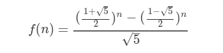

5. 矩阵乘法+矩阵快速幂，O(logN)

   其推导过程如图所示：

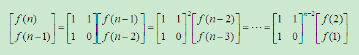

其中对于矩阵快速幂的求解，有两种方法：

- 递归(**二分法**)求矩阵快速幂

  如图所示：

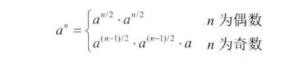

- 循环(**二进制法**)求矩阵快速幂

  如图所示,本来需要156次计算，现在只需要（二进制个数8×二进制中1的个数4=32次）计算,矩阵也是如此

  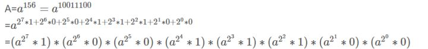

#### 递归+从下而上+矩阵乘方之递归 O(logN)

```java
package others;

/**
 *
 * @author humingk
 */
public class Fibonacci {
    /**
     * 递归
     *
     * @param n
     * @return
     */
    public int recursion(int n) {
        if (n == 0) {
            return 0;
        }
        if (n == 1) {
            return 1;
        }
        return recursion(n - 1) + recursion(n - 2);
    }

    /**
     * 向上调用（动态规划）
     *
     * @param n
     * @return
     */
    public int forUp(int n) {
        if (n == 0) {
            return 0;
        }
        if (n == 1) {
            return 1;
        }
        int FibOne=0;
        int FibTwo=1;
        int FibSum=0;
        for (int i = 2; i <=n ; i++) {
            FibSum=FibOne+FibTwo;
            FibOne=FibTwo;
            FibTwo=FibSum;
        }
        return FibSum;
    }

    /**
     *  递归解矩阵乘方
     *
     * @param n
     * @return
     */
    public int matrixPower(int n){
        if (n == 0) {
            return 0;
        }
        if (n == 1) {
            return 1;
        }
        return helpPower(n)[0];
    }

    /**
     * 递归解矩阵乘方,包含矩阵快速幂
     *
     * @param n
     * @return
     */
    public int[] helpPower(int n){
        if ((n-1)==1){
            return new int[]{1,1,1,0};
        }
        else if((n-1)==2){
            return power(new int[]{1,1,1,0},new int[]{1,1,1,0});
        }
        else if((n-1)%2==0){
            return power(helpPower(n/2+1),helpPower(n/2+1));
        }
        else{
            return power(helpPower(n-1),new int[]{1,1,1,0});
        }
    }

    /**
     * 矩阵乘法
     *
     * @param a
     * @param b
     * @return
     */
    public int[] power(int[] a,int[] b){
        return new int[]{a[0]*b[0]+a[1]*b[2],a[0]*b[1]+a[1]*b[3],a[2]*b[0]+a[3]*b[2],a[2]*b[1]+a[3]*b[3]};
    }

    public static void main(String[] args) {
        Fibonacci f=new Fibonacci();
        System.out.println("");
        for (int i = 0; i <100 ; i++) {
            System.out.println("一 -"+f.recursion(i));
            System.out.println("二 -"+f.forUp(i));
            System.out.println("三 -"+f.matrixPower(i));
        }
    }
}
```
#### 矩阵乘方之循环  O(logN)



```java
public class Solution {
    // 循环求矩阵乘方 O（logN）
    public int Fibonacci(int n) {
        if (n == 0) {
            return 0;
        } else if (n == 1 || n == 2) {
            return 1;
        }
        int[][] a = new int[][]{{1, 1}, {1, 0}};
        a = quickPower(a, n - 2);
        return a[0][0] + a[0][1];
    }

    /**
     * 矩阵乘法
     *
     * @param a
     * @param b
     * @return
     */
    public int[][] multi(int[][] a, int[][] b) {
        if (a[0].length != b.length) {
            return null;
        }
        int length = b.length;
        int[][] result = new int[length][length];
        // result的行
        for (int i = 0; i < length; i++) {
            // result的列
            for (int j = 0; j < length; j++) {
                // a行元素×b列元素
                for (int k = 0; k < length; k++) {
                    result[i][j] += a[i][k] * b[k][j];
                }
            }
        }
        return result;
    }

    /**
     * 矩阵快速幂
     *
     * @param a
     * @param n
     * @return
     */
    public int[][] quickPower(int[][] a, int n) {
        if (n == 1) {
            return a;
        }
        int[][] result = new int[a.length][a.length];
        // 初始化result为单位矩阵
        for (int i = 0; i < result.length; i++) {
            result[i][i] = 1;
        }
        // 暂存矩阵的平方
        int[][] now = a;
        // n的二进制位数遍历
        for (int i = n; i != 0; i >>= 1) {
            // 当前二进制位为1
            if ((i & 1) == 1) {
                result = multi(result, now);
            }
            // 每一位都要暂存矩阵的平方，相当于a的2,4,8...次方，即a^2^n
            now = multi(now, now);
        }
        return result;
    }

    public static void main(String[] args) {
        System.out.println(new Solution().Fibonacci(1));
        System.out.println(new Solution().Fibonacci(2));
        System.out.println(new Solution().Fibonacci(3));
        System.out.println(new Solution().Fibonacci(4));
        System.out.println(new Solution().Fibonacci(5));
        System.out.println(new Solution().Fibonacci(6));
        System.out.println(new Solution().Fibonacci(7));
        System.out.println(new Solution().Fibonacci(8));
        System.out.println(new Solution().Fibonacci(9));
        System.out.println(new Solution().Fibonacci(10));
    }
}
```



---

###  三、减绳子

给一根长度为n的绳子，请把绳子剪成m段（m , n ）都是正整数，（n>1&m>1）

每段绳子的长度为k[0],k[1],k[2],...,k[m]。请问k[0]*k[1]*k[2]*...*k[m]的最大值。

例如绳子是长度为8，我们把它剪成的长度分别为2,3,3的三段，此时得到的最大的乘积是18。

#### 解决方法

1. 动态规划算法

   将对大问题求最优解转化为对小问题求最优解

2. 贪婪算法

   首先，当n>1的时候，n都可以由任意个2和任意个3的和组成
   
   当 n>=5时，有：3(n-3) >= 2(n-2) >= n
   
   也就是说，将绳子剪成3和n-3的乘积比剪成2和n-2大的多，所以应该尽量剪成3和n-3(贪心算法)
   
   

#### 解法+测试

```java
    // ------------------------------------------------------------------------------------------
    // start
    // 1.测试用例方法

    public void test() {
        System.out.println("动态规划-贪婪");
        for (int i = 0; i < 100; i++) {
            System.out.println("长度为"+i+":");
            System.out.println(solutionDynamic(i) + " - " + solutionGreedy(i));
        }
    }

    // 2.算法题方法

    /**
     * 动态规划
     *
     * @return
     */
    public long solutionDynamic(int length) {
        if (length <= 1) {
            return 0;
        } else if (length == 2) {
            return 1;
        } else if (length == 3) {
            return 2;
        }

        long[] f = new long[length + 1];
        f[0] = 0;
        f[1] = 1;
        f[2] = 2;
        f[3] = 3;

        long max = 0;
        for (int i = 4; i <= length; i++) {
            max = 0;
            for (int j = 1; j <= i / 2; j++) {
                // 总长度为i 第一段为j，第二段为i-j
                long temp = f[j] * f[i - j];
                if (max < temp) {
                    max = temp;
                }
            }
            f[i]=max;
        }
        return max;
    }

    /**
     * 贪婪算法
     *
     * @return
     */
    public long solutionGreedy(int length) {
        if (length <= 1) {
            return 0;
        } else if (length == 2) {
            return 1;
        } else if (length == 3) {
            return 2;
        }

        // 剪成长度为3的个数
        int countOf3=length/3;
        // 剪成长度为2的个数
        int countOf2=0;

        // 如果剩下的长度为1，则将最后的长度4剪成两个长度为2
        if(length-countOf3*3==1){
            countOf3--;
            countOf2=2;
        }
        // 剩下的长度为2
        else if(length-countOf3*3==2){
            countOf2=1;
        }
        return (long)(pow(3,countOf3)*(long)pow(2,countOf2));
    }
    // end
    // ------------------------------------------------------------------------------------------
```

---

### 四、二进制中1的个数

[OJ](https://www.nowcoder.com/practice/8ee967e43c2c4ec193b040ea7fbb10b8?tpId=13&tqId=11164&tPage=1&rp=1&ru=%2Fta%2Fcoding-interviews&qru=%2Fta%2Fcoding-interviews%2Fquestion-ranking)

输入一个整数，输出该数二进制表示中1的个数。其中负数用补码表示。

#### 解法12+解法3+测试 将数右移比较 / 将1左移比较 / 先减1再与

1. 如果仅为正数，将二进制数依次右移>>，并与1做与运算&（对负数右移，左边会设为1，会陷入死循环）

2. 如果包含负数，将1依次左移<<，并与二进制数做与运算

3. n=(n-1)&n

   首先，将二进制数减一，然后，再与原二进制数做与运算

   比如 10100

   减一：10011，相与：10100&10011=10000

   减一导致的后面的0变为1，也会因为相与而消去

```java
    // ------------------------------------------------------------------------------------------
    // start
    // 1.测试用例方法

    public void test() {
        for (int i = -256; i < 257; i++) {
            System.out.println(i+" => "+solution1(i)+" - "+solution2(i));
        }
    }

    // 2.算法题方法

    public int solution1(int n) {
        int count=0;
        int flag=1;
        // int 有32位，故循环32次
        while(flag!=0){
            if((n & flag)!=0){
                count++;
            }
            flag=flag<<1;

        }
        return count;

    }
    public int solution2(int n) {
        int count=0;
        while (n!=0){
            count++;
            n=(n-1)&n;
        }
        return count;
    }
    // end
    // ------------------------------------------------------------------------------------------
```

#### 解法4 MIT HAKMEM算法

```java
public class Solution {
    public int NumberOf1(int n) {
        n = n - (((n >>> 1) & 0xdb6db6db) + ((n >>> 2) & 0x49249249));
        n = (n + (n >>> 3)) & 0xc71c71c7;
        return n < 0 ? ((n >>> 30) + ((n << 2) >>> 2) % 63) : n % 63;
    }
}
```

#### 解法5 Hamming Weight算法

```java
public class Solution {
    public int NumberOf1(int n) {
        n = n - ((n >>> 1) & 0x55555555);
        n = (n & 0x33333333) + ((n >>> 2) & 0x33333333);
        n = (n + (n >>> 4)) & 0x0F0F0F0F;
        return (n * 0x01010101) >>> 24;
    }
}
```


---

### 五、double数值的int次方

#### 解决方法

1. 指数分条件讨论，递归
   - 当指数为负，求其倒数
   - 递归求次方
2. 循环求次方
   - 若exp为1，则:
     - 循环1：奇数1=> result=base^1, base=base^2,exp=0
   - 若exp为3，则:
     - 循环1：奇数3=> result=base^1, base=base^2,exp=1
     - 循环2: 奇数1=> result=base^3,base=base^3,exp=0
   - 若exp为5，则:
     - 循环1：奇数5=> result=base^1, base=base^2,exp=3
     - ...

#### 测试用例

- double 正数 0 负数
- int 正数 0 负数

#### 解法+测试

```java
    // ------------------------------------------------------------------------------------------
    // start
    // 1.测试用例方法

    public void test() {
        for (int i = -10; i <= 10; i++) {
            for (double j = -99.99; j <= 99.99; j += 11.11) {
                System.out.println(j + "^" + i + " => " + solution(j, i));
            }
        }
    }

    // 2.算法题方法

    /**
     * 若exp为1，则:循环1：奇数1=> result=base^1, base=base^2,exp=0
     * 若exp为3，则:循环1：奇数3=> result=base^1, base=base^2,exp=1;循环2: 奇数1=> result=base^3,base=base^3,exp=0
     * 若exp为5，则:循环1：奇数5=> result=base^1, base=base^2,exp=3...
     *
     * @param base
     * @param exponent
     * @return
     */
    public double solution(double base, int exponent) {
        int exp;
        if (exponent < 0) {
            exp = -exponent;
        } else {
            exp = exponent;
        }
        double result = 1.0;
        while (exp != 0) {
            // 若为奇数，即末尾为1，则1&1为1，不等于0
            if ((exp & 1) != 0) {
                result *= base;
            }
            base *= base;
            exp >>= 1;
        }
        // 是否求倒数
        return exponent < 0 ? 1.0 / result : result;
    }

    // end
    // ------------------------------------------------------------------------------------------
```

---

### 六、打印从1到最大的n位数

#### 解决方法

1. 高精度加法，再打印
2. 递归排列数字0-9

#### 解法+测试

```java
    // ------------------------------------------------------------------------------------------
    // start
    // 1.测试用例方法

    public void test() {
//        solution1(20);
        solution2(20);
    }

    // 2.算法题方法

    /**
     * 方法1：高精度++
     *
     * @param n
     */
    public void solution1(int n) {
        if (n <= 0) {
            return;
        }
        char[] s = new char[n];
        for (int i = 0; i < s.length - 2; i++) {
            // debug
            s[i] = '9';
        }
        s[s.length - 1] = '0';
        s[s.length - 2] = '0';
        while (!add(s)) {
            print(s);
        }
    }

    /**
     * 高精度++
     *
     * @param s
     * @return
     */
    private boolean add(char[] s) {
        // 是否进位
        boolean isOverflow = false;
        // 进位值
        int overflow = 0;
        for (int i = s.length - 1; i >= 0; i--) {
            // 当前位数值(加上进位值，默认为0)
            int now = s[i] - '0' + overflow;
            // 最末位++
            if (i == s.length - 1) {
                now++;
            }
            // 当前位没有产生进位
            if (now < 10) {
                s[i] = (char) ('0' + now);
                break;
            } else {
                // 最高位溢出
                if (i == 0) {
                    isOverflow = true;
                } else {
                    now -= 10;
                    overflow = 1;
                    s[i] = (char) ('0' + now);
                }
            }
        }
        return isOverflow;

    }

    /**
     * 方法2：数字递归排列
     *
     * @param n
     */
    public void solution2(int n) {
        if (n <= 0) {
            return;
        }
        char[] s = new char[n];
        for (int i = 0; i < s.length; i++) {
            // debug
            s[i] = '9';
        }

        // debug
        for (int i = 0; i < 10; i++) {
            s[i] = (char) (i + '0');
            recursion(s, 0);
        }
    }

    /**
     * 方法2用到的递归
     *
     * @param s
     * @param index
     */
    private void recursion(char[] s, int index) {
        if (index == s.length - 1) {
            print(s);
            return;
        }
        for (int i = 0; i < 10; i++) {
            s[index + 1] = (char) (i + '0');
            recursion(s, index + 1);
        }
    }
    
    /**
     * 打印
     *
     * @param s
     */
    private void print(char[] s) {
        boolean flag = true;
        for (int i = 0; i < s.length; i++) {
            if (flag && s[i] != '0') {
                flag = false;
            }
            if (!flag) {
                System.out.print(s[i]);
            }
        }
        System.out.println();
    }
    // end
    // ------------------------------------------------------------------------------------------
```

------

### 七、包含min的栈

#### 解决方法

- 建立一个辅助栈，专门存放最小值

#### 解法+测试

```java
    // ------------------------------------------------------------------------------------------
    // start
    // 1.测试用例方法

    public void test() {
        for (int i = 10; i < 20; i++) {
            push(i);
            print();
        }
        for (int i = 10; i < 15; i++) {
            pop();
            print();
        }
        for (int i = 5; i < 10; i++) {
            push(i);
            print();
        }
        for (int i = 0; i < data.size(); i++) {
            pop();
        }
    }

    private void print() {
        System.out.print("data: ");
        printStack(data);
        System.out.print("dataMin: ");
        printStack(dataMin);
        System.out.println("min: " + min());
        System.out.println("------------------------");
    }

    private void printStack(Stack<Integer> test) {
        int length = test.size();
        int[] temp = new int[length];
        for (int i = 0; i < length; i++) {
            temp[i] = test.pop();
        }
        for (int i = length - 1; i >= 0; i--) {
            test.push(temp[i]);
            if (temp[i] != 0) {
                System.out.print(temp[i] + " ");
            }
        }
        System.out.println();
    }

    // 2.算法题方法

    private Stack<Integer> data = new Stack<>();
    private Stack<Integer> dataMin = new Stack<>();

    public void push(int node) {
        data.push(node);
        if (dataMin.isEmpty() || node < dataMin.peek()) {
            dataMin.push(node);
        } else {
            dataMin.push(dataMin.peek());
        }
    }

    public void pop() {
        if (!data.isEmpty() && !dataMin.isEmpty()) {
            data.pop();
            dataMin.pop();
        }
    }

    public int top() {
        if (!data.isEmpty()) {
            return data.peek();
        } else {
            return -1;
        }
    }

    public int min() {
        if (!dataMin.isEmpty()) {
            return dataMin.peek();
        } else {
            return -1;
        }
    }

    // end
    // ------------------------------------------------------------------------------------------
```

#### 运行结果

```java
data: 10 
dataMin: 10 
min: 10
------------------------
data: 10 11 
dataMin: 10 10 
min: 10
------------------------
data: 10 11 12 
dataMin: 10 10 10 
min: 10
------------------------
data: 10 11 12 13 
dataMin: 10 10 10 10 
min: 10
------------------------
data: 10 11 12 13 14 
dataMin: 10 10 10 10 10 
min: 10
------------------------
data: 10 11 12 13 14 15 
dataMin: 10 10 10 10 10 10 
min: 10
------------------------
data: 10 11 12 13 14 15 16 
dataMin: 10 10 10 10 10 10 10 
min: 10
------------------------
data: 10 11 12 13 14 15 16 17 
dataMin: 10 10 10 10 10 10 10 10 
min: 10
------------------------
data: 10 11 12 13 14 15 16 17 18 
dataMin: 10 10 10 10 10 10 10 10 10 
min: 10
------------------------
data: 10 11 12 13 14 15 16 17 18 19 
dataMin: 10 10 10 10 10 10 10 10 10 10 
min: 10
------------------------
data: 10 11 12 13 14 15 16 17 18 
dataMin: 10 10 10 10 10 10 10 10 10 
min: 10
------------------------
data: 10 11 12 13 14 15 16 17 
dataMin: 10 10 10 10 10 10 10 10 
min: 10
------------------------
data: 10 11 12 13 14 15 16 
dataMin: 10 10 10 10 10 10 10 
min: 10
------------------------
data: 10 11 12 13 14 15 
dataMin: 10 10 10 10 10 10 
min: 10
------------------------
data: 10 11 12 13 14 
dataMin: 10 10 10 10 10 
min: 10
------------------------
data: 10 11 12 13 14 5 
dataMin: 10 10 10 10 10 5 
min: 5
------------------------
data: 10 11 12 13 14 5 6 
dataMin: 10 10 10 10 10 5 5 
min: 5
------------------------
data: 10 11 12 13 14 5 6 7 
dataMin: 10 10 10 10 10 5 5 5 
min: 5
------------------------
data: 10 11 12 13 14 5 6 7 8 
dataMin: 10 10 10 10 10 5 5 5 5 
min: 5
------------------------
data: 10 11 12 13 14 5 6 7 8 9 
dataMin: 10 10 10 10 10 5 5 5 5 5 
min: 5
------------------------
```


------


### 八、数字序列中某一位的数字

https://www.acwing.com/problem/content/description/52/


数字以0123456789101112131415…的格式序列化到一个字符序列中。

在这个序列中，第5位（从0开始计数）是5，第13位是1，第19位是4，等等。

请写一个函数求任意位对应的数字。

样例

```
输入：13

输出：1
```

#### 测试用例

- 0-9
- 10
- 190

#### 解法1 循环叠加位数

循环每一个数字，叠加每一个数字的位数

------

#### 解法2 按位数分情况叠加

- 0：

- 1～9：

  共9个数字，每数字占1位,共(10-1)*1=9位

- 10~99：

  共100个数字，每数字占2位，共(100-10)*2=180位

- 100～999：

  共1000个数字，每数字占3位，共(1000-100)*3=2700位

eg:

5253,在1000~9999中,前面已叠加 1+9+180+2700 =2890位，从1000开始第 5253-2890 =2363 位

第2363位所在数字为 1000+2363/4=1590 ,其中,第2363位在数字 1590 的第 4-2363%4-1=0位，即0


```java
class Solution {
    public int digitAtIndex(int n) {
        if (n < 10) {
            return n;
        }
        int i = 1;
        // 保存n-之前位数
        int k = n;
        // 用于判断是否过界
        int t = k - 10;
        while (t >= 0) {
            i++;
            k = t;
            // i位数包含的所有位数
            t -= (Math.pow(10, i) - Math.pow(10, i - 1)) * i;
        }
        // 当前位数所在数字
        int num = (int) (Math.pow(10, i - 1) + k / i);
        // 当前数字中第几位（个 十 百...）
        int InNum = i - k % i - 1;
        // 个
        if (InNum == 0) {
            return num % 10;
        } 
        // 十、百...
        else {
            return (int) ((num / (Math.pow(10, InNum))) % 10);
        }
    }

    public static void main(String[] args) {
        for (int i = 0; i < 20; i++) {
            System.out.println(new Solution().digitAtIndex(i));
        }
        for (int i = 170; i < 200; i++) {
            System.out.println(new Solution().digitAtIndex(i));
        }
    }
}
```

------

### 九、丑数

把只包含质因子2、3和5的数称作丑数（Ugly Number）。例如6、8都是丑数，但14不是，因为它包含质因子7。 习惯上我们把1当做是第一个丑数。求按从小到大的顺序的第N个丑数。


#### 解法1 循环数，判断数是否是丑数

对于一个数，循环判断，如果能被2,3,5中的一个数整除就整除，最终结果为1说明是丑数

计算量大，会超时

------

#### 解法2 动态规划

用数组保存排序好从小到大的丑数

每次都从×2，×3，×5中选取最小的作为下一个丑数

用T保存当前X的位置

```java
public class Solution {
    public int GetUglyNumber_Solution(int index) {
        if(index<=0){
            return 0;
        }
        int[] uglyList=new int[index];
        uglyList[0]=1;
        // 当前已有丑数最大值
        int max=1;
        // 乘以2,3,5得到的最小丑数
        int min2=2,min3=3,min5=5;
        // 在t之前的数，乘以2,3,5都会小于max;在t之后的数，乘以2,3,5都会大于max
        int t2=1,t3=1,t5=1;
        for(int i=1;i<index;i++){
            uglyList[i]=Math.min(Math.min(min2,min3),min5);
            // 计算大于max的min2，min3,min5
            max=uglyList[i];
            while(min2<=max){
                min2=uglyList[t2++]*2;
            }
            while(min3<=max){
                min3=uglyList[t3++]*3;
            }
            while(min5<=max){
                min5=uglyList[t5++]*5;
            }
        }
        return uglyList[index-1];
    }

    public static void main(String[] args) {
        System.out.println(new Solution().GetUglyNumber_Solution(5));
    }
}
```

------

### 十、计算1+2+3+...+n

求1+2+3+...+n，要求不能使用乘除法、for、while、if、else、switch、case等关键字及条件判断语句（A?B:C）。


#### 解法1 逻辑与的短路特性+递归 o(n)

boolean flag=A && B

B调用递归函数

- 如果A为true，则执行B
- 如果A为False，则不执行B

这里B中的>0可任意

```java
public class Solution {
    public int Sum_Solution(int n) {
        boolean flag = (n > 0) && ((n += Sum_Solution(n - 1)) > 0);
        return n;
    }
}
```

------

#### 解法2 异常退出+递归 O(n)

递归结束的条件为：

n=0,此时1/n会异常退出，返回0

```java
public class Solution {
    public int Sum_Solution(int n) {
        try {
            int flag = 1 / n;
            n += Sum_Solution(n - 1);
            return n;
        } catch (Exception e) {
            return 0;
        }
    }
}
```

------

#### 解法3 位运算乘法 O(logN)

利用递增数列公式：S(n)=n*(n+1)/2

其中的乘法，利用位运算

例如a\*b 可以拆解为:

- a为奇数：(a-1)\*b +b 
- a为偶数：(a/2)\*(b\*2)

直到a为0

eg: 

5\*6 = 4\*6+6 = 2\*12+6 = 1\*24+6 =0\*24+24+6=30

```java
public class Solution {
    public int Sum_Solution(int n) {
        // n*(n+1)/2
        return multi(n, n + 1) >> 1;
    }

    // a*b
    public int multi(int a, int b) {
        int result = 0;
        // a为奇数（仅一次） a*b = (a-1)*b +b 
        if((a&1)==1){
            result+=b;
        }
        a >>= 1;
        b <<= 1;
        // 若a不为0，此处a肯定为偶数，继续拆分
        // a*b = (a/2)*(b*2)
        if(a!=0){
            result += multi(a, b);
        }
        return result;
    }
}
```

------

### 十一、整数反转

[OJ](https://leetcode-cn.com/problems/reverse-integer)

给出一个 32 位的有符号整数，你需要将这个整数中每位上的数字进行反转。

示例 1:

输入: 123
输出: 321
 示例 2:

输入: -123
输出: -321
示例 3:

输入: 120
输出: 21
注意:

假设我们的环境只能存储得下 32 位的有符号整数，则其数值范围为 [−231,  231 − 1]。请根据这个假设，如果反转后整数溢出那么就返回 0。


#### 解法1 循环

```java
class Solution {
    public int reverse(int x) {
        int result = 0;
        while (x != 0) {
            // 判断下一步操作是否溢出
            // -2^31=-2147483648,2^31-1=2147483647
            // 没必要判断最后一位是否是小于-8或者大于7，因为参数中int的最大值附近值中第一位只能为1或2
            if (Math.abs(result) > Integer.MAX_VALUE / 10) {
                return 0;
            }
            result *= 10;
            result += x % 10;
            x /= 10;
        }
        return result;
    }
}
```

------


### 十二、不用加减乘除做加法

[OJ](https://www.nowcoder.com/practice/59ac416b4b944300b617d4f7f111b215?tpId=13&tqId=11201&tPage=3&rp=1&ru=%2Fta%2Fcoding-interviews&qru=%2Fta%2Fcoding-interviews%2Fquestion-ranking)

写一个函数，求两个整数之和，要求在函数体内不得使用+、-、*、/四则运算符号

#### 解法1 计算机的加法器原理

对于十进制，比如372+948不考虑进位相加得210，进位值分别为10,100,1000，加起来共1320

对于二进制：

- 不考虑进位相加：位的异或操作

  对每一位进行相加，0+0=0，1+1=0，0+1=1，1+0=1，和位的异或操作一样

- 进位：位相与再左移一位

  只有1+1会产生一个进位，可以转换为相与（都为1）后左移（进一位）

如果当前两数进位为0，即没有再同时出现两个1，即不需要进位

eg：5+7=12，即101+111=1100


第一步，101+111=010+1010

相加：101^111=010

进位：(101&111)<<1=1010

此时，num1=相加值=010，num2=进位值=1010


第二步，010+1010=1000+0100

相加：010^1010=1000

进位：(010&1010)<<1=0100

此时，num1=相加值=1000，num2=进位值=0100


第三步，1000+0100=1100+0000

相加：1000^0100=1100

进位：(1000&0100)<<1=0000

此时，num1=相加值=1100，num2=进位值=0000


递归：

```java
public class Solution {
    public int Add(int num1,int num2) {
        if(num2==0){
            return num1;
        }
        // 位异或，相同为0，不同为1，即不考虑进位的加法
        int sum=num1^num2;
        // 相与再左移，即求上一步不考虑进位的加法的进位值
        int carry=(num1&num2)<<1;
        return Add(sum,carry);
    }
}
```

循环：

```java
public class Solution {
    public int Add(int num1,int num2) {
        // 进位值不为0
        while(num2!=0){
            // 位异或，相同为0，不同为1，即不考虑进位的加法
            int sum=num1^num2;
            // 相与再左移，即求上一步不考虑进位的加法的进位值
            num2=(num1&num2)<<1;
            num1=sum;
        }
        return num1;
    }
}
```


### 十三、电话号码的字母组合

[OJ](https://leetcode-cn.com/problems/letter-combinations-of-a-phone-number/)

给定一个仅包含数字 2-9 的字符串，返回所有它能表示的字母组合。

给出数字到字母的映射如下（与电话按键相同）。注意 1 不对应任何字母。


示例:

输入："23"
输出：["ad", "ae", "af", "bd", "be", "bf", "cd", "ce", "cf"].
说明:
尽管上面的答案是按字典序排列的，但是你可以任意选择答案输出的顺序


#### 解法1 递归

```java
import java.util.*;

class Solution {
    HashMap<String, String> phone = new HashMap<String, String>() {{
        put("2", "abc");
        put("3", "def");
        put("4", "ghi");
        put("5", "jkl");
        put("6", "mno");
        put("7", "pqrs");
        put("8", "tuv");
        put("9", "wxyz");
    }};
    List<String> list = new ArrayList<>();

    public List<String> letterCombinations(String digits) {
        if (!"".equals(digits.trim())) {
            recursion("", digits);
        }
        return list;
    }

    public void recursion(String combination, String digits) {
        if ("".equals(digits)) {
            list.add(combination);
        } else {
            String str = phone.get(digits.substring(0, 1));
            for (int i = 0; i < str.length(); i++) {
                recursion(combination + str.charAt(i), digits.substring(1));
            }
        }
    }

    public static void main(String[] args) {
        List<String> result = new Solution().letterCombinations("23");
        for (int i = 0; i < result.size(); i++) {
            System.out.println(result.get(i));
        }
    }
}
```

------


## 动态规划类型

### 1. 贪心算法型

#### 动态规划算法与贪婪算法的区别

贪心算法是一种特殊的动态规划算法

对于一个动态规划问题，问题的最优解往往包含**重复**的子问题的最优解，动态规划就是为了消除重复的子问题

而贪婪算法由于每一次都**贪心**选取一个子问题，所以不会重复计算子问题的最优解

- [贪心算法型](https://humingk.github.io/algorithms-dynamic_programming/#1-%E8%B4%AA%E5%BF%83%E7%AE%97%E6%B3%95%E5%9E%8B)
  - [减绳子](https://humingk.github.io/algorithms-program_others/#三减绳子)  f(n)=Max(n的左边长度，n的右边长度)
  - [最长上升子序列](https://humingk.github.io/algorithms-dynamic_programming/#一最长上升子序列) f(n)=Max(不同上升子序列长度)
  - [课程表](https://humingk.github.io/algorithms-program_graph/#二课程表) 拓扑排序 f(n)=(选取邻接节点中最先没有前驱节点的节点)

---

### 2. 递推/划分型

比如在知道第i-1项的前提下，计算第i项

从前往后，依次递归，比如斐波那契的f(n)=f(n-1)+f(n-2)

利用循环依次计算并存入辅助空间，有时候只需要存储计算当前元素需要的历史元素,比如斐波那契

还有典型类型是求不同划分情况的最大值

- [递推/划分型](https://humingk.github.io/algorithms-dynamic_programming/#2-%E9%80%92%E6%8E%A8%E5%88%92%E5%88%86%E5%9E%8B)
  - [斐波那契数列](https://humingk.github.io/algorithms-program_others/#%E4%BA%8C%E6%96%90%E6%B3%A2%E9%82%A3%E5%A5%91%E6%95%B0%E5%88%97)  f(n)=f(n-1)+f(n-2)
  - [丑数](https://humingk.github.io/algorithms-program_others/#九丑数)  f(n)=Min(当前丑数x2,当前丑数x3,当前丑数x5)
  - [最长不含重复字符的子字符串](https://humingk.github.io/algorithms-program_array/#十六最长不含重复字符的子字符串) f(n)=Max(不同子字符串长度)
  - [把数字翻译成字符串](https://humingk.github.io/algorithms-program_string/#五把数字翻译成字符串) f(n)=[f(n+1),f(n+1)+f(n+2)]
  - [打家劫舍](https://humingk.github.io/algorithms-dynamic_programming/#%E4%B9%9D%E6%89%93%E5%AE%B6%E5%8A%AB%E8%88%8D) f(n)=max(f(n-1),f(n)+f(n-2))
  - [减绳子](https://humingk.github.io/algorithms-program_others/#三减绳子)  f(n)=Max(n的左边长度，n的右边长度)
  - [骰子的点数](https://humingk.github.io/algorithms-program_array/#二十六骰子的点数)  f(n,s)=f(n-1,s-1)+f(n-1,s-2)+...+f(n-1,s-6)
  - [圆圈中最后剩下的数](https://humingk.github.io/algorithms-program_list/#九圆圈中最后剩下的数)  f(n,m)=[0,(f(n-1,m)+m)%n]

---

### 3. 序列/划分型

主要针对序列/双序列的各种求解，包括不同划分情况

- [序列/划分型](https://humingk.github.io/algorithms-dynamic_programming/#3-%E5%BA%8F%E5%88%97%E5%88%92%E5%88%86%E5%9E%8B)
  - [最长上升子序列(LIS)](https://humingk.github.io/algorithms-dynamic_programming/#一最长上升子序列lis) f(n)=Max(不同上升子序列长度)
  - [最长公共子序列(LCS)](https://humingk.github.io/algorithms-dynamic_programming/#十一最长公共子序列lcs) f(n,m)=[f(n-1,m-1)+1,max(f(n-1,m),f(n,m-1))]
  - [最长公共子串(LSS)](https://humingk.github.io/algorithms-dynamic_programming/#十二最长公共子串lss)  f(n,m)=[f(n-1,m-1)+1,0]
  - [最长连续序列](https://humingk.github.io/algorithms-dynamic_programming/#二最长连续序列) f(n)=Max(子连续序列的长度)
  - [正则表达式匹配](https://humingk.github.io/algorithms-program_string/#二正则表达式匹配) dp[i]\[j\]={dp[i+1]\[j\],dp[i]\[j+2\],dp[i+1]\[j+1\]}

---

### 4. 区间/矩阵型

区间模型的状态表示一般为d(i,j)，表示区间[i, j]上的最优解，然后通过状态转移方程计算出[i+1, j]或者[i, j+1]上的最优解，逐步扩大区间的范围，最终求得[1, len]的最优解

主要以矩阵的形式给出

- [区间/矩阵型](https://humingk.github.io/algorithms-dynamic_programming/#4-%E5%8C%BA%E9%97%B4%E7%9F%A9%E9%98%B5%E5%9E%8B)
  - [礼物的最大价值](https://humingk.github.io/algorithms-program_array/#十五礼物的最大价值) f(n)=Max(f(n)+left,f(n)+up)
  - [连续子数组的最大和](https://humingk.github.io/algorithms-program_array/#十一连续子数组的最大和) f(n)=Max(子连续序列的和)
  - [机器人运动范围](https://humingk.github.io/algorithms-program_array/#六-机器人运动范围) f(n)=(1+左+右+上+下)
  - [完全平方数](https://humingk.github.io/algorithms-dynamic_programming/#%E5%8D%81%E5%AE%8C%E5%85%A8%E5%B9%B3%E6%96%B9%E6%95%B0) dp[i+j\*j]=Min(dp[i]+1,dp[i+j\*j])

---

### 5. 背包型

[背包问题九讲](https://www.kancloud.cn/kancloud/pack/70124)比较系统的讲解了不同类型的背包问题，包括解题思路

- [背包型](https://humingk.github.io/algorithms-dynamic_programming/#5-%E8%83%8C%E5%8C%85%E5%9E%8B)
  - 01背包问题
  - 分割等和子集-01背包
  - 一和零-01背包
  - 零钱兑换-完全背包
  - 目标和-背包

---
### 7. 其他类型

- [其他类型](https://humingk.github.io/algorithms-dynamic_programming/#7-%E5%85%B6%E4%BB%96%E7%B1%BB%E5%9E%8B)
  - 最长回文子串

### 基础数据结构算法

---


## 动态规划经典题型

### 一、最长上升子序列(LIS)

OJ:

[https://leetcode-cn.com/problems/longest-increasing-subsequence/](https://leetcode-cn.com/problems/longest-increasing-subsequence/)

给定一个无序的整数数组，找到其中最长上升子序列的长度。

示例:

输入: [10,9,2,5,3,7,101,18]
输出: 4 
解释: 最长的上升子序列是 [2,3,7,101]，它的长度是 4。
说明:

可能会有多种最长上升子序列的组合，你只需要输出对应的长度即可。
你算法的时间复杂度应该为 O(n2) 。
进阶: 

你能将算法的时间复杂度降低到 O(n log n) 吗?

#### 解法1 动态规划 O(n^2)+O(n)

辅助数组dp[]表示以以当前元素结尾的最长上升子序列长度

遍历每一个元素，都与前面的每一个元素对比，得出当前元素dp值的最大值

最后取dp[]最大值

```java
class Solution {
    public int lengthOfLIS(int[] nums) {
        if(nums==null||nums.length==0){
            return 0;
        }
        // 以当前元素结尾的最长上升子序列长度
        int []dp=new int[nums.length];
        for(int i=0;i<dp.length;i++){
            dp[i]=1;
        }
        // 状态转移
        for(int i=1;i<nums.length;i++){
            for(int j=0;j<i;j++){
                if(nums[i]>nums[j]){
                    dp[i]=Math.max(dp[i],1+dp[j]);
                }
            }
        }
        // 最长上升子序列的最大值
        int max=1;
        for(int i=0;i<dp.length;i++){
            max=Math.max(max,dp[i]);
        }
        return max;
    }
}
```

------

#### 解法2 贪心算法 O(NlogN)+O(N)

辅助数组greed表示遍历过程中当前最长上升子序列

每次遍历，考虑保持greed中的序列中值都为最小值，因为序列前面的值越小，序列后面能容纳的值就越多，序列就更可能更长(**贪婪算法**)

要想找到greed中应该更新为更小的值的位置，因为greed有序，故可以采用二分查找 O(logN)

```java
class Solution {
    public int lengthOfLIS(int[] nums) {
        if (nums == null || nums.length == 0) {
            return 0;
        } else if (nums.length == 1) {
            return 1;
        }
        // 当前的最长上升子序列
        int[] greed = new int[nums.length];
        greed[0] = nums[0];
        // greed数组下标
        int j = 0;
        int left = 0, right = j + 1, middle = 0;
        for (int i = 1; i < nums.length; i++) {
            // greed有序，二分查找O(logN)
            left = 0;
            right = j + 1;
            while (left < right) {
                middle = (left + right) >> 1;
                // 右边找
                if (greed[middle] < nums[i]) {
                    left = middle + 1;
                }
                // 左边找
                else {
                    right = middle;
                }
            }
            // 此时greed中的left元素肯定大于当前nums元素，left左边为边界或者小于当前nums元素
            greed[left] = nums[i];
            // greed添加元素
            if (left == j + 1) {
                j++;
            }
        }
        return j + 1;
    }
}
```

------


### 二、最长连续序列

OJ：

[https://leetcode-cn.com/problems/longest-consecutive-sequence/](https://leetcode-cn.com/problems/longest-consecutive-sequence/)

给定一个未排序的整数数组，找出最长连续序列的长度。

要求算法的时间复杂度为 O(n)。

示例:

输入: [100, 4, 200, 1, 3, 2]
输出: 4
解释: 最长连续序列是 [1, 2, 3, 4]。它的长度为 4。


#### 解法1 动态规划(HashSet) O(n)+O(n)

HashSet的存取都是O(1)

将序列存储为hashset，遍历序列，如果当前元素i的前一个元素i-1不存在（通过hashset判断），则从当前元素开始为一个连续序列，i+1,i+2...直到该连续序列末尾

取所有连续序列长度的最大值

```java
import java.util.HashSet;
class Solution {
    public int longestConsecutive(int[] nums) {
        if(nums==null||nums.length==0){
            return 0;
        }
        HashSet<Integer> hashset=new HashSet<>();
        for(int num:nums){
            hashset.add(num);
        }
        // 当前连续序列长度
        int now=0;
        // 所有连续序列长度最大值
        int max=0;
        for(int num:nums){
            // 当前元素的上一个元素不存在
            // 当前元素为该连续序列起始值
            if(!hashset.contains(num-1)){
                now=1;
                while(hashset.contains(++num)){
                    now++;
                }
                // 更新max
                if(max<now){
                    max=now;
                }
            }
        }
        return max;
    }
}
```

------

#### 解法2 动态规划(HashSet) O(n)

HashMap的存取都是O(1)

HashMap中key表示序列中某个元素，value序列中某个元素所在的子连续序列的长度

遍历序列，当前元素i若存在前一个元素i-1或后一个元素i+1,则拼接两个元素所在子连续序列，更新value

取hashmap中value的最大值

------

### 三、01背包

有N件物品和一个容量为V的背包。第i件物品的费用是c[i]，价值是w[i]。求解将哪些物品装入背包可使价值总和最大（恰好装满）。

#### 解法 动态规划  dp\[i\]\[j\] = max{dp\[i-1\]\[j\],dp\[i-1\]\[j-weight\[i\]\]+worth\[i\]}

用dp\[i\]\[j\]表示前i(i<=N)件物品放入一个容量为j(j<=total)的包中，可以获得的最大价值

此时01背包分两种情况:

- 如果第i件物品不放入背包，则表示前i-1件物品放入容量为 total 背包，即：

  dp\[i][j]=dp\[i-1\]\[j\]

- 如果第i件物品放入背包，则表示前i-1件物品放入容量为 j-weight[i] 背包，再放入第i件物品,即：

  dp\[i\]\[j\]=dp\[i-1\]\[j-weight\[i\]\]+worth\[i\] 


状态转移方程为：

 dp\[i\]\[j\] = max{dp\[i-1\]\[j\],dp\[i-1\]\[j-weight\[i\]\]+worth\[i\]}


```java
/**
 * @author humingk
 */
public class test {
    public static void main(String[] args) {
        // 背包的最大承受重量->容量
        int total = 100;
        // 共有N件物品
        int N = 6;
        // 第i件物品的重量
        int[] weight = new int[]{0, 10, 20, 30, 40, 10, 50};
        // 第i件物品的价值
        int[] worth = new int[]{0, 200, 400, 500, 100, 300, 600};


        /**
         * dp[i][j]表示前i(i<=N)件物品放入一个容量为j(j<=total)的包中，可以获得的最大价值
         *
         * 此时01背包分两种情况：
         *  1. 如果第i件物品不放入背包，则表示前i-1件物品放入容量为 total 背包，即：
         *      dp[i][j]=dp[i-1][j]
         *  2. 如果第i件物品放入背包，则表示前i-1件物品放入容量为 total-weight[i] 背包，再放入第i件物品,即：
         *      dp[i][j]=dp[i-1][total-weight[i]]+worth[i]
         *
         * 即：
         *  dp[i][j] = max{dp[i-1][j],dp[i-1][total-weight[i]]+worth[i]}
         *
         */
        int[][] dp = new int[N ][total + 1];
        // 初始化
        for (int j = 0; j < total + 1; j++) {
            dp[0][j] = Integer.MIN_VALUE;
        }

        // 二维数组 01背包
        for (int i = 1; i < N + 1; i++) {
            for (int j = 1; j < total + 1; j++) {
                dp[i][j] = Math.max(dp[i - 1][j], dp[i - 1][j - weight[i]] + worth[i]);
            }
        }
    }
}
```

### 四、分割等和子集01背包

OJ：

[https://leetcode-cn.com/problems/partition-equal-subset-sum/](https://leetcode-cn.com/problems/partition-equal-subset-sum/)

给定一个只包含正整数的非空数组。是否可以将这个数组分割成两个子集，使得两个子集的元素和相等。

注意:

每个数组中的元素不会超过 100
数组的大小不会超过 200
示例 1:

输入: [1, 5, 11, 5]

输出: true

解释: 数组可以分割成 [1, 5, 5] 和 [11].


示例 2:

输入: [1, 2, 3, 5]

输出: false

解释: 数组不能分割成两个元素和相等的子集.


#### 解法1 动态规划 dp\[i\]\[j\]=dp\[i-1\]\[j\] or dp\[i-1\]\[j-num\[i\]\] (j>=num\[i\])

```java
class Solution {
    public boolean canPartition(int[] nums) {
        int sum = 0;
        for (int i = 0; i < nums.length; i++) {
            sum += nums[i];
        }
        // 和为奇数不可取
        if (sum % 2 == 1) {
            return false;
        }
        int target = sum / 2;
        /*
        dp[i][j]表示从第0~i之间的数选取出来的数的和为j，如果选到i则为true，没选到则为false
        两种情况：
            如果不选择i,则表示第0 ~ i-1之间选到的数的和为j
            如果选择i，则表示第0 ～ i-1之间选到的数的和为j-num[i],并且此处j>=num[i]

        dp[i][j]=dp[i-1][j] or dp[i-1][j-num[i]] (j>=num[i])
         */
        boolean[][] dp = new boolean[nums.length][target + 1];
        for (int i = 1; i < target + 1; i++) {
            if (nums[0] == i) {
                dp[0][i] = true;
            }
        }
        for (int i = 1; i < nums.length; i++) {
            for (int j = 0; j < target + 1; j++) {
                dp[i][j] = dp[i - 1][j];
                if (j >= nums[i]) {
                    dp[i][j] = dp[i - 1][j] || dp[i - 1][j - nums[i]];
                }
            }
        }
        return dp[nums.length - 1][target];
    }

    public static void main(String[] args) {
        new Solution().canPartition(new int[]{1, 2});
    }
}
```


------


### 四、分割子集和最小差01背包

分割一个数组为两个数组，使得两个数组的和的差的绝对值最小


#### 解法 动态规划 

dp\[i\]\[j\]=max{dp\[i-1\]\[j\],dp\[i-1\]\[j-array\[i-1\]\]+array\[i-1\]}

return sum - dp\[array.length\]\[sum/2\]*2

```java

/**
 * @author humingk
 */
public class Main {

    public static int solution(int[] array) {
        int sum = 0;
        for (int i = 0; i < array.length; i++) {
            sum += array[i];
        }
        int[][] dp = new int[array.length + 1][sum / 2 + 1];
        for (int i = 1; i <= array.length; i++) {
            for (int j = 1; j <= sum / 2; j++) {
                if (j >= array[i - 1]) {
                    dp[i][j] = Math.max(dp[i - 1][j], dp[i - 1][j - array[i - 1]] + array[i - 1]);
                } else {
                    dp[i][j] = dp[i - 1][j];
                }
            }
        }
        return sum - dp[array.length][sum / 2] * 2;
    }

    public static void main(String[] args) {
        // 2+5+6=13 4+9=13 => 0
        System.out.println(solution(new int[]{2, 4, 5, 6, 9}));
        // 1+0+1+2+4=8 7=7  => 1
        System.out.println(solution(new int[]{1, 0, 1, 7, 2, 4}));
        // 8+2=10 5+4=9 => 1
        System.out.println(solution(new int[]{5, 4, 8, 2}));

    }
}

```


### 五、一和零-01背包

OJ：

[https://leetcode-cn.com/problems/ones-and-zeroes/](https://leetcode-cn.com/problems/ones-and-zeroes/)


#### 解法1

```java

```

------

#### 解法2

```java

```

------

#### 解法3

```java

```

------


### 六、零钱兑换-完全背包

OJ：

[https://leetcode-cn.com/problems/coin-change/](https://leetcode-cn.com/problems/coin-change/)


#### 解法1

```java

```

------

#### 解法2

```java

```

------

#### 解法3

```java

```

------


### 七、目标和-背包

OJ：

[https://leetcode-cn.com/problems/target-sum/](https://leetcode-cn.com/problems/target-sum/)


#### 解法1

```java

```

------

#### 解法2

```java

```

------

#### 解法3

```java

```

------


### 八、最长回文子串

[OJ](https://leetcode-cn.com/problems/longest-palindromic-substring)

给定一个字符串 s，找到 s 中最长的回文子串。你可以假设 s 的最大长度为 1000。

示例 1：

输入: "babad"
输出: "bab"
注意: "aba" 也是一个有效答案。
示例 2：

输入: "cbbd"
输出: "bb"


#### 解法1 动态规划 dp\[i\]\[j\]=dp\[i+1\]\[j-1\] && s\[i\]==s\[j\]

比如babab是否为回文串,取决于aba是否为回文串以及第一个字符b与最后一个字符b是否相等

```java
class Solution {
    public String longestPalindrome(String s) {
        int l = s.length();
        if (l < 2) {
            return s;
        }
        int start = 0, end = -1;
        // dp[i][j] 表示 s的第i-j子字符串 是否为回文串
        boolean[][] dp = new boolean[l][l];
        for (int i = l - 1; i >= 0; i--) {
            for (int j = i; j < l; j++) {
                // 一个字符 || 两个字符相等 || 三个及以上字符 dp[i][j]=dp[i+1][j-1] && s[i]==s[j]
                if (i == j || ((dp[i + 1][j - 1] || i + 1 == j) && s.charAt(i) == s.charAt(j))) {
                    dp[i][j] = true;
                    if (j - i + 1 > end - start + 1) {
                        start = i;
                        end = j;
                    }
                }
            }
        }
        return s.substring(start, end + 1);
    }
}
```

------


### 九、打家劫舍

OJ：

[https://leetcode-cn.com/problems/house-robber/](https://leetcode-cn.com/problems/house-robber/)

你是一个专业的小偷，计划偷窃沿街的房屋。每间房内都藏有一定的现金，影响你偷窃的唯一制约因素就是相邻的房屋装有相互连通的防盗系统，如果两间相邻的房屋在同一晚上被小偷闯入，系统会自动报警。

给定一个代表每个房屋存放金额的非负整数数组，计算你在不触动警报装置的情况下，能够偷窃到的最高金额。

示例 1:

输入: [1,2,3,1]
输出: 4
解释: 偷窃 1 号房屋 (金额 = 1) ，然后偷窃 3 号房屋 (金额 = 3)。
     偷窃到的最高金额 = 1 + 3 = 4 。
示例 2:

输入: [2,7,9,3,1]
输出: 12
解释: 偷窃 1 号房屋 (金额 = 2), 偷窃 3 号房屋 (金额 = 9)，接着偷窃 5 号房屋 (金额 = 1)。
     偷窃到的最高金额 = 2 + 9 + 1 = 12 。


#### 解法1 动态规划 O(n)+O(1)

```java
class Solution {
    public int rob(int[] nums) {
        if(nums==null||nums.length==0){
            return 0;
        }else if(nums.length==1){
            return nums[0];
        }
        int prepre=nums[0],pre=Math.max(prepre,nums[1]);
        if(nums.length==2){
            return pre;
        }
        int now=0;
        // f(n)=max(f(n-1),f(n)+f(n-2))
        for(int i=2;i<nums.length;i++){
            now=Math.max(pre,prepre+nums[i]);
            prepre=pre;
            pre=now;
        }
        return now;
    }
}
```


------


### 十、完全平方数

OJ：

[https://leetcode-cn.com/problems/perfect-squares/](https://leetcode-cn.com/problems/perfect-squares/)


给定正整数 n，找到若干个完全平方数（比如 1, 4, 9, 16, ...）使得它们的和等于 n。你需要让组成和的完全平方数的个数最少。

示例 1:

输入: n = 12
输出: 3 
解释: 12 = 4 + 4 + 4.
示例 2:

输入: n = 13
输出: 2
解释: 13 = 4 + 9.


#### 解法1 动态规划 O(n*sqrt(n))+O(n)

所有的完全平方数的个数都可以看成1

所有的非完全平方数的个数都可以看成(比当前数[i+j\*j]小的某个完全平方数[j\*j]的个数)+(非完全平方数[i]的个数)

用于递推的状态转移方程为：dp[i+j\*j]=Min(dp[i]+1,dp[i+j\*j])

其中，可减少计算量，内循环j<=i

eg:

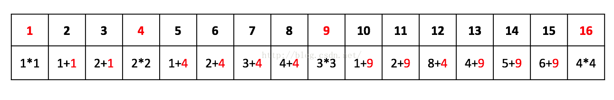

PS：这里不能用贪心算法，因为这里需要找到个数最少的组合，如果每一次都贪心，比如12的时候采用3+3×3而不是8+2×2,个数反而更多了完全

```java
class Solution {
    public int numSquares(int n) {
       // 存储1-n的数对应的最少完全平方数个数
        int[] dp=new int[n+1];
        // 初始化以便求最小值
        for(int i=1;i<=n;i++){
            dp[i]=Integer.MAX_VALUE;   
        }
        // 初始化完全平方数本身
        for(int i=1;i*i<=n;i++){
            dp[i*i]=1;
        }
        for(int i=1;i<=n;i++){
            for(int j=1;j<=i&&i+j*j<=n;j++){
                // 所有的非完全平方数的个数都可以看成
                // (比当前数[i+j*j]小的某个完全平方数[j*j]的个数)+(非完全平方数[i]的个数)
                dp[i+j*j]=Math.min(dp[i]+1,dp[i+j*j]);
            }
        }
        return dp[n];
    }
}
```

------

#### 解法2 广度优先搜索(BFS)

转化为图的问题,图的节点包括当前值及从n走到当前节点的步数

要想找到个数最少的组合，那么从n开始对i\*i<=n的完全平方数i\*i进行广度优先遍历

当i*i==n的时候，n走到了0节点，由于是广度优先，此时的step+1即为最短路径

eg:

求13

广度优先遍历13的邻居节点，step=0

13-1\*1=12

13-2\*2=9

13-3\*3=4

广度优先遍历12的邻居节点，step=1

12-1\*1=11

12-2\*2=8

12-3\*3=3

广度优先遍历9的邻居节点，step=2

9-1\*1=8 (8已存在，不需要重复添加到遍历列表)

9-2\*2=5

9-3\*3=0 (走到了0节点，最短路径为step+1=3)


```java
import java.util.Queue;
import java.util.LinkedList;
class Solution {
    public class Node{
        public int val;
        public int step;
        public Node(int val,int step){
            this.val=val;
            this.step=step;
        }
    }
     public int numSquares(int n) {
         Node node = new Node(n,0);
         //保存广度优先搜索队列
         Queue<Node> queue = new LinkedList<>();
         queue.offer(node);
         // 标记是否访问此节点
         boolean[] visited = new boolean[n+1];
         // 遍历广度队列
         while(!queue.isEmpty()){
             Node temp=queue.poll();
             // 遍历当前节点的所有邻居节点
             for(int i=1;temp.val>=i*i;i++){
                 int now=temp.val-i*i;
                 // 最短路径
                 if(now==0){
                     return temp.step+1;
                 }
                 // 添加队列及标记
                 if(!visited[now]){
                     visited[now]=true;
                     queue.offer(new Node(now,temp.step+1));
                 }
             }
         }
         return -1;
   }
}
```

------


### 十一、最长公共子序列(LCS)

OJ：

[牛客网-最长公共子序列](https://www.nowcoder.com/practice/c996bbb77dd447d681ec6907ccfb488a?tpId=49&&tqId=29348&rp=1&ru=/activity/oj&qru=/ta/2016test/question-ranking)

对于两个字符串，请设计一个高效算法，求他们的最长公共子序列的长度，这里的最长公共子序列定义为有两个序列U1,U2,U3...Un和V1,V2,V3...Vn,其中Ui&ltUi+1，Vi&ltVi+1。且A[Ui] == B[Vi]。

给定两个字符串**A**和**B**，同时给定两个串的长度**n**和**m**，请返回最长公共子序列的长度。保证两串长度均小于等于300。

测试样例：

```
"1A2C3D4B56",10,"B1D23CA45B6A",12
返回：6
```


#### 解法1 动态规划

递推公式：

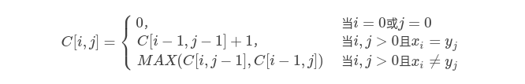

eg:

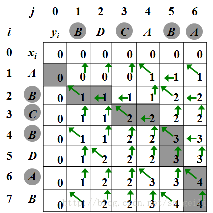


```java
import java.util.*;

public class LCS {
    public int findLCS(String A, int n, String B, int m) {
        if(A==null||B==null||n==0||m==0){
            return 0;
        }
        // 用于存储A的0～i字符串与B的0～j字符串的最长公共序列个数
        int[][] dp =new int[n+1][m+1];
        for(int i=1;i<=n;i++){
            for(int j=1;j<=m;j++){
                // AB相应字符相等，当前子序列++
                if(A.charAt(i-1)==B.charAt(j-1)){
                    dp[i][j]=dp[i-1][j-1]+1;
                }
                // AB相应字符不相等，A或B右移
                else{
                    dp[i][j]=Math.max(dp[i-1][j],dp[i][j-1]);
                }
            }
        }
        return dp[n][m];
    }
}
```

------


### 十二、最长公共子串(LSS)

OJ：

[牛客网-最长公共子串](https://www.nowcoder.com/practice/02e7cc263f8a49e8b1e1dc9c116f7602?tpId=49&&tqId=29349&rp=1&ru=/activity/oj&qru=/ta/2016test/question-ranking)

对于两个字符串，请设计一个时间复杂度为O(m*n)的算法(这里的m和n为两串的长度)，求出两串的最长公共子串的长度。这里的最长公共子串的定义为两个序列U1,U2,..Un和V1,V2,...Vn，其中Ui + 1 == Ui+1,Vi + 1 == Vi+1，同时Ui == Vi。

给定两个字符串**A**和**B**，同时给定两串的长度**n**和**m**。

测试样例：

```
"1AB2345CD",9,"12345EF",7
返回：4
```


#### 解法1 动态规划

类似[十一、最长公共子序列(LCS)](https://humingk.github.io/algorithms-dynamic_programming/#十一最长公共子序列lcs)，不同的是：

- 这里公共子串应该为连续的序列，所以在遇到AB字符不相等的时候，应该重置公共子串而不是A或B右移

- 返回的最大值不是dp最后一个，而是dp中的最大值（所有公共子串长度的最大值）


```java
import java.util.*;

public class LongestSubstring {
    public int findLongest(String A, int n, String B, int m) {
        if(A==null||B==null||n==0||m==0){
            return 0;
        }
        // 用于存储以dp[i][j]结尾的当前公共子串长度
        int[][] dp =new int[n+1][m+1];
        // 公共子串长度最大值
        int max=0;
        for(int i=1;i<=n;i++){
            for(int j=1;j<=m;j++){
                // AB相应字符相等，当前子串++
                if(A.charAt(i-1)==B.charAt(j-1)){
                    dp[i][j]=dp[i-1][j-1]+1;
                }
                // AB相应字符不相等，当前子串重置
                else{
                    dp[i][j]=0;
                }
                // 更新max
                if(max<dp[i][j]){
                    max=dp[i][j];
                }
            }
        }
        return max;
    }
}
```

------


### 十三、固定预算买最少的东西

小米20190908的Java笔试题


小米之家有很多米粉喜欢的产品，产品种类很多，价格也不同。比如某签字笔1元，某充电宝79元，某电池1元，某电视1999元等

假设库存不限，小明去小米之家买东西，要用光N元预算的钱，请问他最少能买几件产品？

输入：

第1行为产品种类数

接下来的每行为每种产品的价格

最后一行为预算金额

输出：

能买到的最少的产品的件数，无法没有匹配的返回-1

样例输入：

```
2
500
1
1000
```

样例输出：

```
2
```

#### 解法1 动态规划

这道题要想不超时间，需要用动态规划来做

dp数组的下标表示当前的预算，对应的值表示当前预算所能买到的最少的产品数


```java

```

------

#### 解法2

```java

```

------

#### 解法3

```java

```

------


### 十四、二维费用背包

类似题型：https://www.acwing.com/problem/content/description/8/

指定最大disk容量，最大memroy容量

每个进程占用disk，memory，以及能服务的用户数

问能服务的最多用户数

```
输入：
15 10 5,1,1000#2,3,3000#5,2,15000#10,4,16000
输出：
31000
```

#### 解法1 动态规划 dp\[i\]\[j\]\[k\] = max{dp\[i - 1\]\[j\]\[k\], dp\[i - 1\]\[j - x\]\[k - y\] + z}

二维费用背包

PS:

不要在已选择此进程的情况中，忘记加上此进程的用户数

```java
import java.io.BufferedReader;
import java.io.InputStreamReader;
import java.util.ArrayList;
import java.util.List;


public class Main_vivo {

    public static void main(String[] args) throws Exception {
        BufferedReader br = new BufferedReader(new InputStreamReader(System.in));
        String inputStr = br.readLine();
        String[] input = inputStr.split(" ");
        int totalDisk = Integer.parseInt(input[0]);
        int totalMemory = Integer.parseInt(input[1]);
        List<Service> services = parseServices(input[2].split("#"));
        int output = solution(totalDisk, totalMemory, services);
        System.out.println(output);
    }

    private static int solution(int totalDisk, int totalMemory, List<Service> services) {

        /*
        dp[i][j][k] 表示前i个进程，分别占用disk=j和memory=k，此时的最大用户数
        分为两种情况：
            如果未选用此进程，则表示前i-1个进程占用了disk=j和memory=k
            如果选用了此进程，则表示前i-1个进程占用了 disk=j-当前进程需要的disk 和 memory=k-当前进程需要的memory,
                以及第i个进程占用了disk=当前进程需要的disk 和 memory=当前进程需要的memory
         */
        int[][][] dp = new int[services.size() + 1][totalDisk + 1][totalMemory + 1];
        for (int i = 2; i <= services.size(); i++) {
            for (int j = 1; j <= totalDisk; j++) {
                for (int k = 1; k <= totalMemory; k++) {
                    if (j >= services.get(i - 1).disk && k >= services.get(i - 1).memory) {
                        dp[i][j][k] = Math.max(dp[i - 1][j][k], dp[i - 1][j - services.get(i - 1).disk][k - services.get(i - 1).memory] + services.get(i - 1).users);
                    }
                    // 不能选择当前进程
                    else {
                        dp[i][j][k] = dp[i - 1][j][k];
                    }
                }
            }
        }
        return dp[services.size()][totalDisk][totalMemory];
    }

    private static List<Service> parseServices(String[] strArr) {
        if (strArr == null || strArr.length == 0) {
            return new ArrayList<Service>(0);
        }
        List<Service> services = new ArrayList<>(strArr.length);
        for (int i = 0; i < strArr.length; i++) {
            String[] serviceArr = strArr[i].split(",");
            int disk = Integer.parseInt(serviceArr[0]);
            int memory = Integer.parseInt(serviceArr[1]);
            int users = Integer.parseInt(serviceArr[2]);
            services.add(new Service(disk, memory, users));
        }
        return services;
    }

    static class Service {
        private int disk;

        private int memory;

        private int users;

        public Service(int disk, int memory, int users) {
            this.disk = disk;
            this.memory = memory;
            this.users = users;
        }

        public int getDisk() {
            return disk;
        }

        public void setDisk(int disk) {
            this.disk = disk;
        }

        public int getMemory() {
            return memory;
        }

        public void setMemory(int memory) {
            this.memory = memory;
        }

        public int getusers() {
            return users;
        }

        public void setusers(int users) {
            this.users = users;
        }
    }
}
```


------


### 十五、最长等差数列

一个数组中，最长的等差数列的元素个数

eg:

2 3 4 5 6 8 的最长等差数列为 2 3 4 5 6 长度为5


#### 解法1 dp\[i\]\[j\]=dp\[i-1\] [ array\[i\]-array\[j\] \] +1

dp\[i\]\[j\] 表示第以array\[i\]为结尾、以j为等差的等差数列的最大长度


```java
import java.util.Arrays;

/**
 * @author humingk
 */
public class Main {

    public static int Solution(int[] array) {
        Arrays.sort(array);
        int res = 1;
        // 等差值的长度
        int length = array[array.length - 1] - array[0];
        int[][] dp = new int[array.length][length + 1];
        for (int i = 0; i < array.length; i++) {
            for (int j = 0; j <= length; j++) {
                dp[i][j] = 1;
            }
        }
        for (int i = 1; i < array.length; i++) {
            for (int j = i - 1; j >= 0; j--) {
                // 所有能得到当前值array[i]的进位值
                int diff = array[i] - array[j];
                // 对此进位值对应的数列个数+1
                dp[i][diff] = dp[j][diff] + 1;
                res = Math.max(res, dp[i][diff]);
            }
        }
        return res;
    }

    public static void main(String[] args) {
        System.out.println(Solution(new int[]{3, 8, 4, 5, 6, 2}));
        System.out.println(Solution(new int[]{1, 2, 7, 10, 3, 4, 5, 6}));
    }
}

```

------

