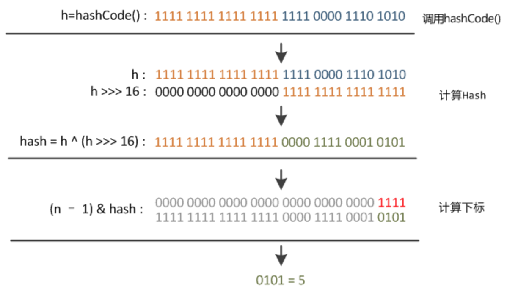
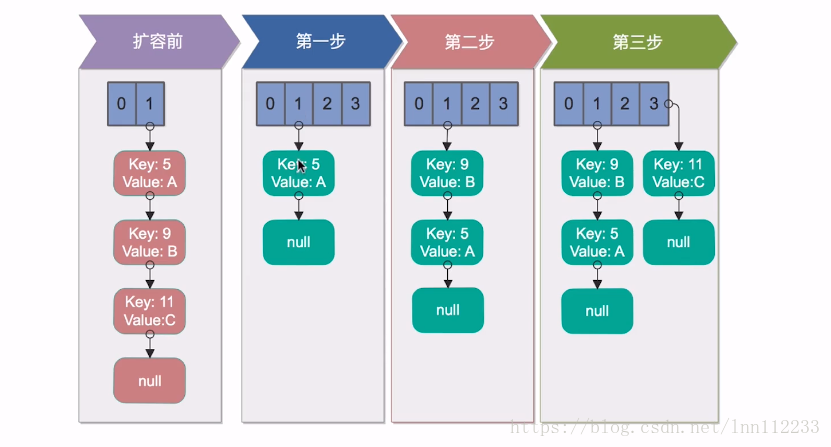
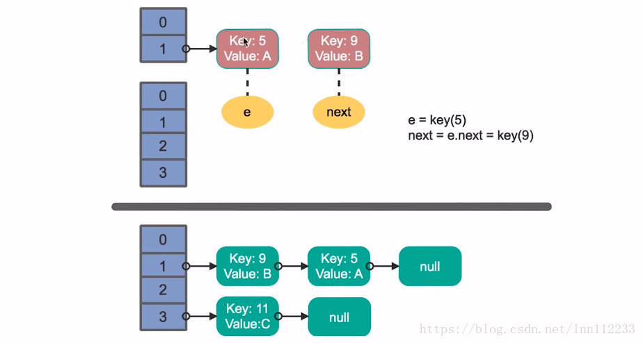
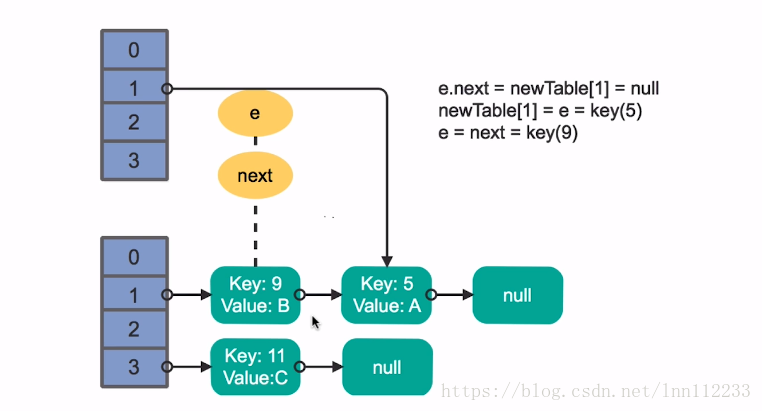
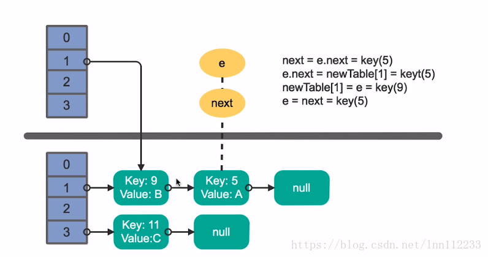
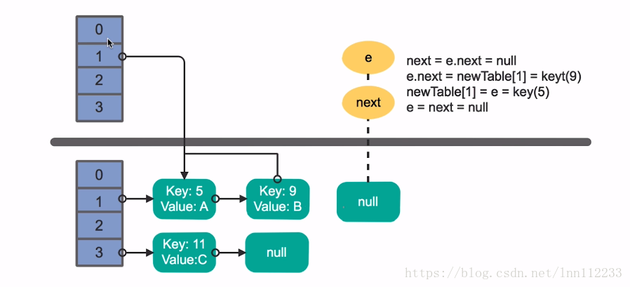

Java中的Map尤其是HashMap我们经常用到，JDK1.8也给HashMap加了不少新特性，这里总结了一些常用方法，包括部分源代码的简单分析，以及HashMap的一些工作原理的实现解析

---

# Map

## 三种遍历Map的方法

### 1. keySet

返回Map中所有Key的Set集合，方法如下:

```java
public Set<K> keySet() {
    Set<K> ks = keySet;
    if (ks == null) {
        ks = new KeySet();
        keySet = ks;
    }
    return ks;
}
```
keySet内部类:

```java
final class KeySet extends AbstractSet<K> {
    public final int size()                 { return size; }
    public final void clear()               { HashMap.this.clear(); }
    public final Iterator<K> iterator()     { return new KeyIterator(); }
    public final boolean contains(Object o) { return containsKey(o); }
    public final boolean remove(Object key) {
        return removeNode(hash(key), key, null, false, true) != null;
    }
    public final Spliterator<K> spliterator() {
        return new KeySpliterator<>(HashMap.this, 0, -1, 0, 0);
    }
    public final void forEach(Consumer<? super K> action) {
        Node<K,V>[] tab;
        if (action == null)
            throw new NullPointerException();
        if (size > 0 && (tab = table) != null) {
            int mc = modCount;
            for (int i = 0; i < tab.length; ++i) {
                for (Node<K,V> e = tab[i]; e != null; e = e.next)
                    action.accept(e.key);
            }
            if (modCount != mc)
                throw new ConcurrentModificationException();
        }
    }
}
```
### 2. values

返回所有value的集合，方法如下：

```java
public Collection<V> values() {
    Collection<V> vs = values;
    if (vs == null) {
        vs = new Values();
        values = vs;
    }
    return vs;
}
```

Values内部类：

```java
final class Values extends AbstractCollection<V> {
    public final int size()                 { return size; }
    public final void clear()               { HashMap.this.clear(); }
    public final Iterator<V> iterator()     { return new ValueIterator(); }
    public final boolean contains(Object o) { return containsValue(o); }
    public final Spliterator<V> spliterator() {
        return new ValueSpliterator<>(HashMap.this, 0, -1, 0, 0);
    }
    public final void forEach(Consumer<? super V> action) {
        Node<K,V>[] tab;
        if (action == null)
            throw new NullPointerException();
        if (size > 0 && (tab = table) != null) {
            int mc = modCount;
            for (int i = 0; i < tab.length; ++i) {
                for (Node<K,V> e = tab[i]; e != null; e = e.next)
                    action.accept(e.value);
            }
            if (modCount != mc)
                throw new ConcurrentModificationException();
        }
    }
}
```

### 3. entrySet

返回Entry对象的Set集合，Entry包括Map的key和value，效率比通过keySet获取key再获取value高得多

```java
public Set<Map.Entry<K,V>> entrySet() {
    Set<Map.Entry<K,V>> es;
    return (es = entrySet) == null ? (entrySet = new EntrySet()) : es;
}
```

EntrySet内部类：

```java
final class EntrySet extends AbstractSet<Map.Entry<K,V>> {
    public final int size()                 { return size; }
    public final void clear()               { HashMap.this.clear(); }
    public final Iterator<Map.Entry<K,V>> iterator() {
        return new EntryIterator();
    }
    public final boolean contains(Object o) {
        if (!(o instanceof Map.Entry))
            return false;
        Map.Entry<?,?> e = (Map.Entry<?,?>) o;
        Object key = e.getKey();
        Node<K,V> candidate = getNode(hash(key), key);
        return candidate != null && candidate.equals(e);
    }
    public final boolean remove(Object o) {
        if (o instanceof Map.Entry) {
            Map.Entry<?,?> e = (Map.Entry<?,?>) o;
            Object key = e.getKey();
            Object value = e.getValue();
            return removeNode(hash(key), key, value, true, true) != null;
        }
        return false;
    }
    public final Spliterator<Map.Entry<K,V>> spliterator() {
        return new EntrySpliterator<>(HashMap.this, 0, -1, 0, 0);
    }
    public final void forEach(Consumer<? super Map.Entry<K,V>> action) {
        Node<K,V>[] tab;
        if (action == null)
            throw new NullPointerException();
        if (size > 0 && (tab = table) != null) {
            int mc = modCount;
            for (int i = 0; i < tab.length; ++i) {
                for (Node<K,V> e = tab[i]; e != null; e = e.next)
                    action.accept(e);
            }
            if (modCount != mc)
                throw new ConcurrentModificationException();
        }
    }
}
```


## 1. HashMap

- 以散列表(哈希表)的形式存储，无序

- 非线程安全，任意时刻可以有多个线程同时读取HashMap，可能会导致数据的不一致

  需要考虑线程安全的，考虑使用ConcurrentHashMap，尽量避免使用旧类HashTable

- 扩容比较耗费性能，因此初始化一个HashMap的时候尽量给定大小

  HashMap的扩容是新建一个2^n大小的哈希表数组，移动旧

- 相比于JDK1.7，JDK1.8的新特性：

  - Node实现了Map.Entry接口
  - 扩容方式有了以下几个有点：
    - 不需要重新计算hash值
    - 转移的链表相对顺序不会改变
    - 在并发扩容中不会出现死锁

  - hash值取模运算之前加入了高位运算
  - 链表元素超过8个的时候采用红黑树方式存储

### HashMap存储

哈希表+链表+红黑树

哈希数组存放每个链表的头结点


红黑树TreeNode:

```java
static final class TreeNode<K,V> extends LinkedHashMap.Entry<K,V> {
    TreeNode<K,V> parent;  // red-black tree links
    TreeNode<K,V> left;
    TreeNode<K,V> right;
    TreeNode<K,V> prev;    // needed to unlink next upon deletion
    boolean red;
}
```

数组table用于存放元素:

```
    transient Node<K,V>[] table;
```

Entry内部类、节点内部类定义：

hashmap实际上就是一个Entry数组

```java
static class Node<K,V> implements Map.Entry<K,V> {
    final int hash;
    final K key;
    V value;
    Node<K,V> next;

    Node(int hash, K key, V value, Node<K,V> next) {
        this.hash = hash;
        this.key = key;
        this.value = value;
        this.next = next;
    }
}
```

### HashMap Hash计算

```java
static final int hash(Object key) {    int h;    return (key == null) ? 0 : (h = key.hashCode()) ^ (h >>> 16);}
```

假如table表的长度为16（默认值），那么此表此时采用的hash值位数为4

1. 调用hashCode取得hash值

   此时key通过调用hashCode生成一个32位的hash值

2. hash值进行高位运算（JDK1.8新特性）

   \>>>16: 无符号右移，向右边移动16位，高位由0补充

   ^ :  异或运算符，相同为0，相反为1，此时hash值变成16位

   进行高位运算，是为了减少运算，特别是在数组长度较小的情况下，高位也参与了运算

   自己的高位与低位做异或运算，是为了混合高位和低位，以此来加大低位的随机性，混合后的地位也保留了高位的信息。

3. hash值对数组长度进行取模运算

   16位的hash值与数组长度（4位）进行与运算，此时hash值变成4位



### HashMap 扩容

#### JDK1.7的扩容方式

- 扩容后，链表的顺序变成逆序



1.7扩容源代码:

```java
void resize(int newCapacity) {
        Entry[] oldTable = table;
        int oldCapacity = oldTable.length;
    	// 当前数据长度已经达到最大容量
        if (oldCapacity == MAXIMUM_CAPACITY) {
            threshold = Integer.MAX_VALUE;
            return;
        }
		// 创建新的数组
        Entry[] newTable = new Entry[newCapacity]; 
        boolean oldAltHashing = useAltHashing;
        useAltHashing |= sun.misc.VM.isBooted() &&
                (newCapacity >= Holder.ALTERNATIVE_HASHING_THRESHOLD);
    	// 是否需要重新计算hash值
        boolean rehash = oldAltHashing ^ useAltHashing; 
    	// table数据转移到新的table
    	// 可能导致死锁
        transfer(newTable, rehash); 
   		// 数组重新赋值
        table = newTable;
    	// 重新计算阈值
        threshold = (int)Math.min(newCapacity * loadFactor, MAXIMUM_CAPACITY + 1); 
    }
```

transf

```java
55     void transfer(Entry[] newTable, boolean rehash) {
56         int newCapacity = newTable.length;
57         for (Entry<K,V> e : table) {
58             while(null != e) {
    				// 提前保存下一次循环需要的链表节点
59                 Entry<K,V> next = e.next;
60                 if (rehash) {
61                     e.hash = null == e.key ? 0 : hash(e.key);
62                 }
    				// 新表的插入位置
63                 int i = indexFor(e.hash, newCapacity);
    				// 新表可能有元素，将e.next指向新表头部
64                 e.next = newTable[i];
65                 newTable[i] = e;
    				//	继续循环
66                 e = next;
67             }
68         }
69     }
```


在JDK1.7中，扩容可能会发生死锁：

若线程一正在扩容，刚刚建立好新的哈希表，正在移动链表，其中e指向A，e.next指向B

此时线程二开始，put一个新值，发现 空间不够，也执行扩容操作



线程二完成扩容并put后，线程一继续扩容，由于e指向A，所以指向A到新table，随后更新e，e指向e.next即B，e.next指向null：



由于e指向B，所以指向B到新table，随后更新e,e指向e.next即null，e.next也指向null:



此时线程一结束，不过相当于进行了两次移动，由 1 -> A -> B ->null 变成 1 -> B -> A -> null 又变成 1 -> A -> B -> null，在第一次移动（线程二）建立了B-A的指向，在第二次移动（线程一)又建立了A-B 的指向，A与B之间出现了死锁。



#### JDK1.8的扩容方式

1.8扩容源代码：

```java
final Node<K,V>[] resize() {
    Node<K,V>[] oldTab = table;
	// 旧数组的 size 容量
    int oldCap = (oldTab == null) ? 0 : oldTab.length;
	// 旧的 阈值
    int oldThr = threshold;
	// 新的容量和阈值
    int newCap, newThr = 0;
    if (oldCap > 0) {
		// 如果 容量 大于最大容量 1<<30,阈值就等于 Int 的最大值 即 不再扩容
        if (oldCap >= MAXIMUM_CAPACITY) {
            threshold = Integer.MAX_VALUE;
            return oldTab;
        }
		// 两个过程
		// 1. 设置新的容量 : newCap(新的容量) = oldCap(旧容量) * 2  扩大为原来的2倍
		// 2. 设置新的阈值 : 如果 newCap(新的容量) 小于 最大值 并且 旧容量 大于 默认的容量值 , 新的阈值设为 旧的阈值的2倍
        else if ((newCap = oldCap << 1) < MAXIMUM_CAPACITY &&
                 oldCap >= DEFAULT_INITIAL_CAPACITY)
            newThr = oldThr << 1; // double threshold
    }
	// 如果旧表的长度的是0，就是说第一次初始化表
	// 如果旧的阈值 大于 0 , 新的容量 = 旧的阈值
    else if (oldThr > 0) // initial capacity was placed in threshold
        newCap = oldThr;
	// 表示 旧表 容量 和 阈值 都等于 0 ,表示 从来没有初始化过
    else {               // zero initial threshold signifies using defaults
	// 赋值个默认值
        newCap = DEFAULT_INITIAL_CAPACITY;
        newThr = (int)(DEFAULT_LOAD_FACTOR * DEFAULT_INITIAL_CAPACITY);
    }
	// 如果新的阈值 等于 0 ,按阈值计算公式(size*加载因子)进行计算
    if (newThr == 0) {
        float ft = (float)newCap * loadFactor;
        newThr = (newCap < MAXIMUM_CAPACITY && ft < (float)MAXIMUM_CAPACITY ?
                  (int)ft : Integer.MAX_VALUE);
    }
	// 给全局的 threshold 阈值 赋值
    threshold = newThr;
    @SuppressWarnings({"rawtypes","unchecked"})
	// 创建新的 数组
        Node<K,V>[] newTab = (Node<K,V>[])new Node[newCap];
	// 赋值给全局的 table
    table = newTab;
	// 把旧的数组中的值, 按某种规则 迁移 到新的数组中
    if (oldTab != null) {
		//遍历桶数组，并将键值对映射到新的数组中
        for (int j = 0; j < oldCap; ++j) {
            Node<K,V> e;
            if ((e = oldTab[j]) != null) {
				//置为null, 方便进行GC
                oldTab[j] = null;
                if (e.next == null)
					//说明这个node中没有链表,直接放在新表的e.hash & (newCap - 1)位置
                    newTab[e.hash & (newCap - 1)] = e;
                else if (e instanceof TreeNode)
					// 如果 此节点是 红黑树(也就是说有冲突), 采用红黑树管理冲突的键值对
                    ((TreeNode<K,V>)e).split(this, newTab, j, oldCap);
                else { // preserve order
				// 证明此节点是 链表 的形式解决冲突的
				//新表是旧表的两倍容量，实例上就把单链表拆分为两队，
                    
                //e.hash&oldCap为偶数是低队，e.hash&oldCap为奇数的是高队
                    Node<K,V> loHead = null, loTail = null;
                    Node<K,V> hiHead = null, hiTail = null;
                    Node<K,V> next;
                    do {
                        next = e.next;
                        // 低队
                        if ((e.hash & oldCap) == 0) {
                            if (loTail == null)
                                loHead = e;
                            else
                                loTail.next = e;
                            loTail = e;
                        }
                        // 高队
                        else {
                            if (hiTail == null)
                                hiHead = e;
                            else
                                hiTail.next = e;
                            hiTail = e;
                        }
                    } while ((e = next) != null);
                    if (loTail != null) {
						//低队不为null，放在新表原位置
                        loTail.next = null;
                        newTab[j] = loHead;
                    }
                    if (hiTail != null) {
						//高队不为null，放在新表 j + oldCap 的位置
                        hiTail.next = null;
                        newTab[j + oldCap] = hiHead;
                    }
                }
            }
        }
    }
    return newTab;
}

```

### HashMap get方法

传入key值，返回value

根据**key的hash值进行取模运算**作为table下标来获取key在table中对应的Node节点串

由于hash值分布问题，一个Node节点可能有一串的node节点，就需要判断对应node节点的hash值是否一致，否则继续向所在Node节点串的下一个节点查找

```java
    public V get(Object key) {
        Node<K,V> e;
        return (e = getNode(hash(key), key)) == null ? null : e.value;
    }
    final Node<K,V> getNode(int hash, Object key) {
        Node<K,V>[] tab; Node<K,V> first, e; int n; K k;
        // 是否存在符合条件的node串
        if ((tab = table) != null && (n = tab.length) > 0 &&
            (first = tab[(n - 1) & hash]) != null) {
            // node串的头节点是否是要找的node
            if (first.hash == hash && // always check first node
                ((k = first.key) == key || (key != null && key.equals(k))))
                return first;
            if ((e = first.next) != null) {
                if (first instanceof TreeNode)
                    return ((TreeNode<K,V>)first).getTreeNode(hash, key);
                // 在node串中循环查找对应的node
                do {
                    if (e.hash == hash &&
                        ((k = e.key) == key || (key != null && key.equals(k))))
                        return e;
                } while ((e = e.next) != null);
            }
        }
        return null;
    }
```

### HashMap put方法

传入key，value，返回旧值或者null

先查询table中key对应的hash值取模运算后的位置有没有node，如果没有就新建一个，如果有就在node串后面添加一个

```java
	public V put(K key, V value) {
    	return putVal(hash(key), key, value, false, true);
	}
	// onlyIfAbsent: true的话不修改原来的值，false的话更新原来的值
    final V putVal(int hash, K key, V value, boolean onlyIfAbsent,
                   boolean evict) {
        Node<K,V>[] tab; Node<K,V> p; int n, i;
        if ((tab = table) == null || (n = tab.length) == 0)
            n = (tab = resize()).length;
        // 找不到对应的node串，新建node串
        if ((p = tab[i = (n - 1) & hash]) == null)
            tab[i] = newNode(hash, key, value, null);
        else {
            Node<K,V> e; K k;
            // 判断node串的头节点是否是需要更新的node
            if (p.hash == hash &&
                ((k = p.key) == key || (key != null && key.equals(k))))
                e = p;
            else if (p instanceof TreeNode)
                e = ((TreeNode<K,V>)p).putTreeVal(this, tab, hash, key, value);
            else {
            	// 循环node串
                for (int binCount = 0; ; ++binCount) {
                	// 循环所有都没找到对应node，新建node
                    if ((e = p.next) == null) {
                        p.next = newNode(hash, key, value, null);
                        if (binCount >= TREEIFY_THRESHOLD - 1) // -1 for 1st
                            treeifyBin(tab, hash);
                        break;
                    }
                    // 存在相同的key值，break
                    if (e.hash == hash &&
                        ((k = e.key) == key || (key != null && key.equals(k))))
                        break;
                    p = e;
                }
            }
            // 已存在key值
            if (e != null) { // existing mapping for key
                V oldValue = e.value;
                if (!onlyIfAbsent || oldValue == null)
                    e.value = value;
                afterNodeAccess(e);
                return oldValue;
            }
        }
        ++modCount;
        if (++size > threshold)
            resize();
        afterNodeInsertion(evict);
        return null;
    }
```


## 2. LinkedHashMap

- LinkedHashMap有顺序，通过iterator遍历的时候是按照插入的顺序遍历的

- 继承了HashMap，比HashMap多了head、tail链表
- 非线程安全

```java
transient LinkedHashMap.Entry<K,V> head;
transient LinkedHashMap.Entry<K,V> tail;
```

##  3. TreeMap

- 具有排序的功能，通过iterator遍历的时候默认按照key值的升序遍历
- 非线程安全

### TreeMap存储方式

红黑树:

```java
static final class Entry<K,V> implements Map.Entry<K,V> {
    K key;
    V value;
    Entry<K,V> left;
    Entry<K,V> right;
    Entry<K,V> parent;
    boolean color = BLACK;
}
```

## 4. WeakHashMap

- 弱键映射，映射之外无引用的键，会被垃圾回收
- 非线程安全