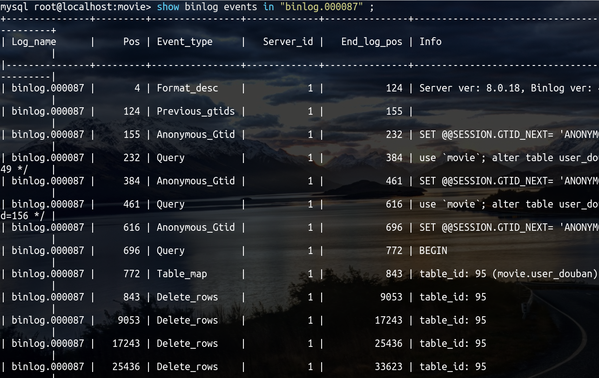
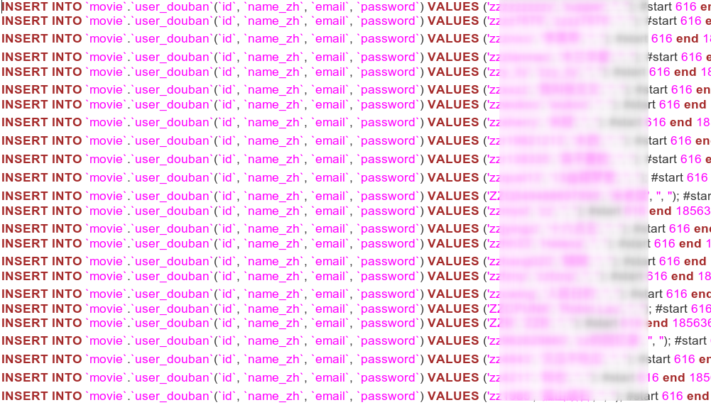

手速过快将某一个表的所有数据都删除了,这里使用[binlog2sql脚本](https://github.com/danfengcao/binlog2sql)通过[MySQL的binlog日志记录](https://dev.mysql.com/doc/refman/8.0/en/binary-log.html)来恢复数据

---

# 记一次误删数据库以及数据恢复 (MySQL-binlog-binlog2sql)

本想删除某表中的某些数据,一不小心把整个表的数据都删除掉了,六万多条数据变成了0条.

刚开始有点慌,因为还没有来得及备份,难道我也要'删库跑路'了吗,但记得以前看到过能通过日志记录来恢复数据.

试一试,首先看一看binlog日志记录是否正常开启,有日志记录那就不慌.

再看一下对应的日志记录文件中是否包含了对应的删除操作

且在对应的日志文件中,以row的形式保存了所有的已删除数据,如下图所示:

接下来就是把这些数据重新给insert到数据库中,这里不推荐重复造轮子,推荐一个python脚本[binlog2sql](https://github.com/danfengcao/binlog2sql)

最终将所有的delete数据改为insert数据

但这个脚本有几个小问题:

- pymysql版本太老,不支持MySQL8.0,需要升级一下
- 遇到utf8mb4格式会报错,将对应的decode方法参数增加一个忽略报错即可,即xx.encode("utf-8","ignore")

这样误删的数据又回来了,接下来的第一件事就是备份一下,推荐mysqldump定时增量备份